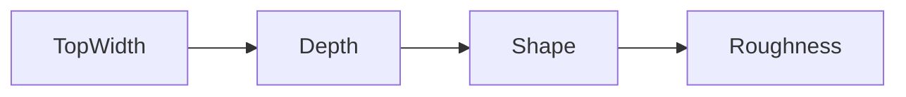
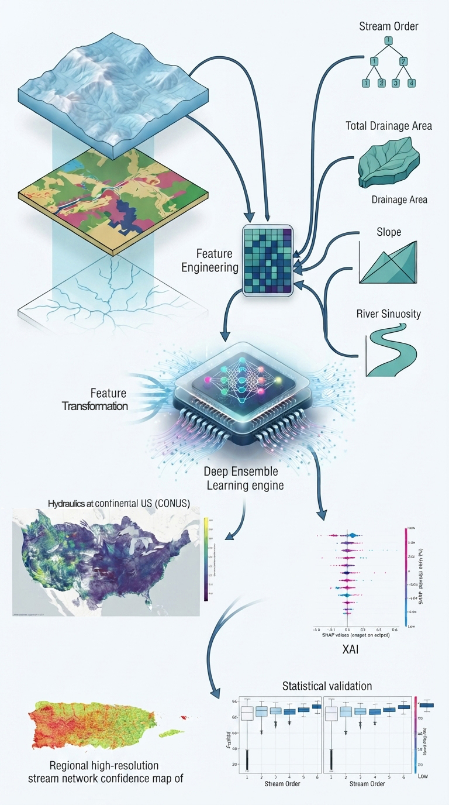

## TopWidth
**Bankfull Channel Width (\( W \propto Q^b \))**
[Explore →](tw/index.md)

## Depth
**Bankfull Depth (\( d \propto Q^f \))**
[Explore →](y/index.md)

## Shape
**Dingman Shape Exponent (\( r \))**
[Explore →](r/index.md)

## Roughness
**Manning's \( n \)**
[Explore →](n/index.md)

<!-- 

 -->

## Key Capabilities

- **Physics-Informed Features**: Feature engineering grounded in fluvial geomorphology.
- **Hybrid Ensemble**: Attention-augmented deep residual tabular network (PhysicalResTabNet) combined with gradient-boosted decision forest ensemble.
- **Continental Coverage**: Inference across 2.8M+ reaches across US territories (SUPERCONUS, AK, HI, PRVI).
- **Confidence Quantification**: Ensemble epistemic uncertainty with ML Confidence Score.
- **Explainable AI**: Model interpretability via SHAP, PDP/ICE, and Causal DML.
- **Topological Regularization**: Graph based deep learning regularization for network continuity.

{ loading=lazy }

This ML pipeline was developed to provide robust, scalable, and physically-consistent estimates of channel geometry and roughness for the National Water Model.
