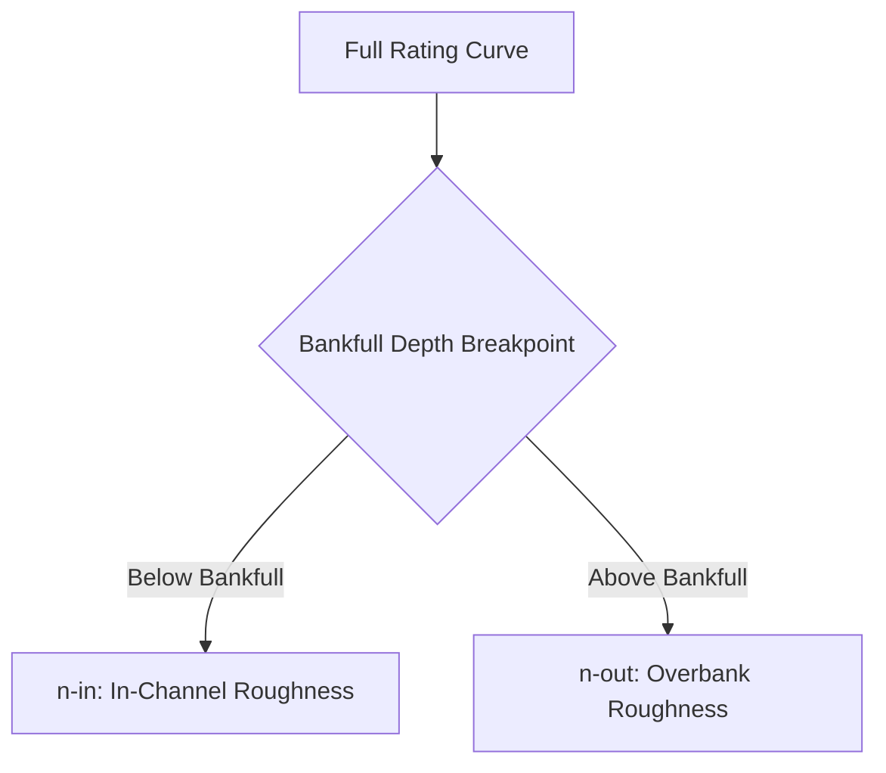

# Roughness Manning's n

## Physical Definition
Manning's $n$ is an empirical coefficient representing channel and floodplain roughness or friction applied to flow. It is a critical parameter in 1D and 2D hydrodynamic modeling. Manning's equation relates velocity, flow area, hydraulic radius, and channel slope:

$$
Q = \frac{1}{n} A R^{2/3} S^{1/2}
$$

where:
- $Q$ is the discharge (m³/s)
- $n$ is Manning's roughness coefficient (s/m$^{1/3}$)
- $A$ is the cross-sectional flow area (m²)
- $R$ is the hydraulic radius (m)
- $S$ is the friction slope (m/m)

## Single vs Compound Roughness

Historically, 1D models often used a single effective roughness value for an entire cross-section. However, as modeling has advanced to incorporate compound channels and 2D floodplains, and sd more data on floodplain stage-discharge relation has became available, it is increasingly common to separate roughness into distinct zones.

- **n-single**: A lumped effective roughness value optimized for the entire rating curve.
- **n-in (in-channel)**: Roughness below the bankfull depth. It is governed primarily by bed material grain size, bedforms (e.g., dunes, ripples), and drainage basin attributes.
- **n-out (overbank)**: Roughness above the bankfull depth in the floodplain. It is governed by floodplain land cover, vegetation density, and valley storage.

### Chow's Compound Channel Method
To estimate compound roughness, we employ Chow's compound channel method. The rating curve is split at the bankfull depth breakpoint. We then optimize **n-in** and **n-out** independently, allowing the model to accurately represent the distinct hydraulic resistance regimes between the main channel and the floodplain.

!!! note "Version Note"
    Compound roughness components (n-in and n-out) were introduced in **v2.00** to improve representation of floodplain inundation dynamics.

## Navigation

  <ul>
    <li>
      <a href="n-single/literature/">
        <strong>n-single</strong>
        
Single lumped effective roughness for the entire rating curve.

      </a>
    </li>
    <li>
      <a href="n-in/literature/">
        <strong>n-in (In-Channel)</strong>
        
Roughness governing flow below bankfull depth.

      </a>
    </li>
    <li>
      <a href="n-out/literature/">
        <strong>n-out (Overbank)</strong>
        
Roughness governing floodplain flow above bankfull depth.

      </a>
    </li>
  </ul>

