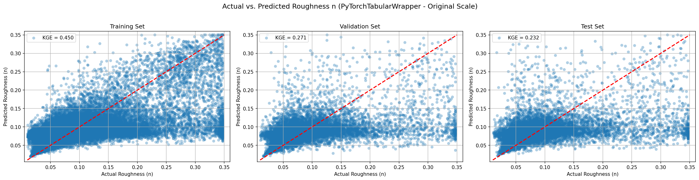
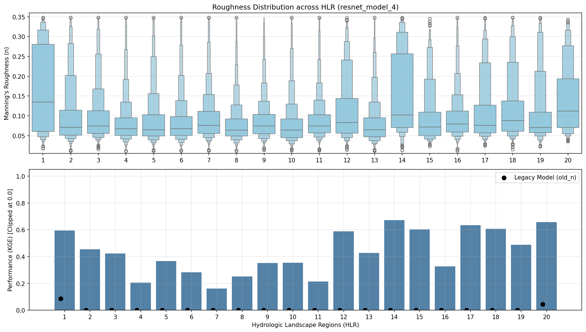
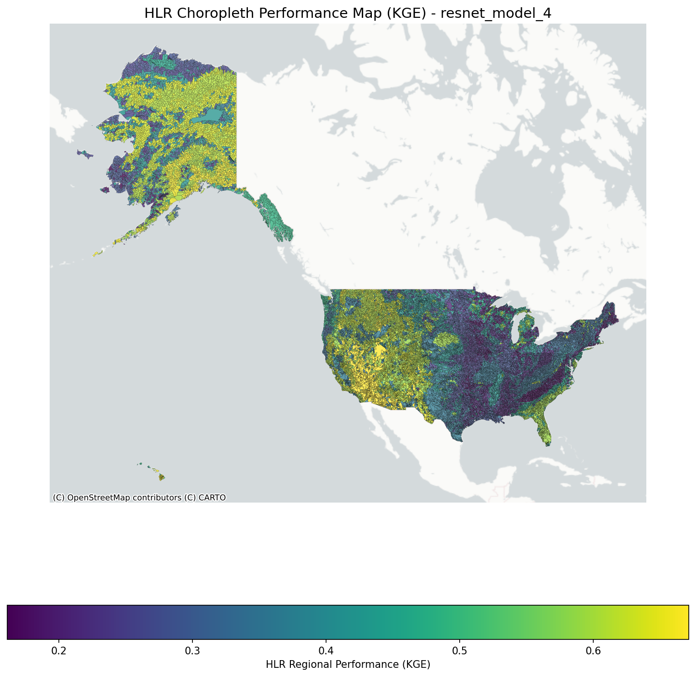
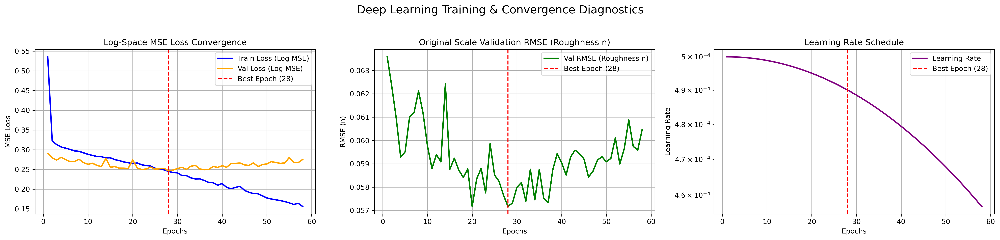
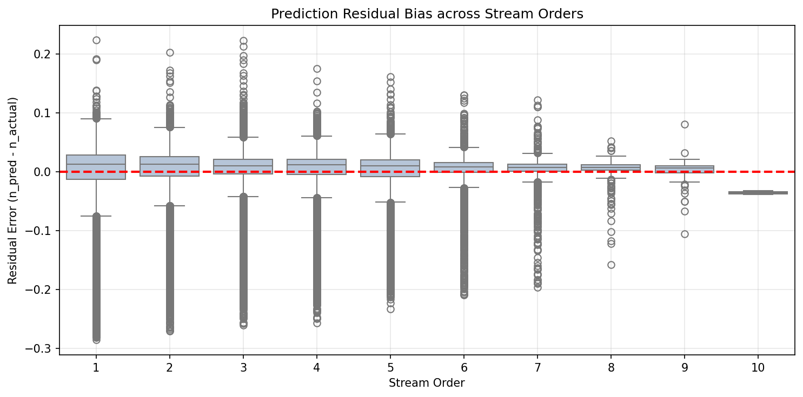

# Model Skill

## Prediction Performance

{ loading=lazy }

The model's ability to predict isolated in-channel roughness is robust, as evidenced by the tight clustering along the 1:1 line in the test set. Compared to n-single, n-in values generally occupy a lower numerical range, accurately reflecting the absence of dense floodplain vegetation resistance.

## Regional Diagnostics

{ loading=lazy }

Performance stratified by Hydrologic Landscape Regions (HLR) shows consistent predictive skill. Simialr to n-single, the areas with higher score are: 
- HLR 1: Subhumid plains with permeable soils and bedrock  
- HLR 14: Arid playas with permeable soils and bedrock 
- HLR 20: Humid mountains with permeable soils and impermeable bedrock 
All three regions have permeable soils, which promote high infiltration and groundwater pathways over surface runoff. This produces more stable, baseflow-dominated hydrographs where stage-discharge and hydraulic geometry relationships follow predictable power law scaling.

The areas with lower score are: 
- HLR 4: Humid plains with permeable soils and bedrock 
- HLR 7: Humid plains with permeable soils and impermeable bedrock 
- HLR 8: Semiarid plains with impermeable soils and bedrock 
All these regions are Plains characterized by extremely low topographic relief and gentle channel slopes 

{ loading=lazy }

The choropleth highlights geographic variations, confirming that the model successfully resolves regional geologic differences influencing bed material composition.

## Training Convergence

{ loading=lazy }

The neural network training curves indicate stable convergence, validating the hyperparameter selection and structural regularization for the isolated n-in target space.

## Bias Analysis

{ loading=lazy }

Residual bias mapped against stream order reveals negligible systemic drift. This proves the model reliably predicts in-channel roughness for both 1st order headwaters and high order lowland rivers, with 10 order having systemtic udnerestiamtion simiallr to n-single due to lack of training data.
