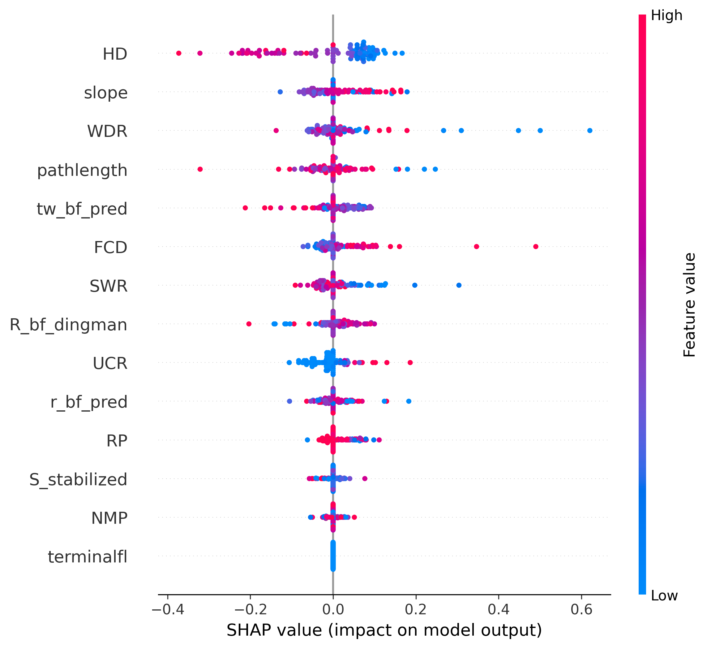
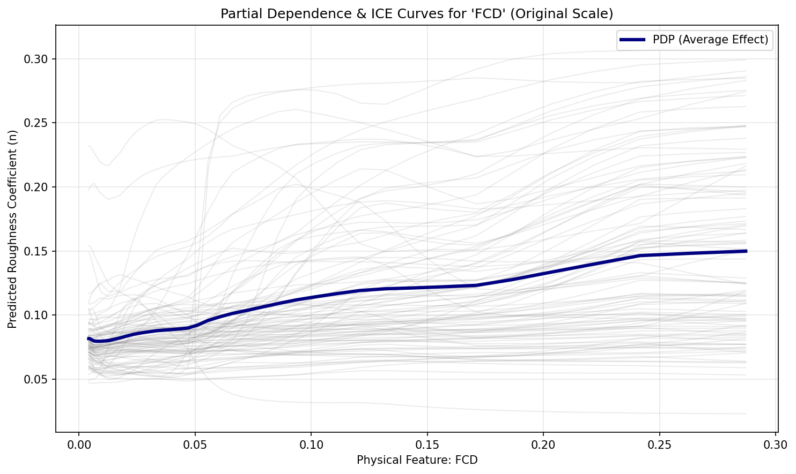
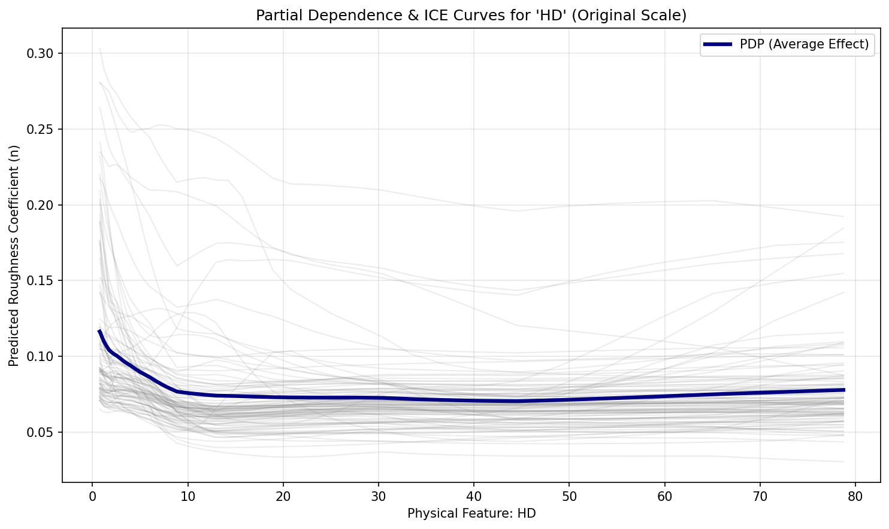
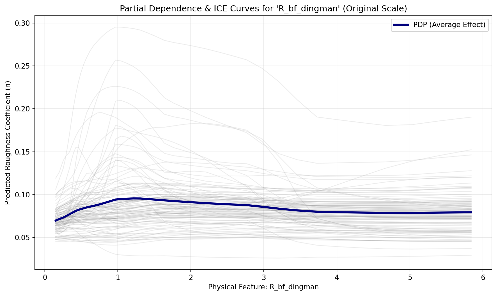
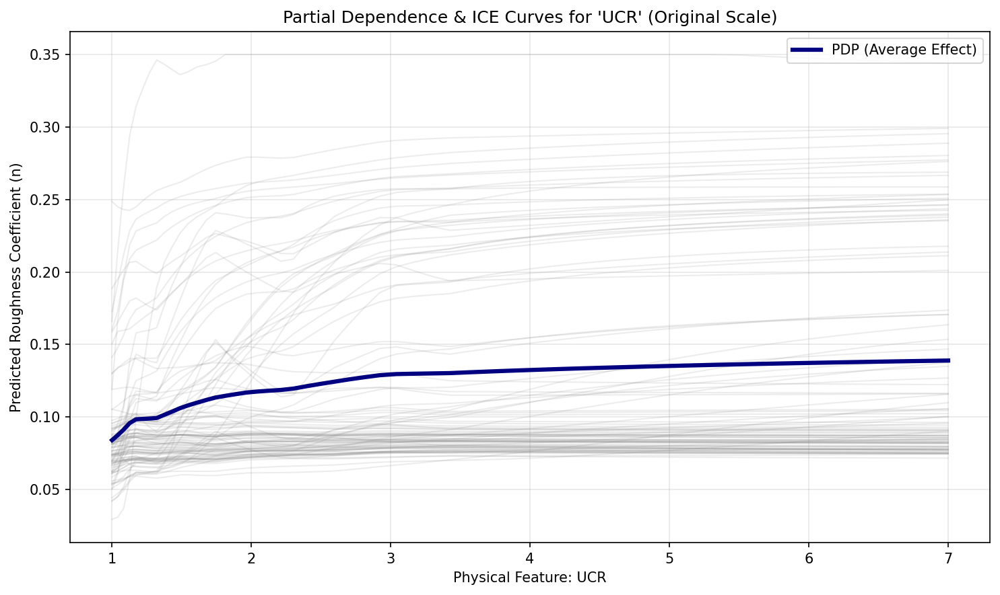
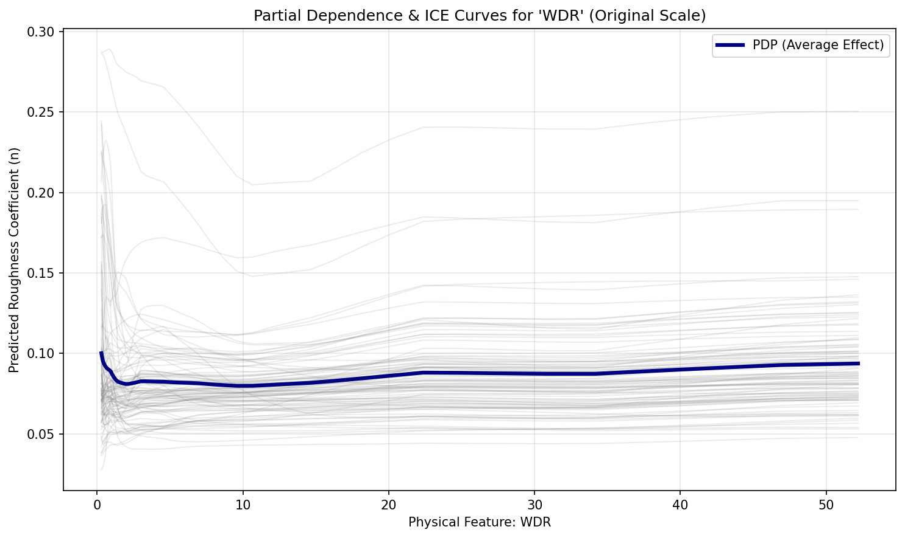

# Explainable AI (XAI)

Our XAI pipeline evaluates the specific geomorphic and hydraulic drivers of in-channel flow resistance using SHapley Additive exPlanations (SHAP) and Partial Dependence Plots (PDP).

---

## Global Feature Importance

{ loading=lazy }

The SHAP beeswarm plot reveals the hierarchical ranking of features dictating in-channel resistance. For in-channel flow, hydraulic scale parameters derived from hydraulic geometry such as bankfull width to depth ratio, slope, and drainage basin elongation heavily dictate flow resistance.

---

## Partial Dependence Analysis

Partial Dependence Plots (PDP) and Individual Conditional Expectation (ICE) curves isolate the marginal response of predicted in-channel Manning's $n$ to individual hydro-geomorphic features while holding all other predictors constant.

!!! info "ICE & PDP Generation & Diagnostic Purpose"
    * **Generation Mechanism**: For a target predictor $X_S$ (e.g., channel slope, hydraulic radius), a 1D grid is evaluated across reach instances where complementary features $x_C$ remain fixed. Individual reach trajectories (ICE curves: $\hat{f}(X_S, x_C^{(i)})$) are computed and averaged across the cohort to yield the marginal expectation curve:
      $$\bar{f}_S(X_S) = \frac{1}{N} \sum_{i=1}^N \hat{f}\left(X_S, x_C^{(i)}\right)$$
    * **Hydraulic Significance**: In in-channel parameterization, PDP and ICE curves verify whether the machine learning ensemble respects boundary layer mechanics (such as Keulegan logarithmic friction decay with deepening flow) and equilibrium channel scaling.

{ loading=lazy }
**Fluvial Concavity Deviation (FCD):** Deviations from profile concavity strongly signal shifts in channel bed regimes (e.g., forced step-pool systems vs. alluvial flats), driving changes in in-channel flow resistance.

{ loading=lazy }
**Hack's Law Deviation (HD):** Catchment elongation dictates hydrograph timing and flood wave concentration, influencing the boundary shear stress available to shape stable channel bedforms.

{ loading=lazy }
**Hydraulic Radius ($R_{bf}$):** Displays the characteristic negative exponential decay of the Keulegan equation. As in-channel depth increases relative to bed roughness elements, relative friction declines asymptotically.

{ loading=lazy }
**Upstream Convergence Ratio (UCR):** Highlights localized hydraulic adjustments at confluences where discharge surges and sediment transitions disrupt uniform in-channel resistance.

{ loading=lazy }
**Width-to-Drainage Ratio (WDR):** Wide, shallow channels possess greater wetted contact per unit conveyance area, driving higher effective in-channel resistance compared to deep, incised reaches.
