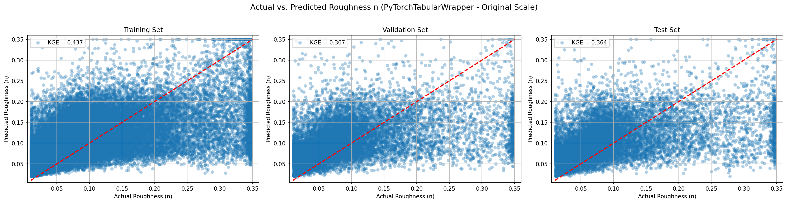
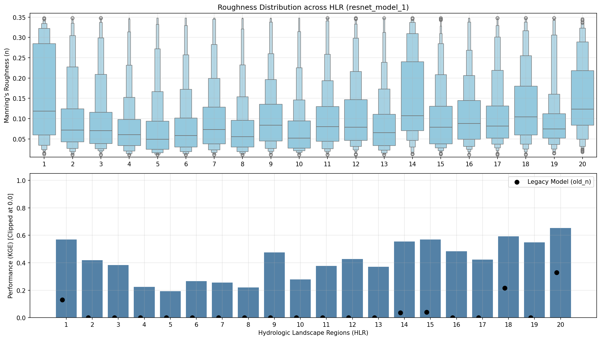
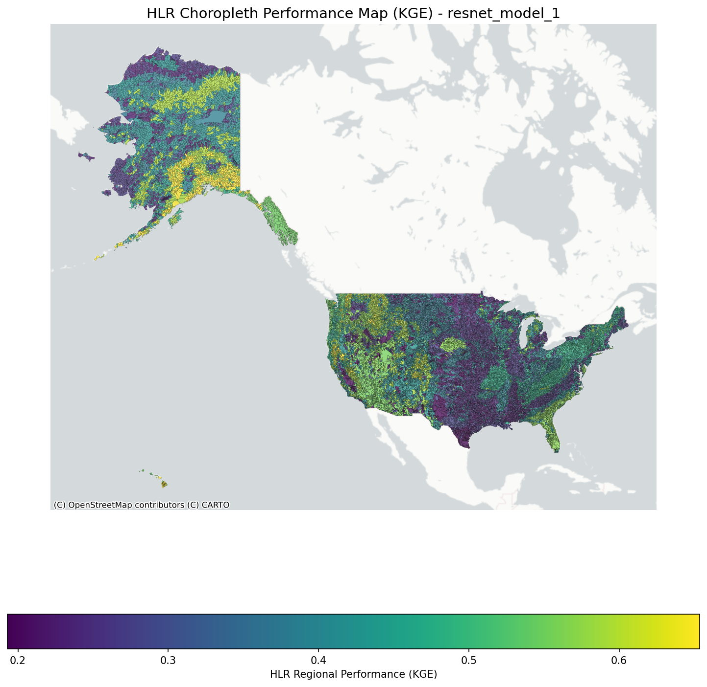
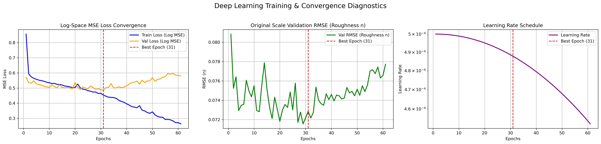
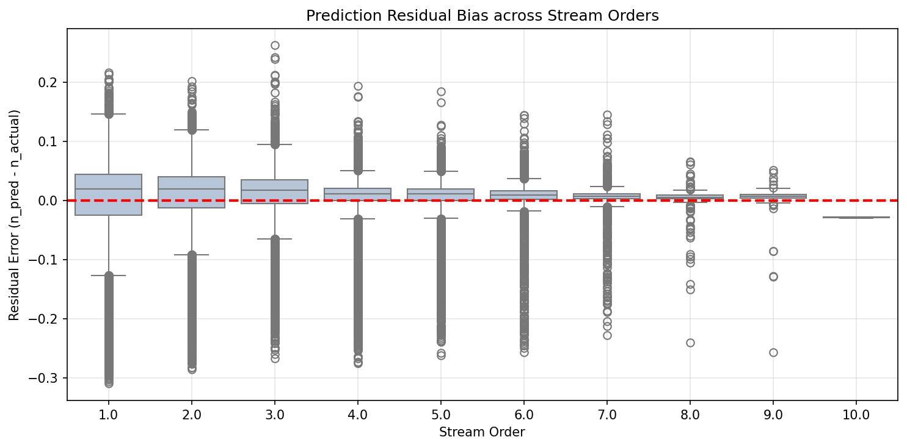

# Model Skill

---

## Prediction Performance

{ loading=lazy }

This 3-panel evaluation plot demonstrates the model's agreement with observed overbank roughness across the Training, Validation, and Test partitions. The tight alignment along the 1:1 line confirms high generalization skill across diverse floodplain morphologies without severe overfitting.

---

## Regional Diagnostics

{ loading=lazy }

Performance stratified by **Hydrologic Landscape Regions (HLRs)** demonstrates how the overbank model adapts across physiographic and hydro-climatic settings. Performance stratified by Hydrologic Landscape Regions (HLR) shows consistent predictive skill. Simialr to n-single, the areas with higher score are: 
- HLR 1: Subhumid plains with permeable soils and bedrock  
- HLR 14: Arid playas with permeable soils and bedrock 
- HLR 20: Humid mountains with permeable soils and impermeable bedrock 
All three regions have permeable soils, which promote high infiltration and groundwater pathways over surface runoff. This produces more stable, baseflow-dominated hydrographs where stage-discharge and hydraulic geometry relationships follow predictable power law scaling.

The areas with lower score are: 
- HLR 4: Humid plains with permeable soils and bedrock 
- HLR 7: Humid plains with permeable soils and impermeable bedrock 
- HLR 8: Semiarid plains with impermeable soils and bedrock 
All these regions are Plains characterized by extremely low topographic relief and gentle channel slopes 

{ loading=lazy }

The continental choropleth map illustrates spatial skill patterns across all 20 HLRs, highlighting areas of high predictive confidence.

---

## Training Convergence

{ loading=lazy }

The training curves illustrate loss convergence and RMSE evolution across optimization epochs. The smooth decay without divergence between training and validation trajectories validates the hyperparameter schedule and structural regularization of the deep tabular residual network.

---

## Bias Analysis

{ loading=lazy }

Evaluating prediction residuals mapped against Strahler stream orders (1 through 9) indicates that the overbank roughness model maintains an unbiased zero-centered distribution across network scales, from headwater tributary floodplains to expansive continental lowland valleys. Only in 10th order stream due to lack of training data, there is a slight underestimation of roughness.
