# Uncertainty Quantification

Our framework explicitly tracks epistemic and aleatoric uncertainty for overbank roughness. Model confidence is quantified using an ML Confidence Score ($CS$), defined as:

$$
CS = \exp(-\gamma \cdot CV) \times 100\%
$$

where $\gamma = 3.0$ and $CV = \frac{\sigma}{\mu}$ is the coefficient of variation across the multi-seed ensemble. The ensemble spread yields the median ($q_{50}$), lower confidence limit ($q_{05}$), and upper confidence limit ($q_{95}$).

---

=== "SUPERCONUS"
    ### SUPERCONUS Uncertainty Profiles
    The contiguous United States domain highlights overbank predictive confidence across diverse floodplain physiographies.
    
    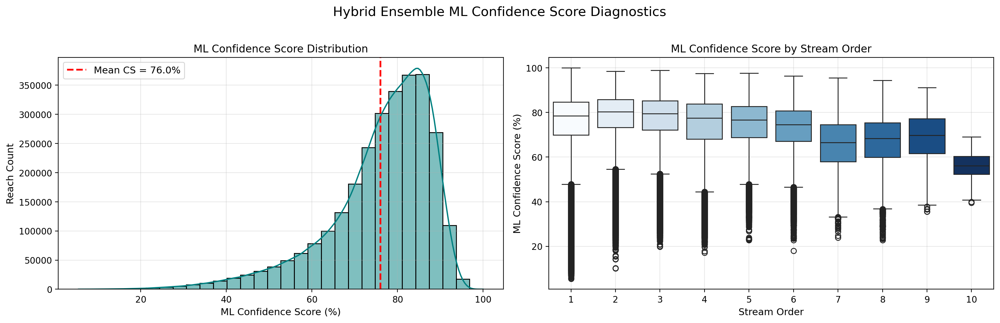{ loading=lazy }
    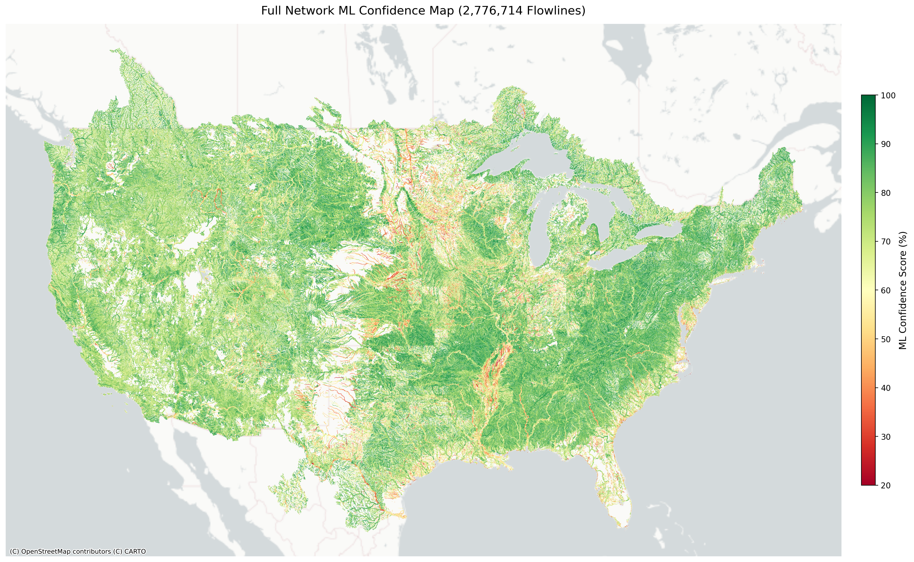{ loading=lazy }
    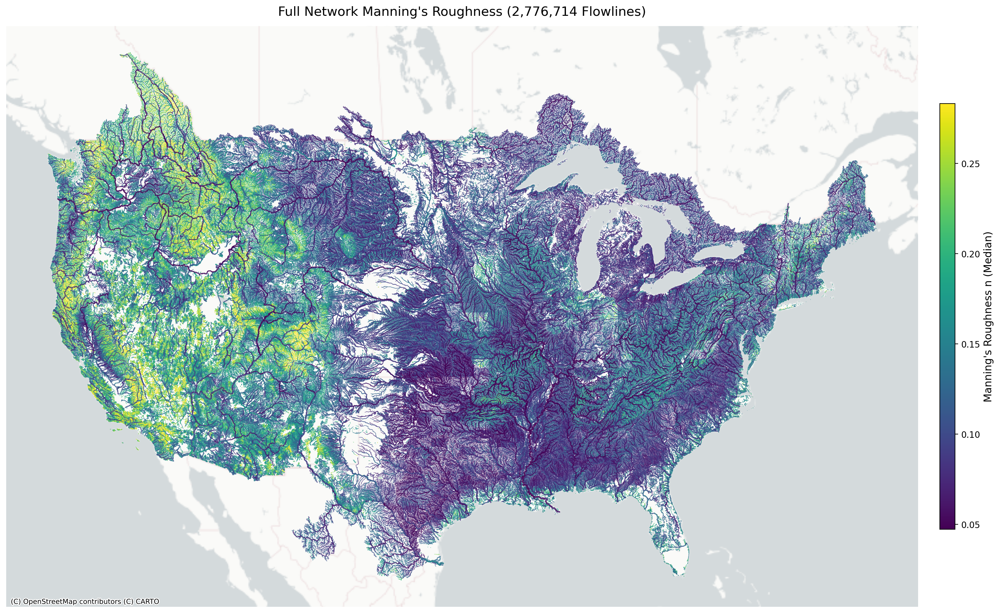{ loading=lazy }
    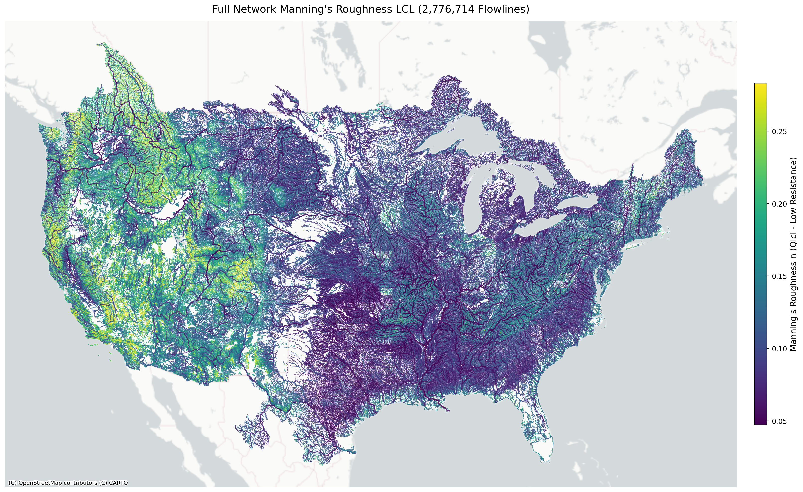{ loading=lazy }
    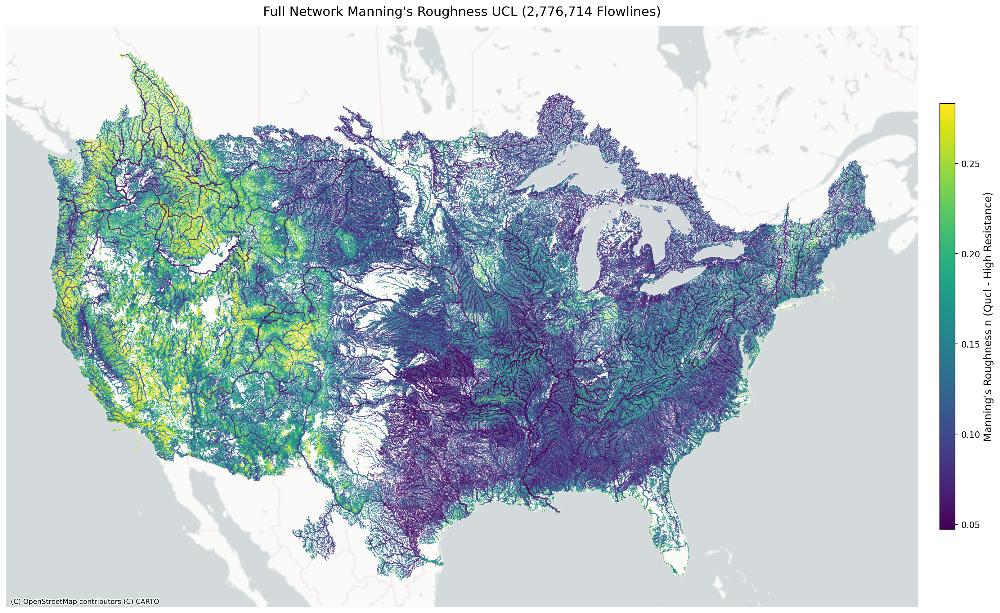{ loading=lazy }

=== "Alaska"
    ### Alaska Uncertainty Profiles
    In Alaska, complex glaciated headwaters and braided river channels none existant in CONUS trraining data lower  the predictive confidence bounds.

    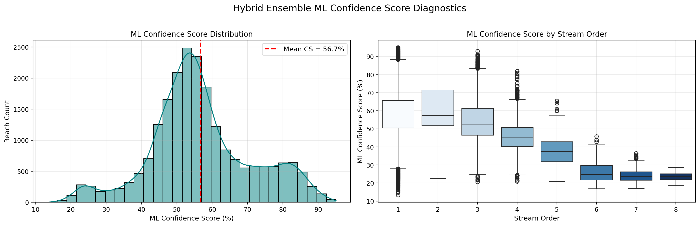{ loading=lazy }
    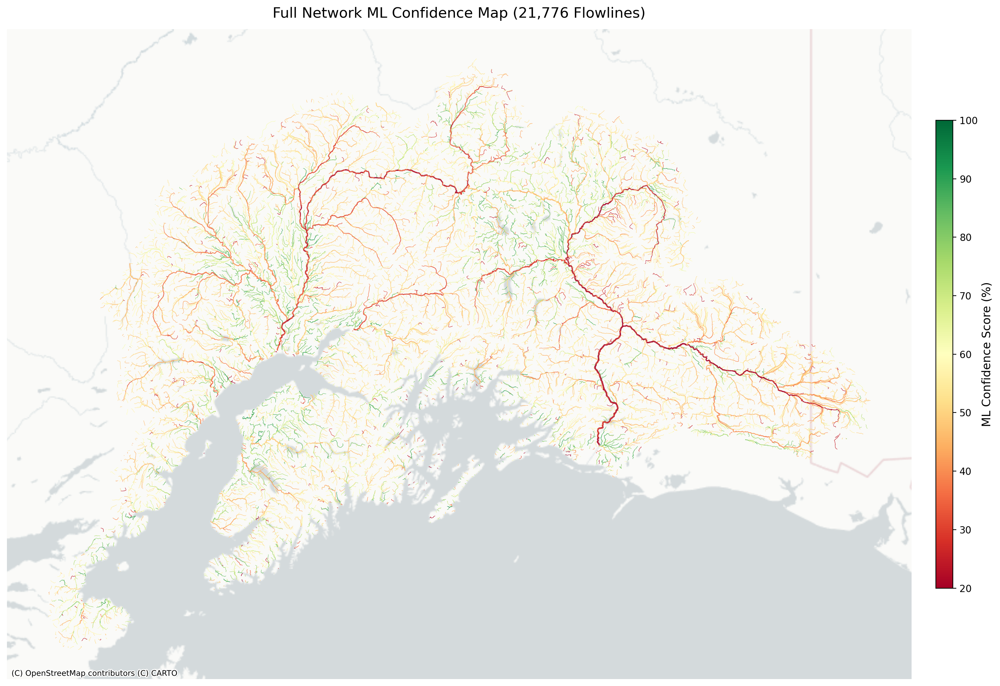{ loading=lazy }
    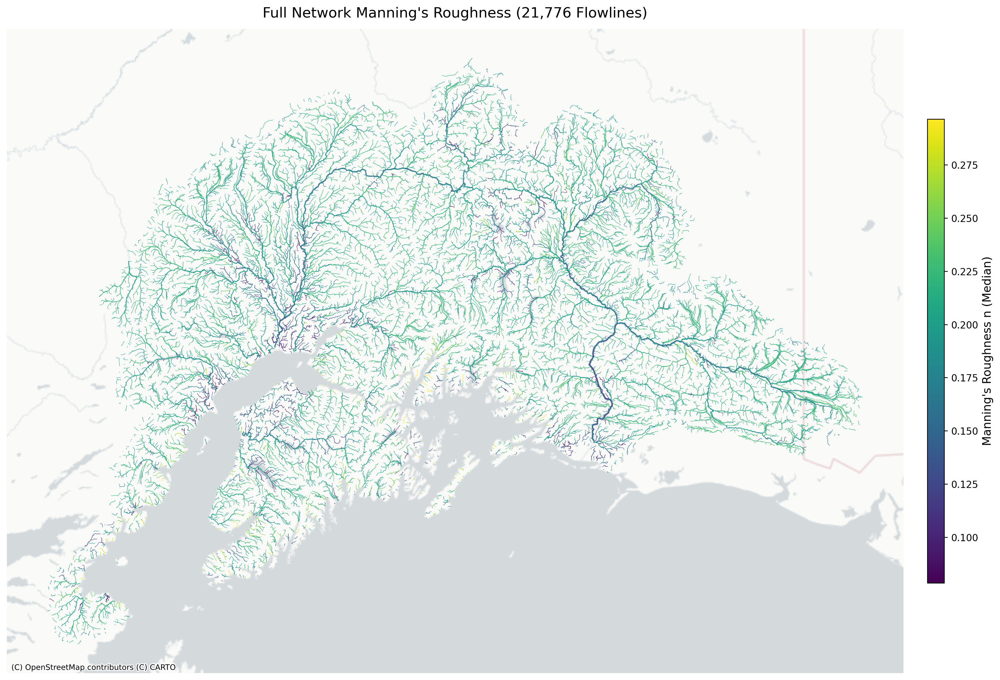{ loading=lazy }
    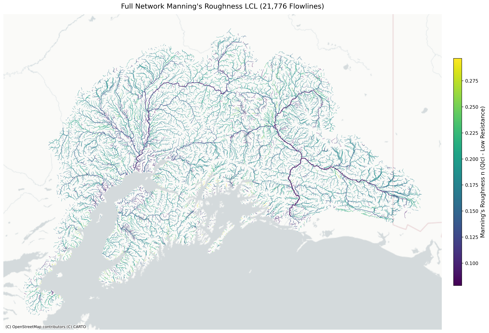{ loading=lazy }
    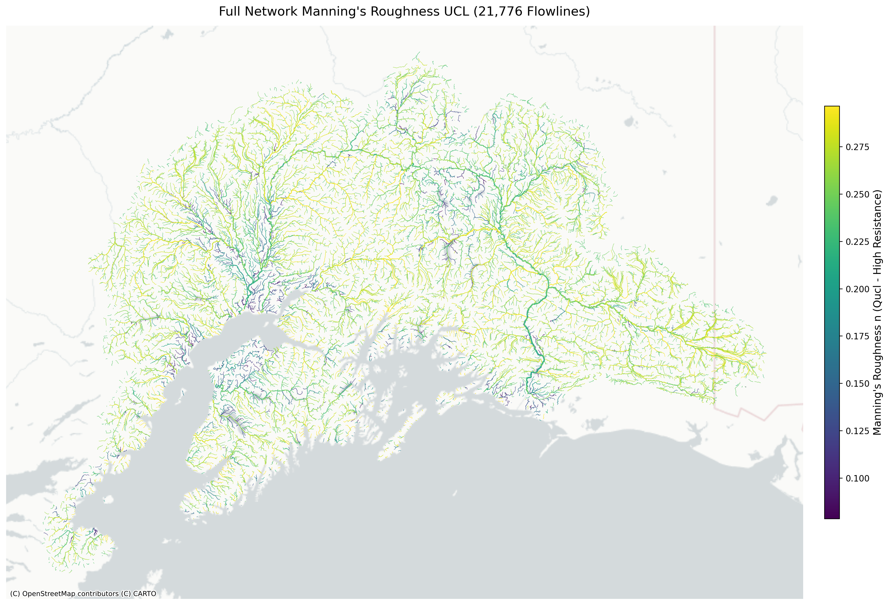{ loading=lazy }

=== "Hawaii"
    ### Hawaii Uncertainty Profiles
    Hawaii's steep volcanic valleys and flash-flood riparian zones present distinct floodplain resistance dynamics.

    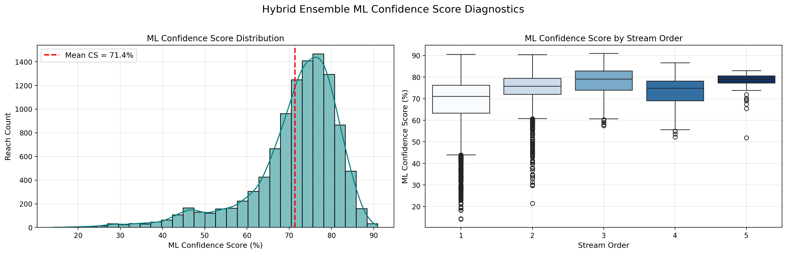{ loading=lazy }
    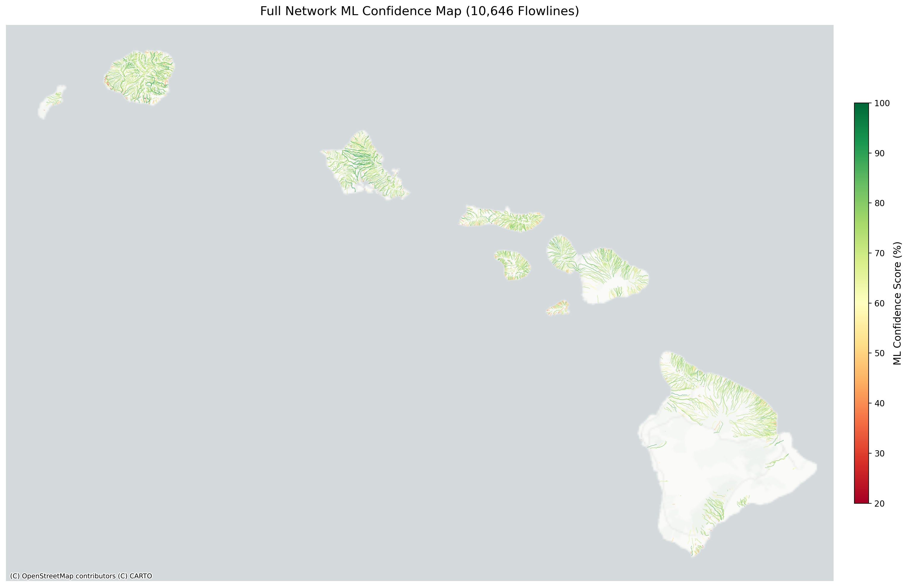{ loading=lazy }
    { loading=lazy }
    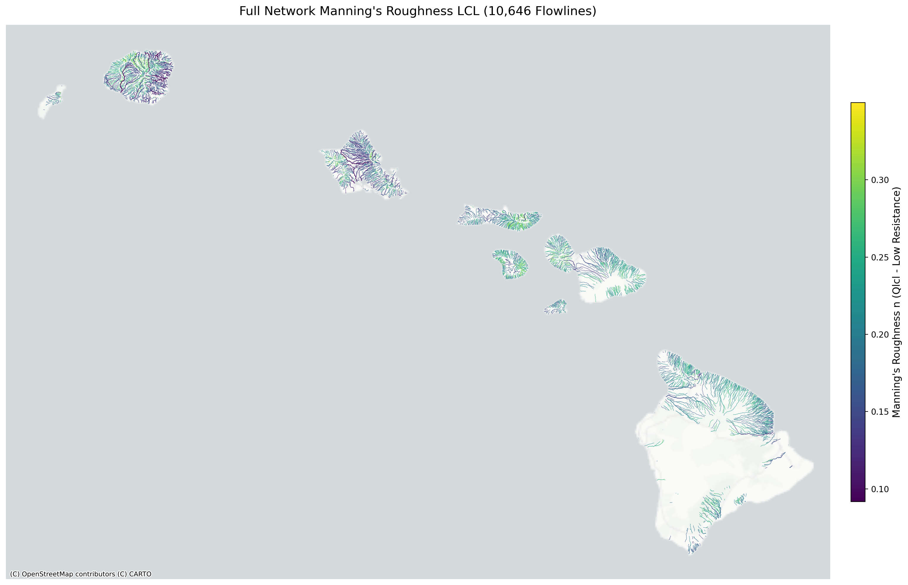{ loading=lazy }
    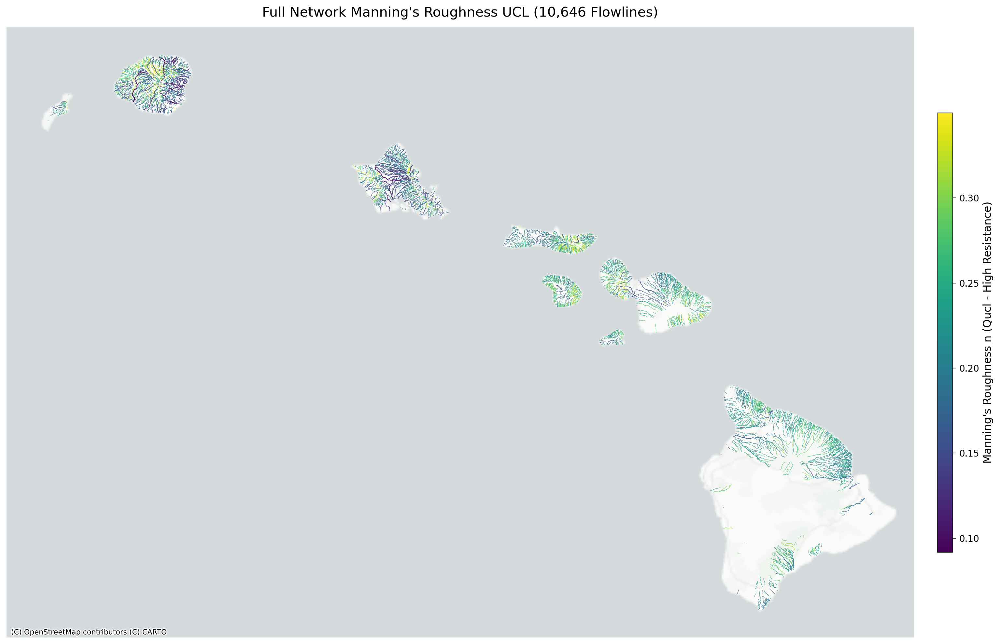{ loading=lazy }

=== "PRVI"
    ### Puerto Rico & Virgin Islands (PRVI) Uncertainty Profiles
    Tropical island floodplain regimes in PRVI exhibit tight confidence intervals along well-developed coastal alluvial reaches.

    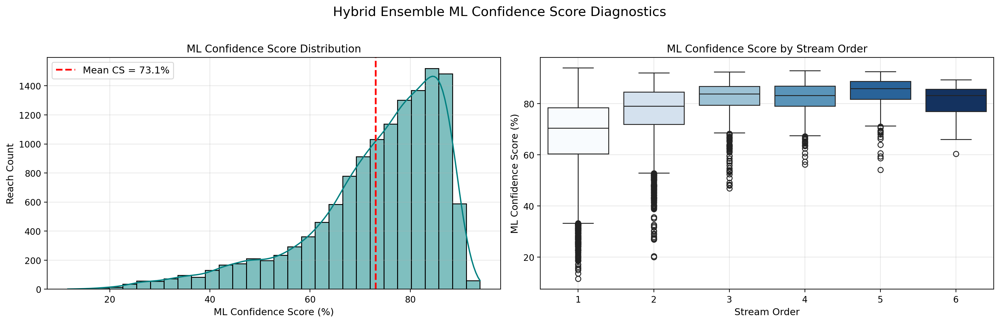{ loading=lazy }
    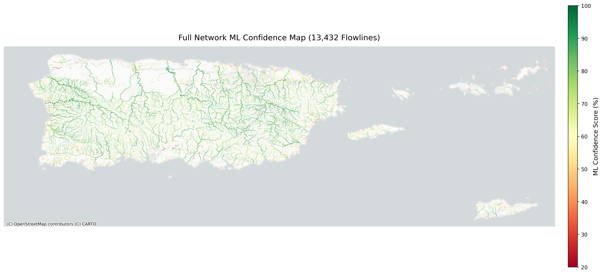{ loading=lazy }
    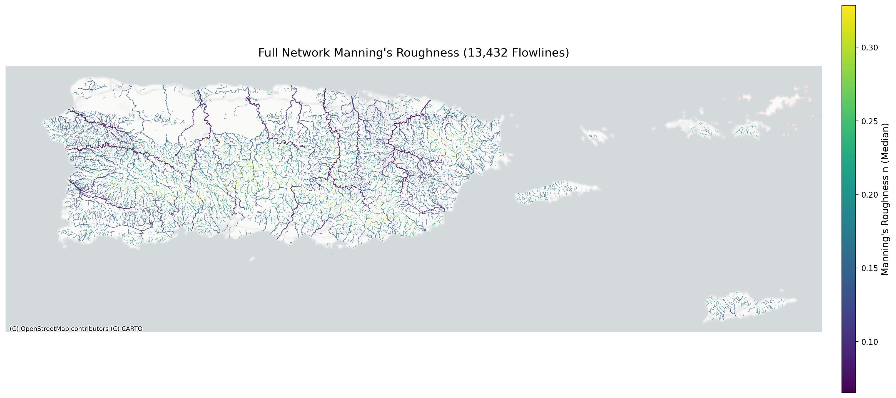{ loading=lazy }
    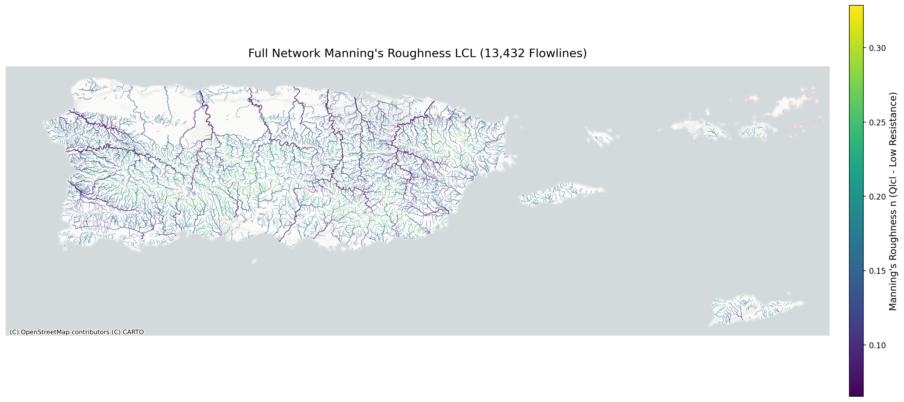{ loading=lazy }
    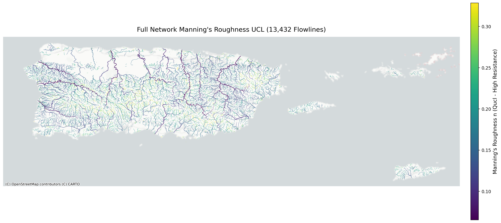{ loading=lazy }
