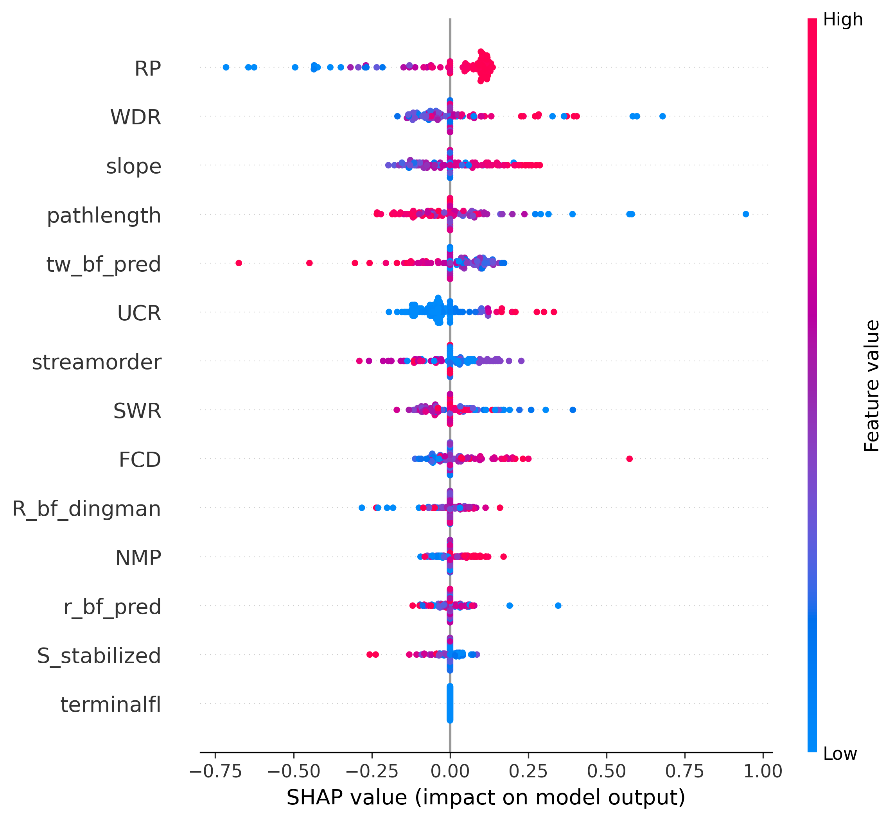
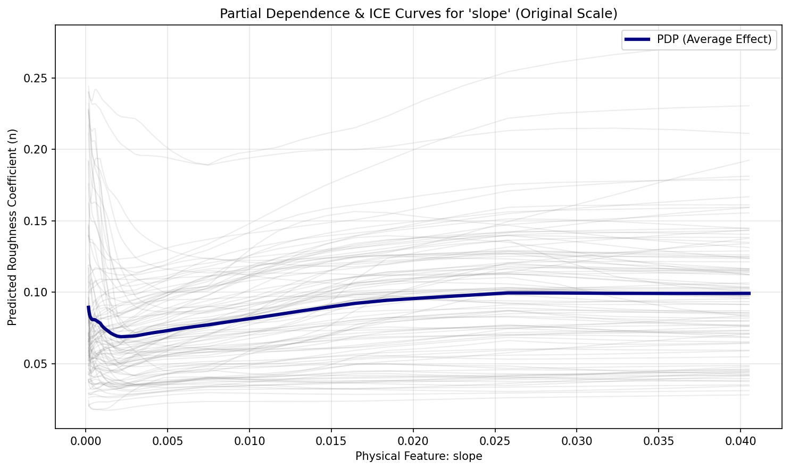
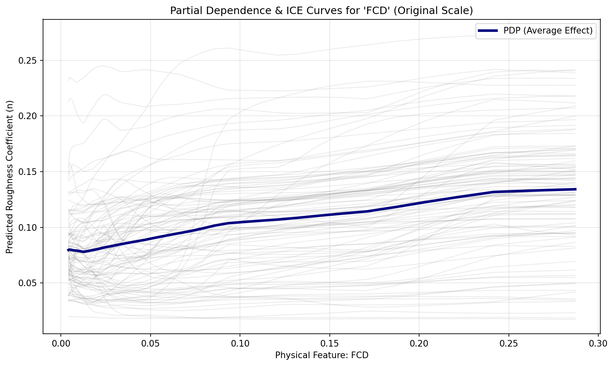
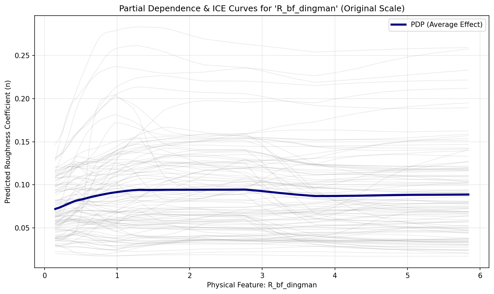
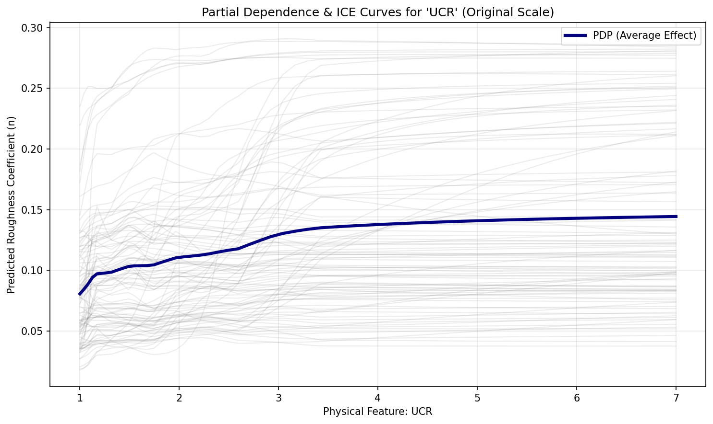
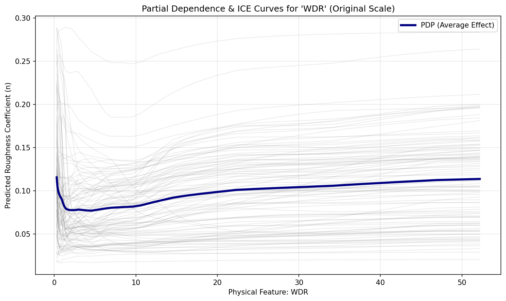

# Explainable AI (XAI)

Our XAI pipeline evaluates the specific geomorphic and hydraulic drivers of overbank resistance using SHapley Additive exPlanations (SHAP) and Partial Dependence Plots (PDP).

---

## Global Feature Importance

{ loading=lazy }

The SHAP beeswarm plot reveals the hierarchical ranking of features dictating overbank flow resistance. Unlike in-channel models where basin elongation dominate, overbank roughness exhibits strong sensitivity to relative position from heatwater to outlet continuam, width to drainge ratio, and slope.

---

## Partial Dependence Analysis

Partial Dependence Plots (PDP) and Individual Conditional Expectation (ICE) curves isolate the marginal response of predicted overbank Manning's $n$ to individual hydro-geomorphic features while holding all other predictors constant.

!!! info "ICE & PDP Generation & Diagnostic Purpose"
    * **Generation Mechanism**: For a target predictor $X_S$ (e.g., channel slope, hydraulic radius), a 1D grid is evaluated across reach instances where complementary features $x_C$ remain fixed. Individual reach trajectories (ICE curves: $\hat{f}(X_S, x_C^{(i)})$) are computed and averaged across the cohort to yield the marginal expectation curve:
      $$\bar{f}_S(X_S) = \frac{1}{N} \sum_{i=1}^N \hat{f}\left(X_S, x_C^{(i)}\right)$$
    * **Hydraulic Significance**: In overbank parameterization, PDP and ICE curves verify whether the machine learning ensemble respects floodplain inundation physics, capturing macro-topographic energy dissipation and momentum exchange across the channel-floodplain boundary.

{ loading=lazy }
**Channel Slope:** Steeper valley gradients require higher overbank energy dissipation, reflecting high-energy, debris-laden montane floodplains compared to tranquil lowland valleys.

{ loading=lazy }
**Fluvial Concavity Deviation (FCD):** FCD highlights departures from equilibrium profile concavity (Flint's Law). Reaches characterized by unconfined depositional flats show distinct overbank friction transitions relative to incised canyons.

{ loading=lazy }
**Hydraulic Radius ($R_{bf}$):** As channel conveyance scale increases, relative boundary resistance diminishes, producing the expected asymptotic decline in bulk friction.

{ loading=lazy }
**Upstream Convergence Ratio (UCR):** Major river junctions produce complex backwater transitions and wide confluence floodplains that modify effective overbank storage.

{ loading=lazy }
**Width-to-Drainage Ratio (WDR):** High WDR channels correspond to wide, unconfined valleys where overbank flow spreads across extensive vegetated surfaces, elevating effective resistance.
