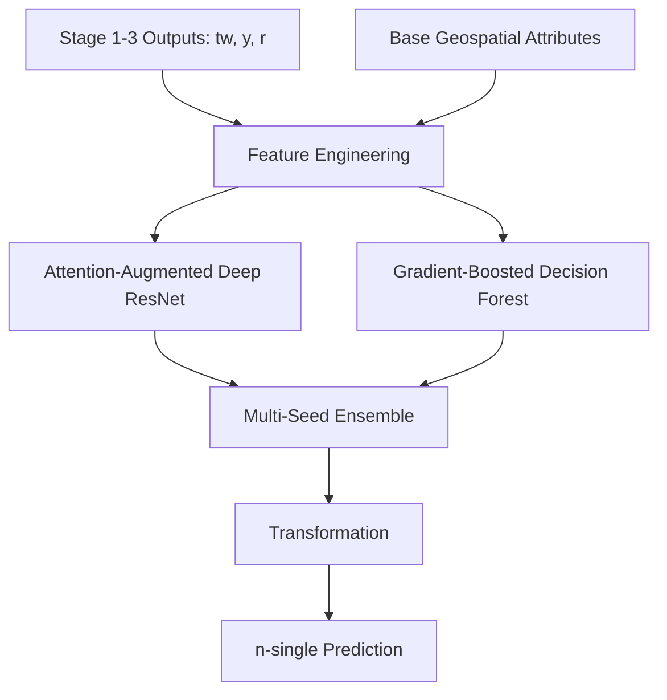

# Model Architecture

The prediction of n-single occurs in **Stage 4** of our cascaded modeling pipeline, building directly upon the outputs (top width `tw`, depth `y`, and shape parameter `r`) from Stages 1 through 3.

## Feature Set
The model utilizes a comprehensive set of base and derived features to capture geomorphic and hydraulic contexts: 
- `slope`, `totdasqkm`, `streamorder`, `pathlength`, `arb_sum`, `terminalfl` 
- `S_stabilized`, `V_bf_proxy`, `FCD`, `FS_proxy`, `HD`, `RP`, `UCR`, `NMP` 
- `tw_bf_pred`, `WDR`, `y_bf_pred`, `HSI`, `SWR`, `r_bf_pred`, `R_bf_dingman` 

## Hybrid Ensemble Architecture

We employ a robust hybrid ensemble that merges deep learning with tree-based gradient boosting, ensuring high predictive skill alongside bounded physical realism.

- **Attention-Augmented Deep Residual Tabular Network**: This architecture features piecewise quantile encodings for robust numerical representation, cross-feature interaction layers, SwiGLU-gated residual blocks for complex non-linear approximations, Squeeze-and-Excitation (SE) attention mechanisms, and RMS normalization.
- **Gradient-Boosted Decision Forest**: A deep tree architecture provides strong partitioning over categorical and nonlinear geographic divides, complementing the neural network.
- **Multi-Seed Ensembling**: Used to systematically quantify epistemic uncertainty across model initializations.

## Optimization and Physical Constraints

- **Log-Space Training**: Targets are transformed to log-space to handle skewed distributions and enforce positivity. Predictions are transformed back using the correction factor: 
  $\hat{n} = \exp\left(\hat{n}_{\log} + \frac{\sigma^2}{2}\right)$

- **Physical Loss Weighting**: The loss function is weighted by drainage area to prioritize accurate representation of major conveying rivers over minor headwaters.
- **Topological Smoothing**: A Gaussian Markov Random Field (GMRF) approach ensures longitudinal consistency along river networks.
- **Physical Bounds Clipping**: Final predictions are hard-clipped to physically realistic limits: $[0.01, 0.35]$.
