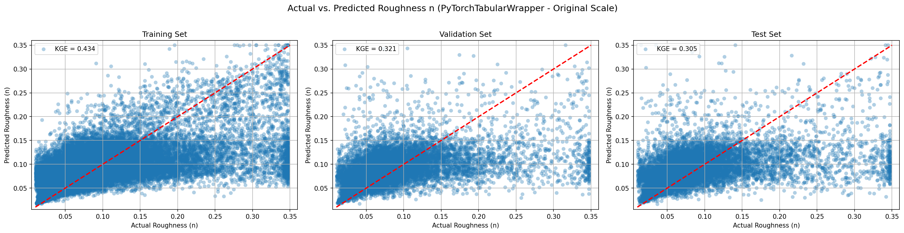
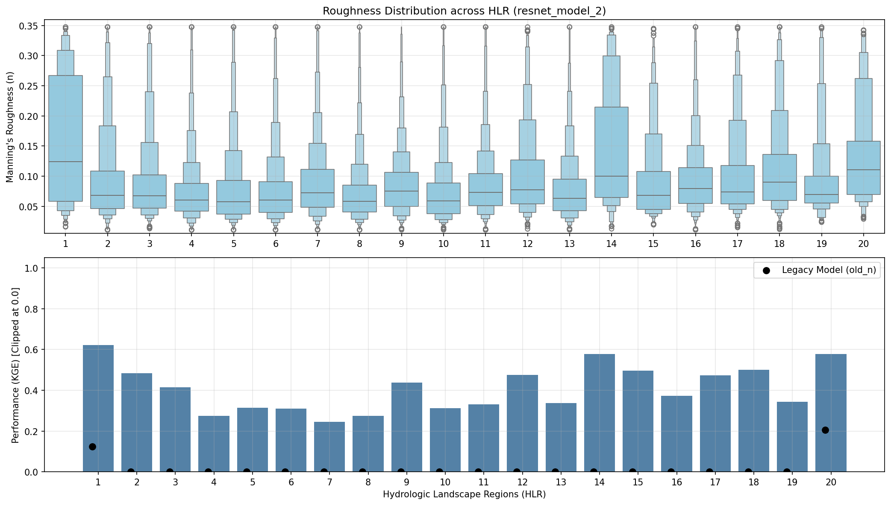
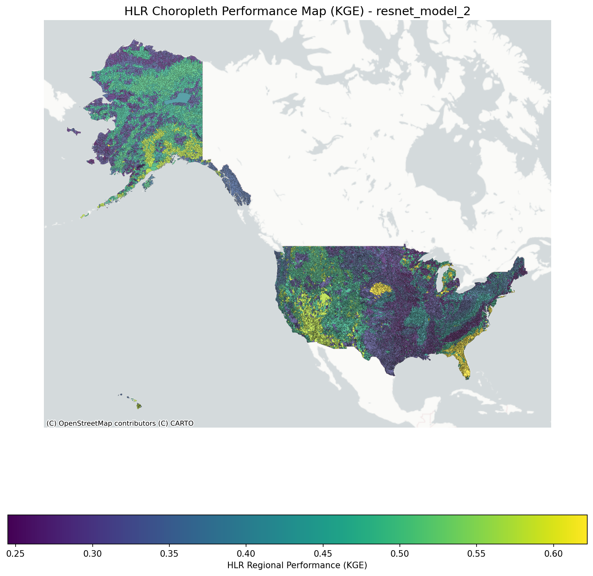
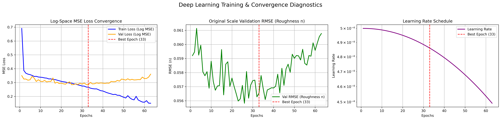
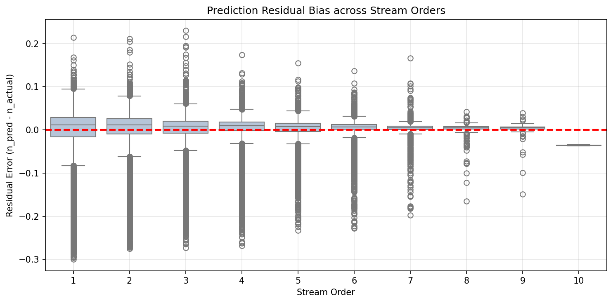

# Model Skill

## Prediction Performance

{ loading=lazy }

This 3-panel scatter plot illustrates the model's agreement with observed data across the Training, Validation, and Test sets. The alignment along the 1:1 line demonstrates strong predictive capability without severe overfitting and confirming the model's robustness and generalization.

## Regional Diagnostics

{ loading=lazy }

Performance stratified by Hydrologic Landscape Regions (HLR)[1] reveals how the model adapts to varying hydro-climatic and geologic regimes. High $KGE$ scores across diverse regions indicate that the model is capturing fundamental physical drivers rather than memorizing local geographies. 
The arease with higher score are: 
- HLR 1: Subhumid plains with permeable soils and bedrock  
- HLR 14: Arid playas with permeable soils and bedrock 
- HLR 20: Humid mountains with permeable soils and impermeable bedrock 
All three regions have permeable soils, which promote high infiltration and groundwater pathways over surface runoff. This produces more stable, baseflow-dominated hydrographs where stage-discharge and hydraulic geometry relationships follow predictable power law scaling.

The arease with lower score are: 
- HLR 4: Humid plains with permeable soils and bedrock 
- HLR 7: Humid plains with permeable soils and impermeable bedrock 
- HLR 8: Semiarid plains with impermeable soils and bedrock 
All these regions are Plains characterized by extremely low topographic relief and gentle channel slopes 

{ loading=lazy }

The choropleth map provides a geographic distribution of model skill, highlighting areas of high confidence and isolating regions where complex terrain or sparse data slightly degrade performance.

## Training Convergence

{ loading=lazy }

The training curves show loss convergence and RMSE evolution over epochs. The smooth decay without significant divergence between training and validation loss curves points to an effective learning rate schedule and appropriate regularization mechanisms within the SwiGLU-gated residual blocks.

## Bias Analysis

{ loading=lazy }

An analysis of prediction residuals mapped against stream order (1 through 9) indicates that the model maintains zero-centered bias across network scales. There is under-prediciton observed in 10th order stream and that is mainly due to lack of traning data for 10th order stream.

!!! success "Key Finding"
    The lack of systematic bias across stream orders confirms that our physical loss weighting (by drainage area) successfully balances performance between expansive headwater networks and major river stems.

[1] Wolock, D. M. (2003). *Hydrologic landscape regions of the United States (No. 2003-145). US Geological Service.*