# Uncertainty Quantification

Our framework explicitly tracks epistemic and aleatoric uncertainty. Model confidence is quantified using an ML Confidence Score, defined as:

$$
CS = \exp(-\gamma \cdot CV) \times 100\%
$$

where $\gamma = 3.0$ and $CV$ is the coefficient of variation across the multi-seed ensemble. The ensemble spread provides a probabilistic range of roughness values, yielding the median ($q_{50}$), lower confidence interval ($q_{05}$), and upper confidence interval ($q_{95}$).

=== "SUPERCONUS"
    ### SUPERCONUS Uncertainty Profiles
    The SUPERCONUS domain showcases the model's performance across the contiguous US.
    
    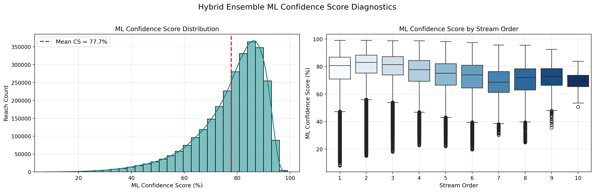{ loading=lazy }
    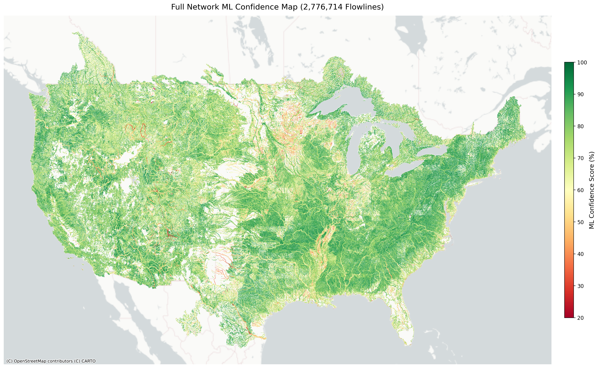{ loading=lazy }
    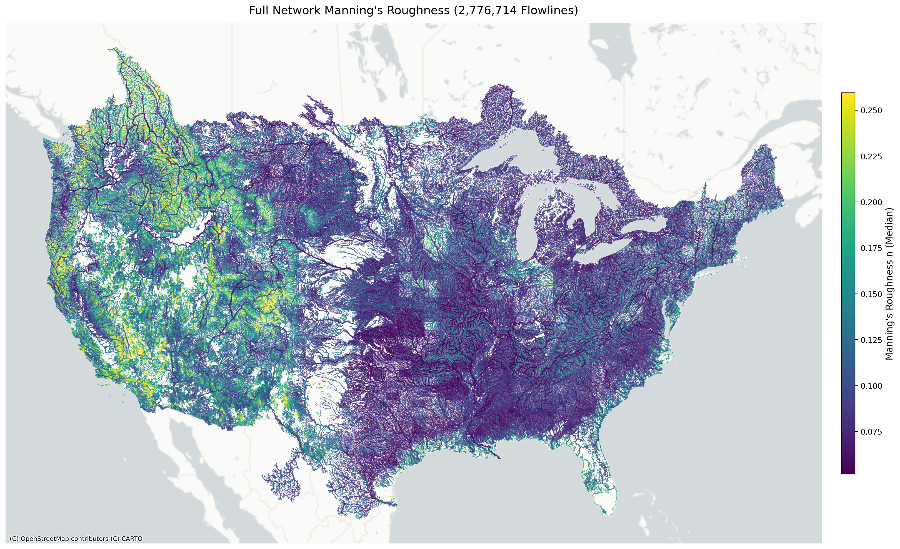{ loading=lazy }
    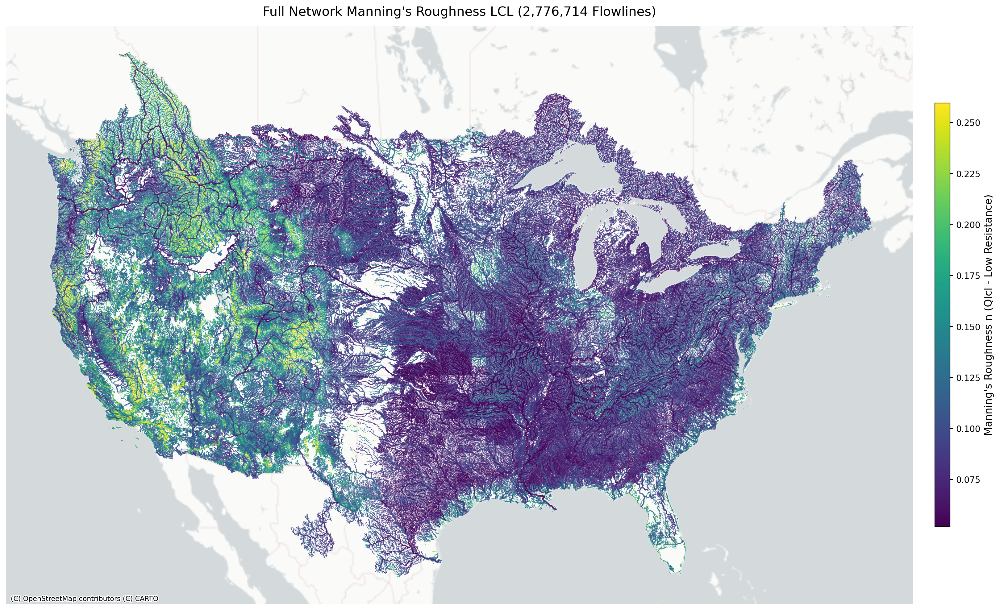{ loading=lazy }
    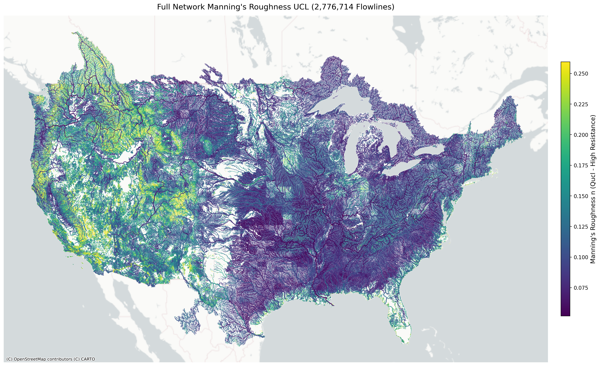{ loading=lazy }

=== "Alaska"
    ### Alaska Uncertainty Profiles
    In Alaska, complex glaciated headwaters and braided river channels none existant in CONUS trraining data lower  the predictive confidence bounds.

    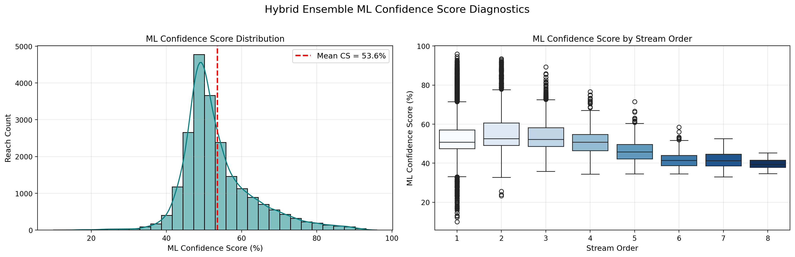{ loading=lazy }
    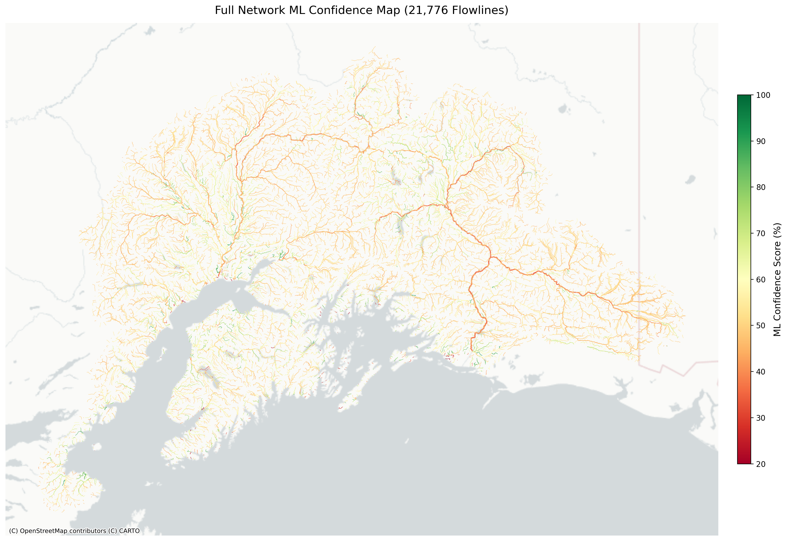{ loading=lazy }
    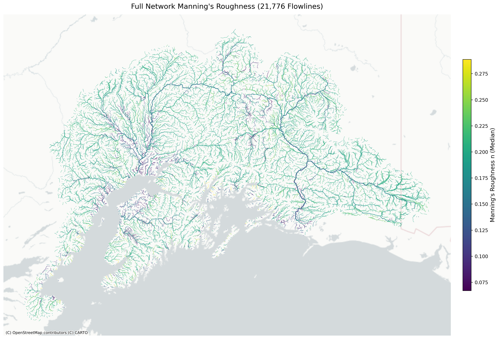{ loading=lazy }
    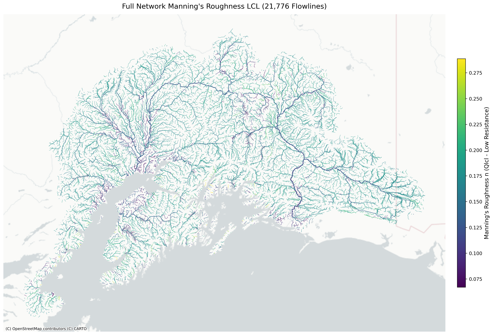{ loading=lazy }
    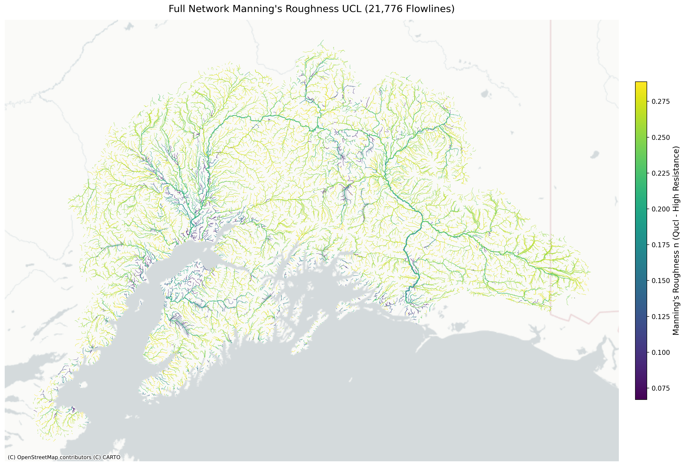{ loading=lazy }

=== "Hawaii"
    ### Hawaii Uncertainty Profiles
    Hawaii's steep, volcanic catchments present unique geomorphic signatures captured in the confidence intervals.

    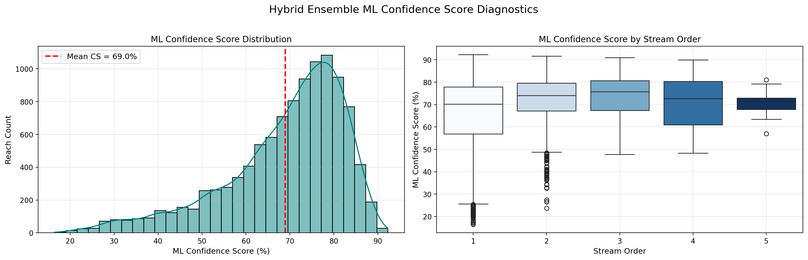{ loading=lazy }
    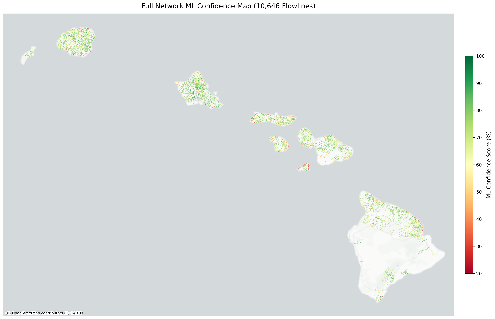{ loading=lazy }
    { loading=lazy }
    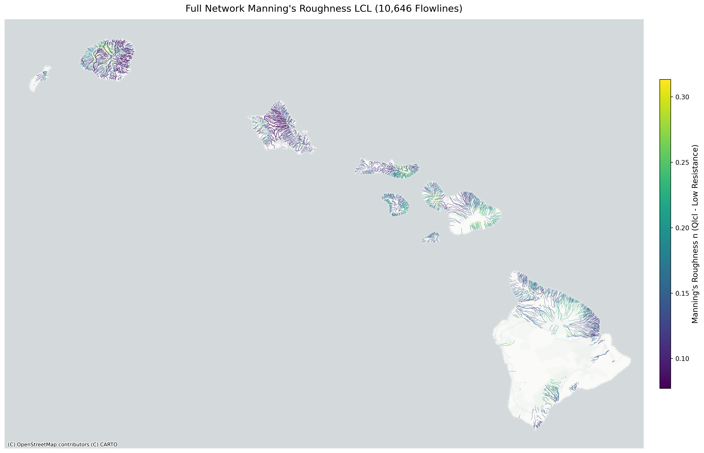{ loading=lazy }
    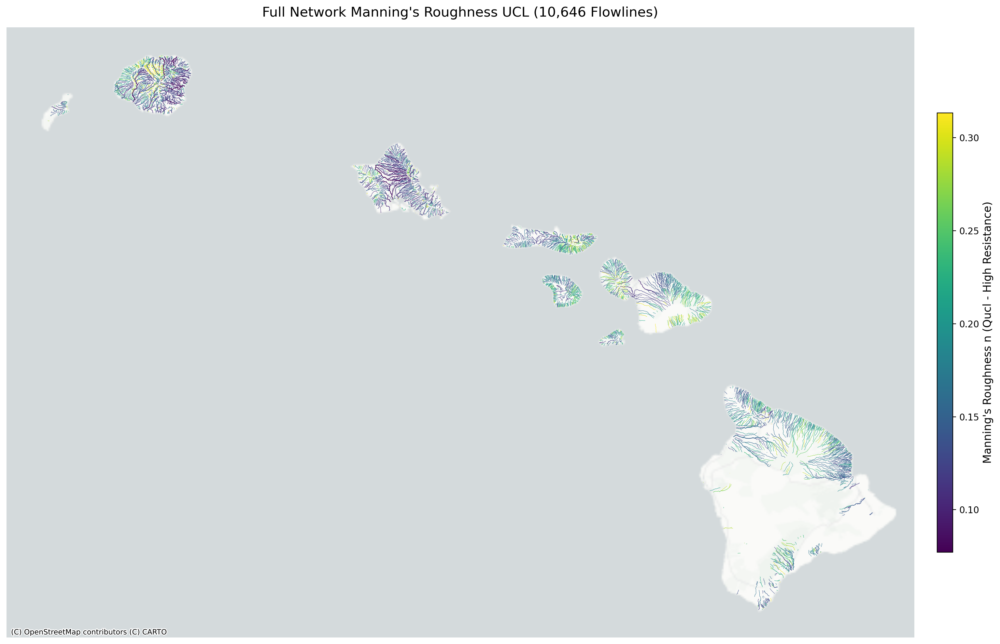{ loading=lazy }

=== "PRVI"
    ### Puerto Rico & Virgin Islands (PRVI) Uncertainty Profiles
    Tropical island hydrology in PRVI exhibits tight confidence limits in well-defined main channels with increasing variance in steep headwaters.

    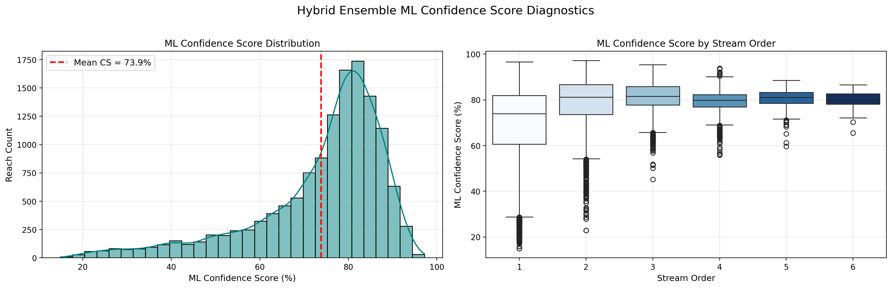{ loading=lazy }
    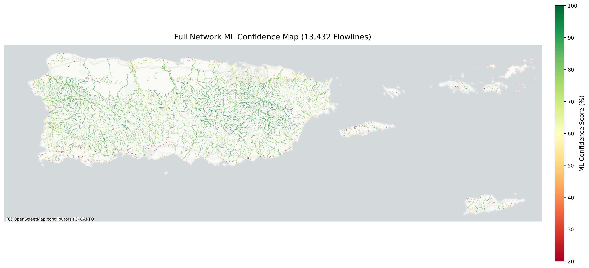{ loading=lazy }
    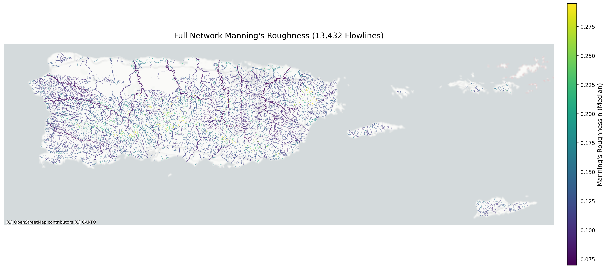{ loading=lazy }
    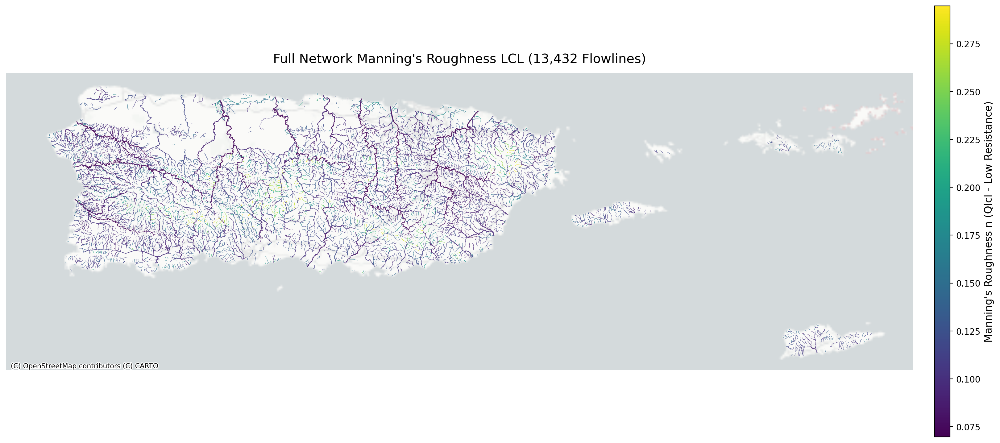{ loading=lazy }
    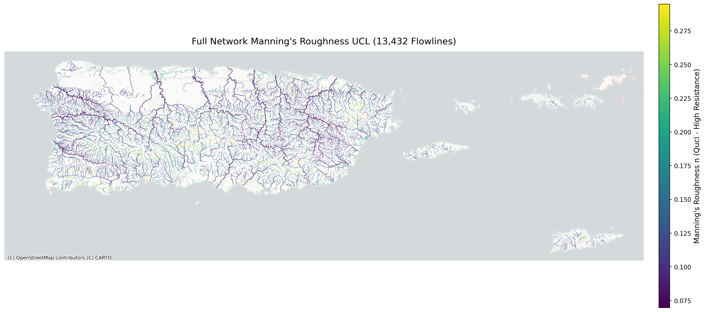{ loading=lazy }
