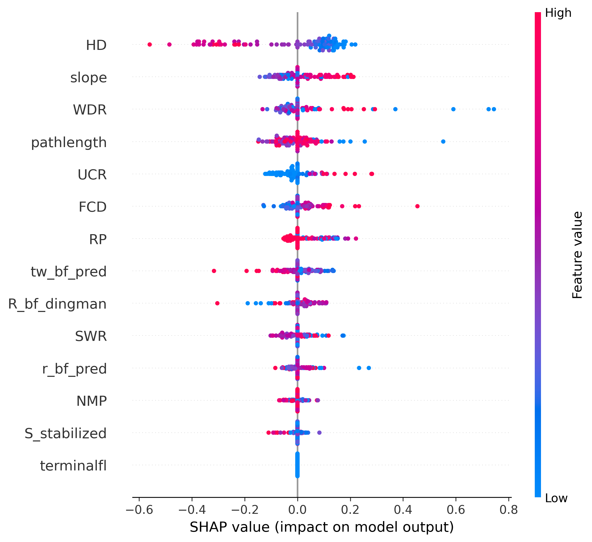
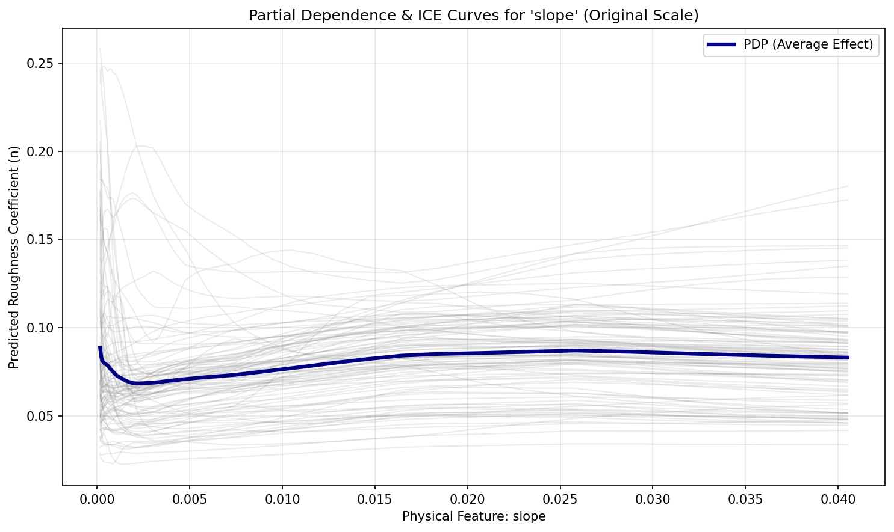
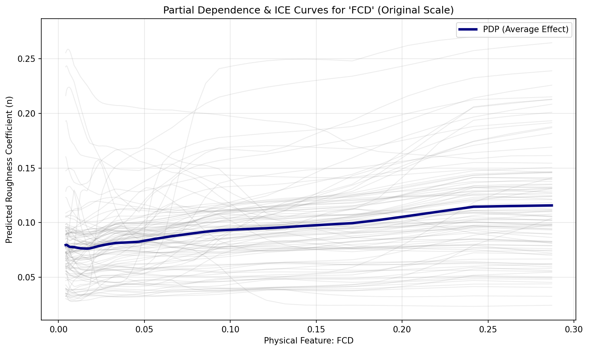
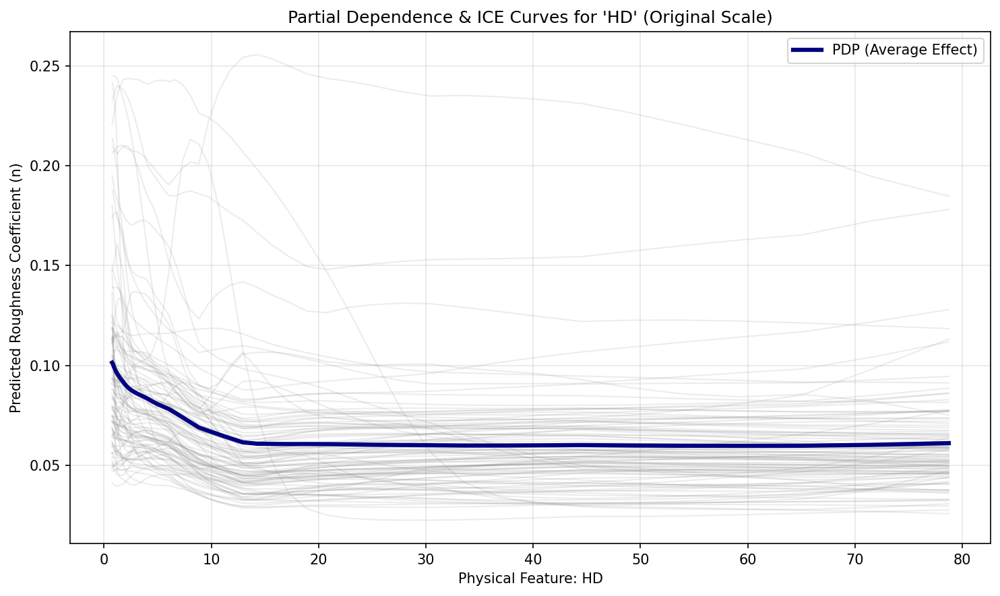
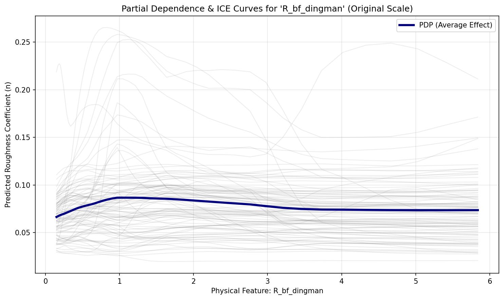
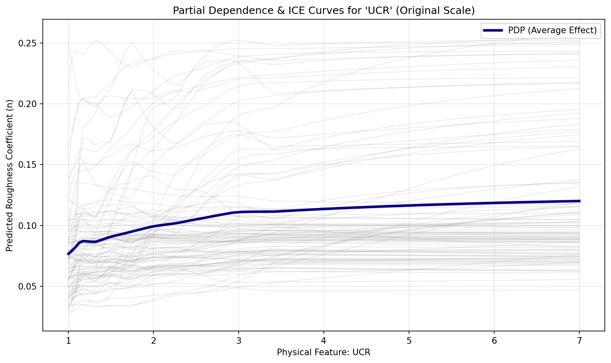
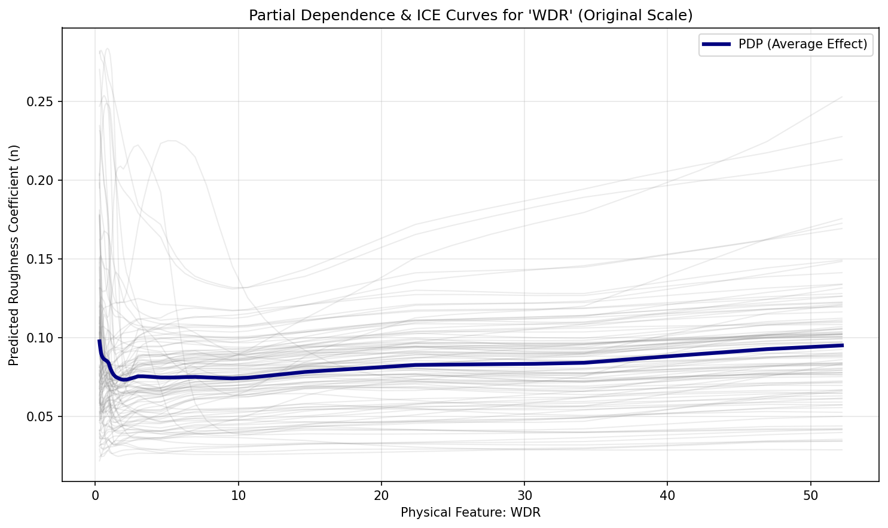

# Explainable AI (XAI)

We utilize SHapley Additive exPlanations (SHAP) [1] to compute global feature importance, treating the ML ensemble as a cooperative game where features are players contributing to the final prediction. Partial Dependence Plots (PDP) and Individual Conditional Expectation (ICE) plots are used to isolate the marginal effect of individual geomorphic features on the predicted roughness.

## Global Feature Importance
{ loading=lazy }
The SHAP beeswarm plot reveals the hierarchical importance of our engineered features, demonstrating that variables derived from hydraulic geometry (such as drainage basin elongation; HD) heavily dictate flow resistance.

## Partial Dependence Analysis

Partial Dependence Plots (PDP) and Individual Conditional Expectation (ICE) curves isolate the marginal response of predicted Manning's $n$ to individual hydro-geomorphic features while holding all other predictors constant.

!!! info "ICE & PDP Generation & Diagnostic Purpose"
    * **Generation Mechanism**: For a target predictor $X_S$ (e.g., channel slope, hydraulic radius), a 1D grid is evaluated across reach instances where complementary features $x_C$ remain fixed. Individual reach trajectories (ICE curves: $\hat{f}(X_S, x_C^{(i)})$) are computed and averaged across the cohort to yield the marginal expectation curve:
      $\bar{f}_S(X_S) = \frac{1}{N} \sum_{i=1}^N \hat{f}\left(X_S, x_C^{(i)}\right)$
    * **Hydraulic Significance**: In roughness parameterization, PDP and ICE curves verify whether the machine learning ensemble obeys boundary layer hydraulics (such as the Keulegan asymptotic decay of relative roughness with increasing conveyance depth) and positive energy dissipation scaling with steep valley slopes, ensuring the model generalizes reliably across diverse physiographic settings.

{ loading=lazy }
**Channel Slope:** As channel slope increases, predicted $n$ increases. This reflects the greater energy dissipation required in steep channels, often associated with steps, pools, and large bed material.

{ loading=lazy }
**Fluvial Concavity Deviation (FCD):** FCD measures deviation from Flint's Law. The PDP shows how geologic knickpoints or depositional flats dynamically adjust local roughness expectations.

{ loading=lazy }
**Hack's Law Deviation (HD):** Variations in drainage basin elongation impact hydrograph routing, indirectly influencing the stable channel dimensions and associated boundary friction.

{ loading=lazy }
**Hydraulic Radius (R_bf_dingman):** This plot vividly captures the Keulegan effect: as the hydraulic radius increases, relative roughness declines, resulting in a distinctly asymptotic decrease in Manning's $n$.

{ loading=lazy }
**Upstream Convergence Ratio (UCR):** The UCR helps the model identify confluences. Sharp changes in water and sediment discharge alter channel width and depth, influencing the optimized flow resistance.

{ loading=lazy }
**Width-to-Drainage Ratio (WDR):** High WDR values indicate shallow, braided, or aggraded channels, which inherently possess higher boundary friction compared to narrow, deep channels.

[1] Lundberg, S. M., & Lee, S. I. (2017). A unified approach to interpreting model predictions. Advances in neural information processing systems, 30.