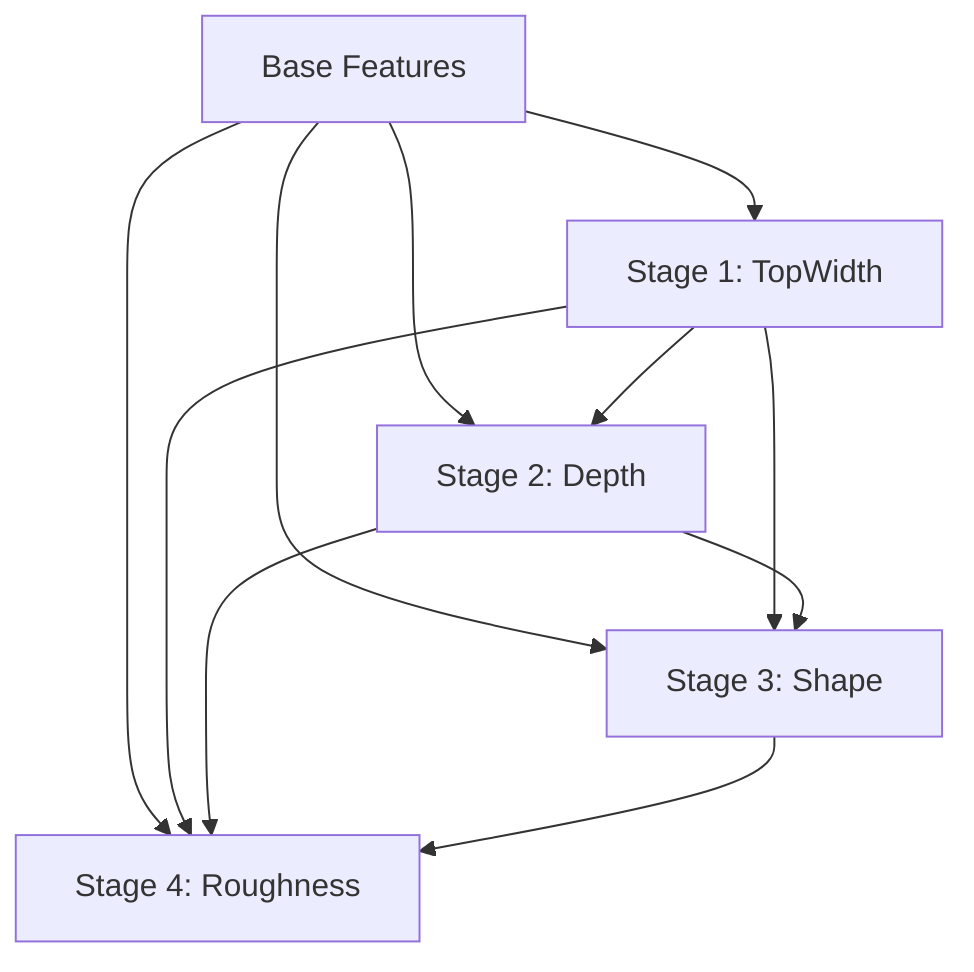

# Feature Engineering

## Glossary of Raw Inputs
- `totdasqkm`: Total upstream drainage area (\(\text{km}^2\))
- `slope`: Channel bed slope (dimensionless)
- `arb_sum`: Sum of lengths of all upstream flowlines
- `pathlength`: Downstream path length to a sink
- `terminalfl`: Binary indicator (1 if flowline drains into a sink/ocean)
- `streamorder`: Strahler stream order

## Feature Dependency Cascade

## Multicollinearity Resolution & Feature Selection

Geomorphic and hydrographic attributes derived from river networks often exhibit strong mutual correlations (e.g., drainage area, cumulative stream length). If unaddressed, high multicollinearity destabilizes model coefficients, inflates parameter variance, and distorts feature attribution.

To ensure robust and interpretable models, the framework incorporates an **information-driven multicollinearity resolution protocol** prior to model training:

### 1. Spearman Rank Correlation Screening
The pairwise non-parametric monotonic relationship across all candidate features is evaluated:

$$
|r_s(f_1, f_2)| = \left| \text{corr}_{\text{spearman}}(f_1, f_2) \right|
$$

All feature pairs exhibiting high correlation ($|r_s| > 0.75$) are flagged for redundancy resolution.

### 2. Initial Predictive Utility Assessment
To determine which variable to keep in each collinear pair, an initial evaluative gradient-boosted tree probe assesses the relative predictive power of every candidate feature against the target variable. Each feature receives an initial empirical importance score:

$$
\text{imp}(f)
$$

### 3. Information-Driven Pruning & Retention
For every collinear pair $(f_1, f_2)$ with $|r_s| > 0.75$:

- **Retention**: The feature with the higher predictive importance score is preserved.
- **Pruning**: The redundant collinear counterpart with lower predictive power is systematically dropped.
- **Provenance Logging**: The dropped variable, its collinear partner, the correlation magnitude, and relative importance scores are recorded in the model deployment metadata for transparency and auditability.

### 4. Downstream Pipeline Ingestion
Only the selected, non-redundant feature subset advances to subsequent preprocessing stages (log/log1p transformations, quantile bounds clipping) and final hybrid ensemble model training.

---

## Base Hydro-Geomorphic Features

**`S_stabilized`**

$$
S_{\text{stabilized}} = \frac{L_{\text{curved}}}{D_{\text{Euclidean}}}
$$

Stabilized Sinuosity: Represents channel meandering. Stabilizing short reaches prevents division-by-zero and artificial sinuosity spikes from GIS discretization artifacts [1].

**`SPI_actual`**

$$
\text{SPI}_{\text{actual}} = \text{totdasqkm} \times \text{slope}
$$

Stream Power Index Proxy: Proportional to the total kinetic energy potential of the flow, driving sediment transport and channel-widening capacity [3].

**`V_bf_proxy`**

$$
V_{\text{bf_proxy}} = \frac{\text{totdasqkm}^{0.27} \times \sqrt{\text{slope} + \epsilon}}{S_{\text{stabilized}}}
$$

Bankfull Velocity Proxy: Replaces segment-dependent travel-time. Captures localized flow speed and energy state independently of GIS-segment splits [8].

**`FCD`**

$$
\text{FCD} = \frac{\text{slope}}{\text{totdasqkm}^{-0.45} + \epsilon}
$$

Fluvial Concavity Deviation: Measures local slope deviation from Flint’s Law. Identifies geological knickpoints (high values) and depositional flats (low values) [4].

**`FS_proxy`**

$$
\text{FS}_{\text{proxy}} = \frac{S_{\text{stabilized}} \times \sqrt{\text{totdasqkm}}}{\text{slope} + \epsilon}
$$

Floodplain Storage Proxy: Uses the regional scaling of valley width (\( \propto \sqrt{A} \)) to estimate lateral floodplain space and storage capacity [1].

**`HD`**

$$
\text{HD} = \frac{\text{arb_sum}}{\text{totdasqkm}^{0.55} + \epsilon}
$$

Hack's Law Deviation: Evaluates drainage basin elongation (\( L \propto A^{0.55} \)). Captures hydrograph shape variations and peak discharge timing [5].

**`RP`**

$$
\text{RP} = \frac{\text{pathlength}}{\text{pathlength} + \text{arb_sum} + \epsilon}
$$

Relative Position: A scale-independent ratio defining where the reach sits along the headwater-to-outlet continuum.

**`UCR`**

$$
\text{UCR} = \frac{\text{totdasqkm}}{\sum \text{upstream_totda} + \epsilon}
$$

Upstream Convergence Ratio: Identifies major network confluences where rapid changes in water and sediment discharge alter channel width and depth.

---

## Stage 1 Prediction

**`tw_bf_pred`**
Predicted Target: Bankfull channel width, scaling as \( W \propto Q^b \) [2]. Uses the 8 Base Predictors.

---

## Stage 2 Derived + Prediction

**`WDR`**

$$
\text{WDR} = \frac{\text{tw_bf_pred}}{\sqrt{\text{totdasqkm}} + \epsilon}
$$

Width-to-Drainage Ratio: Dimensionless metric showing how wide the channel is relative to regional curves. High values indicate shallow, braided, or aggraded channels [2].

**`WSP`**

$$
\text{WSP} = \text{tw_bf_pred} \times \text{slope}
$$

Width-Slope Product: Proportional to the lateral-to-bed shear stress ratio. Helps the model constrain bankfull depth based on available energy [3].

**`y_bf_pred`**
Predicted Target: Bankfull channel depth, scaling as \( d \propto Q^f \) and constrained by width and aspect ratio [2]. Uses 8 Base + `tw_bf_pred` + `WDR` + `WSP`.

---

## Stage 3 Derived + Prediction

**`AR_channel`**

$$
\text{AR}_{\text{channel}} = \frac{\text{tw_bf_pred}}{\text{y_bf_pred} + \epsilon}
$$

Aspect Ratio (W/D): The primary geomorphic classifier. Narrow/deep channels behave differently from wide/shallow channels [3].

**`HSI`**

$$
\text{HSI} = \frac{\text{tw_bf_pred} \times \text{y_bf_pred}}{\text{totdasqkm} + \epsilon}
$$

Hydraulic Scale Index: Compares bankfull cross-sectional area to drainage area, reflecting regional water routing and conveying efficiency [6].

**`SWR`**

$$
\text{SWR} = \frac{\text{slope} \times \text{y_bf_pred}}{\text{tw_bf_pred} + \epsilon}
$$

Shear-to-Width Ratio: A proxy for tractive force distribution. High values indicate high bed-shear relative to bank stability, driving rectangular or bedrock-confined shapes [3].

**`r_pred`**
Predicted Target: Dingman \( r \) (dimensionless). Defines cross-section shape exponent (\( r=1 \) triangular, \( r=2 \) parabolic, \( r \to \infty \) rectangular) [6]. Uses 8 Base + Stage 1 & 2 outputs + Stage 3 derived features.

---

## Stage 4 Derived + Prediction

**`A_bf`**

$$
A_{\text{bf}} = \left(\frac{\text{r_pred}}{\text{r_pred} + 1}\right) \times \text{tw_bf_pred} \times \text{y_bf_pred}
$$

Dingman Bankfull Area: Exact analytical cross-sectional area of a power-law channel [6].

**`P_bf`**

$$
P_{\text{bf}} = \text{tw_bf_pred} + \left(\frac{2 \times \text{r_pred}}{\text{r_pred} + 1}\right) \times \frac{\text{y_bf_pred}^2}{\text{tw_bf_pred} + \epsilon}
$$

Dingman Bankfull Wetted Perimeter: Wetted boundary length calculated analytically from the power-law geometry [6].

**`R_bf_dingman`**

$$
R_{\text{bf_dingman}} = \frac{A_{\text{bf}}}{P_{\text{bf}} + \epsilon}
$$

Dingman Hydraulic Radius: Represents the hydraulic efficiency of the predicted channel shape [6].

**`RRP`**

$$
\text{RRP} = \frac{1}{R_{\text{bf_dingman}} + \epsilon}
$$

Relative Roughness Proxy: Captures the Keulegan effect (\( n \propto \ln(R/k_s)^{-1} \)). As hydraulic radius increases, relative roughness and Manning’s \( n \) decrease [8].

**`MRP`**

$$
\text{MRP} = S_{\text{stabilized}}^2 - 1.0
$$

Meander Roughness Penalty: Represents energy loss from channel meandering (Cowan's friction addition method) [7].

**`u_star`**

$$
u_* = \sqrt{9.81 \times R_{\text{bf_dingman}} \times \text{slope}}
$$

Boundary Shear Velocity Proxy: Key parameter for bedform stability. Controls the transition between different roughness regimes [8].

**`n_pred`**
Predicted Target: Manning's \( n \) (\( s/\text{m}^{1/3} \)). Flow resistance coefficient used in flood modeling [8]. Uses all preceding inputs and derived features.
