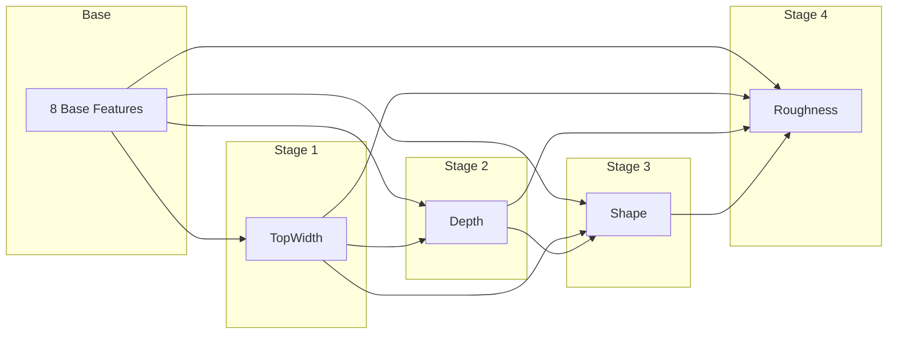

# Pipeline Architecture

The NOAA OWP channel parameter estimation framework utilizes a multi-stage sequential prediction approach. By explicitly modeling the hydraulic dependency chain from width to depth to shape to roughness the architecture ensures physical consistency and manages error propagation across the cascading geomorphic features.

## Why Sequential Prediction?

!!! info "Hydraulic Dependency Chain"
    Channel characteristics are intrinsically linked. Depth depends on the available width and energy, shape depends on the aspect ratio (width/depth), and roughness depends on the hydraulic radius derived from width, depth, and shape. Sequential prediction allows the model to constrain downstream parameters using upstream predictions, effectively managing error propagation while respecting physical laws.

## Multicollinearity Filtering & Feature Selection

To prevent parameter variance inflation from highly correlated hydrographic features ($|r| > 0.85$), the pipeline applies an automated, information-driven feature selection protocol:

1. **Spearman Rank Correlation Matrix**: Identifies all feature pairs exhibiting high mutual correlation ($|r_s| > 0.85$).
2. **Predictive Utility Assessment**: Evaluates initial feature importance scores using a baseline gradient-boosted tree probe.
3. **Collinear Pair Resolution**: Retains the predictor with higher predictive power while pruning the redundant surrogate.
4. **Metadata Provenance**: Records dropped features, correlation magnitudes, and relative importance values in deployment metadata.

See [Feature Engineering](feature-engineering.md#multicollinearity-resolution-feature-selection) for full methodological details.

## Hybrid Ensemble Architecture

Our framework employs a state-of-the-art hybrid architecture that merges deep learning with tree-based methods:

- **PhysicalResTabNet**: An attention-augmented deep residual tabular network featuring piecewise quantile feature encodings. It employs explicit cross-feature interaction layers and SwiGLU-gated residual blocks with RMS normalization and Squeeze-and-Excitation channel attention.
- **Gradient-Boosted Decision Forest**: A robust XGBoost ensemble featuring deep tree architecture with regularized learning to capture non-linear geomorphic thresholds.
- **Multi-Seed Epistemic Uncertainty**: Predictions are aggregated across \( N \) independent model instantiations (varying initializations and data splits) to quantify epistemic uncertainty and generate a robust ML Confidence Score.

## Log-Space Training and Bias Correction

To properly scale targets that span orders of magnitude and enforce non-negativity, models are trained in log-space (\( y_{\log} = \ln(y) \)). When transforming predictions back to the physical domain, we apply an analytical variance bias correction to preserve the mean:

$$
\hat{y} = \exp\left(\hat{y}_{\log} + \frac{\sigma^2_{\text{val}}}{2}\right)
$$

## Physical Loss Weighting

!!! tip "Physics-Informed Optimization"
    We apply power-law sample weights proportional to drainage area during training. This ensures that larger, hydraulically significant mainstems which transport the majority of flow, dominate the loss function, preventing the model from over-optimizing on headwater noise.

## GMRF Topological Smoothing

To enforce longitudinal hydraulic continuity along mainstem networks, the raw predictions undergo a regularized tridiagonal Gaussian Markov Random Field (GMRF) topological smoothing. This penalizes unphysical discontinuities between adjacent stream segments while preserving genuine geomorphic transitions (knickpoints, confluences).

## Explainable AI (XAI)

To ensure that continental-scale deep learning models remain physically grounded and scientifically interpretable, our framework integrates comprehensive Explainable AI diagnostics:

- **SHAP Game-Theoretic Attribution**: Global dominance rankings and localized reach-scale waterfall plots quantifying individual feature contributions.
- **Partial Dependence & ICE Curves**: Validating empirical monotonicity against physical laws ($W \propto A^b$, $n \propto \ln(R/k_s)^{-1}$).
- **Permutation Feature Importance**: Model-agnostic out-of-fold sensitivity metrics.
- **Hydrologic Landscape Region (HLR) Auditing**: Verifying stability across diverse physiographic provinces.

For full methodology and visual diagnostic frameworks, see [Explainable AI (XAI)](xai.md).
