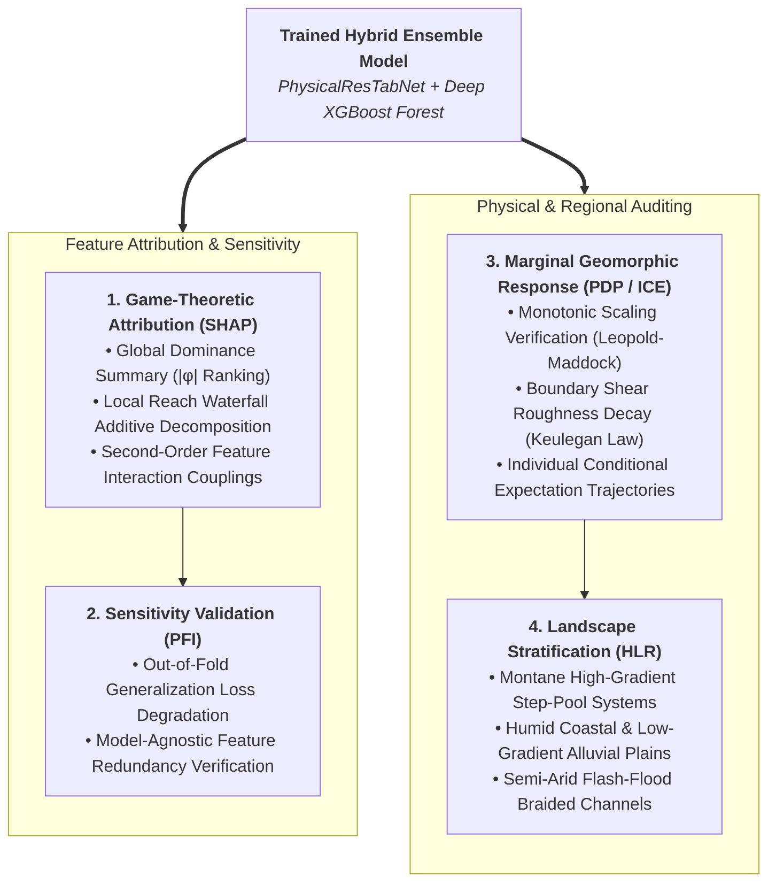
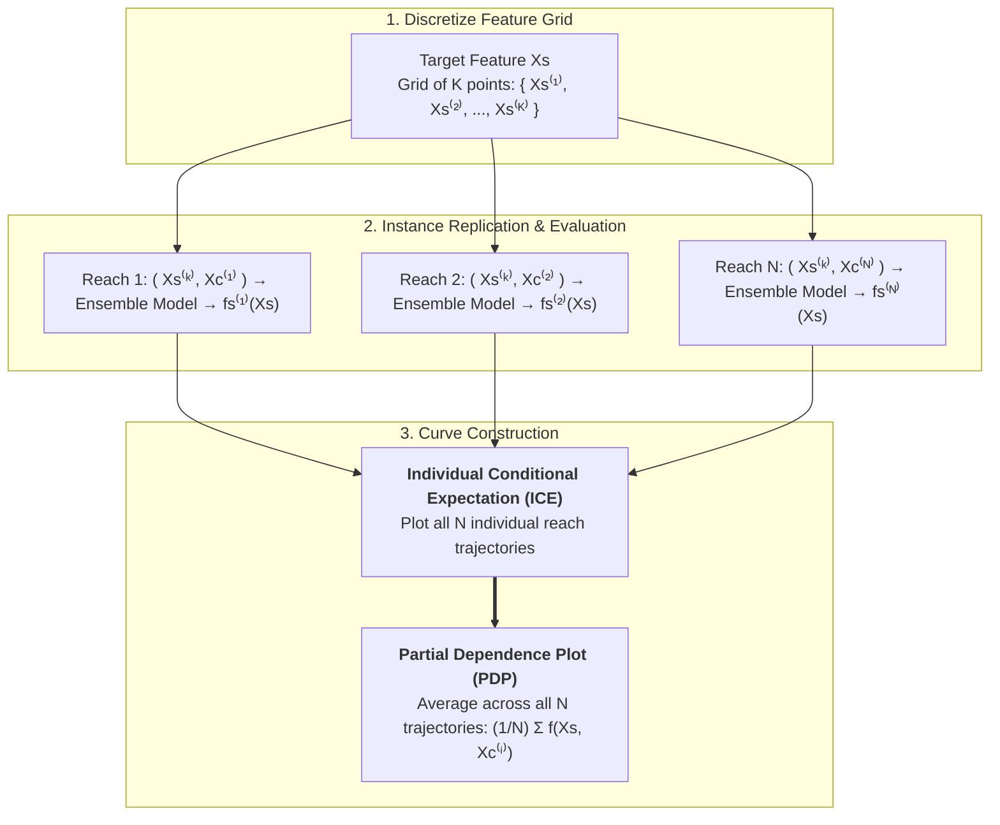

# Explainable AI (XAI) Framework

## The Imperative for Explainability in Fluvial Modeling

Large-scale machine learning models deployed for continental river networks cannot operate as opaque black boxes. In the NOAA OWP channel parameterization framework, predictions for bankfull width, depth, cross-section shape, and Manning's roughness directly govern hydrodynamic flood wave propagation across millions of kilometers of waterways.

Integrating **Explainable Artificial Intelligence (XAI)** into the modeling lifecycle is essential for:

1. **Verifying Physical Consistency**: Ensuring models adhere to established geomorphic and hydraulic principles (e.g., Leopold & Maddock hydraulic geometry, Flint’s concavity law, Keulegan boundary roughness mechanics) rather than following spurious GIS artifacts.
2. **Diagnosing Regional Generalization**: Identifying how feature sensitivities vary across contrasting hydroclimatic landscapes (e.g., snowmelt-dominated montane streams vs. low-gradient alluvial plains vs. arid basins).
3. **Auditing Multi-Stage Error Propagation**: Disentangling how uncertainties and feature attributions cascade through the sequential prediction chain ($\text{TopWidth} \to \text{Depth} \to \text{Shape} \to \text{Roughness}$).
4. **Fostering Operational Trust**: Providing hydrologists, hydraulic engineers, and flood managers with transparent, interpretable rationale for every reach-scale prediction.

---

## Core Explainability Methodologies

---

### 1. SHAP (SHapley Additive exPlanations)

Grounded in cooperative game theory, SHAP provides a mathematically unified framework for attributing model predictions to individual input features. For any given stream reach prediction $f(x)$, the output is decomposed into an additive sum of feature contributions:

$$
f(x) = \phi_0 + \sum_{j=1}^M \phi_j(x)
$$

where $\phi_0 = \mathbb{E}[f(X)]$ is the expected baseline target value across the training population, and $\phi_j(x)$ is the Shapley value assigned to feature $j$.

- **Global Attribution Summary**: Aggregates mean absolute Shapley values ($|\phi_j|$) across millions of reaches to rank the dominant physical drivers governing channel geometry and flow resistance.
- **Local Reach Attributions (Waterfall / Force Plots)**: Breaks down the exact additive contributions driving individual reach estimates (e.g., isolating whether a narrow, deep channel profile is driven primarily by bedrock confinement or low valley slope).
- **SHAP Interaction Values**: Decomposes total attribution into main effects and pairwise second-order interactions, clarifying non-linear couplings such as the joint influence of bed slope and drainage area on channel incision.

---

### 2. Partial Dependence Plots (PDP) & Individual Conditional Expectation (ICE)

While global importance metrics (e.g., SHAP summary plots, impurity rankings) identify *which* features most heavily influence predictions, they do not reveal *how* the predicted hydraulic targets respond as a feature changes across its numerical domain. **Partial Dependence Plots (PDP)** and **Individual Conditional Expectation (ICE)** curves provide the primary diagnostic tools for evaluating the functional form, monotonicity, and heterogeneity of model responses.

---

#### How ICE and PDP Plots are Generated

To construct ICE and PDP curves for a target predictor feature (or a pair of features), we partition the full input feature space $X$ into two subsets:

$$
X = (X_S, X_C)
$$

where $X_S$ represents the target feature of interest (e.g., contributing drainage area $\text{totdasqkm}$, channel slope $S$, or Stream Power Index $\text{SPI}$), and $X_C$ is the complementary vector containing all other $M-1$ model inputs.

1. **Grid Discretization**: An evaluation grid of $K$ equally spaced points or empirical quantiles $\{x_S^{(1)}, x_S^{(2)}, \dots, x_S^{(K)}\}$ is defined across the feature domain of $X_S$ (typically $K = 10-50$).

2. **Instance Replication**: For a representative sample of $N$ river reaches from the dataset, the complementary feature vector $x_C^{(i)}$ of each reach $i$ is held strictly constant.

3. **Synthetic Evaluation (ICE Curves)**: For reach $i$, the target feature is systematically overwritten with each grid point $x_S^{(k)}$ while preserving its true complementary attributes $x_C^{(i)}$. The trained ensemble model $\hat{f}$ evaluates each modified vector:

    $$
    \hat{f}_S^{(i)}(x_S) = \hat{f}\left(x_S, x_C^{(i)}\right)
    $$

    Plotting $\hat{f}_S^{(i)}(x_S)$ across all grid values yields the **Individual Conditional Expectation (ICE)** curve for reach $i$.

4. **Marginal Expectation (PDP Curve)**: The Partial Dependence function $\bar{f}_S(x_S)$ is computed by taking the mathematical expectation (sample average) across all $N$ individual ICE trajectories:

    $$
    \bar{f}_S(x_S) = \frac{1}{N} \sum_{i=1}^N \hat{f}\left(x_S, x_C^{(i)}\right)
    $$

5. **Centered ICE (c-ICE)**: To eliminate vertical level shifts and isolate the relative rate of change across reaches, curves can be centered by subtracting each reach's prediction at the first grid point:

    $$
    \hat{f}_{S,\text{centered}}^{(i)}(x_S) = \hat{f}_S^{(i)}(x_S) - \hat{f}_S^{(i)}\left(x_S^{(1)}\right)
    $$

---

#### Why Plotting PDP and ICE is Essential in Fluvial ML

Standard evaluation metrics ($R^2$, RMSE, KGE) only quantify aggregate fit at observed sample coordinates; they cannot detect whether a complex ensemble model behaves realistically across the continuous hydro-geomorphic spectrum. Plotting PDP and ICE is critical for:

1. **Verifying Theoretical Fluvial Scaling Laws (Monotonicity & Power-Law Exponents)**:
    Empirical geomorphology dictates that bankfull top width ($W_{bf}$) and depth ($d_{bf}$) must scale monotonically with contributing drainage area ($A$) and bankfull discharge ($Q_{bf}$):

    $$
    W_{bf} \propto A^b, \quad d_{bf} \propto A^f
    $$

    PDP plots in log-log space allow direct extraction of empirical scaling exponents ($\frac{\partial \ln \hat{W}}{\partial \ln A}$), verifying whether the model matches Leopold & Maddock expectations rather than producing unphysical negative slopes or fluctuations.

2. **Uncovering Hidden Heterogeneity and Interaction Effects (The ICE Advantage)**:
    An average PDP curve can be deceptively flat or smooth if subgroup effects cancel each other out. For example, if channel width increases rapidly with drainage area in unconfined alluvial plains but remains constant in bedrock gorges, the average PDP will show an intermediate slope that represents neither landscape accurately.
    * *Parallel ICE curves* indicate that the target feature acts additively and independently of other predictors.
    * *Fanning, crossing, or bimodal ICE trajectories* Indicate strong non-linear interactions with complementary features (such as valley confinement, slope, or lithology).

3. **Auditing Boundary Shear Resistance Mechanics (Manning's $n$)**:
    For hydraulic roughness estimation, boundary layer mechanics (e.g., Keulegan logarithmic resistance law) mandate that relative roughness decreases as hydraulic radius ($R_{bf}$) increases:

    $$
    \frac{1}{\sqrt{f}} \propto \ln\left(\frac{R_{bf}}{k_s}\right) \implies n \propto R_{bf}^{-1/6}
    $$

    PDP/ICE curves verify that predicted Manning's $n$ exhibits monotonic decay with channel conveyance depth rather than predicting unphysical increases in friction for deep mainstem channels.

4. **Detecting Geomorphic Thresholds and Regime Shifts**:
    Natural river systems undergo sudden structural changes, such as a steep mountain stream flattening out into a gravelly river, or a single river splitting into multiple braided channels due to a surge in water energy. Machine learning curves (PDP and ICE) show whether the model has successfully discovered these physical tipping points on its own, without being forced to follow rigid, pre-programmed rules.

5. **Diagnosing Out-of-Distribution Artifacts & Edge Overfitting**:
    Tree-based models (XGBoost) and deep tabular networks can produce step like artifacts or fluctuations in sparse tail regions (e.g., headwaters $< 0.1\text{ km}^2$ or major rivers $> 100,000\text{ km}^2$). Overlaying rug plots of empirical data distributions on PDP/ICE curves allows hydrologists to identify where predictions are firmly supported by training evidence versus where epistemic uncertainty widens.

---

### 3. Permutation Feature Importance (PFI)

To complement tree-based impurity rankings without susceptibility to feature scale or cardinality biases, model-agnostic Permutation Feature Importance is computed on out-of-fold validation sets:

$$
I_{\text{PFI}}(j) = \mathcal{L}\left(y, f(X^{\text{perm } j})\right) - \mathcal{L}(y, f(X))
$$

By measuring the exact increase in loss $\mathcal{L}$ when the values of feature $j$ are randomly shuffled, PFI quantifies the true generalization dependency of the trained ensemble on each predictor.

---

### 4. Hydrologic Landscape Region (HLR) Stratification

Channel geomorphology varies across physiographic and hydroclimatic settings. XAI analyses in this pipeline are systematically stratified across **Hydrologic Landscape Regions (HLRs)**:

- **Humid Eastern Lowlands**: Evaluating models under high baseflow, dense vegetation, and fine grained cohesive bank conditions.
- **Semi-Arid & Southwestern Channels**: Auditing flash flood regimes, wide braided sandy channels, and high width-to-drainage ratios.
- **Streams in Mountainous Regions**: Ensuring steep step pool systems exhibit appropriate slope dominated energy dissipation and elevated roughness.

This multi level explainability framework ensures that the machine learning pipeline delivers both predictive accuracy and scientific integrity.
