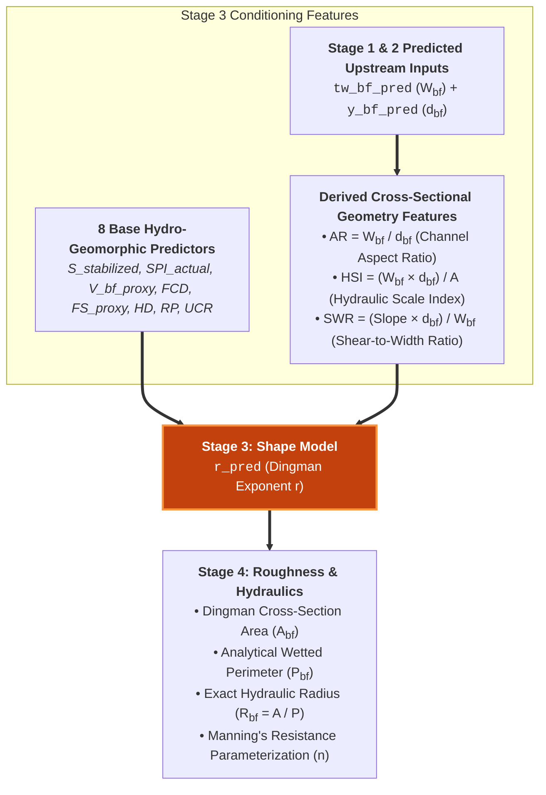

# Shape: Dingman Cross-Section Exponent

The cross-sectional profile of a natural river channel is parameterized using the continuous power-law model introduced by Dingman (2007). The channel bed elevation $y(x)$ relative to the maximum bankfull depth $d_{bf}$ is expressed as:

$$y(x) = d_{bf} \cdot \left(1 - \left|\frac{2x}{W_{bf}}\right|^r\right)$$

where $x \in [-W_{bf}/2, W_{bf}/2]$ is the lateral coordinate from the channel centerline, and $r \in [1, \infty)$ is the dimensionless cross-sectional shape exponent.

---

## Physical Interpretation of Exponent $r$

The Dingman exponent $r$ characterizes the geometric morphology and confinement of the channel boundary:

| Exponent | Shape | Morphological & Hydraulic Context |
| :--- | :--- | :--- |
| **$r = 1.0$** | **Triangular (V-shaped)** | Steep, bedrock-confined headwaters and incised gullies with minimal flat bed. |
| **$r = 2.0$** | **Parabolic** | Stable alluvial channels in mobile-bed equilibrium with progressive lateral bank shoaling. |
| **$r \to \infty$** | **Rectangular (U-shaped)** | Highly cohesive clay banks, vertical bedrock slot canyons, or engineered urban flood channels. |

{ loading=lazy }

### Analytical Geometry Formulation

Using the continuous exponent $r$, exact analytical expressions for bankfull cross-sectional area ($A_{bf}$) and wetted perimeter ($P_{bf}$) are formulated without numerical integration:

$$A_{bf} = \frac{r}{r+1} \cdot W_{bf} \cdot d_{bf}$$

$$P_{bf} \approx W_{bf} + \frac{2r}{r+1} \cdot \frac{d_{bf}^2}{W_{bf} + \epsilon}$$

---

## Multi-Stage Pipeline Role (Stage 3)

Shape is predicted in **Stage 3** of the cascade pipeline, utilizing the **8 base predictors**, Stage 1 predicted width ($\hat{W}_{bf}$), Stage 2 predicted depth ($\hat{d}_{bf}$), and Stage 3 derived geomorphic ratios:

### Input Feature Set (14 Predictors)

1. **8 Base Hydro-Geomorphic Features**: $S_{\text{stabilized}}$, $\text{SPI}_{\text{actual}}$, $V_{bf,\text{proxy}}$, $\text{FCD}$, $\text{FS}_{\text{proxy}}$, $\text{HD}$, $\text{RP}$, $\text{UCR}$.
2. **Predicted TopWidth (`tw_bf_pred`)**: $\hat{W}_{bf}$ from Stage 1.
3. **Predicted Depth (`y_bf_pred`)**: $\hat{d}_{bf}$ from Stage 2.
4. **Stage 2 Derived Predictors**: $\text{WDR}$ and $\text{WSP}$.
5. **Channel Aspect Ratio ($\text{AR}_{\text{channel}}$)**:
   $$\text{AR}_{\text{channel}} = \frac{\hat{W}_{bf}}{\hat{d}_{bf} + \epsilon}$$
   Primary geomorphic descriptor separating wide/shallow streams from narrow/deep canyons.
6. **Hydraulic Scale Index ($\text{HSI}$)**:
   $$\text{HSI} = \frac{\hat{W}_{bf} \cdot \hat{d}_{bf}}{A_{\text{total}} + \epsilon}$$
   Compares estimated cross-sectional scale to regional drainage scale.
7. **Shear-to-Width Ratio ($\text{SWR}$)**:
   $$\text{SWR} = \frac{S \cdot \hat{d}_{bf}}{\hat{W}_{bf} + \epsilon}$$
   Proxy for lateral vs. vertical boundary shear stress distributions.

---

## Downstream Feature Propagation

The predicted shape exponent ($\hat{r}$ / `r_pred`) feeds directly into **Stage 4 (Roughness)** to compute:

- Dingman Hydraulic Radius: $R_{bf} = \frac{A_{bf}}{P_{bf}}$
- Relative Roughness Proxy: $\text{RRP} = \frac{1}{R_{bf} + \epsilon}$
- Boundary Shear Velocity: $u_* = \sqrt{g \cdot R_{bf} \cdot S}$

---

!!! info "Upcoming Release"
    Content is being prepared. Results and analysis for this variable will be published in an upcoming release.

---

## Section Navigation

- [Literature Review](literature.md): Dingman power-law theory and geomorphic cross-section classification.
- [Model Architecture](models.md): ResNet-XGBoost ensemble with physical parameter bounds.
- [Model Skill](skill.md): Validation against field surveys and 2D hydraulic cross-sections.
- [Uncertainty Quantification](uncertainty.md): Continental shape maps and confidence bounds.
- [Explainability (XAI)](xai.md): SHAP attribution and geomorphic driver analysis.
