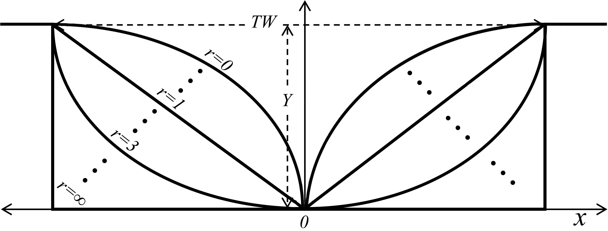

# Literature — Shape

!!! info "Coming Soon"
    Mathematical derivations of cross-sectional geometry, power-law channel theory, and geomorphic classifications are being prepared.

This section will examine power-law cross-sectional geometry models in open-channel hydraulics, centering on Dingman's (2007) shape formulation and its relationship to classical cross-section approximations (triangular, parabolic, trapezoidal, and rectangular). It will link the shape parameter ($r$) to stream channel classification frameworks, such as Rosgen stream types and Montgomery-Buffington channel reach morphologies. Furthermore, the literature review will highlight the mathematical advantages of continuous power-law geometry over rigid geometric assumptions in continental-scale hydrodynamic routing.
 
{ loading=lazy }
