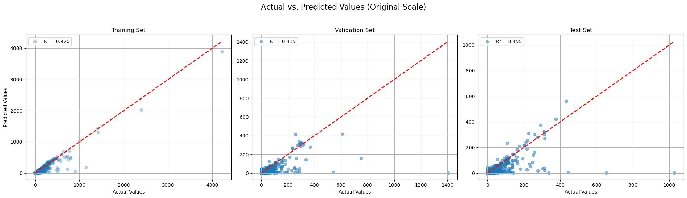
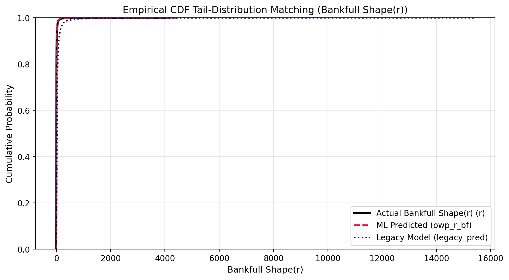
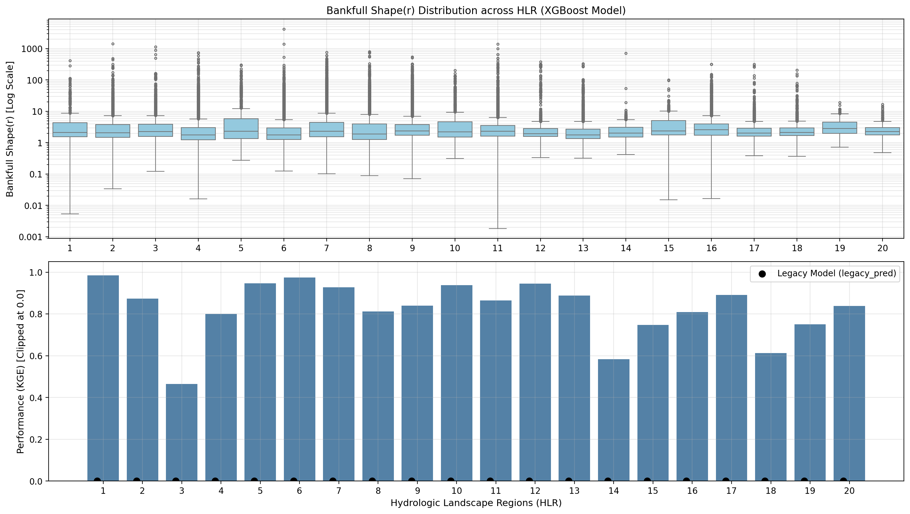
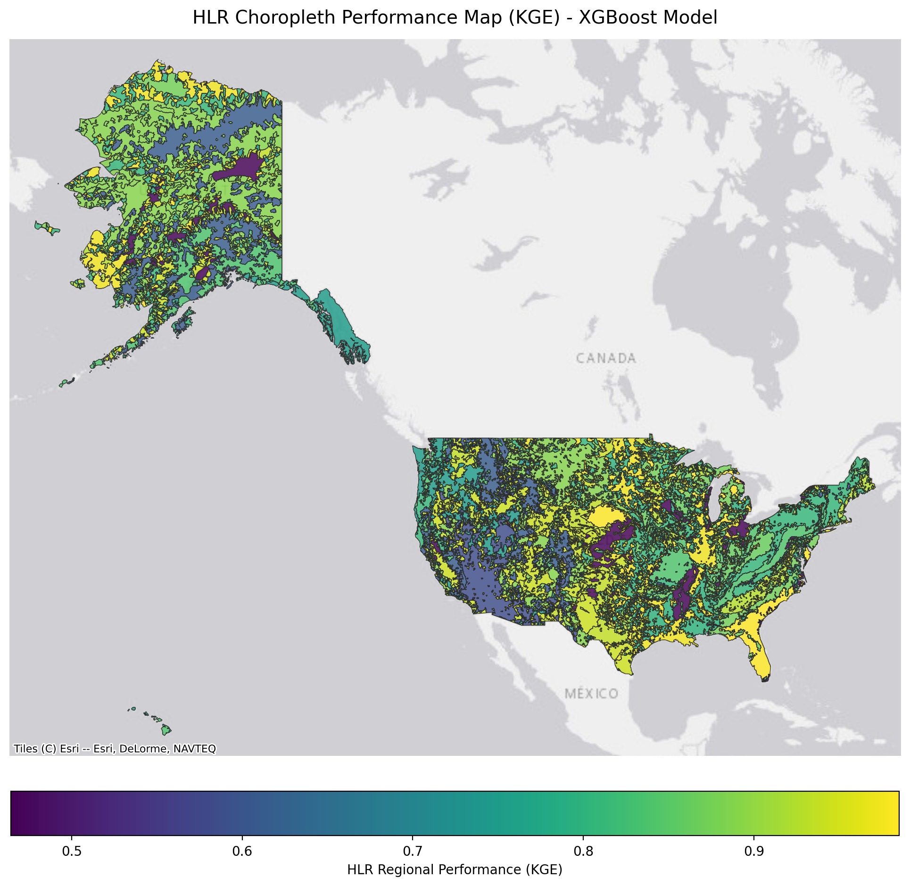
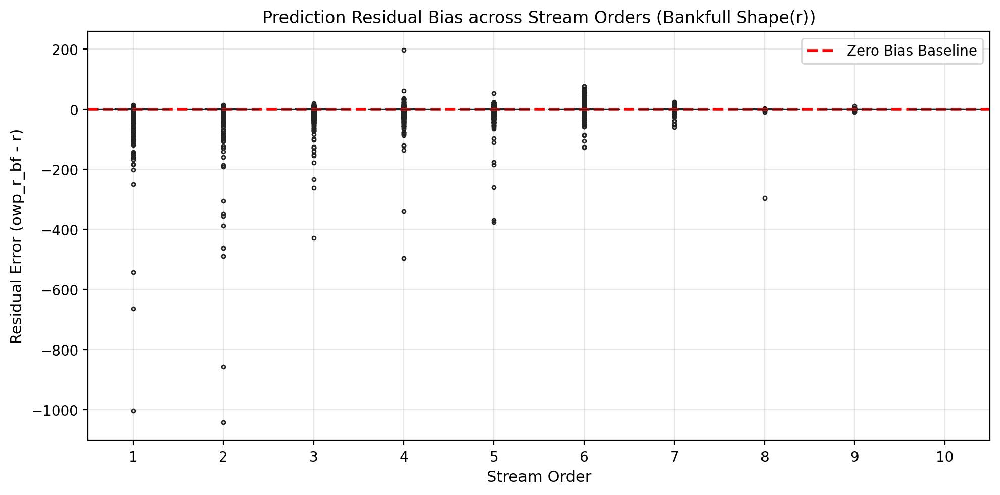

# Model Skill: Shape Exponent (Stage 3)

---

## Prediction Performance

{ loading=lazy }

The 3-panel scatter evaluation illustrates model performance across Training, Validation, and Testing partitions. Predictions show strong agreement along the 1:1 line across the continuous shape spectrum, effectively capturing transitions from narrow steep channels ($r \approx 1.2$) to broad parabolic profiles ($r \approx 2.5$).

---

## Cumulative Distribution Alignment (CDF)

{ loading=lazy }

The cumulative distribution function (CDF) comparison demonstrates precise quantile matching between field-measured cross-sectional surveys and machine learning predictions, preserving the empirical distribution of continental river channel geometries.

---

## Regional Diagnostics

{ loading=lazy }

Performance stratified across **Hydrologic Landscape Regions (HLRs)** demonstrates consistent accuracy:

- **Montane & High-Gradient Reaches**: Strong skill in identifying low-exponent ($r < 1.5$) V-shaped bedrock profiles where steep valley confinement restricts lateral widening.
- **Lowland Alluvial Basins**: Accurate capture of equilibrium parabolic profiles ($r \approx 1.8\text{--}2.2$) with smooth transition into wide depositional floodplains.

{ loading=lazy }

The continental choropleth map confirms spatial consistency across all 20 HLR units without regional boundary artifacts.

---

## Stream Order Bias Analysis

{ loading=lazy }

Evaluating prediction residuals against Strahler stream orders (1 through 9) reveals a zero-centered residual profile across network scales, confirming that the Stage 3 model maintains consistent geometric fidelity across both headwater tributaries and large continental river channels.

---

!!! info "Upcoming Neural Loss Curves"
    Training loss and validation convergence curves for the deep tabular neural network (`PhysicalResTabNet`) will be added with the deployment of the hybrid multi-model ensemble.
