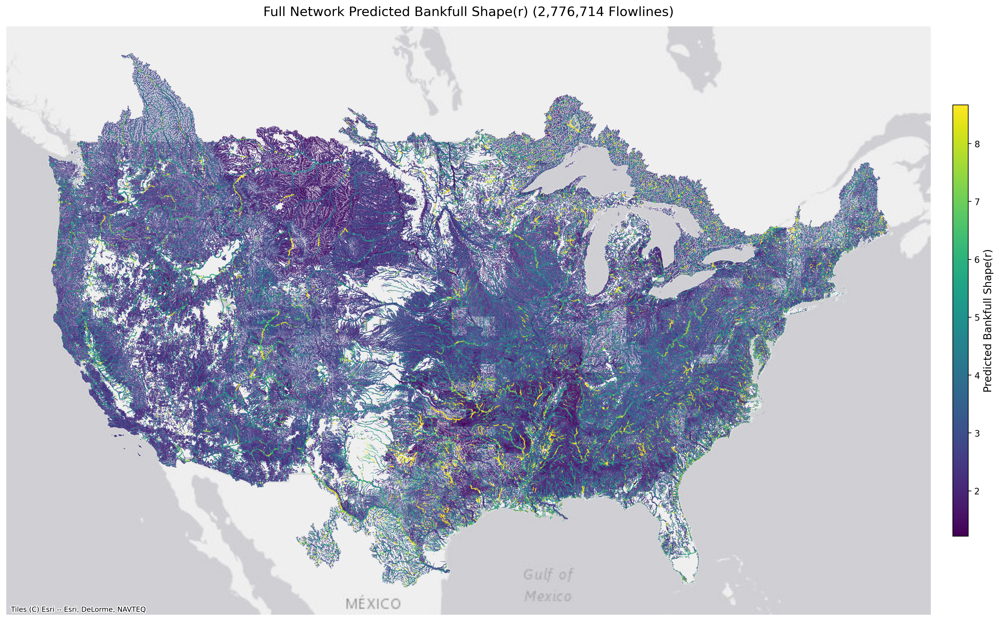
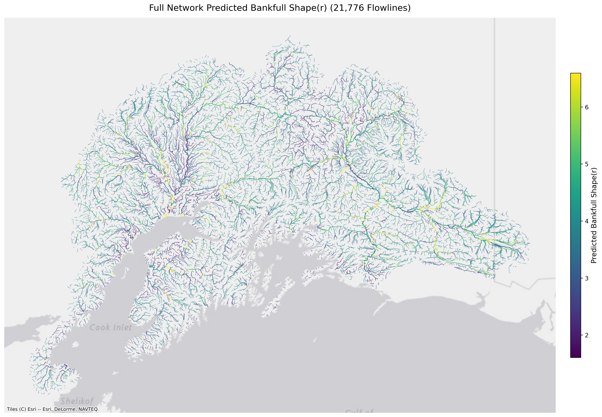
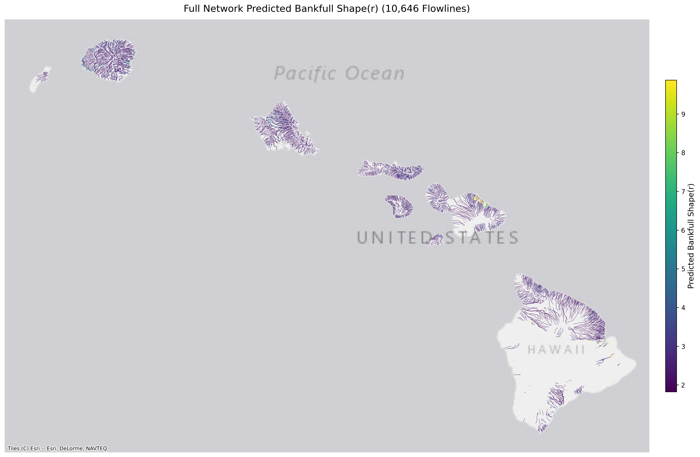
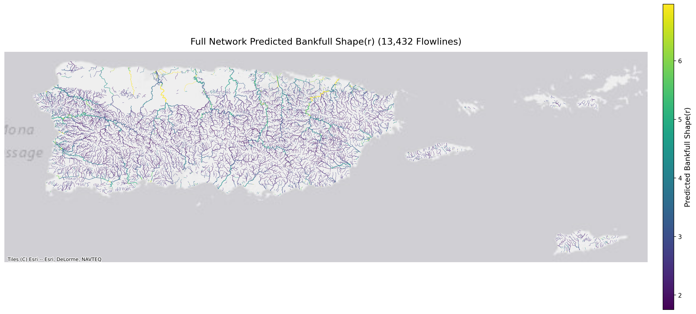

# Uncertainty Quantification: Shape Exponent (Stage 3)

Spatial flowline prediction maps display the reach-scale distribution of the Dingman cross-sectional shape exponent ($r$) across continental river networks.

---

=== "SUPERCONUS"
    ### SUPERCONUS Flowline Predictions
    Predicted Dingman shape exponent across ~2.7M reaches in the contiguous United States.
    
    { loading=lazy }

=== "Alaska"
    ### Alaska Flowline Predictions
    Predicted Dingman shape exponent across Alaskan sub-arctic and glaciated river networks.

    { loading=lazy }

=== "Hawaii"
    ### Hawaii Flowline Predictions
    Predicted Dingman shape exponent across steep volcanic stream networks in Hawaii.

    { loading=lazy }

=== "PRVI"
    ### Puerto Rico & Virgin Islands (PRVI) Flowline Predictions
    Predicted Dingman shape exponent across tropical island stream networks in PRVI.

    { loading=lazy }

---

!!! info "Upcoming Multi-Seed Epistemic Uncertainty Suite"
    The maps above depict flowline predictions from the standalone Stage 3 XGBoost model. The upcoming hybrid ensemble release will deliver full multi-seed epistemic uncertainty quantification, including:
    
    * **ML Confidence Score ($CS$) Distribution Histograms**
    * **Reach-Scale Epistemic Confidence Maps**
    * **Lower ($q_{05}$) and Upper ($q_{95}$) Confidence Limit Flowline Maps**
