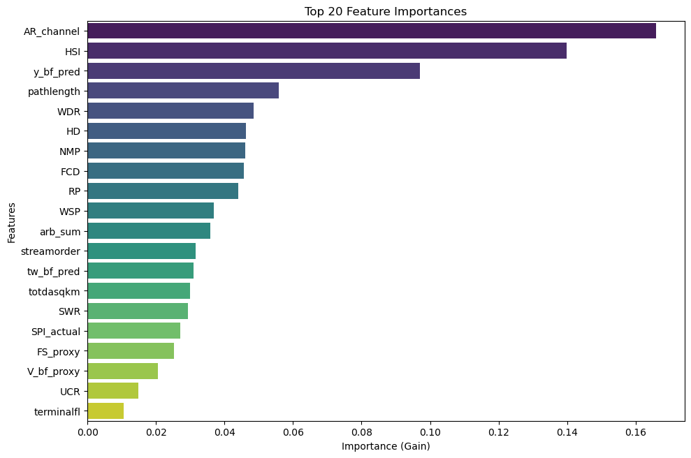

# Explainable AI (XAI) — Shape Exponent (Stage 3)

Our explainability pipeline evaluates the feature attribution structure of the Stage 3 Dingman shape exponent ($r$) model, illuminating how upstream predicted geometry and cross-sectional aspect ratios govern channel curvature.

---

## Global Feature Importance

{ loading=lazy }

The feature importance distribution confirms the primary geomorphic drivers controlling channel cross-sectional shape:

1. **Channel Aspect Ratio ($\text{AR} = \hat{W}_{bf} / \hat{d}_{bf}$)** and **Cascaded Geometry ($\hat{W}_{bf}, \hat{d}_{bf}$)**: Serve as primary physical determinants, dictating the ratio of wetted boundary perimeter to free surface area.
2. **Hydraulic Scale Index ($\text{HSI}$)** and **Shear-to-Width Ratio ($\text{SWR}$)**: Capture the relative magnitude of boundary shear stress along bank interfaces, separating narrow incised channels from wide braided profiles.
3. **Flint's Law Deviation ($\text{FCD}$) & Valley Slope**: Act as secondary controls, identifying knickpoints and steep valley transitions where bedrock confinement forces low $r$ values.

---

!!! info "Upcoming SHAP Beeswarm & Partial Dependence (PDP/ICE) Suite"
    Detailed **SHAP beeswarm distributions** and **Partial Dependence / ICE response curves** will be published in the upcoming release, providing reach-level feature attribution and exploring non-linear shape transitions across diverse physiographic settings.
