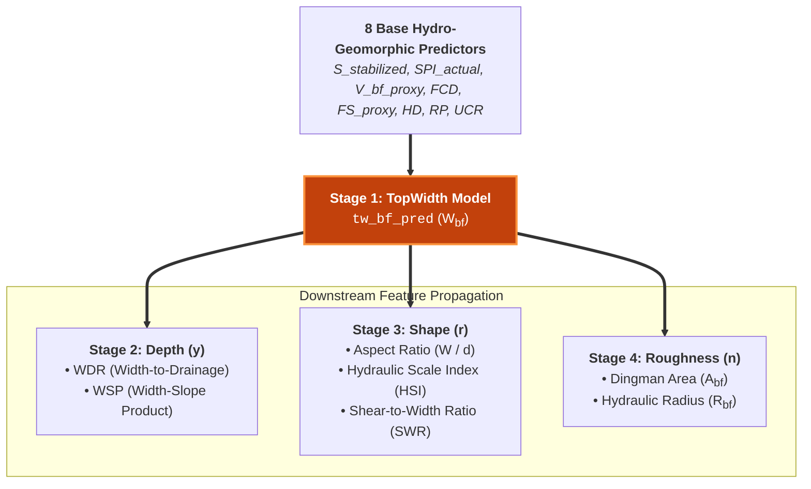

# TopWidth: Bankfull Channel Width

Bankfull channel top width ($W_{bf}$) represents the fundamental scaling variable in fluvial hydraulics and geomorphology. In classical hydraulic geometry, bankfull width scales with bankfull discharge following the foundational empirical power-law of Leopold & Maddock (1953):

$$W_{bf} \propto Q_{bf}^b$$

where the scaling exponent $b \approx 0.5$ for downstream hydraulic geometry across alluvial river systems.

{ loading=lazy }

---

## Multi-Stage Pipeline Role (Stage 1)

TopWidth constitutes **Stage 1** of the continental-scale channel geometry and roughness estimation cascade. Because channel width exhibits strong correlation with drainage scale and valley topography, it acts as the primary geometric anchor for all subsequent downstream predictions.

The Stage 1 model predicts bankfull width directly from the **8 base hydro-geomorphic features**:

1. **Stabilized Sinuosity ($S_{\text{stabilized}}$)**: Channel meandering metric with topological short-reach merging.
2. **Stream Power Index Proxy ($\text{SPI}_{\text{actual}}$)**: Total kinetic energy potential ($A \cdot S$).
3. **Bankfull Velocity Proxy ($V_{bf,\text{proxy}}$)**: Localized reach flow speed and energy state.
4. **Fluvial Concavity Deviation ($\text{FCD}$)**: Departure from Flint's Law equilibrium slope ($S = k_s A^{-0.45}$).
5. **Floodplain Storage Proxy ($\text{FS}_{\text{proxy}}$)**: Lateral valley room and storage capacity.
6. **Hack's Law Deviation ($\text{HD}$)**: Basin elongation and hydrograph timing proxy ($L \propto A^{0.55}$).
7. **Relative Position ($\text{RP}$)**: Scale-independent position along the headwater to outlet network.
8. **Upstream Convergence Ratio ($\text{UCR}$)**: Network confluence identifier for discharge and sediment transitions.

---

## Downstream Feature Propagation

Predicted bankfull width (`tw_bf_pred`) feeds directly into downstream modeling stages:

<!-- - **Stage 2 (Depth)**: Derives the Width-to-Drainage Ratio ($\text{WDR} = \frac{W}{\sqrt{A} + \epsilon}$) and Width-Slope Product ($\text{WSP} = W \cdot S$).
- **Stage 3 (Shape)**: Derives the channel Aspect Ratio ($\text{AR} = \frac{W}{d}$), Hydraulic Scale Index ($\text{HSI}$), and Shear-to-Width Ratio ($\text{SWR}$).
- **Stage 4 (Roughness)**: Enables exact analytical calculation of Dingman Bankfull Area ($A_{bf}$) and Hydraulic Radius ($R_{bf}$). -->

<!-- ---

!!! info "Upcoming Release"
    Content is being prepared. Results and analysis for this variable will be published in an upcoming release.

--- -->
<!-- 
## Section Navigation

- [Literature Review](literature.md) — Scaling laws, hydraulic geometry, and prior ML approaches.
- [Model Architecture](models.md) — Hybrid ResNet-XGBoost ensemble design and feature processing.
- [Model Skill](skill.md) — Prediction accuracy, KGE/NSE scores, and regional validation.
- [Uncertainty Quantification](uncertainty.md) — Confidence distributions and spatial flowline maps.
- [Explainability (XAI)](xai.md) — SHAP feature importance, PDP curves, and causal inference. -->
