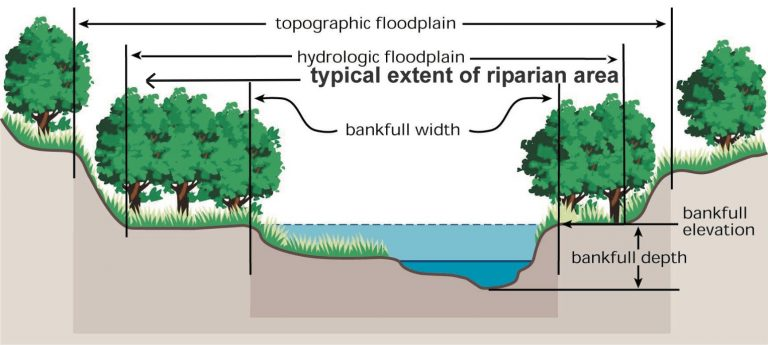

# Literature: TopWidth

!!! info "Coming Soon"
    Detailed literature review, theoretical derivations, and historical benchmark comparisons are currently in preparation.

This section will review downstream and at-a-station hydraulic geometry scaling laws, beginning with the foundational empirical power-law formulations of Leopold & Maddock (1953) ($W \propto Q^b$) and subsequent theoretical developments in regime theory and rational hydraulic geometry. It will examine channel width adjustment mechanisms, bank stability criteria, and vegetation-roughness feedbacks across diverse physiographic provinces and hydrologic regimes. Furthermore, this review will synthesize prior machine learning and statistical approaches to continental-scale width estimation, highlighting key limitations in conventional GIS-derived predictors that motivated our physics-informed hydro-geomorphic feature engineering.
 
{ loading=lazy }
