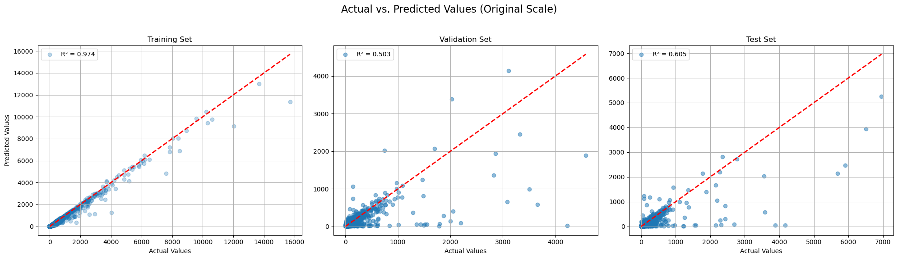
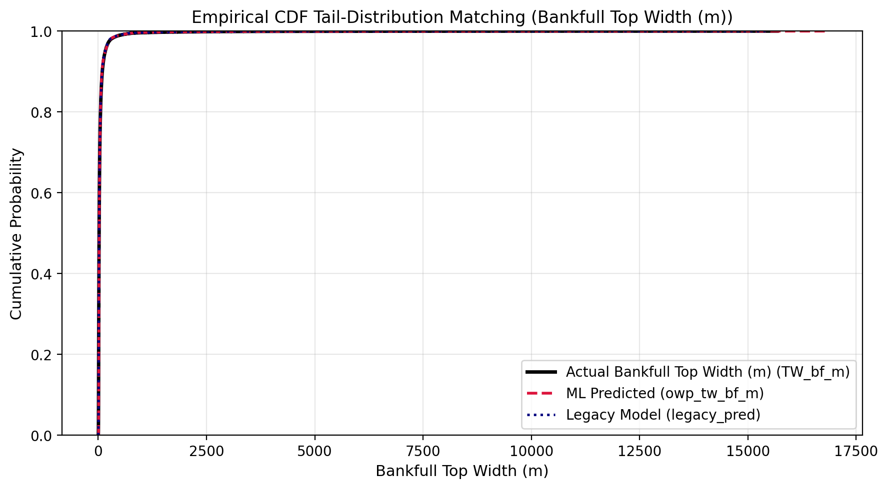
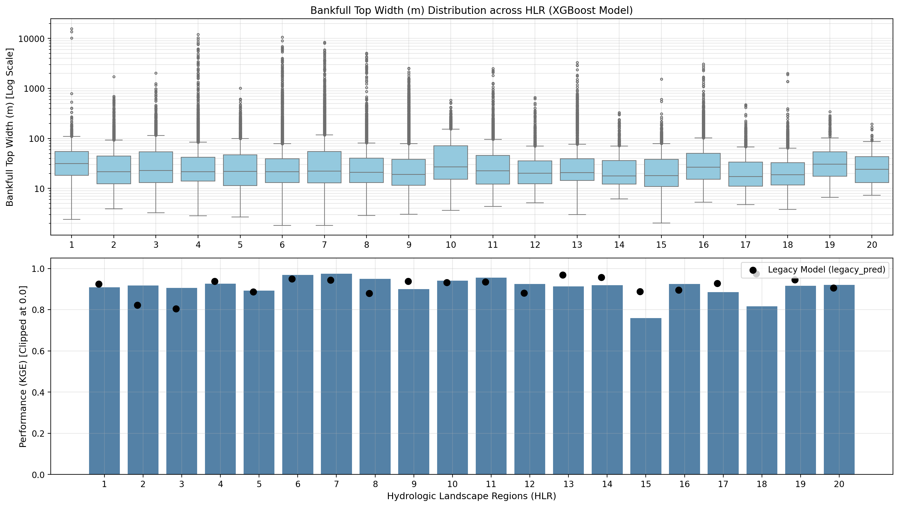
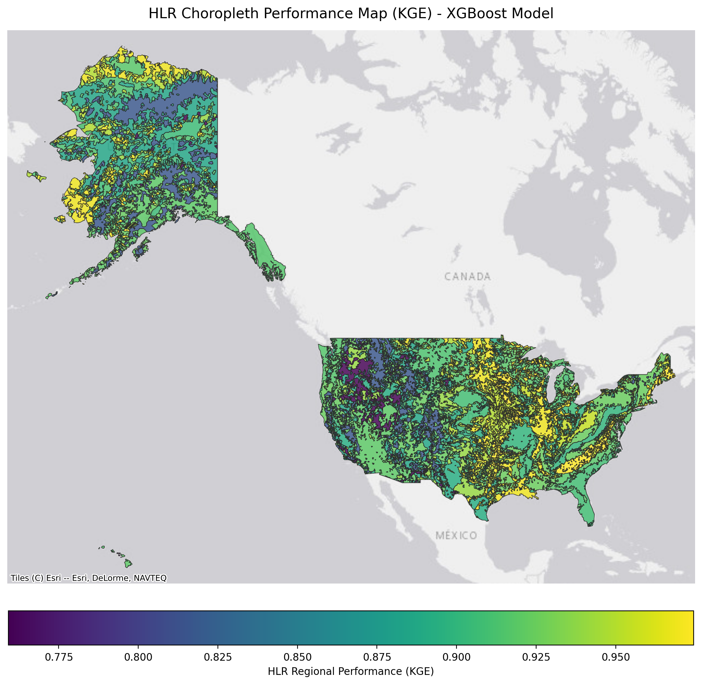
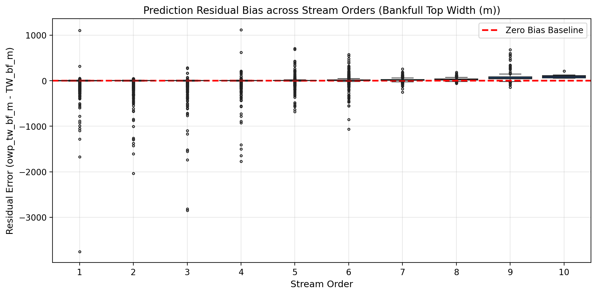

# Model Skill: TopWidth (Stage 1)

---

## Prediction Performance

{ loading=lazy }

This 3-panel scatter evaluation illustrates model agreement across the independent Training, Validation, and Test splits. The alignment along the 1:1 diagonal confirms that the Stage 1 model captures bankfull width scaling over multiple orders of magnitude without systematic overfitting.

---

## Cumulative Distribution Alignment (CDF)

{ loading=lazy }

The cumulative distribution function (CDF) comparison demonstrates quantile-by-quantile alignment between predicted and measured channel widths. The close tracking across both lower quantiles (narrow headwater streams $< 5\text{ m}$) and upper quantiles (wide mainstem rivers $> 200\text{ m}$) confirms that the model preserves the true statistical distribution of continental river geometry.

---

## Regional Diagnostics

{ loading=lazy }

Performance stratified across **Hydrologic Landscape Regions (HLRs)** demonstrates consistent predictive skill across diverse physiographic provinces:

- **High-Performing Domains**: Humid and subhumid regions with permeable soils (e.g., HLR 1, HLR 14, HLR 20) exhibit superior metric scores, driven by stable baseflow regimes and well-developed alluvial hydraulic geometry.
- **Challenging Domains**: Low-relief plains and highly incised semi-arid channels exhibit slightly wider dispersion due to anthropogenic channelization, intermittent flows, and localized bedrock controls.

{ loading=lazy }

The continental choropleth map illustrates the spatial distribution of model performance across all 20 HLRs, confirming geographic consistency without regional artifacts.

---

## Stream Order Bias Analysis

{ loading=lazy }

Evaluating prediction residuals mapped against Strahler stream orders (1 through 9) reveals that the model maintains an unbiased zero-centered residual profile across network scales. This demonstrates that headwater reaches and expansive mainstem channels are balanced effectively during training.

---

!!! info "Upcoming Neural Loss Curves"
    Training convergence curves from the deep tabular neural network (`PhysicalResTabNet`) will be added alongside the multi-seed hybrid ensemble update.
