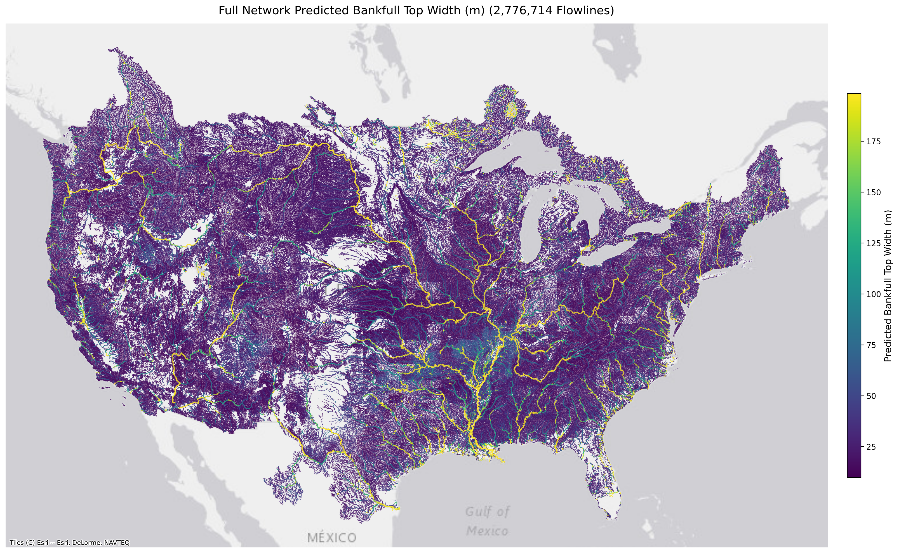
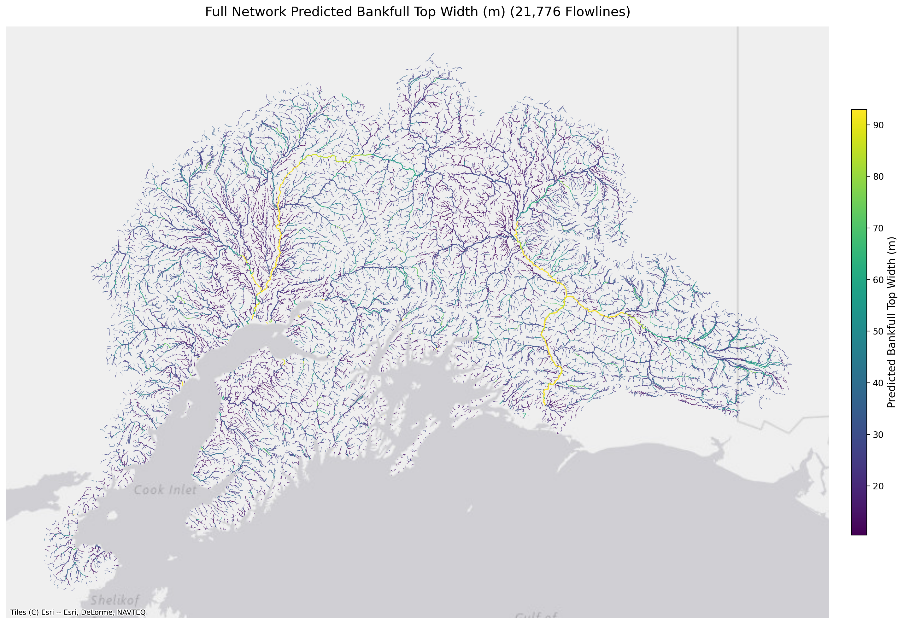
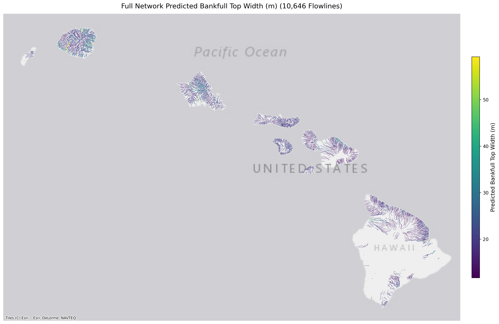
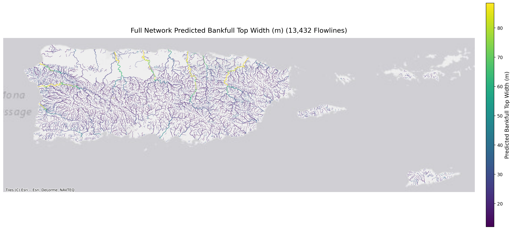

# Uncertainty Quantification: TopWidth (Stage 1)

Spatial flowline prediction maps illustrate the geographic distribution of bankfull channel top width ($W_{bf}$) across diverse hydrologic regimes.

---

=== "SUPERCONUS"
    ### SUPERCONUS Flowline Predictions
    Predicted bankfull top width across ~2.7M reaches in the contiguous United States.
    
    { loading=lazy }

=== "Alaska"
    ### Alaska Flowline Predictions
    Predicted bankfull top width across glaciated and permafrost river networks in Alaska.

    { loading=lazy }

=== "Hawaii"
    ### Hawaii Flowline Predictions
    Predicted bankfull top width across steep volcanic catchments in Hawaii.

    { loading=lazy }

=== "PRVI"
    ### Puerto Rico & Virgin Islands (PRVI) Flowline Predictions
    Predicted bankfull top width across tropical island stream networks in PRVI.

    { loading=lazy }

---

!!! info "Upcoming Multi-Seed Epistemic Uncertainty Suite"
    The maps above display continuous reach-scale predictions from the standalone Stage 1 XGBoost model. The upcoming hybrid ensemble release will provide full multi-seed epistemic uncertainty quantification, including:
    
    * **ML Confidence Score ($CS$) Distribution Histograms**
    * **Reach-Scale Epistemic Confidence Maps**
    * **Lower ($q_{05}$) and Upper ($q_{95}$) Confidence Limit Flowline Maps**
