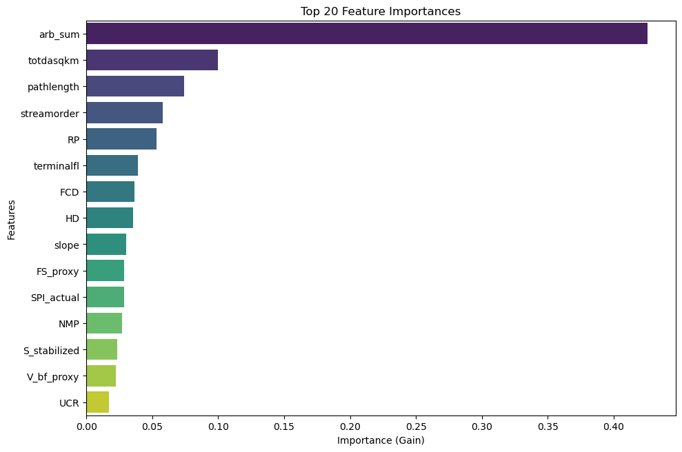

# Explainable AI (XAI) — TopWidth (Stage 1)

Our explainability framework investigates how the Stage 1 model relies on base hydro-geomorphic features to predict bankfull top width ($W_{bf}$).

---

## Global Feature Importance

{ loading=lazy }

The feature importance ranking highlights the primary drivers governing bankfull width estimation:

1. **Velocity Proxy ($V_{bf,\text{proxy}}$)** and **Stream Power Index ($\text{SPI}_{\text{actual}}$)**: Act as primary proxies for cross-sectional energy expenditure, driving hydraulic widening in high-discharge reaches.
2. **Topological and Scale Features**: Contributing drainage scale and relative river position ($RP$) establish the macro-scale downstream widening gradient.
3. **Planform Sinuosity & Concavity**: Channel sinuosity ($S_{\text{stabilized}}$) and fluvial concavity deviation ($\text{FCD}$) fine-tune local adjustments, reflecting meandering alluvial dynamics versus steep bedrock valleys.

---

!!! info "Upcoming SHAP Beeswarm & Partial Dependence (PDP/ICE) Suite"
    In the upcoming release, comprehensive **SHAP beeswarm distributions** and **Partial Dependence / ICE response curves** will be published, providing reach-level feature attribution and isolating non-linear marginal scaling trends across all predictors.
