# Continental River Channel Geometry (CONUS-FHG v1.0)

Welcome to the **v1.0 Release** documentation for the continental-scale Machine Learning River Channel Dimension Estimation framework (**CONUS-FHG v1.0**). Developed in collaboration with the NOAA National Water Center (Office of Water Prediction) and FEMA, this milestone represents the first physics-informed, continental-scale machine learning parameterization of river channel geometry and cross-sectional shape across the Contiguous United States (CONUS).

---

## Executive Summary

Standard Digital Elevation Models (DEMs) derived from airborne LiDAR or satellite sensors accurately capture terrestrial floodplain topography but cannot penetrate the water surface during survey conditions. This creates a critical **missing bathymetry gap** beneath the bankfull stage, distorting hydraulic conveyance, stage-discharge rating curves, and flood inundation extent in hydrographic models.

**CONUS-FHG v1.0** resolves this fundamental challenge by extending classical **At-a-station Hydraulic Geometry (AHG)** into **Feature Hydraulic Geometry (FHG)**. By training a multi-tier machine learning ensemble on high-precision Acoustic Doppler Current Profiler (ADCP) surveys from the USGS HYDRoSWOT database and coupling them with National Water Model (NWM v2.1) flow dynamics, StreamCat landscape characteristics, POLARIS soils, and high-resolution DEM topography, the framework predicts continuous power-law geometry ($W \propto Q^b, Y \propto Q^f, V \propto Q^m$) and synthetic cross-sectional shape exponents ($r$) across millions of stream reaches.

```mermaid
flowchart LR
    subgraph IN ["Input Data Harmonization"]
        direction TB
        ADCP["<b>USGS HYDRoSWOT</b><br/>3,543 ADCP Stations<br/>1,432 River Systems"]
        ENV["<b>Landscape & Hydrology</b><br/>NWM 2.1 &bull; StreamCat<br/>POLARIS Soil &bull; 3DEP DEM"]
    end

    subgraph FE ["Feature Optimization"]
        direction TB
        RED["<b>Dimensionality Reduction</b><br/>116 &rarr; 60 Features<br/>Recursive SHAP &bull; AutoEncoder"]
    end

    subgraph ML ["3-Tier Modeling Cascade"]
        direction TB
        T1["<b>Tier 1: Best Model</b><br/>Top Tuned Regressors"]
        T2["<b>Tier 2: Voting Ensemble</b><br/>Multi-Model Averaging"]
        T3["<b>Tier 3: Meta-Learner</b><br/>Stacking Level-1 Model"]
    end

    subgraph OUT ["Continental Geometry"]
        direction TB
        TW["<b>TopWidth (W)</b><br/>W = a &middot; Q<sup>b</sup>"]
        DEP["<b>Depth (Y)</b><br/>Y = c &middot; Q<sup>f</sup>"]
        SHP["<b>Channel Shape (r)</b><br/>z(x) = Y<sub>m</sub>*(2x/W*)<sup>r</sup>"]
    end

    IN ==> FE ==> ML ==> OUT

    class ADCP highlight-blue;
    class ENV highlight-blue;
    class RED highlight-teal;
    class T3 highlight-orange;
```

---

## Published Scientific Paper

The v1.0 release directly reflects the peer-reviewed methodology and findings published in the American Geophysical Union (AGU) *Journal of Geophysical Research: Machine Learning and Computation*:

!!! quote "Official Paper Citation"
    **Modaresi Rad, A., Johnson, J. M., Ghahremani, Z., Coll, J., & Frazier, N. (2024).**  
    *Enhancing River Channel Dimension Estimation: A Machine Learning Approach Leveraging the National Water Model, Hydrographic Networks, and Landscape Characteristics.*  
    **Journal of Geophysical Research: Machine Learning and Computation**, 1(4), e2024JH000173.  
    [:octicons-link-external-16: https://doi.org/10.1029/2024JH000173](https://doi.org/10.1029/2024JH000173){ target=_blank }

??? abstract "Paper Abstract (Click to expand)"
    Accurate representation of river channel bathymetry is essential for hydrodynamic modeling, flood risk assessment, and ecological studies. However, direct measurements of in-channel bathymetry are sparse, and remote sensing methods such as LiDAR cannot penetrate water surfaces, leaving a critical data gap below the water surface. In this study, we present a machine learning framework to estimate channel dimensions across the Contiguous United States (CONUS). We leverage the USGS HYDRoSWOT acoustic Doppler current profiler (ADCP) dataset (3,543 stations across 1,432 distinct river systems) combined with the National Water Model (NWM v2.1) flood frequency reanalysis, hydrographic networks, landscape characteristics from StreamCat, POLARIS soil properties, and digital elevation models. Feature space is reduced from 116 candidate predictors to 60 optimized features using recursive SHAP importance screening and deep Denoising AutoEncoders. We evaluate a three-tier modeling strategy comparing the best individual hyperparameter-tuned model, a voting ensemble, and a stacking meta-learner. The framework yields high predictive skill (Normalized NSE > 0.85 for depth and width scaling) and enables synthetic reconstruction of 2D/3D channel cross-sections using Dingman's power-law shape formulation ($r$).

---

## Key Innovations in v1.0

-   :material-database-sync:{ .lg .middle } __Continental ADCP Harmonization__

    ---

    Curated and quality-controlled **3,543 USGS streamflow stations** across **1,432 distinct river networks**, extracting hydraulic geometry power-law parameters while enforcing strict mass continuity ($a \cdot c \cdot k = 1.0$, $b + f + m = 1.0$).

-   :material-vector-arrange-below:{ .lg .middle } __AutoEncoder Feature Compression__

    ---

    Compressed a massive, multi-collinear feature space of **116 candidate environmental variables** into **60 orthogonal predictors** using unsupervised Denoising AutoEncoders and game-theoretic SHAP pruning.

-   :material-layers-triple:{ .lg .middle } __3-Tier Ensembling Framework__

    ---

    Benchmarked 50 machine learning regressors and deployed a 3-tier hierarchy: **Best Tuned Model**, **Voting Ensemble**, and **Stacking Meta-Learner** to exploit cross-algorithm predictive synergies.

-   :material-chart-bell-curve-cumulative:{ .lg .middle } __Dingman Submerged Shape Parameterization__

    ---

    Directly mapped FHG scaling exponents ($b, f$) into Dingman's continuous shape parameter ($r = f/b$), establishing synthetic 2D/3D in-channel bathymetry for FEMA FIS and NextGen FIM models.

---

## Target Variables Parameterized in v1.0

The v1.0 framework focuses on three core geometric variables governing in-channel hydraulic conveyance:

### TopWidth ($W$)
**Bankfull Channel Width ($W = a Q^b$)**

Predicts width coefficient $a$ and scaling exponent $b$ to capture lateral channel expansion under varying discharge regimes.

[Explore Methods & Pipeline →](overview/methods.md)

### Depth ($Y$)
**Mean Channel Depth ($Y = c Q^f$)**

Predicts depth coefficient $c$ and scaling exponent $f$, resolving vertical stage growth and thalweg incisement.

[Explore Methods & Pipeline →](overview/methods.md)

### Shape ($r$)
**Dingman Cross-Sectional Shape Exponent**

Analytically derives bed curvature $r = f/b$, parameterizing triangular ($r=1$), parabolic ($r=2$), and flat-bottomed ($r>3$) channels.

[Explore Shape Analysis →](r/index.md)

!!! note "Scope of v1.0 vs. Subsequent Releases"
    **v1.0** establishes the baseline geometry parameterization for **TopWidth ($W$)**, **Depth ($Y$)**, and **Channel Shape ($r$)**. Hydraulic roughness (Manning's $n$ for in-channel, overbank, and unified sections) is introduced in subsequent releases (v2.06) utilizing Deep Residual Tabular Networks (PhysicalResTabNet).

---

## Three-Tier Modeling Architecture

To maximize predictive accuracy across diverse physiographic provinces, v1.0 implements a 3-tier architecture:

| Tier | Architecture | Description | Primary Strength |
| :--- | :--- | :--- | :--- |
| **Tier 1** | **Best Tuned Model** | Top-performing regressor selected from 50 candidates following Bayesian hyperparameter tuning (e.g. CatBoost / XGBoost). | High computational speed and direct interpretability. |
| **Tier 2** | **Voting Ensemble** | Uniform or weighted average of predictions from the top 6–8 tuned regressors. | Variance reduction and mitigation of single-model overfitting. |
| **Tier 3** | **Stacking Meta-Learner** | Level-1 meta-regressor trained on out-of-fold predictions of base models to learn regional error correlations. | Highest overall skill (KGE / NNSE) and superior handling of extreme flows. |

---

## Navigation & Documentation Structure

Explore the v1.0 documentation sections below:

* **[Pipeline Overview](overview/index.md)**: End-to-end framework, hydrographic context, and study area analysis.
* **[Data Sources & Quality Control](overview/data-sources.md)**: HYDRoSWOT ADCP data cleaning, continuity fitting, and environmental predictor PCA decompositions.
* **[Methods & Feature Engineering](overview/methods.md)**: AutoEncoder dimensionality reduction, SHAP screening, multi-tier ensembling, and validation protocols.
* **[Channel Shape Parameterization ($r$)](r/index.md)**: Deep dive into the Dingman power-law cross-section model and continental $r$ distributions.
