# Data Sources & Quality Assurance

The **V1.0** framework integrates field-measured hydraulic geometry from the USGS HYDRoSWOT database with continental-scale environmental predictor datasets spanning hydrology, topography, geology, soil physics, and climate. This page details the source data catalogs, quality assurance workflows, hydraulic continuity fitting, and Principal Component Analysis (PCA) decompositions.

---

## USGS HYDRoSWOT Hydraulic Geometry Database

The primary observational foundation for training and validating the hydraulic geometry models is the USGS **HYDRoacoustic dataset in support of the Surface Water Oceanographic Topography satellite mission (HYDRoSWOT)** (Canova et al., 2016).

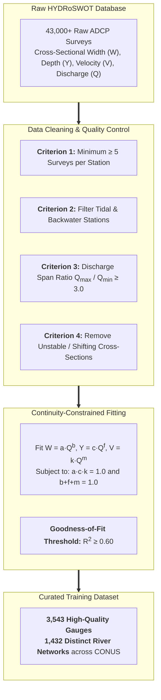

### Acoustic Doppler Current Profiler (ADCP) Principles

Acoustic Doppler Current Profilers (ADCPs) transmit high-frequency acoustic pulses (300 kHz – 3 MHz) into the water column and measure the Doppler shift of backscattered sound from suspended particulate matter. By combining acoustic Doppler velocity profiling with acoustic echo-sounding bed tracking, ADCP transects provide high-resolution cross-sectional geometry, measuring:
* **Top Width ($W$)**: Water surface width across the transect ($m$ or $ft$).
* **Cross-Sectional Area ($A$)**: Submerged conveyance area ($m^2$ or $ft^2$).
* **Mean Depth ($Y = A/W$)**: Hydraulic depth ($m$ or $ft$).
* **Mean Velocity ($V = Q/A$)**: Cross-sectional flow speed ($m/s$ or $ft/s$).
* **Total Discharge ($Q$)**: Integrated cross-sectional discharge ($m^3/s$ or $cfs$).

### Quality Assurance & Data Cleaning Pipeline

To eliminate spurious measurements and transient hydraulic artifacts, raw surveys undergo a multi-tier quality control protocol:

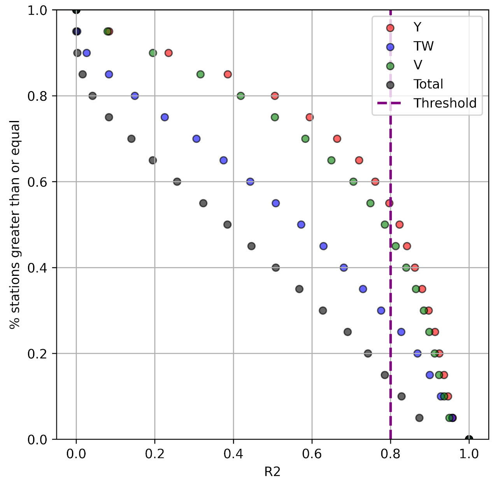{ loading=lazy }

Key filtering criteria include:
1. **Survey Frequency**: Stations must have a minimum of 5 distinct ADCP surveys across different flow regimes to capture stage-discharge scaling.
2. **Dynamic Range**: A minimum discharge dynamic ratio of $Q_{\text{max}} / Q_{\text{min}} \ge 3.0$ is enforced to ensure valid power-law exponent estimation.
3. **Hydraulic Regimes**: Removal of stations subject to severe tidal backwater, impoundment backwater from downstream dams, or frequent morphological avulsions.

### Continuity-Constrained AHG Power-Law Fitting

Power-law curves are simultaneously optimized across all three hydraulic parameters while enforcing strict mass conservation:

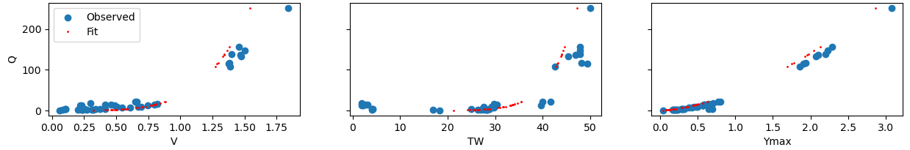{ loading=lazy }

$$
\min_{a, b, c, f, k, m} \sum_{i=1}^N \left[ \left(\ln W_i - \ln(a Q_i^b)\right)^2 + \left(\ln Y_i - \ln(c Q_i^f)\right)^2 + \left(\ln V_i - \ln(k Q_i^m)\right)^2 \right]
$$

subject to the physical equality constraints:

$$
b + f + m = 1.0 \quad \text{and} \quad \ln(a) + \ln(c) + \ln(k) = 0.0 \implies a \cdot c \cdot k = 1.0
$$

Only stations achieving a coefficient of determination $R^2 \ge 0.60$ are retained for ML training.

### Spatial Distribution of Training Stations

The curated dataset contains **3,543 stations** situated across **1,432 distinct river systems**:

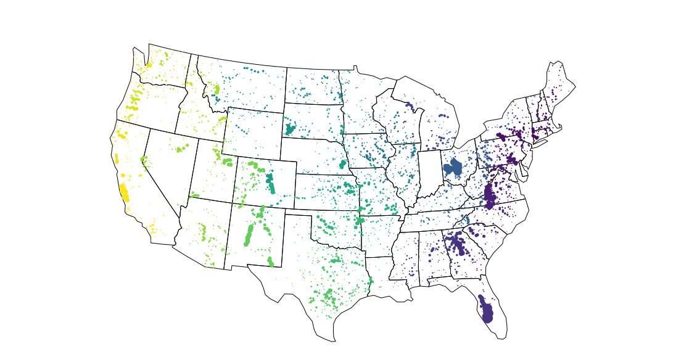{ loading=lazy }

Station marker sizing illustrates the clustering density of gauges within contiguous hydrographic networks. Clustered gauges allow the machine learning pipeline to evaluate spatial autocorrelation and topological continuity along longitudinal river corridors.

---

## Environmental Predictor Catalog (116 Candidate Features)

A comprehensive suite of **116 candidate environmental predictors** was compiled across six primary thematic categories for all 3,543 training gauge locations and continental Reference Fabric / NextGen flowlines:

| Predictor Category | Primary Data Source | Key Variables & Physical Descriptors |
| :--- | :--- | :--- |
| **Hydrologic Dynamics** | **National Water Model (NWM v2.1)** | 1.5-yr, 2-yr, 5-yr, 10-yr, 25-yr, 50-yr, 100-yr annual flood frequency flows; flow duration quantiles ($Q_{10}, Q_{50}, Q_{90}$); mean annual runoff. |
| **Catchment Landscape** | **EPA StreamCat Dataset** | Base Flow Index (BFI), NLCD 2016 land cover (forest, urban, agriculture, wetland fractions), impervious percentage, road density, dam density. |
| **Soil Physical Properties** | **POLARIS & SSURGO** | % clay, % sand, % silt, saturated hydraulic conductivity ($K_{\text{sat}}$), saturated soil water content ($\theta_s$), soil depth to bedrock, available water capacity. |
| **Topography & Network** | **USGS 3DEP DEM & Reference Fabric** | Reach slope ($S$), upstream drainage area ($A$), Strahler stream order, arbolate sum, channel elevation, catchment relief ratio, physiographic diversity. |
| **Hydro-Meteorology** | **PRISM & GridMET** | Mean annual precipitation ($P$), mean annual temperature ($T$), potential evapotranspiration ($\text{PET}$), aridity index ($P/\text{PET}$), precipitation seasonality. |
| **Land Surface Dynamics** | **MODIS & Landsat** | Normalized Difference Vegetation Index (NDVI), Leaf Area Index (LAI), long-term root-zone soil moisture ($SM$). |

---

## Principal Component Analysis (PCA) Decompositions

To eliminate multicollinearity among the 116 candidate predictors and compress thematic feature sub-domains into orthogonal predictors, Principal Component Analysis (PCA) was performed across each environmental domain. Supplementary Figures S2 through S12 detail the scree plots, eigenvector loadings, and geographic spatial patterns:

=== "StreamCat Catchment"
    ### Catchment Landscape & Land Use PCA
    Decomposes EPA StreamCat metrics into orthogonal axes capturing urbanization/imperviousness (PC1), agricultural intensity vs. forest cover (PC2), and baseflow buffering capacity (PC3).

    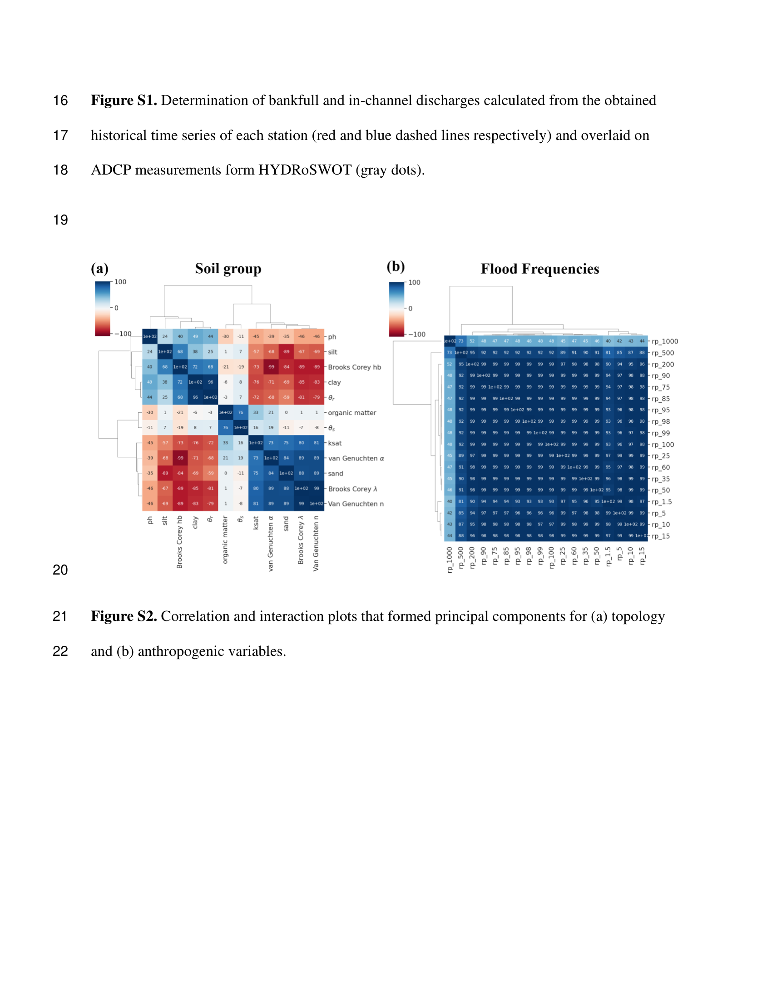{ loading=lazy }

=== "Soil Physical Texture"
    ### Soil Texture & Hydraulic Conductivity PCA
    Decomposes POLARIS/SSURGO soil properties. PC1 aligns strongly with the clay-sand textural gradient, while PC2 represents saturated hydraulic conductivity ($K_{\text{sat}}$) and water retention capacity ($\theta_s$).

    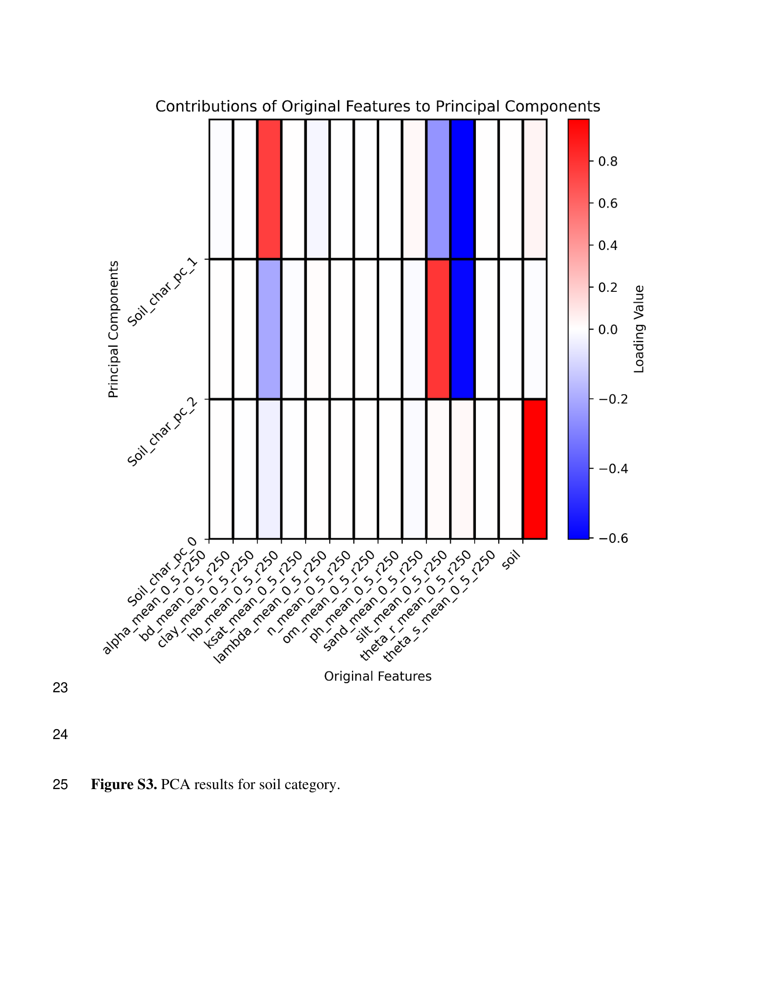{ loading=lazy }

=== "Topography & Relief"
    ### DEM Slope & Catchment Relief PCA
    Captures terrain ruggedness, elevation gradients, and longitudinal stream slopes extracted from USGS 3DEP 10m/30m DEMs.

    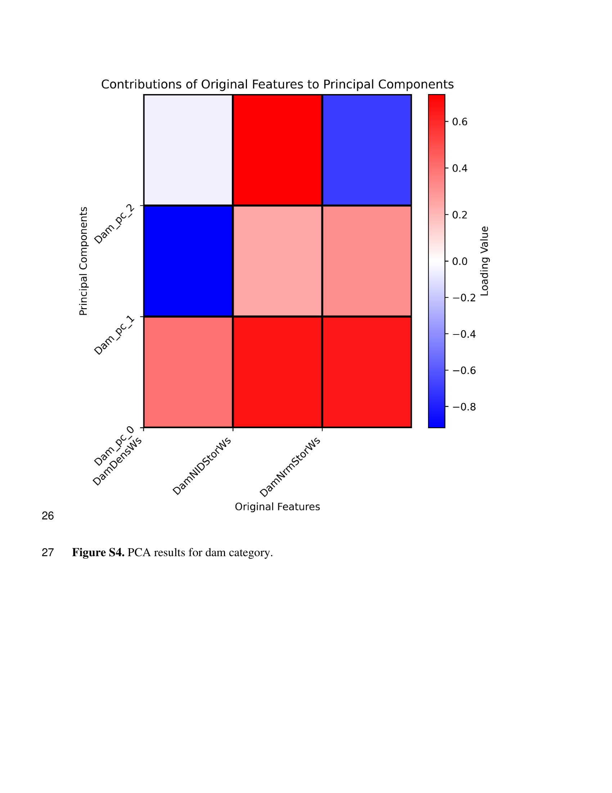{ loading=lazy }

=== "NWM Flood Frequency"
    ### National Water Model (NWM 2.1) Flow Dynamics PCA
    Decomposes flood frequency return periods ($Q_{1.5}$ through $Q_{100}$) and flow duration quantiles. PC1 accounts for >85% of total flow magnitude variance, while PC2 captures hydrograph flashiness.

    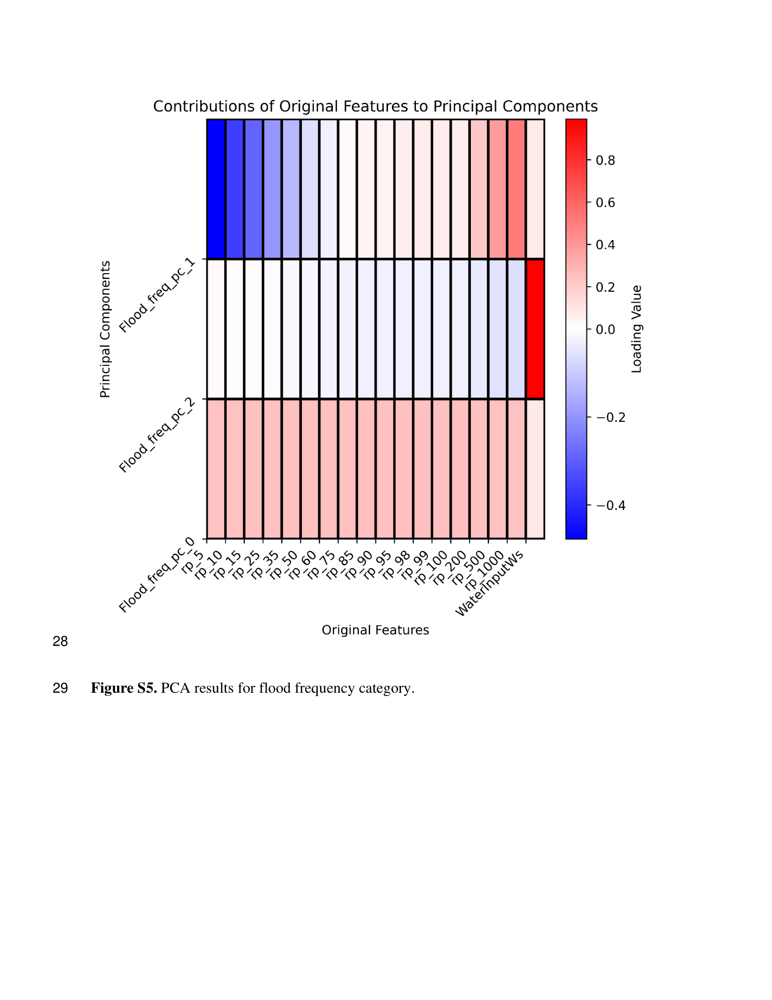{ loading=lazy }

=== "Riparian Land Cover"
    ### Riparian Buffer & Corridor Dynamics PCA
    Evaluates 100m riparian buffer land use, identifying canopy shading, bank stabilization vegetation, and near-channel anthropogenic development.

    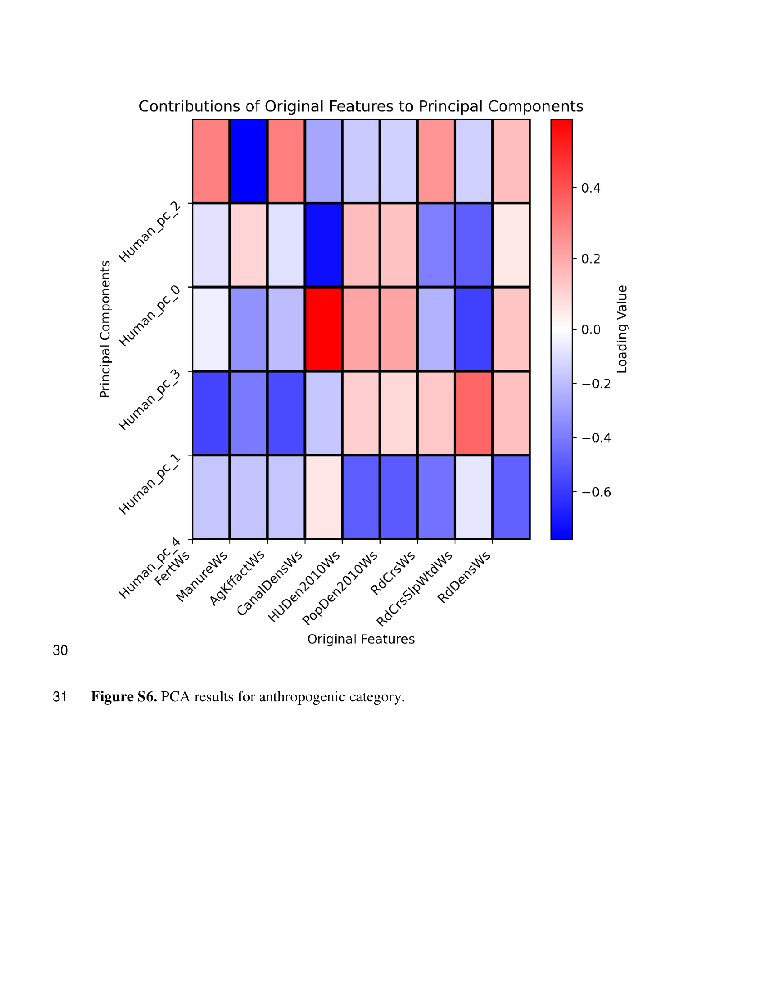{ loading=lazy }

=== "Climate & Water Balance"
    ### PRISM Climate & Aridity Index PCA
    Captures continental gradients in precipitation magnitude, seasonality, potential evapotranspiration, and water-energy balance.

    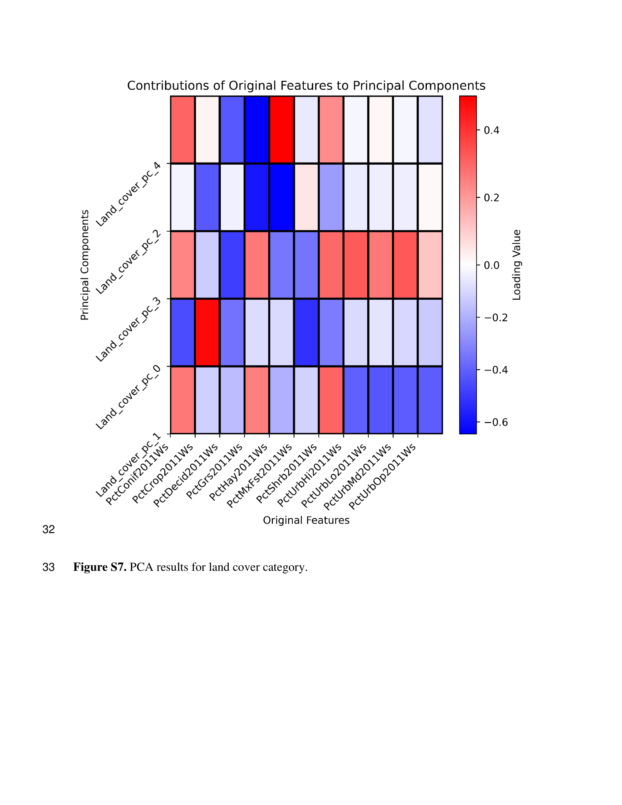{ loading=lazy }

=== "Vegetation Dynamics"
    ### MODIS NDVI & Leaf Area Index PCA
    Characterizes seasonal canopy density, transpiration demand, and surface roughness variations derived from multi-year MODIS time series.

    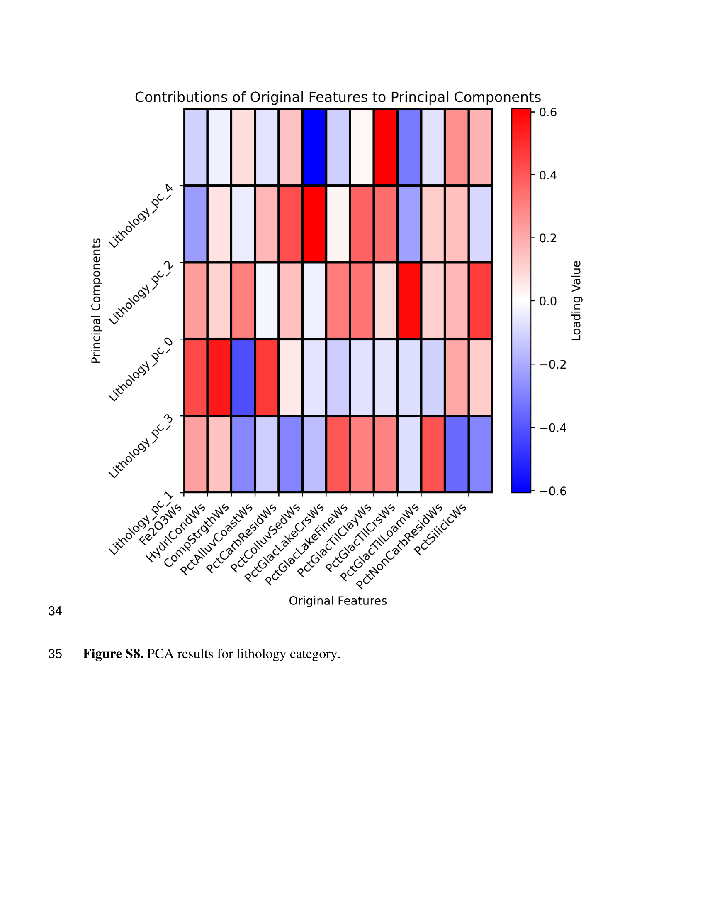{ loading=lazy }

=== "Geology & Lithology"
    ### Subsurface Permeability & Lithologic Classes PCA
    Represents bedrock geology, surficial deposit permeability, and geochemical weathering classes influencing bank cohesion.

    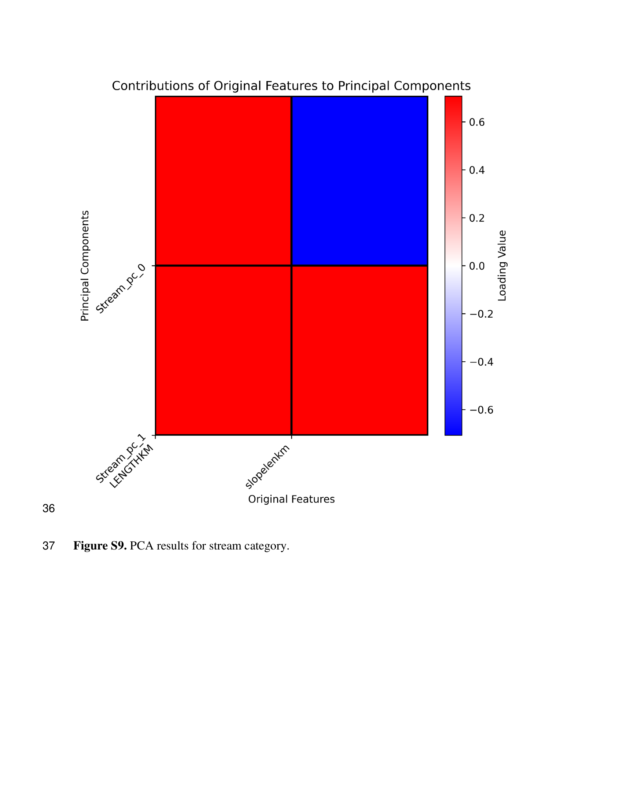{ loading=lazy }

=== "Network Topology"
    ### Hydrographic Topology & Flowline Connectivity PCA
    Quantifies upstream network bifurcation, Strahler stream order scaling, arbolate sum expansion, and tributary confluence spacing.

    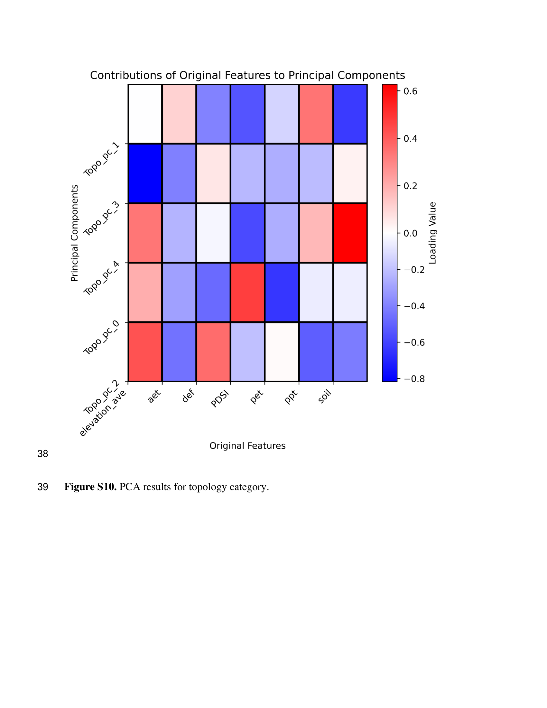{ loading=lazy }

=== "Flow Duration & Flashiness"
    ### Flow Duration & Hydrograph Flashiness PCA
    Isolates Richards-Baker Flashiness Index (RBI), baseflow recession constants, and low-flow intermittency ($Q_{90}/Q_{50}$).

    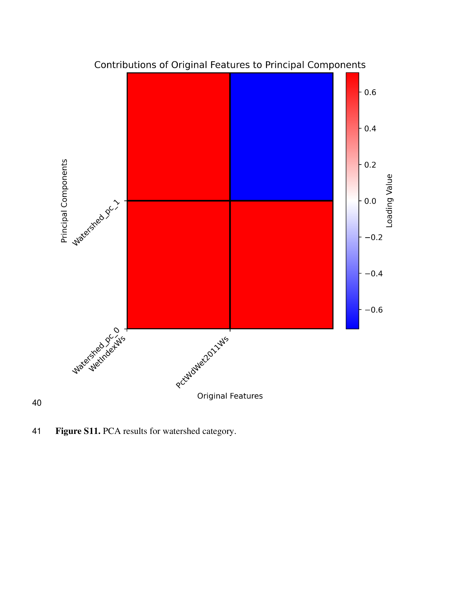{ loading=lazy }

=== "Hydrological Landscape Regions (HLR)"
    ### Integrated Continental Eigenvector Spectrum
    Full-spectrum of HLR codes.

    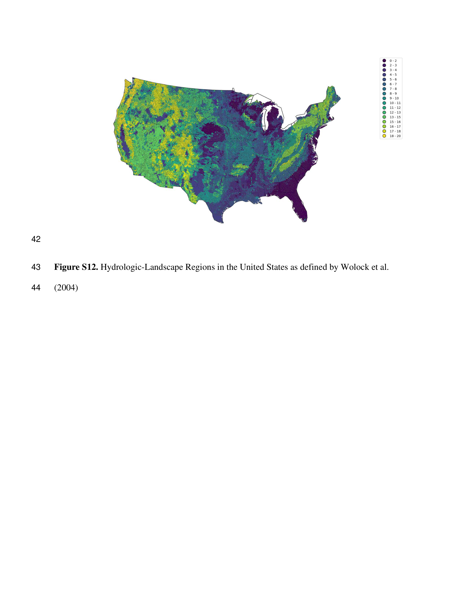{ loading=lazy }

---

## Summary of Data Harmonization

By reconciling field-measured ADCP hydraulic geometry from HYDRoSWOT with multi-source environmental descriptors, the v1.0 data pipeline provides a clean, continuous, and physically consistent dataset for machine learning. 

Next: Explore how these 116 predictors are compressed and modeled in [Methods & Feature Engineering](methods.md).
