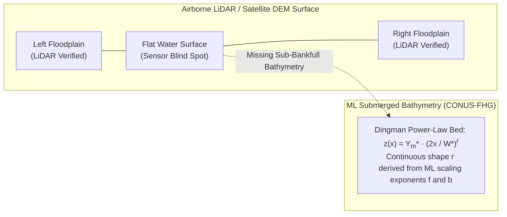
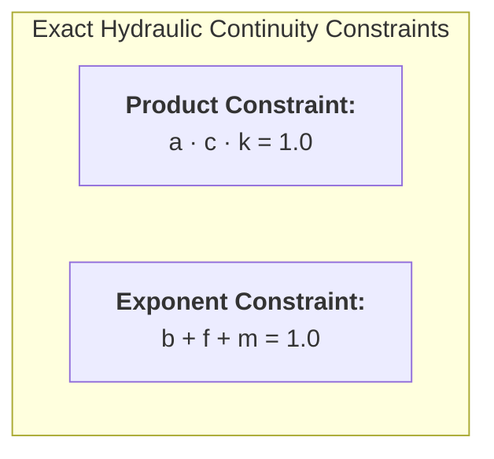
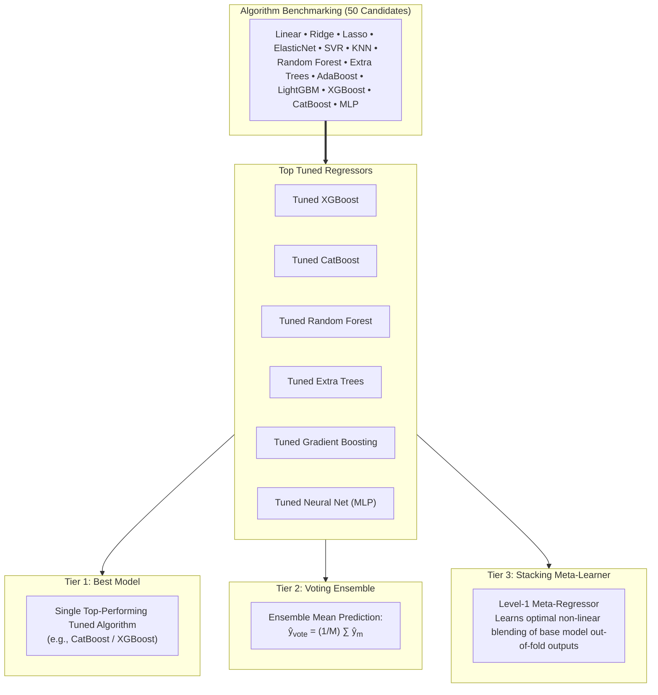

# CONUS-FHG v1.0 Pipeline Overview

The **CONUS-FHG v1.0** framework provides a robust, physics-grounded machine learning methodology for estimating continental-scale river channel geometry and submerged cross-sectional shape across the Contiguous United States (CONUS). Developed by Modaresi Rad et al. (2024), this framework bridges the gap between discrete hydrographic surveys and continental-scale hydrodynamic modeling.

---

## The Missing Bathymetry Challenge

Modern hydrologic and hydrodynamic modeling frameworks—such as the NOAA **Next Generation Water Resources Modeling Framework (NextGen)**, **FEMA Flood Insurance Studies (FIS)**, and the **National Flood Inundation Mapping (FIM)** program—require accurate channel geometry to simulate open-channel hydraulics:

While airborne LiDAR and high-resolution Digital Elevation Models (DEMs) capture terrestrial floodplain topography with centimeter-level precision, near-infrared LiDAR pulses are absorbed or reflected by water surfaces. Consequently, raw DEMs depict river channels as flat water surfaces, omitting the **submerged in-channel conveyance area**. 

Failing to account for submerged bathymetry creates severe hydraulic modeling errors:
1. **Premature Overbank Flooding**: Channels artificially overflow at sub-bankfull flows because cross-sectional conveyance volume is underestimated.
2. **Distorted Wave Celerity**: Hydraulic radius ($R = A/P$) is miscalculated, skewing Manning's equation velocity ($V = \frac{1}{n} R^{2/3} S^{1/2}$) and flood wave travel times.
3. **Inaccurate Rating Curves**: Stage-discharge relationships deviate substantially from gauge observations.

CONUS-FHG v1.0 solves this fundamental problem by learning hydraulic geometry relationships from surveyed cross-sections and generalizing them to all CONUS stream reaches.

---

## From At-a-Station to Feature Hydraulic Geometry (FHG)

### At-a-Station Hydraulic Geometry (AHG)

Classical hydraulic geometry, pioneered by Leopold and Maddock (1953), demonstrates that cross-sectional top width ($W$), mean depth ($Y$), and mean flow velocity ($V$) scale with discharge ($Q$) as power-law functions at a fixed river cross-section:

$$
W = a \cdot Q^b
$$

$$
Y = c \cdot Q^f
$$

$$
V = k \cdot Q^m
$$

where $a, c, k$ are empirical coefficients and $b, f, m$ are dimensionless scaling exponents. 

From the physical principle of mass conservation (continuity equation $Q = W \cdot Y \cdot V$ for incompressible fluid flow in steady state), the power laws must satisfy exact mathematical constraints:

$$
(a \cdot Q^b) \cdot (c \cdot Q^f) \cdot (k \cdot Q^m) = (a \cdot c \cdot k) \cdot Q^{b + f + m} = Q^1
$$

This yields the fundamental AHG continuity criteria:

$$
a \cdot c \cdot k = 1.0 \quad \text{and} \quad b + f + m = 1.0
$$

### Feature Hydraulic Geometry (FHG)

While AHG describes empirical relationships at individual gauge sites, **Feature Hydraulic Geometry (FHG)** (Johnson et al., 2023; Modaresi Rad et al., 2024) expands these relationships to regional and continental scales. FHG treats the power-law parameters ($a, b, c, f, k, m$) as continuous functional responses to holistic catchment and hydrographic features:

$$
\{a, b, c, f, k, m\} = \mathcal{F}\Big(\mathbf{X}_{\text{NWM}}, \mathbf{X}_{\text{StreamCat}}, \mathbf{X}_{\text{DEM}}, \mathbf{X}_{\text{Soil}}, \mathbf{X}_{\text{Climate}}\Big)
$$

where $\mathcal{F}$ represents the machine learning mapping function parameterized across CONUS.

---

## End-to-End Workflow Architecture

The CONUS-FHG v1.0 pipeline consists of four tightly integrated phases spanning data acquisition, feature space reduction, multi-tier machine learning, and continental inference:

{ loading=lazy }

### Workflow Stages:

1. **Hydrographic Data Curation & Preprocessing**:
   - Extraction of raw Acoustic Doppler Current Profiler (ADCP) cross-sectional surveys from the USGS HYDRoSWOT database.
   - Quality control: filtering out tidal/backwater stations, unstable cross-sections, and records with fewer than 5 surveys.
   - Robust optimization fitting of AHG power laws ensuring $R^2 \ge 0.8$ while strictly enforcing continuity constraints ($a \cdot c \cdot k = 1.0$, $b + f + m = 1.0$).
2. **Environmental Feature Extraction**:
   - Extraction of 116 candidate environmental predictors across all gauge locations.
   - Predictor families include National Water Model (NWM v2.1) flood frequencies, StreamCat landscape attributes, POLARIS high-resolution soil physical parameters, 3DEP DEM topographic indices, and PRISM climate statistics.
3. **Dimensionality Reduction & Latent Encoding**:
   - Game-theoretic SHAP (Shapley Additive Explanations) importance screening to prune noisy, uninformative variables.
   - Unsupervised Deep Denoising AutoEncoders (AE) trained on clustered predictor subsets to compress high-dimensional collinear features into orthogonal latent components, reducing the feature space to 60 final predictors.
4. **Multi-Tier Ensemble Modeling & Continental Generalization**:
   - Systematic benchmarking of 50 candidate regression algorithms.
   - Deployment of a 3-tier predictive cascade: Best Tuned Regressors (Tier 1), Voting Ensemble (Tier 2), and Stacking Meta-Learner (Tier 3).
   - Validation via 10-fold spatial cross-validation and out-of-bag testing.
   - Synthesis of continuous Dingman channel shape exponents ($r = f/b$) for all reaches.

---

## Study Area & Training Domain

The training dataset encompasses **3,543 USGS stream gauging stations** distributed across **1,432 distinct river systems** throughout the Contiguous United States:

{ loading=lazy }

### Spatial & Hydrographic Diversity:

* **Geographic Breadth**: Spans all major physiographic provinces and Hydrologic Landscape Regions (HLRs) of CONUS, from the humid Appalachian basins to the arid Southwest and Pacific Northwest maritime environments.
* **Stream Order Representation**: Includes 1st through 8th Strahler stream orders, capturing the geomorphic continuum from steep, confined headwaters to large lowland alluvial mainstems (e.g. Mississippi, Ohio, Missouri, Columbia).
* **Station Density & Network Clustering**: Clustered station groups enable robust evaluation of spatial autocorrelation and cross-reach continuity along continuous river networks.

---

## Modeling Strategy: Three-Tier Ensemble

To evaluate whether algorithmic complexity improves hydraulic geometry estimation, v1.0 implements a systematic three-tier modeling hierarchy:

1. **Tier 1 (Best Tuned Model)**: Identifies the single best-performing machine learning architecture for each target parameter following extensive Bayesian hyperparameter optimization.
2. **Tier 2 (Voting Ensemble)**: Computes the unweighted ensemble average of the top hyperparameter-tuned base models, dampening idiosyncratic model variance.
3. **Tier 3 (Stacking Meta-Learner)**: Trains a higher-level regression model on the out-of-fold cross-validation predictions of base models. The meta-learner learns the regional strengths and weaknesses of each base model, achieving superior predictive skill across the full spectrum of river scales.

---

## Section Navigation

For comprehensive technical documentation of each v1.0 subsystem, explore the following pages:

* **[Data Sources & Quality Control](data-sources.md)**: HYDRoSWOT ADCP data cleaning, continuity fitting, and environmental predictor PCA decompositions.
* **[Methods & Feature Engineering](methods.md)**: AutoEncoder dimensionality reduction, SHAP screening, multi-tier ensembling, and validation protocols.
* **[Channel Shape Parameterization ($r$)](../r/index.md)**: Mathematical derivation of Dingman exponent $r$, morphological classifications, and CONUS-scale spatial trends.
