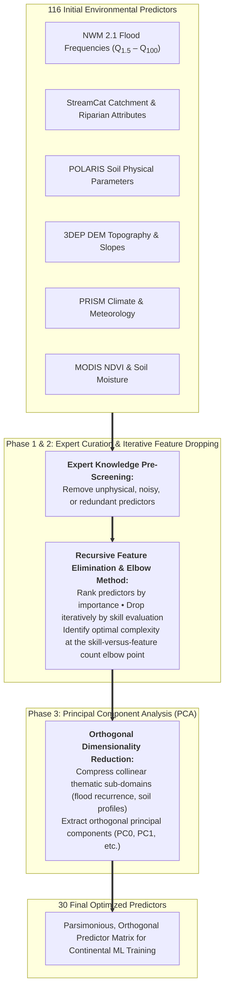
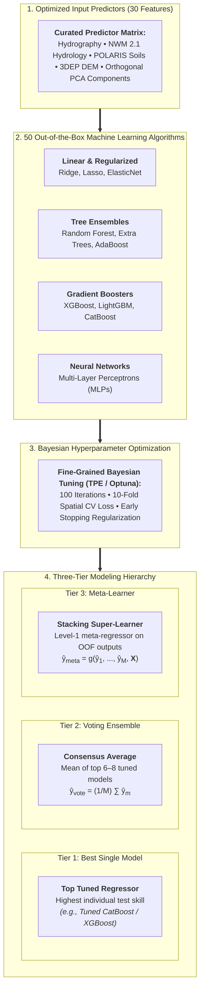
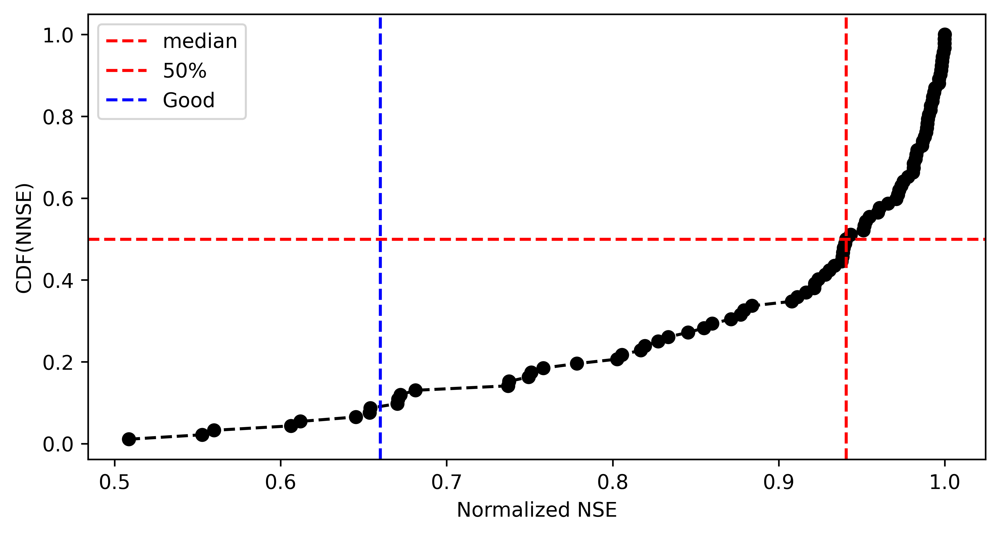
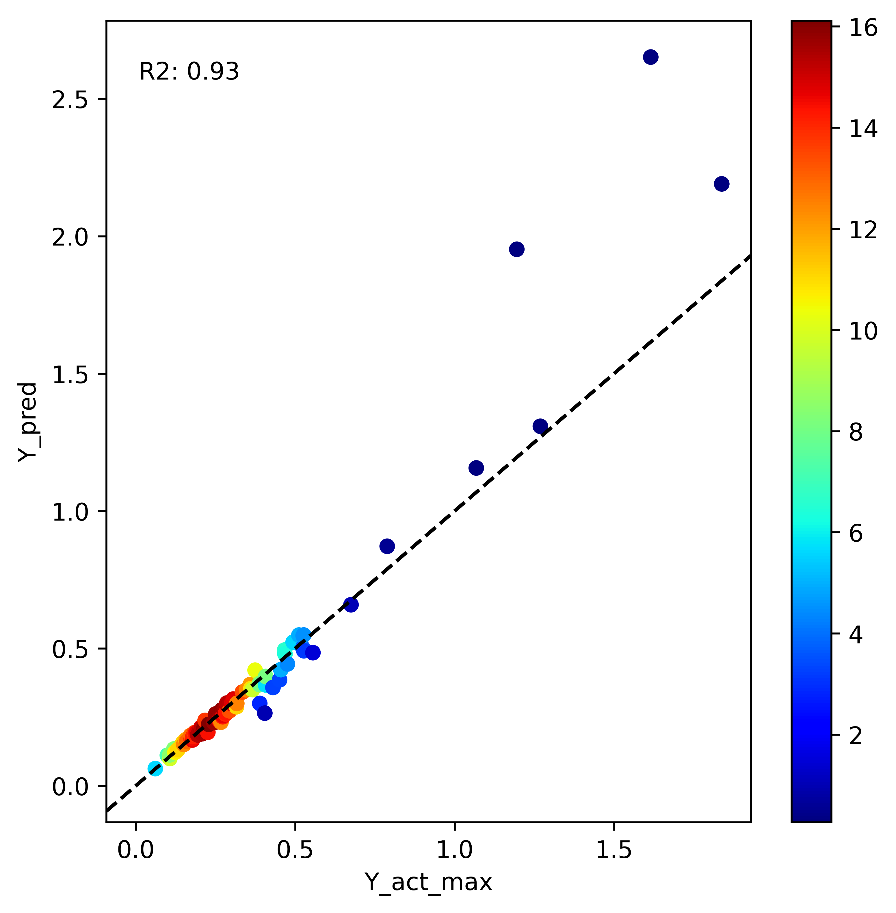
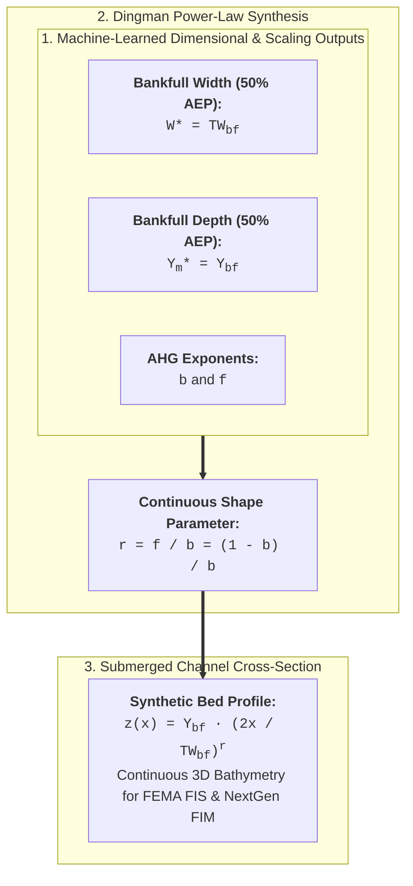

# Methods & Modeling Strategy

The **v1.0** framework employs a disciplined, physics-informed machine learning pipeline to estimate hydraulic geometry parameters ($a, b, c, f, k, m$) and Dingman channel shape ($r$) across CONUS. This page details the feature space reduction methodology using expert knowledge, iterative feature dropping via the elbow method, and Principal Component Analysis (PCA), followed by the three-tier ensemble architecture, hyperparameter optimization, and spatial validation protocols.

---

## Feature Space Optimization & Dimensionality Reduction

Predicting hydraulic geometry across continental scales requires capturing complex interactions between hydrology, terrain, soils, and land cover without inducing severe multicollinearity ($|r| > 0.75$) or variance inflation. The v1.0 pipeline optimizes the initial feature pool from **116 candidate environmental predictors** to **30 parsimonious features** using a three-phase feature reduction strategy:

### Phase 1: Expert Knowledge Screening & Domain Curation

An initial compilation of 116 candidate geospatial, climatic, topographic, and hydrologic variables was assembled from national databases (NWM 2.1 reanalysis, StreamCat, POLARIS, USGS 3DEP, PRISM, MODIS). Domain hydrological and geomorphological expert knowledge was applied to remove irrelevant, noisy, or physically illogical variables, ensuring that all retained predictors carry plausible causal mechanisms for channel width, depth, or velocity scaling.

### Phase 2: Iterative Feature Dropping & Elbow Method Evaluation

To determine the most informative predictor subset:  
1. Candidate features were ranked based on feature importance scores (TreeSHAP and permutation importance across gradient boosting and decision forest algorithms). 
2. Features were recursively dropped in descending order of unimportance.  
3. Model evaluation metrics (Kling-Gupta Efficiency $\text{KGE}$, Normalized Nash-Sutcliffe Efficiency $\text{NNSE}$, and $\text{RMSE}$) were continuously tracked across each subset size. 
4. The **Elbow Method** was applied to the skill vs. feature count trajectory to locate the optimal balance point retaining maximal predictive power while eliminating noise, reducing variance, and avoiding overparameterization.

### Phase 3: Principal Component Analysis (PCA) for Collinear Sub-Domains

For multi-dimensional thematic groups exhibiting strong internal multicollinearity (such as multi-recurrence flood frequency distributions $Q_{1.5}$ through $Q_{100}$, multi-layer soil physical properties, and continuous catchment slope metrics), **Principal Component Analysis (PCA)** was performed:

$$
\mathbf{Z} = \mathbf{X} \mathbf{W}
$$

where $\mathbf{X}$ is the standardized thematic feature matrix, $\mathbf{W}$ contains the orthogonal eigenvectors of the covariance matrix, and $\mathbf{Z}$ represents the principal components. By retaining the dominant principal components (e.g., PC0 and PC1, accounting for $> 95\%$ of cumulative domain variance), the pipeline preserves essential hydrological and physical gradients while enforcing strict orthogonality.

---

## Multi-Tier Modeling Architecture

The modeling cascade is structured into three progressive tiers to rigorously evaluate the performance benefits of ensembling and meta-learning:

### 1. Algorithm Benchmarking & Screening

An initial screening of **50 diverse regression algorithms** was conducted using default hyperparameters across all target parameters ($a, b, c, f, k, m$). The top candidate architectures predominantly gradient-boosted decision trees (XGBoost, CatBoost, LightGBM), randomized decision forests (Extra Trees, Random Forest), and deep feedforward MLPs—were selected for dedicated hyperparameter optimization.

### 2. Tier 1: Best Hyperparameter-Tuned Model

Each selected algorithm underwent Bayesian hyperparameter optimization (Tree-structured Parzen Estimator, TPE) over 100 trials with early stopping on validation loss. Key tuned hyperparameters included:
* **Tree Depth & Max Leaves**: Controlling tree complexity and interaction order.
* **Learning Rate ($\eta$) & Subsample Ratio**: Controlling regularization and gradient step stability.
* **L1 ($\alpha$) and L2 ($\lambda$) Regularization**: Penalizing leaf weight magnitudes to prevent overfitting to gauge clusters.

### 3. Tier 2: Voting Ensemble

The Voting Ensemble aggregates predictions from the top $M$ tuned base models (typically $M=6\text{–}8$):

$$
\hat{y}_{\text{vote}} = \frac{1}{M} \sum_{m=1}^M \hat{y}_m(\mathbf{x})
$$

Ensemble averaging reduces epistemic variance arising from stochastic training initializations and feature subsampling, producing smoother spatial parameter fields across hydrographic transitions.

### 4. Tier 3: Stacking Meta-Learner

The Meta-Learner takes ensembling a step further by training a **Level-1 meta-regressor** $g(\cdot)$ on the out-of-fold prediction vectors $\mathbf{\hat{Y}}_{\text{OOF}} = [\hat{y}_1, \hat{y}_2, \dots, \hat{y}_M]^T$ generated during cross-validation:

$$
\hat{y}_{\text{meta}} = g\left(\hat{y}_1(\mathbf{x}), \hat{y}_2(\mathbf{x}), \dots, \hat{y}_M(\mathbf{x}), \mathbf{X}_{\text{context}}\right)
$$

Because different algorithms excel in different geomorphic domains (e.g., CatBoost in steep bedrock channels vs. Extra Trees in wide alluvial valleys), the meta-learner learns the non-linear error synergies and regional biases of each base regressor, achieving the highest overall skill.

---

## Validation Protocols & Goodness-of-Fit Metrics

### 10-Fold Spatial Cross-Validation

To ensure true out-of-sample generalizability and prevent spatial data leakage between clustered gauges on the same river segment:
1. Gauges within the same contiguous river network are assigned together to either the training or testing partition.
2. A **10-fold spatial cross-validation scheme** is executed iteratively, ensuring every gauge is evaluated out-of-bag.

### Quantitative Evaluation Metrics

Model skill is evaluated using hydro-statistical metrics:

#### Kling-Gupta Efficiency (KGE)
Decomposes performance into correlation ($\rho$), relative variability ($\alpha = \sigma_{\text{sim}}/\sigma_{\text{obs}}$), and bias ($\beta = \mu_{\text{sim}}/\mu_{\text{obs}}$):

$$
\text{KGE} = 1 - \sqrt{(\rho - 1)^2 + (\alpha - 1)^2 + (\beta - 1)^2}
$$

#### Normalized Nash-Sutcliffe Efficiency (NNSE)
Bounds the classical NSE metric to the interval $[0, 1]$ to avoid extreme negative skews:

$$
\text{NNSE} = \frac{1}{2 - \text{NSE}} = \frac{1}{2 - \left(1 - \frac{\sum (y_i - \hat{y}_i)^2}{\sum (y_i - \bar{y})^2}\right)}
$$

#### Mean Absolute Percentage Error (MAPE) & Relative Bias

$$
\text{MAPE} = \frac{100\%}{N} \sum_{i=1}^N \left| \frac{y_i - \hat{y}_i}{y_i} \right|, \quad \text{Bias}_{\text{rel}} = \frac{\sum (\hat{y}_i - y_i)}{\sum y_i} \times 100\%
$$

---

## Model Skill & Empirical Validation

The cumulative distribution function (CDF) of NNSE scores demonstrates that the **Tier 3 Meta-Learner** consistently outperforms both individual tuned models and the simple voting ensemble across depth ($f$) and width ($b$) exponent estimation:

{ loading=lazy }

### Continental Spatial Skill Distribution

Mapping NNSE scores across CONUS reveals high skill across diverse hydrological regimes, with NNSE exceeding 0.85 in >80% of test stations:

{ loading=lazy }

### Performance at Maximum Flow Conditions

Evaluating predictions against peak observed flows ($Q_{\text{max}}$) confirms that the model preserves hydraulic scaling even under high-magnitude flow events:

{ loading=lazy }

Residual analysis indicates that the small remaining bias is concentrated primarily in extreme mega-rivers (e.g., lower Mississippi mainstem), where ADCP training samples are inherently limited due to sparse gauging.

---

## Synthesis of Channel Shape Parameter ($r$)

Once hydraulic geometry exponents ($b, f, m$) are predicted across the hydrographic network, the continuous **Dingman cross-sectional shape exponent ($r$)** is analytically synthesized:

$$
r = \frac{f}{b}
$$

For complete mathematical derivations, morphological classifications (triangular $r=1$, parabolic $r=2$, flat-bottomed $r>3$), and continental mapping of $r$, see the [Channel Shape Parameterization ($r$)](../r/index.md) documentation.
