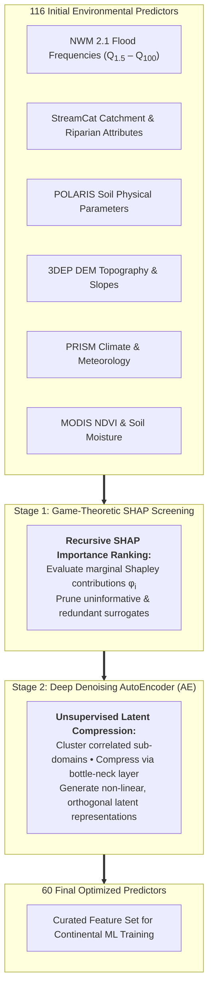
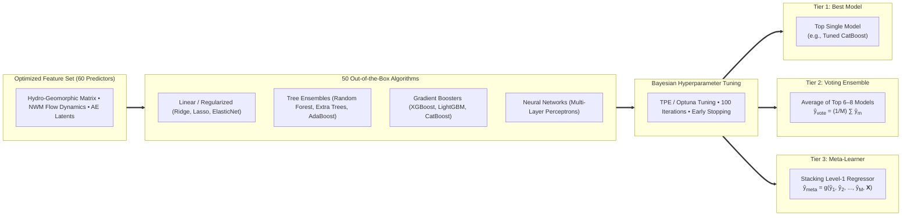
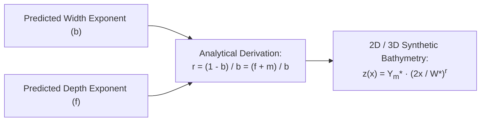

# Methods & Modeling Strategy

The **CONUS-FHG v1.0** framework employs a disciplined, physics-informed machine learning pipeline to estimate hydraulic geometry parameters ($a, b, c, f, k, m$) and Dingman channel shape ($r$) across CONUS. This page details the two-stage feature space reduction methodology, the three-tier ensemble architecture, hyperparameter optimization, and spatial validation protocols.

---

## Feature Space Optimization & Dimensionality Reduction

Predicting hydraulic geometry across continental scales requires capturing complex interactions between hydrology, terrain, soils, and land cover without inducing severe multicollinearity ($|r| > 0.85$) or variance inflation. The v1.0 pipeline reduces the initial feature pool from **116 candidate environmental predictors** to **60 optimized features** using a hybrid two-stage approach:

### Stage 1: Game-Theoretic SHAP Importance Screening

We quantify the global predictive utility of candidate predictors using **TreeSHAP** (Lundberg & Lee, 2017), which computes the exact Shapley value attribution for feature $i$ across all possible feature subsets $S \subseteq F \setminus \{i\}$:

$$
\phi_i(x) = \sum_{S \subseteq F \setminus \{i\}} \frac{|S|! (|F| - |S| - 1)!}{|F|!} \left[ f_x(S \cup \{i\}) - f_x(S) \right]
$$

Features with near-zero mean absolute SHAP values ($\mathbb{E}[|\phi_i|] < \epsilon$) across base learners are systematically eliminated, removing noise and reducing training variance.

### Stage 2: Deep Denoising AutoEncoder (AE) Compression

For thematic subsets exhibiting high internal collinearity (such as multi-depth soil texture measurements, multi-recurrence-interval flood frequencies, and seasonal vegetation indices), we apply **Deep Denoising AutoEncoders**:

$$
\mathbf{h} = \sigma\left(\mathbf{W}_e \mathbf{\tilde{x}} + \mathbf{b}_e\right), \quad \mathbf{\hat{x}} = \sigma\left(\mathbf{W}_d \mathbf{h} + \mathbf{b}_d\right)
$$

where $\mathbf{\tilde{x}} = \mathbf{x} + \boldsymbol{\epsilon}$ is the stochastically corrupted input feature vector, $\mathbf{h} \in \mathbb{R}^d$ is the compressed latent representation ($d \ll \dim(\mathbf{x})$), and the network minimizes the reconstruction mean squared error:

$$
\mathcal{L}_{\text{AE}} = \frac{1}{N} \sum_{i=1}^N \|\mathbf{x}_i - \mathbf{\hat{x}}_i\|^2_2 + \lambda \|\mathbf{W}\|_2^2
$$

The compressed latent vectors $\mathbf{h}$ preserve essential non-linear geomorphic signals while ensuring orthogonality and preventing overparameterization.

---

## Multi-Tier Modeling Architecture

The modeling cascade is structured into three progressive tiers to rigorously evaluate the performance benefits of ensembling and meta-learning:

### 1. Algorithm Benchmarking & Screening

An initial screening of **50 diverse regression algorithms** was conducted using default hyperparameters across all target parameters ($a, b, c, f, k, m$). The top candidate architectures—predominantly gradient-boosted decision trees (XGBoost, CatBoost, LightGBM), randomized decision forests (Extra Trees, Random Forest), and deep feedforward MLPs—were selected for dedicated hyperparameter optimization.

### 2. Tier 1: Best Hyperparameter-Tuned Model

Each selected algorithm underwent Bayesian hyperparameter optimization (Tree-structured Parzen Estimator, TPE) over 100 trials with early stopping on validation loss. Key tuned hyperparameters included:
* **Tree Depth & Max Leaves**: Controlling tree complexity and interaction order.
* **Learning Rate ($\eta$) & Subsample Ratio**: Controlling regularization and gradient step stability.
* **L1 ($\alpha$) and L2 ($\lambda$) Regularization**: Penalizing leaf weight magnitudes to prevent overfitting to gauge clusters.

### 3. Tier 2: Voting Ensemble

The Voting Ensemble aggregates predictions from the top $M$ tuned base models (typically $M=6\text{–}8$):

$$
\hat{y}_{\text{vote}} = \frac{1}{M} \sum_{m=1}^M \hat{y}_m(\mathbf{x})
$$

Ensemble averaging reduces epistemic variance arising from stochastic training initializations and feature subsampling, producing smoother spatial parameter fields across hydrographic transitions.

### 4. Tier 3: Stacking Meta-Learner

The Meta-Learner takes ensembling a step further by training a **Level-1 meta-regressor** $g(\cdot)$ on the out-of-fold prediction vectors $\mathbf{\hat{Y}}_{\text{OOF}} = [\hat{y}_1, \hat{y}_2, \dots, \hat{y}_M]^T$ generated during cross-validation:

$$
\hat{y}_{\text{meta}} = g\left(\hat{y}_1(\mathbf{x}), \hat{y}_2(\mathbf{x}), \dots, \hat{y}_M(\mathbf{x}), \mathbf{X}_{\text{context}}\right)
$$

Because different algorithms excel in different geomorphic domains (e.g., CatBoost in steep bedrock channels vs. Extra Trees in wide alluvial valleys), the meta-learner learns the non-linear error synergies and regional biases of each base regressor, achieving the highest overall skill.

---

## Validation Protocols & Goodness-of-Fit Metrics

### 10-Fold Spatial Cross-Validation

To ensure true out-of-sample generalizability and prevent spatial data leakage between clustered gauges on the same river segment:
1. Gauges within the same contiguous river network are assigned together to either the training or testing partition.
2. A **10-fold spatial cross-validation scheme** is executed iteratively, ensuring every gauge is evaluated out-of-bag.

### Quantitative Evaluation Metrics

Model skill is evaluated using hydro-statistical metrics:

#### Kling-Gupta Efficiency (KGE)
Decomposes performance into correlation ($\rho$), relative variability ($\alpha = \sigma_{\text{sim}}/\sigma_{\text{obs}}$), and bias ($\beta = \mu_{\text{sim}}/\mu_{\text{obs}}$):

$$
\text{KGE} = 1 - \sqrt{(\rho - 1)^2 + (\alpha - 1)^2 + (\beta - 1)^2}
$$

#### Normalized Nash-Sutcliffe Efficiency (NNSE)
Bounds the classical NSE metric to the interval $[0, 1]$ to avoid extreme negative skews:

$$
\text{NNSE} = \frac{1}{2 - \text{NSE}} = \frac{1}{2 - \left(1 - \frac{\sum (y_i - \hat{y}_i)^2}{\sum (y_i - \bar{y})^2}\right)}
$$

#### Mean Absolute Percentage Error (MAPE) & Relative Bias

$$
\text{MAPE} = \frac{100\%}{N} \sum_{i=1}^N \left| \frac{y_i - \hat{y}_i}{y_i} \right|, \quad \text{Bias}_{\text{rel}} = \frac{\sum (\hat{y}_i - y_i)}{\sum y_i} \times 100\%
$$

---

## Model Skill & Empirical Validation

The cumulative distribution function (CDF) of NNSE scores demonstrates that the **Tier 3 Meta-Learner** consistently outperforms both individual tuned models and the simple voting ensemble across depth ($f$) and width ($b$) exponent estimation:

{ loading=lazy }

### Continental Spatial Skill Distribution

Mapping NNSE scores across CONUS reveals high skill across diverse hydrological regimes, with NNSE exceeding 0.85 in >80% of test stations:

{ loading=lazy }

### Performance at Maximum Flow Conditions

Evaluating predictions against peak observed flows ($Q_{\text{max}}$) confirms that the model preserves hydraulic scaling even under high-magnitude flow events:

{ loading=lazy }

Residual analysis indicates that the small remaining bias is concentrated primarily in extreme mega-rivers (e.g., lower Mississippi mainstem), where ADCP training samples are inherently limited due to sparse gauging.

---

## Synthesis of Channel Shape Parameter ($r$)

Once hydraulic geometry exponents ($b, f, m$) are predicted across the hydrographic network, the continuous **Dingman cross-sectional shape exponent ($r$)** is analytically synthesized:

$$
r = \frac{1 - b}{b} = \frac{f + m}{b}
$$

For complete mathematical derivations, morphological classifications (triangular $r=1$, parabolic $r=2$, flat-bottomed $r>3$), and continental mapping of $r$, see the [Channel Shape Parameterization ($r$)](../r/index.md) documentation.
