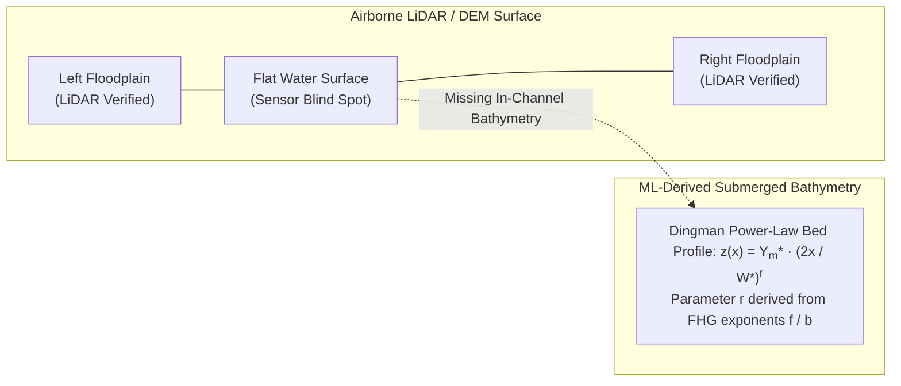
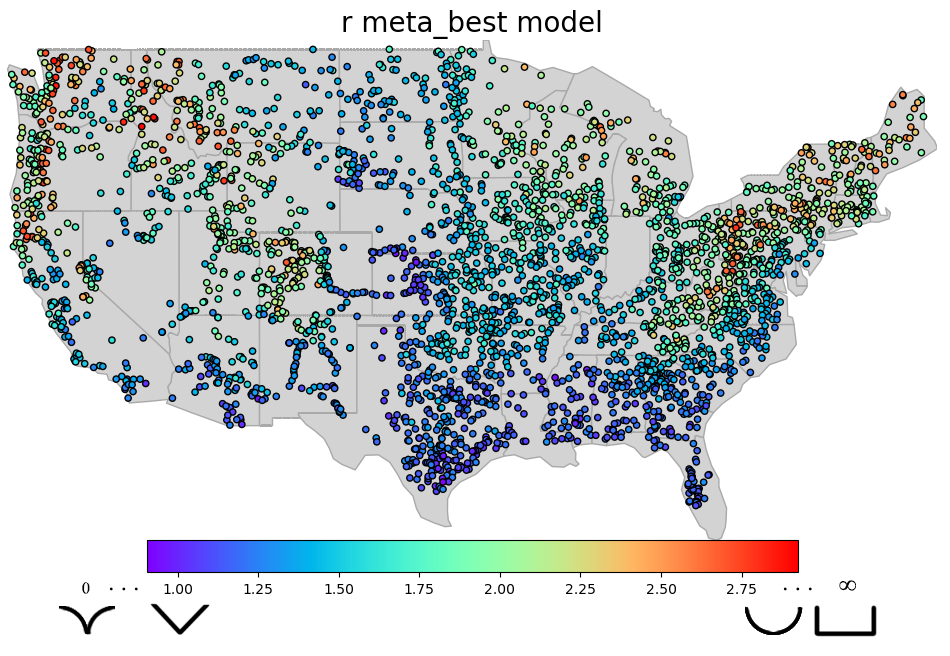

# Shape ($r$) — v1.0 Parameterization Overview

In 1D and 2D hydrodynamic routing models (such as **HEC-RAS** and the **NextGen National Water Model**), the cross-sectional shape of a river channel controls the relationship between water surface elevation, conveyance area, wetted perimeter, and mean velocity. In the **v1.0 ML Parameterization Framework**, channel cross-sectional geometry is continuously parameterized using the power-law formulation introduced by **Dingman (2007)**, derived directly from machine-learned hydraulic geometry exponents.

---

## The Missing Bathymetry Challenge

Standard Digital Elevation Models (DEMs), such as USGS 3DEP LiDAR and NED, are derived from airborne sensors that cannot penetrate the water surface during normal or baseflow conditions. Consequently, DEMs accurately capture subaerial floodplain topography but exhibit a **missing bathymetry gap** below the bankfull water surface.

Without accounting for submerged channel geometry, hydraulic models underestimate cross-sectional conveyance volume, leading to premature overbank flooding, distorted travel times, and inaccurate stage-discharge rating curves in FEMA Flood Insurance Studies (FIS) and continental Flood Inundation Mapping (FIM).

---

## Dingman Continuous Power-Law Formulation

Dingman (2007) parameterized symmetrical river cross-sections using a generalized continuous power-law function. The vertical height of the channel bed $z$ above the channel thalweg (assumed to occur at the channel centerline $x = 0$) is defined across the bankfull width $W^*$ as:

$$
z(x) = Y_m^* \cdot \left(\frac{2}{W^*}\right)^r \cdot x^r, \quad 0 \le x \le \frac{W^*}{2}
$$

where:

* $x$ is the lateral horizontal distance from the channel centerline ($0 \le x \le W^*/2$).
* $z(x)$ is the vertical bed elevation above the lowest point (thalweg) of the cross-section.
* $W^*$ is the bankfull top width.
* $Y_m^*$ is the maximum bankfull depth at the thalweg.
* $r$ is the dimensionless cross-sectional shape exponent ($0 < r < \infty$).

Alternatively, expressing local water depth $y(x)$ below the bankfull stage as a function of lateral coordinate $x \in [-W^*/2, W^*/2]$:

$$
y(x) = Y_m^* \left[1 - \left|\frac{2x}{W^*}\right|^r\right]
$$

### Morphological Spectrum of Exponent $r$

The dimensionless parameter $r$ defines the curvature of the channel bed and lateral bank steepness:

* **$r < 1.0$ (Convex)**: Channel bed slopes gently in the center and steepens outward, characteristic of shallow, unconfined multi-thread channels or compound bedrock sills.
* **$r = 1.0$ (Triangular / V-shaped)**: Steep V-shaped profile with zero flat bed width, typical of incised headwaters, gullies, and bedrock-confined canyons.
* **$r \approx 1.75$ (Lane Type B Stable Channel)**: The empirical threshold cross-section identified by Lane (1955) for stable alluvial channels in non-cohesive sediment under critical tractive force equilibrium.
* **$r = 2.0$ (Parabolic)**: Classical parabolic cross-section typical of equilibrium alluvial rivers in mobile gravel and sand-bed environments.
* **$r > 3.0$ (Flat-Bottomed / Trapezoidal)**: Steep vertical banks with a broad, flat bed, common in cohesive silt-clay lowland channels and urban floodways.
* **$r \to \infty$ (Rectangular / Box Channel)**: Vertical sidewalls and flat horizontal bed, characteristic of cohesive slot canyons, wooden flumes, and concrete canal conduits.

{ loading=lazy }

---

## Hydraulic Geometry Linkage: Connecting AHG to Exponent $r$

In the classical **At-a-station Hydraulic Geometry (AHG)** framework established by Leopold & Maddock (1953) and extended to **Feature Hydraulic Geometry (FHG)** by Johnson et al. (2023), channel width ($W$), mean depth ($Y$), and mean velocity ($V$) scale with discharge ($Q$) as power-law functions:

$$
W = a \cdot Q^b, \quad Y = c \cdot Q^f, \quad V = k \cdot Q^m
$$

subject to the physical continuity constraints:

$$
b + f + m = 1, \quad a \cdot c \cdot k = 1
$$

### Mathematical Derivation of $r = f / b$

For a power-law channel cross-section obeying $y(x) = Y_m^* [1 - |2x/W^*|^r]$, the top width $W(y)$ at any stage height $y$ above the bed expands according to:

$$
W(y) = W^* \cdot \left(\frac{y}{Y_m^*}\right)^{1/r}
$$

Differentiating the stage-discharge power laws with respect to discharge $Q$:

1. Lateral expansion rate: $W \propto Q^b \implies Q \propto W^{1/b}$
2. Vertical stage growth rate: $Y \propto Q^f \implies Q \propto Y^{1/f}$

Equating discharge relations reveals the stage-to-width power law:

$$
W \propto Y^{b/f} \iff Y \propto W^{f/b}
$$

Comparing exponents between Dingman's geometric power law ($W \propto y^{1/r}$) and the hydraulic geometry stage relation ($W \propto Y^{b/f}$) yields the exact fundamental physical relationship:

$$
\boxed{r = \frac{f}{b}}
$$

!!! note "Physical Significance of the Ratio $f / b$"
    * When **$f > b$** ($r > 1$): Vertical depth changes outpace lateral widening with increasing discharge. This occurs when channel banks are cohesive, vegetated, or laterally confined.
    * When **$b > f$** ($r < 1$): Lateral widening outpaces depth growth. This is characteristic of unconfined alluvial fans, arid braided rivers, and non-cohesive sandy washes.
    * When **$f \approx 2b$** ($r \approx 2$): The channel maintains an equilibrium parabolic geometry, matching standard alluvial regime theory.

---

## Analytical Geometry Properties

A major computational advantage of the continuous Dingman formulation is that key cross-sectional properties can be computed **analytically** without requiring discretized numerical cross-section integration:

| Geometric Parameter | Analytical Formula | $r=1.0$ (Triangle) | $r=1.75$ (Lane B) | $r=2.0$ (Parabola) | $r \to \infty$ (Rectangle) |
| :--- | :--- | :--- | :--- | :--- | :--- |
| **Bankfull Area ($A^*$)** | $A^* = \left(\frac{r}{r+1}\right) W^* Y_m^*$ | $0.500 \cdot W^* Y_m^*$ | $0.636 \cdot W^* Y_m^*$ | $0.667 \cdot W^* Y_m^*$ | $1.000 \cdot W^* Y_m^*$ |
| **Mean Hydraulic Depth ($\bar{Y}^*$)** | $\bar{Y}^* = \left(\frac{r}{r+1}\right) Y_m^*$ | $0.500 \cdot Y_m^*$ | $0.636 \cdot Y_m^*$ | $0.667 \cdot Y_m^*$ | $1.000 \cdot Y_m^*$ |
| **Cross-Sectional Shape Factor ($\lambda$)** | $\lambda = \frac{r}{r+1}$ | $0.500$ | $0.636$ | $0.667$ | $1.000$ |
| **Wetted Perimeter ($P^*$)** | $P^* \approx W^* + \frac{2r}{r+1} \frac{(Y_m^*)^2}{W^*}$ | $W^* + \frac{(Y_m^*)^2}{W^*}$ | $W^* + 1.273 \frac{(Y_m^*)^2}{W^*}$ | $W^* + 1.333 \frac{(Y_m^*)^2}{W^*}$ | $W^* + 2Y_m^*$ |
| **Hydraulic Radius ($R^*$)** | $R^* = \frac{A^*}{P^*}$ | $\frac{0.500 W^* Y_m^*}{W^* + (Y_m^*)^2/W^*}$ | $\frac{0.636 W^* Y_m^*}{W^* + 1.273 (Y_m^*)^2/W^*}$ | $\frac{0.667 W^* Y_m^*}{W^* + 1.333 (Y_m^*)^2/W^*}$ | $\frac{W^* Y_m^*}{W^* + 2Y_m^*}$ |

---

## Morphological Classification Summary

| Exponent Regime | Dominant Profile | Confinement & Bed Material | Hydrologic / Flow Regime | Geographic Settings |
| :--- | :--- | :--- | :--- | :--- |
| **$r < 1.0$** | **Convex / Composite** | Unconfined, non-cohesive gravels and coarse sands; low bank cohesion | High flashiness, ephemeral floods, wide lateral braiding | Arid Southwest washes, braided glacial outwash plains |
| **$1.0 \le r < 1.5$** | **Triangular / V-Shaped** | Bedrock-confined or colluvial boundaries; steep valley walls | Mountainous, high unit stream power, rapid runoff response | Cascade Range, Rocky Mountains, Appalachian headwaters |
| **$1.5 \le r \le 2.2$** | **Parabolic (Lane Type B)** | Cohesive-to-alluvial banks; mobile silt-sand bed equilibrium | Perennial humid-to-subhumid baseflow; balanced sediment load | Midwestern interior basins, Ohio River Valley, Southeast Piedmont |
| **$r > 2.2$** | **Trapezoidal / Rectangular** | High clay-silt bank cohesion; fine cohesive muds or engineered canals | Regulated low-gradient baseflow; low lateral erosion capacity | Mississippi Delta lowlands, Gulf Coastal Plain, urban corridors |

---

## Model Pipeline Navigation

* **[Model Architecture & Meta-Learners](models.md)** — Multi-tier machine learning framework, AutoEncoder feature reduction, and meta-learner stacking.
* **[Model Skill & Validation](skill.md)** — Continental validation against HYDRoSWOT ADCP surveys, Kling-Gupta Efficiency CDFs, and stream-order bias analysis.
* **[Explainability & Physical Controls (XAI)](xai.md)** — SHAP global importance ranking, hydroclimatic interaction plots, and geomorphic sensitivity analysis.
