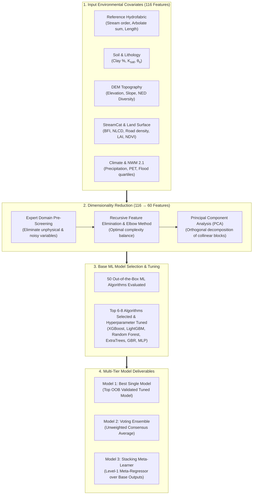

# Model Architecture — Machine Learning & Meta-Learners

Estimating the continuous Dingman channel shape exponent ($r$) across millions of ungauged river reaches requires an architecture that captures non-linear relationships across diverse physiographic, climatic, and geologic regimes. The **v1.0 Shape Modeling Pipeline** implements a multi-tier machine learning architecture that integrates expert knowledge screening, recursive feature elimination via the elbow method, Principal Component Analysis (PCA), tuned gradient-boosted ensembles, and a **Stacking Meta-Learner**.

---

## Machine Learning Framework Overview

---

## Multi-Tier Model Hierarchy

The modeling architecture produces three distinct model tiers, evaluating how ensemble combination strategies improve generalization over single best estimators:

### 1. Best Single Model (Top-Ranked Estimator)
Selected from out-of-bag (OOB) cross-validation benchmarks among 50 candidate algorithms. The winning individual estimator (typically a heavily regularized **XGBoost** or **LightGBM** regressor) undergoes fine-grained Bayesian hyperparameter optimization.

### 2. Voting Ensemble (Consensus Model)
Combines predictions from the top 6–8 hyperparameter-tuned algorithms via an unweighted arithmetic consensus:

$$
\hat{r}_{\text{vote}} = \frac{1}{M} \sum_{m=1}^M \hat{r}_m
$$

where $M$ is the number of constituent base learners ($M \in [6, 8]$). By averaging independent model outputs, the voting ensemble dampens variance and mitigates localized overfitting.

### 3. Stacking Meta-Learner (Level-1 Super Learner)
A meta-learner operates **one hierarchical level above** the base estimators. Rather than learning directly from raw physical catchment features, the meta-learner is trained on the out-of-fold prediction matrices generated by the top base models:

$$
\hat{r}_{\text{meta}} = \mathcal{G}\left(\hat{r}_1(X), \hat{r}_2(X), \dots, \hat{r}_M(X); \Theta_{\text{meta}}\right)
$$

The meta-learner recognizes the specific hydro-physiographic conditions where certain base models excel or falter (e.g., neural networks in high-density humid networks versus tree-based models in arid ephemeral washes), dynamically reweighting model contributions to maximize continental Kling-Gupta Efficiency ($\text{KGE}$).

---

## Feature Space & Dimensionality Reduction

The raw input dataset incorporates 116 catchment, climate, and topographic attributes. To prevent the curse of dimensionality, resolve multicollinearity, and eliminate noisy predictors, feature reduction is executed in three coupled stages:

### 1. Expert Knowledge Screening
Candidate predictors are evaluated against established geomorphological and hydraulic principles. Non-informative, unstable, or redundant surrogates are eliminated prior to model training.

### 2. Recursive Feature Elimination & Elbow Method
The model is trained across subsets of candidate features ranked by importance. Features are recursively dropped while tracking validation metrics ($\text{KGE}$, $\text{NNSE}$). The **Elbow Method** is applied to find the optimal trade-off point between model parsimony and predictive skill.

### 3. Principal Component Analysis (PCA)
For thematic sub-domains exhibiting high internal correlation (e.g., multi-recurrence flood frequency distributions, soil textural profiles), **Principal Component Analysis (PCA)** is performed to extract orthogonal components (PC0, PC1) that preserve dominant physical variance while eliminating multicollinearity:

$$
\mathbf{Z} = \mathbf{X} \mathbf{W}
$$

This produces the final parsimonious matrix of **60 optimized predictors** for continental ML training.

---

## Input Feature Groups

| Category | Key Variables | Physical & Morphological Significance |
| :--- | :--- | :--- |
| **Reference Hydrofabric** | `streamorde`, `arbolatesu`, `lengthkm`, `pathlength`, `roughness`, `streamleve` | Modified Strahler stream order, cumulative upstream flowline length (Arbolate sum), reach length, mainstem path length to sink, and baseline Manning's roughness. Defines network scale and transport distance. |
| **Soil Properties** | `clay_mean_0_5`, `ksat_mean_0_5`, `theta_s_mean_0_5` | Topsoil clay percentage ($0\text{--}5\text{ cm}$), effective saturated hydraulic conductivity ($K_{\text{sat}}$, $\text{cm/hr}$), and saturated water content ($\theta_s$, $\text{cm}^3/\text{cm}^3$). Controls bank cohesion, infiltration capacity, and bank stability against lateral fluvial erosion. |
| **DEM Topography** | `elevation`, `slope`, NED Physiographic Diversity | Reach-scale bed slope, elevation (m NAVD88), and regional topographic complexity index. Governs valley confinement, gravitational shear stress, and channel incision gradients. |
| **StreamCat Indicators** | `BFI`, `NLCD` classes, road density | Baseflow Index (groundwater-fed vs runoff-dominated regime), land-cover distribution (forested, wetland, cultivated), and urban infrastructure density. |
| **Land Surface & Remote Sensing** | `LAI`, `NDVI`, soil moisture (`SM_mean`, `SM_max`) | Leaf Area Index, Normalized Difference Vegetation Index, and long-term soil moisture profiles. Proxies for riparian root reinforcement and evapotranspirative demand. |
| **Hydroclimate** | Precipitation, PET, Mean Temperature | Long-term annual and seasonal precipitation depth, potential evapotranspiration, and temperature extremes. Drives hydrological water balance and runoff generation. |
| **NWM 2.1 Simulations** | Flow quartiles, flood frequencies | Modeled streamflow distribution quantiles ($Q_{10}, Q_{50}, Q_{90}$) and return-period flood magnitudes ($Q_{1.5}, Q_{2}, Q_{10}$) from the National Water Model retrospective reanalysis. |

---

## Overfitting Prevention & Cross-Validation Protocol

To guarantee model generalizability across 3.5+ million reaches in CONUS, the training pipeline enforces four strict regularization safeguards:

1. **10-Fold Cross-Validation**:
   The 3,543 HYDRoSWOT field stations across 1,432 distinct river systems are partitioned across 10 folds, evaluating predictions strictly out-of-fold (OOF) to test generalization to unmonitored reaches.
2. **Early Stopping with Validation Plateaus**:
   Iterative gradient boosting and deep learning models monitor a dedicated holdout validation split, halting training when validation loss fails to improve after 20 consecutive iterations.
3. **Deep Learning Dropout & Weight Decay**:
   Neural architectures incorporate dropout rates ($p = 0.2\text{--}0.4$) and $L_2$ weight decay regularization on dense layers.
4. **ADCP Quality Thresholding ($R^2 \ge 0.8$)**:
   To prevent noisy or poorly rated field measurements from degrading the ML loss landscape, only ADCP stations with a coefficient of determination $R^2 \ge 0.8$ across measured stage-discharge pairs are ingested into training.

---

## Model Pipeline Navigation

* **[Overview & Dingman Geometry](index.md)** — Fundamentals of continuous channel power-law geometry and $r = f/b$ derivation.
* **[Model Skill & Validation](skill.md)** — Empirical validation against field observations, CDF comparisons, and regional diagnostic maps.
* **[Explainability (XAI)](xai.md)** — SHAP global feature attributions, soil moisture sensitivity, and geomorphic control mechanisms.
