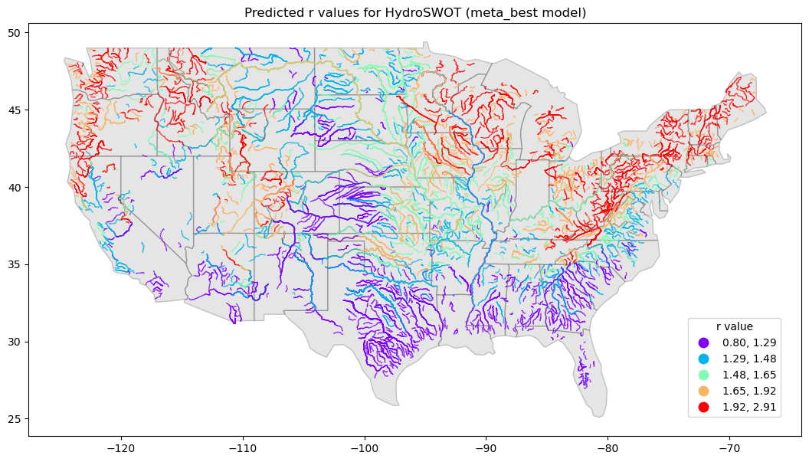
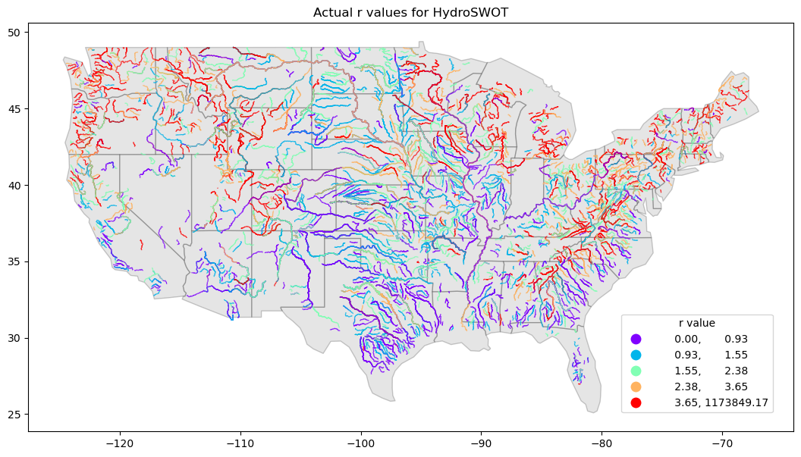
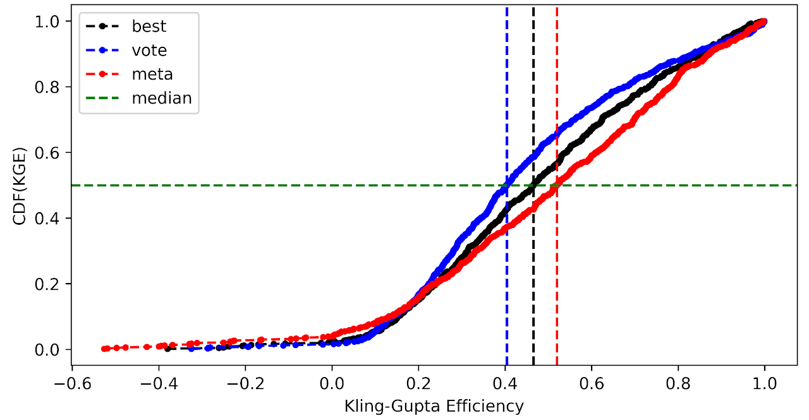
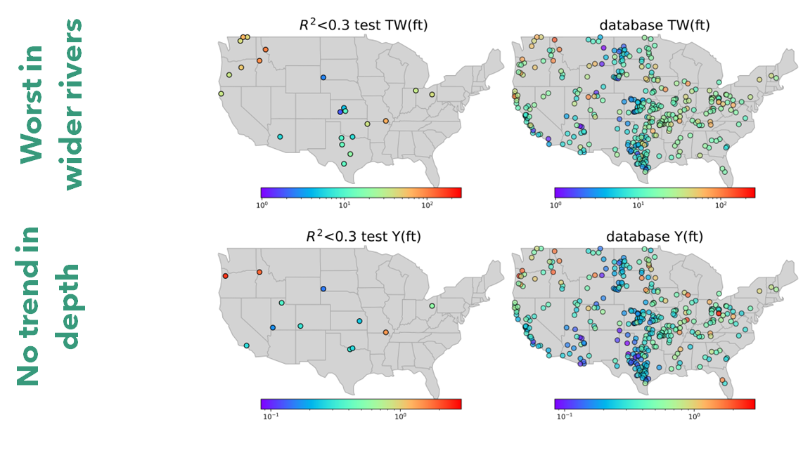
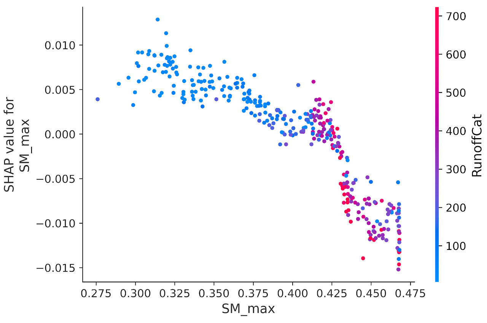

# Model Skill & Validation — Channel Shape ($r$)

Model evaluation for the **v1.0 Channel Shape ($r$) Parameterization** is conducted using the USGS **HYDRoSWOT** acoustic Doppler current profiler (ADCP) database across 3,543 field monitoring stations spanning 1,432 distinct river systems across the Contiguous United States (CONUS).

---

## Continental Predicted Channel Shape Map

The v1.0 Meta-Learner generates reach-level predictions of the Dingman shape exponent $r$ across the entire Reference Fabric network:

{ loading=lazy }

The continental distribution of predicted $r$ values reflects distinct hydro-physiographic and geomorphic regimes across 5 quantile intervals:

| Quantile Class | Exponent Range ($r$) | Primary Geographic Regions | Fluvial & Hydraulic Characteristics |
| :--- | :--- | :--- | :--- |
| **Purple** | $[0.80, 1.29]$ | Intermountain West, Cascade Range, Rocky Mountains, arid Southwest washes, Appalachian ridges | Steep bedrock-confined gorges, incised headwaters, and ephemeral washes. High bed-to-bank slope gradients drive triangular-to-convex profiles ($r \approx 1$). |
| **Cyan** | $(1.29, 1.48]$ | Mountain foothills, Ozark Plateau, New England uplands | Transitional gravel-bed streams with moderate lateral confinement and moderate bank vegetation. |
| **Pale Green** | $(1.48, 1.65]$ | Upper Midwest interior plains, Piedmont transitional valleys | Mixed alluvial channels with moderate silt-clay bank cohesion transitioning toward regime equilibrium. |
| **Orange** | $(1.65, 1.92]$ | Corn Belt, Ohio River Basin, lower Missouri tributaries | Stable alluvial threshold channels aligning with **Lane Type B ($r \approx 1.75$)** and near-parabolic geometries ($r \approx 1.8\text{--}1.9$). |
| **Red** | $(1.92, 2.91]$ | Lower Mississippi Alluvial Valley, Gulf Coastal Plain, Mid-Atlantic lowlands | High clay-silt cohesion banks, low channel slopes, and broad floodplains. Parabolic to flat-bottomed trapezoidal channels ($r \ge 2.0$). |

---

## Observed vs. Predicted Validation Distributions

Evaluating the machine learning predictions against ground truth measurements reveals how the model regularizes raw empirical fits into physically stable parameters:

-   ### Observed Field Distribution
    { loading=lazy }
    Raw station fits derived from unconstrained AHG equations ($r = f/b$) exhibit high variance, with values ranging from near-zero to $> 10^5$ at locations with near-vertical sidewalls.

-   ### Model Predicted Distribution
    { loading=lazy }
    The v1.0 Meta-Learner regularizes predicted shape exponents into a robust physical range ($r \in [0.8, 3.0]$), preserving natural spatial gradients while eliminating numerical singularities.

!!! note "Physical Regularization of Upper-Bound Shape Exponents"
    In raw field data, a channel with nearly vertical banks produces an extremely small width exponent ($b \to 0$), driving the unconstrained mathematical ratio $r = f/b$ to astronomical values ($r > 10^4$). 
    
    However, as Dingman (2007) demonstrated, the geometric profile difference between $r = 4.0$ and $r = 100,000$ is negligible (both represent essentially flat-bottomed rectangular box channels). By constraining predictions within $0.8 \le r \le 3.0$, the ML model avoids catastrophic numerical instabilities in hydrodynamic solvers while preserving the exact hydraulic conveyance and hydraulic radius properties.

---

## Meta-Learner Skill Benchmark (KGE CDF Analysis)

The performance of the three modeling tiers was benchmarked across all independent testing stations using the **Kling-Gupta Efficiency ($\text{KGE}$)**:

{ loading=lazy }

### Quantitative Performance Metrics Comparison

| Model Architecture | CDF Line | Median KGE (50th Percentile) | Benchmark Description |
| :--- | :---: | :---: | :--- |
| **Voting Ensemble (`vote`)** | Blue (dashed line) | **$0.41$** | Unweighted average of top tuned algorithms |
| **Best Single Model (`best`)** | Black (dashed line) | **$0.47$** | Winning individual tuned algorithm (XGBoost) |
| **Stacking Meta-Learner (`meta`)** | Red (dashed line) | **$0.52$** | **Level-2 meta-regressor trained on out-of-fold predictions** |

### Key Benchmark Insights:
1. **Meta-Learner Superiority**: The Stacking Meta-Learner (red curve) shifts the entire CDF to the right, achieving a **median KGE of 0.52**, outperforming both the single best base model ($\text{KGE} = 0.47$) and the simple voting ensemble ($\text{KGE} = 0.41$).
2. **Failure Suppression in Low-Skill Reaches**: In the lower tail ($\text{KGE} < 0.2$), the meta-learner sharply reduces extreme negative errors by selectively relying on resilient tree-based estimators when neural networks encounter out-of-distribution inputs.
3. **Voting Dilution Effect**: The simple voting ensemble exhibits lower median skill than the single best model, because unweighted averaging allows weaker sub-models to dilute the high-precision predictions of top gradient-boosted trees. The meta-learner overcomes this limitation through adaptive non-linear weighting.

---

## Downstream Scale Trends & Predictive Bias

Diagnostic analysis across continental network scales identifies how measurement sample density influences prediction accuracy:

{ loading=lazy }

### Diagnostic Interpretations:

1. **Width Sensitivity in Large Mainstems ("Worst in wider rivers")**:
   * The top-left panel highlights stations with low predictive skill ($R^2 < 0.3$ for top width $\text{TW}$).
   * These low-performing sites are concentrated on very wide rivers ($W^* > 100\text{ m}$) where the HYDRoSWOT training database contains sparse observations. In contrast, medium-to-small channels ($W^* < 50\text{ m}$) exhibit dense clustering and high predictive accuracy ($R^2 > 0.7$).
2. **Scale-Invariant Depth Predictability ("No trend in depth")**:
   * The bottom row evaluates prediction skill for bankfull depth ($Y$).
   * Low-skill stations ($R^2 < 0.3$) are uniformly and sparsely distributed with **no systematic scale or geographic bias**. Depth scaling ($Y \propto Q^f$) remains consistent from 1st-order headwaters to 9th-order continental trunk rivers.

---

## Geomorphic Scaling & Sensitivity Analysis

Evaluating shape exponent sensitivity against hydroclimatic forcing confirms that the model captures physical regime boundaries:

{ loading=lazy }

* **Arid / Flashy Regimes**: Low maximum soil moisture ($\text{SM}_{\max} < 0.35$) and low catchment runoff ($\text{RunoffCat} < 150\text{ mm}$, blue cluster) consistently produce positive SHAP contributions, reinforcing wider, flatter channel morphologies.
* **Humid / Vegetated Regimes**: High soil moisture ($\text{SM}_{\max} > 0.42$) and heavy runoff ($\text{RunoffCat} > 450\text{ mm}$, pink/red cluster) drive strong negative SHAP contributions, reflecting deep, cohesive parabolic channels held stable by dense root networks.

---

## Model Pipeline Navigation

* **[Overview & Dingman Geometry](index.md)** — Fundamentals of continuous channel power-law geometry and $r = f/b$ derivation.
* **[Model Architecture & Meta-Learners](models.md)** — Machine learning workflows, elbow method & PCA feature reduction, and stacking algorithms.
* **[Explainability (XAI)](xai.md)** — SHAP feature ranking, environmental driver attribution, and physical control mechanisms.
