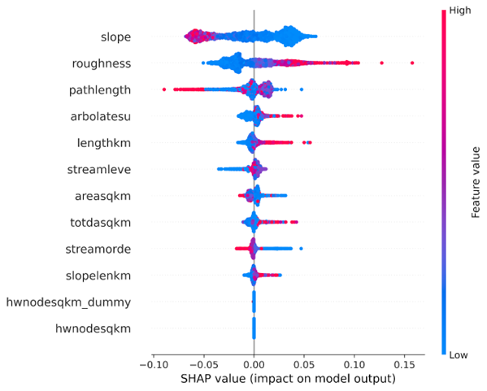
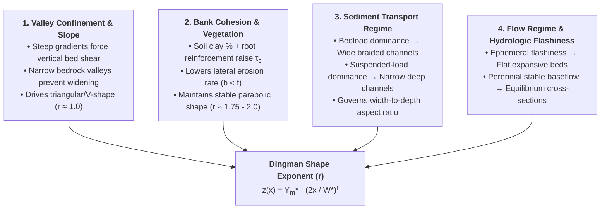

# Explainable AI (XAI) & Physical Controls

To ensure that the **v1.0 Channel Shape ($r$) Model** aligns with established principles of fluvial geomorphology and hydraulic regime theory, we apply **SHAP (SHapley Additive exPlanations)** based on cooperative game theory. SHAP attributions decompose model predictions into individual feature contributions, revealing how catchment, climate, and hydrographic factors govern cross-sectional curvature across the continental river network.

---

## Global Feature Attribution (SHAP Beeswarm Ranking)

The SHAP summary beeswarm plot ranks the most influential predictors governing the shape exponent $r$:

{ loading=lazy }

### Detailed Feature Attribution Analysis:

| Rank | Feature Name | Description | SHAP Directionality & Physical Mechanism |
| :---: | :--- | :--- | :--- |
| **1** | `slope` | Reach-scale bed slope | **Strongest Predictor**. High reach slope (pink/red dots) exerts a strong negative SHAP impact ($\text{SHAP} \in [-0.07, -0.01]$), forcing $r$ down toward **$r \approx 1.0$ (triangular / V-shaped)** in steep mountainous valleys where vertical incision outpaces lateral widening. Low slope (blue dots) drives positive SHAP impact ($\text{SHAP} \in [+0.01, +0.05]$), promoting **$r \ge 2.0$ (parabolic to flat-bottomed)** channels in depositional lowlands. |
| **2** | `roughness` | Baseline channel Manning's $n$ | High boundary roughness (pink/red dots) pushes SHAP values positive ($\text{SHAP} \in [+0.02, +0.13]$). Higher boundary resistance retards near-bank velocities and dissipates kinetic energy, stabilizing wider bedforms and increasing the exponent $r$. |
| **3** | `pathlength` | Flow distance to sink / ocean | High pathlength values (pink/red dots) produce negative SHAP impacts. Reaches located far inland or in steep headwater origins maintain narrower, confined cross-sections. |
| **4** | `arbolatesu` | Cumulative upstream flowline length (Arbolate sum, km) | High arbolate sum (pink/red dots) produces positive SHAP contributions ($\text{SHAP} \in [+0.01, +0.06]$). Mature, well-integrated drainage networks develop extensive alluvial plains and stable parabolic profiles. |
| **5** | `lengthkm` | Flowline reach length (km) | Longer flowline segments correlate with lower-gradient alluvial reaches, exerting positive SHAP influence on channel curvature. |
| **6** | `streamleve` | Hierarchical stream level | Differentiates mainstem river trunks from minor tributaries, controlling the cross-sectional capacity and flood wave attenuation dynamics. |
| **7** | `areasqkm` | Local catchment area ($\text{km}^2$) | Captures lateral hillslope contribution and localized tributary discharge increments along the reach. |
| **8** | `totdasqkm` | Total upstream contributing area ($\text{km}^2$) | Upstream drainage area governs total bankfull discharge volume ($Q^* \propto A^{0.75}$), shifting channels from steep headwater V-notches to wide lowland profiles. |
| **9** | `streamorde` | Modified Strahler stream order | High stream orders (mainstem rivers) systematically exhibit positive SHAP attributions, reflecting higher width-to-depth ratios and flatter bed geometry. |
| **10** | `slopelenkm` | Slope-length interaction product | Captures reach-level gravitational potential energy and stream power gradient. |
| **11** | `hwnodesqkm` | Headwater node drainage metric | Identifies first-order unbranched headwater reaches where colluvial processes and debris supply dominate channel cross-sectional form. |

---

## Sensitivity & Hydroclimatic Interaction Analysis

Fluvial cross-sectional shape is strongly governed by the non-linear interaction between soil moisture conditions, riparian vegetation, and catchment runoff volume:

{ loading=lazy }

 High soil moisture ($\text{SM}_{\max} > 0.42$) and heavy runoff ($\text{RunoffCat} > 450\text{ mm}$, pink/red cluster) drive strong negative SHAP contributions, reflecting deep, cohesive parabolic channels.

---

## Physical Controls on River Channel Shape

The XAI results confirm that the machine learning models have learned physical geomorphic dynamics rather than spurious statistical correlations:

### 1. Valley Confinement & Topographic Gradient
In headwaters and montane gorges, high bedrock confinement physically restricts lateral channel widening. Flow energy is concentrated vertically along the bed, driving downcutting and enforcing a triangular V-notch cross-section ($r \approx 1.0$).

### 2. Geotechnical Bank Cohesion & Critical Shear Stress
In alluvial plains, channel cross-sectional form reflects the balance between boundary shear stress ($\tau_0 = \gamma R S$) and the critical erodibility of bank materials ($\tau_c$). High soil moisture and clay content increase bank cohesion, allowing channels to maintain steeper sidewalls without geotechnical slumping.

---

## Model Pipeline Navigation

* **[Overview & Dingman Geometry](index.md)**: Fundamentals of continuous channel power-law geometry and $r = f/b$ derivation.
* **[Model Architecture & Meta-Learners](models.md)**: Machine learning workflows, elbow method & PCA feature reduction, and stacking algorithms.
* **[Model Skill & Validation](skill.md)**: Continental validation against HYDRoSWOT ADCP surveys, Kling-Gupta Efficiency CDFs, and stream-order bias analysis.
