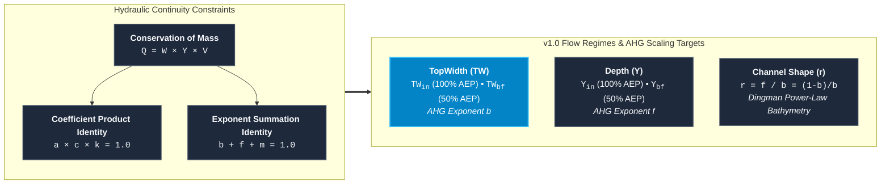
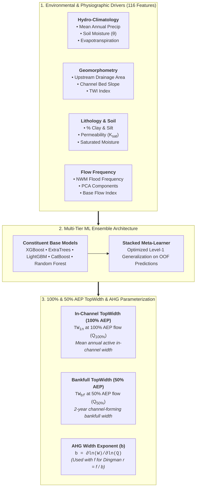
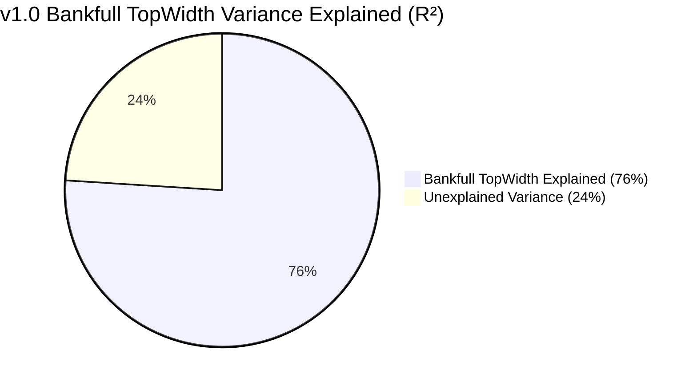

# TopWidth: Continental Channel Width Parameterization

River channel top width ($W$ or $\text{TW}$) is the primary horizontal dimension governing open channel conveyance, stage-discharge dynamics, hydraulic radius, and sediment transport capacity. In hydrological and hydrodynamic modeling frameworks such as the NOAA National Water Model (NWM), NextGen Water Resources Modeling Framework, and FEMA Flood Inundation Mapping (FIM) accurate cross sectional geometry is required for millions of kilometers of ungaged river reaches across the Continental United States (CONUS).

However, high-resolution digital elevation models (DEMs) and LiDAR data cannot penetrate beneath water surfaces, creating a pervasive **missing sub-surface bathymetry** problem. The **v1.0 TopWidth model** resolves this challenge by combining **At Station Hydraulic Geometry (AHG)** with advanced ensemble machine learning to predict both continuous in-channel width and bankfull channel width across CONUS river networks ([Modaresi Rad et al., 2024](https://doi.org/10.1029/2024JH000173)).

---

## Theoretical Foundation: At Station Hydraulic Geometry (AHG)

### Classical Hydraulic Geometry Framework

Classical at-a-station hydraulic geometry (AHG) and downstream hydraulic geometry (DHG), pioneered by [Leopold & Maddock (1953)](https://pubs.usgs.gov/pp/0252/report.pdf), establish that channel width ($W$), mean depth ($Y$), and cross-sectional mean velocity ($V$) scale with discharge ($Q$) via empirical power-law relationships:

$$\begin{aligned}
W &= a \cdot Q^b \\
Y &= c \cdot Q^f \\
V &= k \cdot Q^m
\end{aligned}$$

where:

* $a, c, k$ are the hydraulic geometry coefficients representing width, depth, and velocity at unit discharge ($Q = 1$).
* $b, f, m$ are the dimensionless scaling exponents governing the rate of geometric and kinematic expansion as discharge varies.

### Physical Constraints & Continuity Relations

Conservation of mass dictates that total discharge equals the product of top width, mean depth, and mean cross-sectional velocity ($Q = W \cdot Y \cdot V$). Substituting the power-law equations yields the fundamental continuity identities:

$$Q = (a \cdot Q^b) \cdot (c \cdot Q^f) \cdot (k \cdot Q^m) = (a \cdot c \cdot k) \cdot Q^{b + f + m}$$

For mass conservation to hold unconditionally across all discharge regimes:

$$a \cdot c \cdot k = 1.0 \quad \text{and} \quad b + f + m = 1.0$$

### From AHG to Feature Hydraulic Geometry (FHG)

While classical AHG applies only to individual gaged cross-sections, **Feature Hydraulic Geometry (FHG)** ([Johnson et al., 2023](https://doi.org/10.22541/au.167093222.95689047/v1); [Modaresi Rad et al., 2024](https://doi.org/10.1029/2024JH000173)) bridges localized at-a-station dynamics and continental-scale downstream scaling. FHG learns functional relationships between holistic catchment attributes (hydro-climate, terrain morphometry, lithology, and soils) and the hydraulic coefficients ($a, b$) to infer width across ungaged reaches.

---

## Two Regimes: In-Channel (100% AEP) vs. Bankfull (50% AEP) TopWidth

The v1.0 framework models channel top width under two distinct flow regimes defined by USGS NWIS flood frequency annual exceedance probabilities:

| Dimension | Governing Discharge | Hydrologic Definition | Training Data Derivation |
| :--- | :--- | :--- | :--- |
| **In-Channel Width ($TW_{\text{in}}$)** | **100% AEP Discharge ($Q_{\text{100\% AEP}}$)** | 1-year recurrence interval / mean annual flow within active banks. | Extracted directly from USGS HYDRoSWOT ADCP stage-discharge rating curves at the 100% AEP flow threshold. |
| **Bankfull Width ($TW_{\text{bf}}$)** | **50% AEP Discharge ($Q_{\text{50\% AEP}}$)** | 2-year recurrence interval ($Q_2$) channel-forming bankfull flow. | Extracted directly from USGS HYDRoSWOT ADCP stage-discharge rating curves at the 50% AEP flow threshold. |

The ML ensemble directly learns and predicts both **$TW_{\text{in}}$** (at 100% AEP) and **$TW_{\text{bf}}$** (at 50% AEP) across all CONUS reaches. In parallel, continuous At-a-station Hydraulic Geometry (AHG) power laws are fitted to the multi-flow ADCP soundings to extract the width scaling exponent $b$, which is coupled with depth exponent $f$ exclusively to derive the Dingman cross-sectional shape parameter ($r = f/b$).

!!! info "Operational Hydrologic Significance"
    * **In-Channel Width ($TW_{\text{in}}$ at 100% AEP)** directly determines baseflow wetted perimeter, in-stream aquatic habitat, and sub-grid channel storage during routine non-flood hydrologic routing.
    * **Bankfull Width ($TW_{\text{bf}}$ at 50% AEP)** defines the conveyance capacity threshold before overbank spill, controlling the onset of floodplain inundation for FEMA Flood Insurance Studies (FIS) and NextGen FIM.

---

## Continental Mapping Across CONUS

The trained ensemble pipeline was applied to the entire High-Resolution Reference Fabric dataset, generating reach-level predictions for over **2.7 million COMID stream reaches** across CONUS.

{ loading=lazy }
*Figure 1: Continental reach scale predictions of river top width mapped across Reference Fabric flowlines in the Continental United States (CONUS).*

The continental map captures clear macro-geomorphic patterns:

* **Headwater Streams (Orders 1–3)**: Narrow channels ($W < 5\text{ m}$) strongly confined by valley topography and bedrock boundaries in the Appalachian Highlands and Rocky Mountains.
* **Transitional Alluvial Networks (Orders 4–6)**: Progressively widening active channels ($W \approx 15 - 60\text{ m}$) across the Interior Plains and Gulf Coastal Plain.
* **Lowland Trunk Rivers (Orders 7–10)**: Expansive alluvial corridors ($W > 150 - 500\text{ m}$) along the Mississippi, Ohio, Missouri, and Columbia river systems.

---

## Key Performance Summary

Across rigorous out-of-fold spatial cross-validation and independent ADCP field benchmarks, the v1.0 TopWidth pipeline achieves exceptional predictive accuracy:

$$\text{In-Channel TopWidth (100\% AEP): } R^2 = 0.66, \quad \text{KGE} = 0.66, \quad \text{NRMSE} = 0.08$$

$$\text{Bankfull TopWidth (50\% AEP): } R^2 = 0.76, \quad \text{KGE} = 0.78, \quad \text{NRMSE} = 0.05$$

### Major Scientific & Operational Milestones

1. **Elimination of Regional Discontinuities**: Traditional regional regression equations (e.g., [Blackburn-Lynch et al., 2017](https://doi.org/10.1111/1752-1688.12567)) produce artificial boundary jumps at political and watershed divides. The v1.0 ML model provides seamless, hydro-climatically driven reach predictions across all 20 Hydrologic Landscape Regions (HLRs).
2. **Superior Benchmarking**: The proposed model substantially outperforms classical global discharge equations ([Andreadis et al., 2013](https://doi.org/10.1002/wrcr.20440)), global drainage area equations ([Frasson et al., 2019](https://doi.org/10.1029/2019WR025345)), and modern machine learning models ([Doyle et al., 2023](https://doi.org/10.1029/2022WR033621)).
3. **Physical Explainability via TreeSHAP**: Interpretability analysis confirms that predictions are governed by physically sound drivers including bankfull discharge ($Q_{bf}$), flood frequency PC0, Topographic Wetness Index (TWI), and root-stabilizing soil moisture ($\theta$).

---

## Section Navigation

Explore the technical details of the v1.0 TopWidth modeling framework:

-   :material-cpu-64-bit:{ .lg .middle } **[Model Architecture & Tuning](models.md)**

    ---

    Base algorithms (XGBoost, ExtraTrees, LightGBM, CatBoost, RF), stacked meta-learner design, target transformations, and feature selection.

    [:octicons-arrow-right-24: Explore Model Pipeline](models.md)

-   :material-chart-box-outline:{ .lg .middle } **[Model Skill & Validation](skill.md)**

    ---

    In-channel and bankfull Goodness-of-Fit (NNSE, $R^2$, KGE), quantile diagnostics, and benchmarks against Blackburn-Lynch, Bieger, and Doyle.

    [:octicons-arrow-right-24: View Performance Metrics](skill.md)

-   :material-lightbulb-on-outline:{ .lg .middle } **[Explainability (XAI)](xai.md)**

    ---

    Global TreeSHAP feature importance rankings, local explanations, and physical dependency analyses (TWI, soil moisture, flood frequency).

    [:octicons-arrow-right-24: Inspect Geomorphic Drivers](xai.md)

