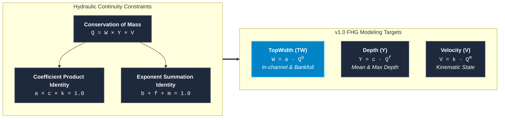
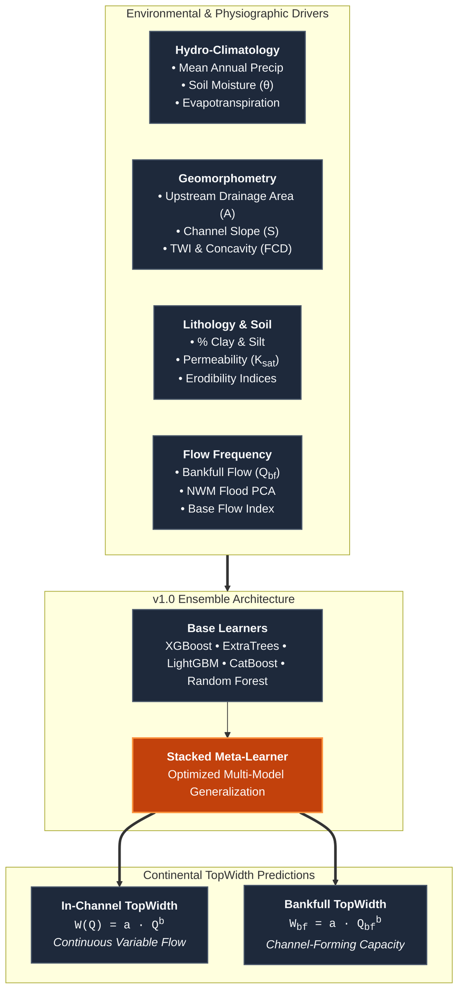
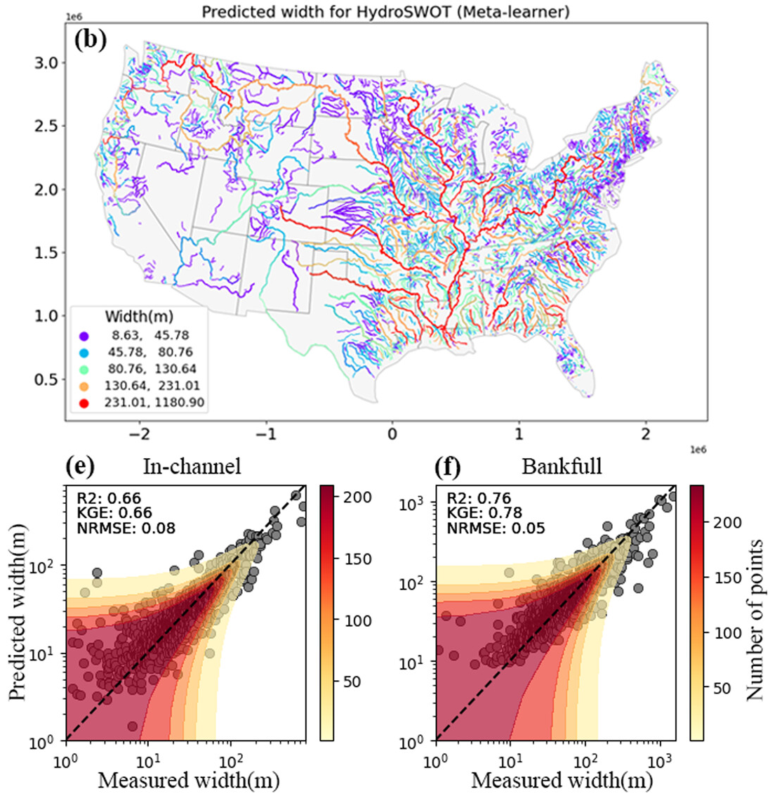
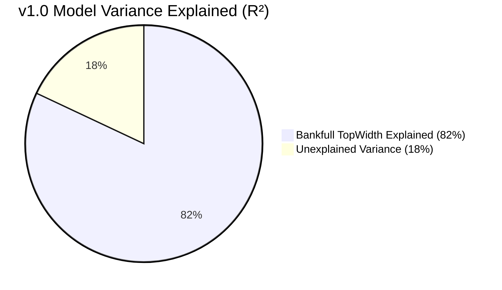

# TopWidth: Continental Channel Width Parameterization (v1.0)

River channel top width ($W$ or $\text{TW}$) is the primary horizontal dimension governing open-channel conveyance, stage-discharge dynamics, hydraulic radius, and sediment transport capacity. In hydrological and hydrodynamic modeling frameworks—such as the NOAA National Water Model (NWM), NextGen Water Resources Modeling Framework, and FEMA Flood Inundation Mapping (FIM)—accurate cross-sectional geometry is required for millions of kilometers of ungaged river reaches across the Continental United States (CONUS).

However, high-resolution digital elevation models (DEMs) and LiDAR data cannot penetrate beneath water surfaces, creating a pervasive **missing sub-surface bathymetry** problem. The **v1.0 TopWidth model** resolves this challenge by combining **Feature Hydraulic Geometry (FHG)** with advanced ensemble machine learning to predict both continuous in-channel width and bankfull channel width across CONUS river networks ([Modaresi Rad et al., 2024](https://doi.org/10.1029/2024JH000173)).

---

## Theoretical Foundation: Feature Hydraulic Geometry (FHG)

### Classical Hydraulic Geometry Framework

Classical at-a-station hydraulic geometry (AHG) and downstream hydraulic geometry (DHG), pioneered by [Leopold & Maddock (1953)](https://pubs.usgs.gov/pp/0252/report.pdf), establish that channel width ($W$), mean depth ($Y$), and cross-sectional mean velocity ($V$) scale with discharge ($Q$) via empirical power-law relationships:

$$\begin{aligned}
W &= a \cdot Q^b \\
Y &= c \cdot Q^f \\
V &= k \cdot Q^m
\end{aligned}$$

where:

* $a, c, k$ are the hydraulic geometry coefficients representing width, depth, and velocity at unit discharge ($Q = 1$).
* $b, f, m$ are the dimensionless scaling exponents governing the rate of geometric and kinematic expansion as discharge varies.

### Physical Constraints & Continuity Relations

Conservation of mass dictates that total discharge equals the product of top width, mean depth, and mean cross-sectional velocity ($Q = W \cdot Y \cdot V$). Substituting the power-law equations yields the fundamental continuity identities:

$$Q = (a \cdot Q^b) \cdot (c \cdot Q^f) \cdot (k \cdot Q^m) = (a \cdot c \cdot k) \cdot Q^{b + f + m}$$

For mass conservation to hold unconditionally across all discharge regimes:

$$a \cdot c \cdot k = 1.0 \quad \text{and} \quad b + f + m = 1.0$$

### From AHG to Feature Hydraulic Geometry (FHG)

While classical AHG applies only to individual gaged cross-sections, **Feature Hydraulic Geometry (FHG)** ([Johnson et al., 2023](https://doi.org/10.22541/au.167093222.95689047/v1); [Modaresi Rad et al., 2024](https://doi.org/10.1029/2024JH000173)) bridges localized at-a-station dynamics and continental-scale downstream scaling. FHG learns functional relationships between holistic catchment attributes (hydro-climate, terrain morphometry, lithology, and soils) and the hydraulic coefficients ($a, b$) to infer width across ungaged reaches.

---

## Two Regimes: In-Channel vs. Bankfull Width

The v1.0 framework models channel top width under two distinct hydrologic states:

| Dimension | Governing Equation | Hydrologic Role | Data Source & Calibration |
| :--- | :--- | :--- | :--- |
| **In-Channel Width ($W$)** | $W(Q) = a \cdot Q^b$ | Continuous time-varying water surface width under baseflow, median, and sub-bankfull flows. | Calibrated against thousands of multi-flow Acoustic Doppler Current Profiler (ADCP) field surveys from the USGS HYDRoSWOT database. |
| **Bankfull Width ($W_{bf}$)** | $W_{bf} = a \cdot Q_{bf}^b$ | Maximum top width of the active channel prior to floodplain inundation (channel-forming discharge $Q_{bf} \approx Q_{1.5}$). | Coupled with 1.5-year recurrence flood statistics simulated by the National Water Model (NWM 2.1). |

!!! info "In-Channel vs. Bankfull Significance"
    * **In-Channel Width ($W$)** directly determines low-flow wetted habitat, baseflow travel times, and sub-grid storage for continuous hydrological routing.
    * **Bankfull Width ($W_{bf}$)** defines channel conveyance limits, the onset threshold of floodplain overbank flow, and boundary shear stress distributions during flood events.

---

## Continental Mapping Across CONUS

The trained ensemble pipeline was applied to the entire High-Resolution National Hydrography Dataset (NHDPlusV2), generating reach-level predictions for over **2.7 million COMID stream reaches** across CONUS.

{ loading=lazy }
*Figure 1: Continental reach-scale predictions of river top width mapped across NHDPlusV2 flowlines in the Continental United States (CONUS).*

The continental map captures clear macro-geomorphic patterns:

* **Headwater Streams (Orders 1–3)**: Narrow channels ($W < 5\text{ m}$) strongly confined by valley topography and bedrock boundaries in the Appalachian Highlands and Rocky Mountains.
* **Transitional Alluvial Networks (Orders 4–6)**: Progressively widening active channels ($W \approx 15 - 60\text{ m}$) across the Interior Plains and Gulf Coastal Plain.
* **Lowland Trunk Rivers (Orders 7–10)**: Expansive alluvial corridors ($W > 150 - 500\text{ m}$) along the Mississippi, Ohio, Missouri, and Columbia river systems.

---

## Key Performance Summary

Across rigorous out-of-fold spatial cross-validation and independent ADCP field benchmarks, the v1.0 TopWidth pipeline achieves exceptional predictive accuracy:

$$\text{In-Channel TopWidth: } R^2 = 0.76, \quad \text{NNSE} = 0.88$$

$$\text{Bankfull TopWidth: } R^2 = 0.82, \quad \text{NNSE} = 0.91$$

### Major Scientific & Operational Milestones

1. **Elimination of Regional Discontinuities**: Traditional regional regression equations (e.g., [Blackburn-Lynch et al., 2017](https://doi.org/10.1111/1752-1688.12567)) produce artificial boundary jumps at political and watershed divides. The v1.0 ML model provides seamless, hydro-climatically driven reach predictions across all 20 Hydrologic Landscape Regions (HLRs).
2. **Superior Benchmarking**: The stacked meta-learner substantially outperforms classical global drainage area power laws ([Bieger et al., 2015](https://doi.org/10.1111/1752-1688.12282)) and modern machine learning models ([Doyle et al., 2023](https://doi.org/10.1029/2022WR033621)).
3. **Physical Explainability via TreeSHAP**: Interpretability analysis confirms that predictions are governed by physically sound drivers—including bankfull discharge ($Q_{bf}$), flood frequency PC0, Topographic Wetness Index (TWI), and root-stabilizing soil moisture ($\theta$).

---

## Section Navigation

Explore the technical details of the v1.0 TopWidth modeling framework:

-   :material-cpu-64-bit:{ .lg .middle } **[Model Architecture & Tuning](models.md)**

    ---

    Base algorithms (XGBoost, ExtraTrees, LightGBM, CatBoost, RF), stacked meta-learner design, target transformations, and feature selection.

    [:octicons-arrow-right-24: Explore Model Pipeline](models.md)

-   :material-chart-box-outline:{ .lg .middle } **[Model Skill & Validation](skill.md)**

    ---

    In-channel and bankfull Goodness-of-Fit (NNSE, $R^2$, KGE), quantile diagnostics, and benchmarks against Blackburn-Lynch, Bieger, and Doyle.

    [:octicons-arrow-right-24: View Performance Metrics](skill.md)

-   :material-lightbulb-on-outline:{ .lg .middle } **[Explainability (XAI)](xai.md)**

    ---

    Global TreeSHAP feature importance rankings, local explanations, and physical dependency analyses (TWI, soil moisture, flood frequency).

    [:octicons-arrow-right-24: Inspect Geomorphic Drivers](xai.md)

