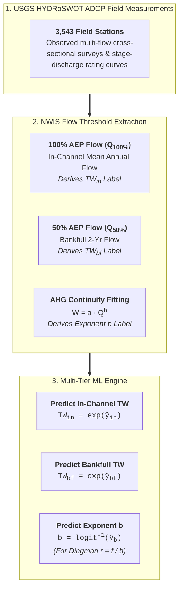
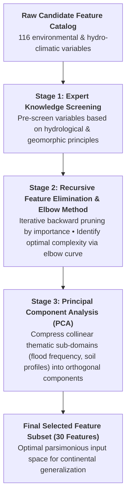
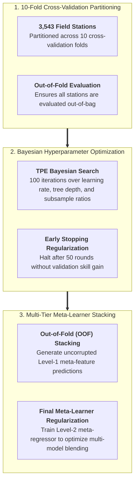

# TopWidth: Model Architectures & Optimization

The v1.0 TopWidth modeling framework uses a robust multi-model machine learning architecture to predict At Station Hydraulic Geometry (AHG) parameters across CONUS river networks ([Modaresi Rad et al., 2024](https://doi.org/10.1029/2024JH000173)). To capture non-linear interactions across diverse physiographic settings while preventing overfitting, the pipeline integrates feature selection, dimensionality reduction, hyperparameter optimization, and a two-tier **stacked meta-learner**.

---

## Target Formulation & Physical Constraining

The v1.0 TopWidth modeling framework predicts both dimensional channel widths and dimensionless hydraulic geometry scaling parameters:

1. **In-Channel & Bankfull Width Targets**:
   >   **In-Channel Width ($TW_{\text{in}}$)**: Evaluated at the **100% AEP discharge** ($Q_{\text{100\% AEP}}$, 1-year mean annual flow).
   >   **Bankfull Width ($TW_{\text{bf}}$)**: Evaluated at the **50% AEP discharge** ($Q_{\text{50\% AEP}}$, 2-year channel-forming flood).
   >   Target transformation: Log-transformed ($\ln(TW)$) to normalize right-skewed width distributions across stream orders:
     $y_{TW} = \ln(TW) \implies \widehat{TW} = \exp(\hat{y}_{TW})$

2. **AHG Power-Law Scaling Exponent ($b$)**:
   >   Fitted across multi-flow ADCP surveys under mass continuity ($b + f + m = 1.0$).
   >   Bounded in $(0, 1)$ via logit transformation and used specifically with depth exponent $f$ to derive the continuous Dingman shape parameter ($r = f/b$):
     $y_b = \ln\left(\frac{b}{1 - b}\right) \iff b = \frac{1}{1 + \exp(-y_b)}$

---

## Machine Learning Algorithms

To explore structural model diversity, five distinct non-linear machine learning algorithms were trained and benchmarked alongside a stacked meta-learner:

```mermaid
flowchart TD
    subgraph TIER1 ["Tier 1: Diverse Base Learners"]
        direction TB
        XGB["<b>XGBoost</b><br/>Exact greedy tree boosting with L1/L2 regularization"]
        ET["<b>ExtraTrees</b><br/>Extremely randomized trees with aggressive variance reduction"]
        LGBM["<b>LightGBM</b><br/>Fast leaf-wise tree growth with histogram binning"]
        CAT["<b>CatBoost</b><br/>Oblivious decision trees with ordered boosting"]
        RF["<b>Random Forest</b><br/>Bagged decorrelated decision tree ensemble"]
    end

    subgraph CV ["Out-of-Fold Cross-Validation"]
        OOF["OOF Meta-Feature Generator<br/><i>Prevents Target Snooping & Data Leakage</i>"]
    end

    subgraph TIER2 ["Tier 2: Meta-Learning Layer"]
        META["<b>Stacked Meta-Learner</b><br/>Regularized Meta-Regressor (Ridge / ElasticNet)<br/><i>Dynamically weights models based on hydro-climate regimes</i>"]
    end

    subgraph FINAL ["Final Predictions"]
        PRED["<b>Optimized TopWidth Prediction</b><br/><code>W(Q) = &acirc; &middot; Q<sup>b&#770;</sup></code> &bull; <code>W<sub>bf</sub> = &acirc; &middot; Q<sub>bf</sub><sup>b&#770;</sup></code>"]
    end

    XGB --> OOF
    ET --> OOF
    LGBM --> OOF
    CAT --> OOF
    RF --> OOF

    OOF ==> META
    META ==> PRED

    classDef default fill:#1e293b,stroke:#475569,stroke-width:1.5px,color:#f8fafc;
    classDef highlight fill:#c2410c,stroke:#fb923c,stroke-width:2px,color:#ffffff;
    class META highlight;
```

---

## Two-Tier Stacked Meta-Learner Architecture

Rather than relying on any single algorithm, the v1.0 pipeline employs a **Stacked Generalization (Stacking)** framework:

$$\hat{y}_{\text{meta}} = g\left(\sum_{k=1}^K w_k \cdot \hat{y}_k + \mathbf{\theta}^T \mathbf{z}\right)$$

where:

* $\hat{y}_k$ is the out-of-fold prediction from the $k$-th base learner ($k \in \{\text{XGBoost}, \text{ExtraTrees}, \text{LightGBM}, \text{CatBoost}, \text{RF}\}$).
* $w_k$ is the optimal blending weight assigned by the meta-regressor.
* $\mathbf{z}$ represents high-level environmental conditioning covariates.
* $g(\cdot)$ is the meta-learner link function.

### Advantages of the Meta-Learner

1. **Complementary Strengths**: Tree boosting models (XGBoost/LightGBM) excel at sharp physical transitions (e.g., bedrock knickpoints, urbanized valleys), while randomized bagging models (ExtraTrees/RF) maintain smooth interpolations in data-sparse regions.
2. **Leakage Prevention**: Base learners generate meta-features strictly using $K$-fold out-of-fold (OOF) cross-validation, ensuring the meta-learner never observes base predictions generated on training folds.
3. **Variance Reduction**: Meta-learning consistently reduces prediction variance across all stream orders compared to individual standalone models.

---

## Feature Selection & Dimensionality Reduction

The raw environmental feature catalog contained 116 candidate variables spanning hydro-climatology (PRISM/Daymet), catchment topography (DEM), stream network topology (Reference Fabric), soil physics (POLARIS / SSURGO), and flow statistics (NWM 2.1).

To eliminate redundant collinearity and build a robust model, a four-stage feature pruning pipeline was applied:

### Final 30-Feature Thematic Breakdown

The selected 30 predictors span 7 critical hydro-geomorphic domains:

1. **Hydro-Climatology**: Mean annual precipitation, potential evapotranspiration (PET), seasonality index, aridity index.
2. **Network Topology & Scale**: Upstream drainage area (`totdasqkm`), Strahler stream order, arbolate sum (`arb_sum`), downstream path length.
3. **Terrain & Geomorphometry**: Channel bed slope, elevation, Topographic Wetness Index (TWI), Fluvial Concavity Deviation (FCD), relief ratio.
4. **Soil Physical Properties**: Saturated hydraulic conductivity ($K_{sat}$), saturated soil water content ($\theta_s$), percent clay, silt, and sand fractions.
5. **Hydrologic Flow Regimes**: Bankfull discharge proxy ($Q_{bf}$), NWM 2.1 flood frequency principal components (PC0, PC1), Base Flow Index (BFI).
6. **Land Cover & Vegetation**: Leaf Area Index (LAI), Normalized Difference Vegetation Index (NDVI), riparian tree canopy fraction.
7. **Geological Context**: US NED Physiographic Diversity and regional lithologic resistance indices.

---

## Hyperparameter Optimization Strategy

Hyperparameters were systematically tuned using Bayesian Optimization across 10-fold cross-validation with out-of-fold (OOF) evaluation.

!!! tip "Out-of-Fold Cross-Validation Safeguard"
    To ensure robust generalization across unseen reaches, 10-fold cross-validation is used across all candidate models. Predictions for meta-learning are strictly generated out-of-fold (OOF), preventing any information leakage between training and testing partitions.
