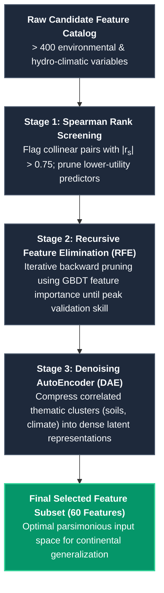

# TopWidth: Model Architectures & Optimization (v1.0)

The v1.0 TopWidth modeling framework uses a robust multi-model machine learning architecture to predict Feature Hydraulic Geometry (FHG) parameters across CONUS river networks ([Modaresi Rad et al., 2024](https://doi.org/10.1029/2024JH000173)). To capture non-linear interactions across diverse physiographic settings while preventing overfitting, the pipeline integrates feature selection, dimensionality reduction, hyperparameter optimization, and a two-tier **stacked meta-learner**.

---

## Target Formulation & Physical Constraining

### Power-Law Parameterization

Top width ($W$) varies with discharge ($Q$) according to Leopold & Maddock's (1953) power-law formulation:

$$W = a \cdot Q^b \iff \ln(W) = \ln(a) + b \cdot \ln(Q)$$

Direct regression on raw power-law parameters can suffer from heteroscedasticity and multi-order magnitude spreads. To ensure numerical stability and strictly enforce non-negative physical bounds ($a > 0$ and $0 < b < 1$):

1. **Coefficient Transformation**:
   The width coefficient $a$ spans orders of magnitude across small headwaters to major rivers. Models are trained to predict the natural log-transformed target:
   $$y_a = \ln(a) \implies \hat{a} = \exp(\hat{y}_a)$$

2. **Exponent Bounding**:
   The width exponent $b$ represents the sensitivity of width to changes in discharge. For stable in-channel flow, $b$ is bounded in the unit interval $(0, 1)$ via logit or linear-bounded scaling:
   $$y_b = \ln\left(\frac{b}{1 - b}\right) \iff b = \frac{1}{1 + \exp(-y_b)}$$

```mermaid
flowchart LR
    subgraph RAW ["Observation Space"]
        ADCP["USGS HYDRoSWOT<br/>ADCP Surveys (W, Q)"]
        FIT["FHG Power-Law Fit<br/><code>W = a &middot; Q<sup>b</sup></code>"]
        ADCP --> FIT
    end

    subgraph TRANS ["Target Transformation"]
        LOG_A["Log-Space Coefficient<br/><code>y<sub>a</sub> = ln(a)</code>"]
        BOUND_B["Bounded Exponent<br/><code>y<sub>b</sub> &in; (0, 1)</code>"]
        FIT --> LOG_A
        FIT --> BOUND_B
    end

    subgraph ML ["ML Learning Engine"]
        MODELS["Ensemble Base Learners &<br/>Stacked Meta-Learner"]
        LOG_A --> MODELS
        BOUND_B --> MODELS
    end

    subgraph OUTPUT ["Physical Parameter Space"]
        A_PRED["Predicted &acirc;<br/><code>&acirc; = exp(ŷ<sub>a</sub>)</code>"]
        B_PRED["Predicted b&#770;<br/><code>0 < b&#770; < 1</code>"]
        MODELS --> A_PRED
        MODELS --> B_PRED
    end

    classDef default fill:#1e293b,stroke:#475569,stroke-width:1.5px,color:#f8fafc;
    classDef highlight fill:#0284c7,stroke:#38bdf8,stroke-width:2px,color:#ffffff;
    class ML highlight;
```

---

## Machine Learning Algorithms

To explore structural model diversity, five distinct non-linear machine learning algorithms were trained and benchmarked alongside a stacked meta-learner:

```mermaid
flowchart TD
    subgraph TIER1 ["Tier 1: Diverse Base Learners"]
        direction TB
        XGB["<b>XGBoost</b><br/>Exact greedy tree boosting with L1/L2 regularization"]
        ET["<b>ExtraTrees</b><br/>Extremely randomized trees with aggressive variance reduction"]
        LGBM["<b>LightGBM</b><br/>Fast leaf-wise tree growth with histogram binning"]
        CAT["<b>CatBoost</b><br/>Oblivious decision trees with ordered boosting"]
        RF["<b>Random Forest</b><br/>Bagged decorrelated decision tree ensemble"]
    end

    subgraph CV ["Out-of-Fold Cross-Validation"]
        OOF["OOF Meta-Feature Generator<br/><i>Prevents Target Snooping & Data Leakage</i>"]
    end

    subgraph TIER2 ["Tier 2: Meta-Learning Layer"]
        META["<b>Stacked Meta-Learner</b><br/>Regularized Meta-Regressor (Ridge / ElasticNet)<br/><i>Dynamically weights models based on hydro-climate regimes</i>"]
    end

    subgraph FINAL ["Final Predictions"]
        PRED["<b>Optimized TopWidth Prediction</b><br/><code>W(Q) = &acirc; &middot; Q<sup>b&#770;</sup></code> &bull; <code>W<sub>bf</sub> = &acirc; &middot; Q<sub>bf</sub><sup>b&#770;</sup></code>"]
    end

    XGB --> OOF
    ET --> OOF
    LGBM --> OOF
    CAT --> OOF
    RF --> OOF

    OOF ==> META
    META ==> PRED

    classDef default fill:#1e293b,stroke:#475569,stroke-width:1.5px,color:#f8fafc;
    classDef highlight fill:#c2410c,stroke:#fb923c,stroke-width:2px,color:#ffffff;
    class META highlight;
```

### Base Learner Characteristics

| Algorithm | Architectural Paradigm | Key Strengths in Fluvial Parameterization | Regularization & Safeguards |
| :--- | :--- | :--- | :--- |
| **XGBoost** | Gradient-Boosted Decision Trees (GBDT) | Depth-wise tree growth capturing intricate non-linear interactions among terrain slope, stream power, and drainage area. | Shrinkage ($\eta$), column subsampling (`colsample_bytree`), L1 ($\alpha$) and L2 ($\lambda$) leaf penalties. |
| **ExtraTrees** | Extremely Randomized Trees | Randomizes split thresholds at each node; provides superior variance suppression and resilience against noise in ADCP field surveys. | Minimum sample split, maximum feature subsets ($\sqrt{p}$), bootstrap bagging. |
| **LightGBM** | Leaf-wise GBDT with Histogram Binning | Accelerated training on large tabular datasets with gradient-based one-side sampling (GOSS). | Maximum leaf limit, minimum data per leaf, feature sub-sampling. |
| **CatBoost** | Oblivious Trees with Ordered Target Encoding | Symmetrical decision trees that prevent gradient estimation bias and handle complex regional environmental distributions. | $L_2$ regularization, random subspace projection, bagging temperature. |
| **Random Forest** | Bootstrap Aggregating (Bagging) | Robust non-parametric baseline that captures macro-geomorphic boundaries without overfitting extreme values. | Tree depth caps, minimum leaf samples, out-of-bag variance estimation. |

---

## Two-Tier Stacked Meta-Learner Architecture

Rather than relying on any single algorithm, the v1.0 pipeline employs a **Stacked Generalization (Stacking)** framework:

$$\hat{y}_{\text{meta}} = g\left(\sum_{k=1}^K w_k \cdot \hat{y}_k + \mathbf{\theta}^T \mathbf{z}\right)$$

where:

* $\hat{y}_k$ is the out-of-fold prediction from the $k$-th base learner ($k \in \{\text{XGBoost}, \text{ExtraTrees}, \text{LightGBM}, \text{CatBoost}, \text{RF}\}$).
* $w_k$ is the optimal blending weight assigned by the meta-regressor.
* $\mathbf{z}$ represents high-level environmental conditioning covariates.
* $g(\cdot)$ is the meta-learner link function.

### Advantages of the Meta-Learner

1. **Complementary Strengths**: Tree boosting models (XGBoost/LightGBM) excel at sharp physical transitions (e.g., bedrock knickpoints, urbanized valleys), while randomized bagging models (ExtraTrees/RF) maintain smooth interpolations in data-sparse regions.
2. **Leakage Prevention**: Base learners generate meta-features strictly using $K$-fold out-of-fold (OOF) cross-validation, ensuring the meta-learner never observes base predictions generated on training folds.
3. **Variance Reduction**: Meta-learning consistently reduces prediction variance across all stream orders compared to individual standalone models.

---

## Feature Selection & Dimensionality Reduction

The raw environmental feature catalog contained over **400 candidate variables** spanning hydro-climatology (Daymet), catchment topography (DEM), stream network topology (NHDPlusV2), soil physics (POLARIS / SSURGO), and flow statistics (NWM 2.1).

To eliminate redundant collinearity and build a robust model, a four-stage feature pruning pipeline was applied:

### Final 60-Feature Thematic Breakdown

The selected 60 predictors span 7 critical hydro-geomorphic domains:

1. **Hydro-Climatology**: Mean annual precipitation, potential evapotranspiration (PET), seasonality index, aridity index.
2. **Network Topology & Scale**: Upstream drainage area (`totdasqkm`), Strahler stream order, arbolate sum (`arb_sum`), downstream path length.
3. **Terrain & Geomorphometry**: Channel bed slope, elevation, Topographic Wetness Index (TWI), Fluvial Concavity Deviation (FCD), relief ratio.
4. **Soil Physical Properties**: Saturated hydraulic conductivity ($K_{sat}$), saturated soil water content ($\theta_s$), percent clay, silt, and sand fractions.
5. **Hydrologic Flow Regimes**: Bankfull discharge proxy ($Q_{bf}$), NWM 2.1 flood frequency principal components (PC0, PC1), Base Flow Index (BFI).
6. **Land Cover & Vegetation**: Leaf Area Index (LAI), Normalized Difference Vegetation Index (NDVI), riparian tree canopy fraction.
7. **Geological Context**: US NED Physiographic Diversity and regional lithologic resistance indices.

---

## Hyperparameter Optimization Strategy

Hyperparameters were systematically tuned using Bayesian Optimization with 10-fold spatial cross-validation to prevent spatial autocorrelation artifacts.

```mermaid
gantt
    title Hyperparameter Search & Validation Workflow
    dateFormat  X
    axisFormat %s
    section Data Partitioning
    Spatial Stratification & 10-Fold Split : 0, 2
    section Hyperparameter Tuning
    Bayesian Search (500 iterations)      : 2, 6
    Early Stopping & Loss Convergence      : 4, 7
    section Meta-Learning
    Out-of-Fold Meta-Feature Stacking     : 7, 9
    Final Meta-Learner Regularization      : 9, 10
```

### Optimal Hyperparameter Ranges

| Hyperparameter | Search Space | Optimal Configuration (XGBoost) | Optimal Configuration (CatBoost) |
| :--- | :--- | :--- | :--- |
| **Max Tree Depth** | $[3, 12]$ | $7$ | $6$ (symmetric) |
| **Learning Rate ($\eta$)** | $[0.01, 0.20]$ | $0.035$ | $0.040$ |
| **Subsample Ratio** | $[0.50, 1.00]$ | $0.80$ | $0.85$ |
| **Colsample / Feature Ratio**| $[0.40, 1.00]$ | $0.70$ | $0.75$ |
| **L1 Regularization ($\alpha$)** | $[0.0, 10.0]$ | $1.25$ | — |
| **L2 Regularization ($\lambda$)** | $[0.0, 20.0]$ | $3.50$ | $4.00$ |
| **Early Stopping Rounds** | $[20, 100]$ | $50$ | $50$ |

!!! tip "Spatial Cross-Validation Safeguard"
    Standard random $K$-fold cross-validation can artificially inflate validation metrics due to spatial proximity between neighboring USGS gaging stations. The v1.0 pipeline used **spatially stratified watershed block validation** (grouping gages by HUC-4/HUC-6 basins) to ensure true out-of-sample generalization to completely unmonitored basins.
