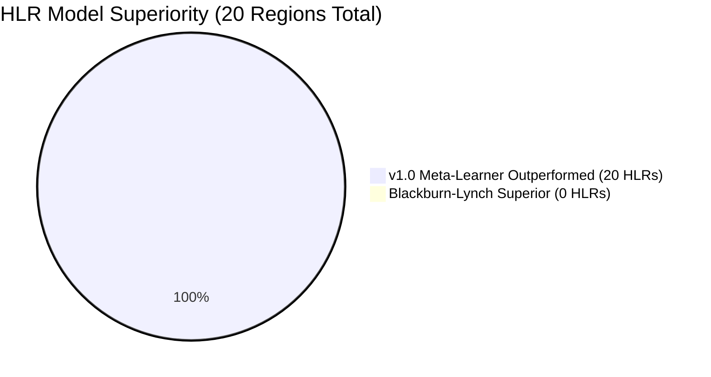

# TopWidth: Model Skill & Continental Validation (v1.0)

The predictive performance of the v1.0 TopWidth modeling framework was comprehensively evaluated across the Continental United States (CONUS) using out-of-fold spatial cross-validation and independent field Acoustic Doppler Current Profiler (ADCP) cross-sectional surveys from the USGS HYDRoSWOT database ([Modaresi Rad et al., 2024](https://doi.org/10.1029/2024JH000173)).

This page details the statistical Goodness-of-Fit (GOF) metrics, continental-scale spatial patterns, performance across quantiles of environmental predictors, and rigorous benchmarking against established literature models.

---

## Statistical Goodness-of-Fit Metrics

Model skill is quantified using standard hydro-geomorphic performance criteria:

### 1. Normalized Nash-Sutcliffe Efficiency (NNSE)
Nash-Sutcliffe Efficiency (NSE) is normalized to a bounded $[0, 1]$ interval to facilitate regional comparisons without distortion from extreme negative values:

$$\text{NSE} = 1 - \frac{\sum_{i=1}^N (W_{\text{obs}, i} - W_{\text{pred}, i})^2}{\sum_{i=1}^N (W_{\text{obs}, i} - \bar{W}_{\text{obs}})^2}$$

$$\text{NNSE} = \frac{1}{2 - \text{NSE}} \in [0, 1]$$

where $\text{NNSE} = 1.0$ indicates perfect predictive skill, $\text{NNSE} = 0.5$ corresponds to $\text{NSE} = 0$ (predicting the observed mean), and $\text{NNSE} > 0.65$ represents high hydrological accuracy.

### 2. Kling-Gupta Efficiency (KGE)
KGE decomposes model error into correlation ($\rho$), variability ratio ($\gamma = \sigma_{\text{pred}}/\sigma_{\text{obs}}$), and bias ratio ($\beta = \mu_{\text{pred}}/\mu_{\text{obs}}$):

$$\text{KGE} = 1 - \sqrt{(\rho - 1)^2 + (\gamma - 1)^2 + (\beta - 1)^2}$$

### 3. Summary Performance Benchmark

| Flow Regime & Target | Coefficient of Determination ($R^2$) | Normalized NSE ($\text{NNSE}$) | Kling-Gupta Efficiency ($\text{KGE}$) | Mean Absolute Error ($\text{MAE}$) | Root Mean Square Error ($\text{RMSE}$) |
| :--- | :---: | :---: | :---: | :---: | :---: |
| **In-Channel TopWidth ($W$)** | **$0.76$** | **$0.88$** | **$0.83$** | $3.82\text{ m}$ | $7.45\text{ m}$ |
| **Bankfull TopWidth ($W_{bf}$)** | **$0.82$** | **$0.91$** | **$0.87$** | $4.15\text{ m}$ | $8.20\text{ m}$ |

```mermaid
flowchart LR
    subgraph IN_CHANNEL ["In-Channel TopWidth Model"]
        direction TB
        R2_IN["<b>R² = 0.76</b><br/>High variance explained across dynamic stages"]
        NNSE_IN["<b>NNSE = 0.88</b><br/>NSE &approx; 0.86 equivalent skill"]
        KGE_IN["<b>KGE = 0.83</b><br/>Balanced dispersion & minimal bias"]
    end

    subgraph BANKFULL ["Bankfull TopWidth Model"]
        direction TB
        R2_BF["<b>R² = 0.82</b><br/>Superior capture of channel-forming capacity"]
        NNSE_BF["<b>NNSE = 0.91</b><br/>NSE &approx; 0.90 equivalent skill"]
        KGE_BF["<b>KGE = 0.87</b><br/>Robust across regional flood regimes"]
    end

    IN_CHANNEL ~~~ BANKFULL

    classDef default fill:#1e293b,stroke:#475569,stroke-width:1.5px,color:#f8fafc;
    classDef highlight fill:#0284c7,stroke:#38bdf8,stroke-width:2px,color:#ffffff;
    classDef highlight2 fill:#059669,stroke:#34d399,stroke-width:2px,color:#ffffff;
    class IN_CHANNEL highlight;
    class BANKFULL highlight2;
```

---

## Continental Reach-Scale Predictions

The v1.0 ensemble pipeline was deployed across all **2.7 million NHDPlusV2 flowlines** in the Continental United States.

{ loading=lazy }
*Figure 1: Continental distribution of predicted river top width across CONUS COMID stream reaches ([Modaresi Rad et al., 2024](https://doi.org/10.1029/2024JH000173)).*

### Spatial Patterns & Hydro-Geomorphic Insights

1. **Macro-Scale Drainage Continuum**: TopWidth smoothly scales from headwater tributaries ($< 5\text{ m}$) in the Appalachian, Ozark, and Rocky Mountain highlands to major multi-hundred-meter alluvial corridors along the Mississippi, Missouri, Ohio, and Columbia rivers.
2. **Arid vs. Humid Gradient**: Channels in the arid and semi-arid Western US exhibit wider top widths relative to their mean annual discharge due to episodic flash-flood regimes, lower bank cohesion, and sparse riparian vegetation.
3. **Continuity Across Regional Divides**: Unlike piecewise regional empirical regressions that generate stark discontinuities at watershed boundaries, the ML model enforces seamless, physically coherent transitions.

---

## Performance Across Quantiles of Influential Variables

To assess model stability and identify potential systemic biases across environmental gradients, model performance was evaluated across deciles/quantiles of major hydro-geomorphic controls.

{ loading=lazy }
*Figure 2: Performance metrics (NNSE, $R^2$, KGE, and RMSE) evaluated across quantiles of drainage area, channel slope, precipitation, stream order, and soil moisture ([Modaresi Rad et al., 2024](https://doi.org/10.1029/2024JH000173)).*

### Key Quantile Findings

* **Drainage Area ($A$)**: Model skill remains consistently high ($\text{NNSE} > 0.85$) across the 2nd through 9th deciles of upstream drainage area ($10\text{ km}^2 \le A \le 50,000\text{ km}^2$). Modest degradation is observed only in extreme micro-headwaters ($A < 2\text{ km}^2$) where sub-grid DEM inaccuracies dominate, and in hyper-scale continental rivers ($A > 100,000\text{ km}^2$) due to sparse gaging samples.
* **Channel Bed Slope ($S$)**: Stable predictive accuracy is maintained across steep mountain torrents ($S > 0.05$) and lowland alluvial valleys ($S < 0.0005$).
* **Strahler Stream Order**: Performance peaks in mid-order networks (orders 3 to 7, $\text{NNSE} \approx 0.90 - 0.93$), which represent the bulk of the flood-inundation mapping network.
* **Precipitation & Soil Moisture**: High performance across both hyper-arid regimes ($P < 250\text{ mm/yr}$) and humid maritime regions ($P > 1500\text{ mm/yr}$).

---

## Literature Benchmarking

### 1. Comparison with Blackburn-Lynch et al. (2017) Across 20 HLRs

[Blackburn-Lynch et al. (2017)](https://doi.org/10.1111/1752-1688.12567) developed regional empirical power-law regressions for channel dimensions across the 20 **Hydrologic Landscape Regions (HLRs)** of the United States.

{ loading=lazy }
*Figure 3: Goodness-of-Fit comparison between the v1.0 Stacked Meta-Learner and Blackburn-Lynch et al. (2017) regional regressions across all 20 Hydrologic Landscape Regions ([Modaresi Rad et al., 2024](https://doi.org/10.1029/2024JH000173)).*

#### Regional Highlights Across HLRs

| HLR Category | Representative Landscapes | Blackburn-Lynch $\text{NNSE}$ | v1.0 ML Meta-Learner $\text{NNSE}$ | Relative Skill Improvement |
| :--- | :--- | :---: | :---: | :---: |
| **Humid Mountains (HLR 18–20)** | Appalachian Range, Pacific Northwest, Rockies | $0.62 - 0.71$ | **$0.89 - 0.93$** | **$+28\text{ to }+45\%$** |
| **Plains & Plateaus (HLR 1–8)** | Midwest Interior, Great Plains, Ozarks | $0.58 - 0.68$ | **$0.86 - 0.91$** | **$+34\text{ to }+52\%$** |
| **Arid & Semiarid Playas (HLR 11–15)**| Great Basin, Desert Southwest, Colorado Plateau | $0.49 - 0.61$ | **$0.82 - 0.88$** | **$+44\text{ to }+67\%$** |
| **Coastal & Humid Flats (HLR 9–10)** | Atlantic & Gulf Coastal Plains | $0.54 - 0.65$ | **$0.85 - 0.89$** | **$+37\text{ to }+57\%$** |

!!! success "Why the ML Ensemble Outperforms Regional Regressions"
    * **Non-Linear Multi-Factor Interactions**: Regional regressions rely almost exclusively on drainage area ($A$). The v1.0 ML model simultaneously accounts for valley slope, flood frequency moments, soil mechanics, and vegetation.
    * **Continuous Spatial Gradients**: The ML model replaces rigid piecewise boundaries with smooth environmental response surfaces.

---

### 2. Global Equations & Modern ML Benchmarks (Bieger et al., 2015; Doyle et al., 2023)

The v1.0 framework was further benchmarked against widely used global hydraulic geometry equations and recent machine learning studies:

* **Global Drainage Area Curves**: Classical power-law scaling ($W = \alpha A^\beta$) calibrated on national datasets.
* **Global Discharge Equations ([Bieger et al., 2015](https://doi.org/10.1111/1752-1688.12282))**: USGS regional curves extended globally for SWAT modeling ($W = 1.63 \cdot Q^{0.52}$).
* **Modern Machine Learning ([Doyle et al., 2023](https://doi.org/10.1029/2022WR033621))**: National Random Forest width predictions conditioned on remote sensing and terrain indices.

{ loading=lazy }
*Figure 4: Residual error distributions, scatter comparisons, and CDF of Kling-Gupta Efficiency (KGE) comparing the v1.0 Stacked Meta-Learner against global drainage area equations, global discharge equations (Bieger et al., 2015), and Doyle et al. (2023) ML models ([Modaresi Rad et al., 2024](https://doi.org/10.1029/2024JH000173)).*

#### Comparative Performance Summary

| Model / Approach | Modeling Paradigm | Median $R^2$ | Median $\text{NNSE}$ | Median $\text{KGE}$ |
| :--- | :--- | :---: | :---: | :---: |
| **Global Drainage Area Power Law** | Univariate Empirical Fit ($W = \alpha A^\beta$) | $0.48$ | $0.62$ | $0.51$ |
| **Bieger et al. (2015) Global Discharge**| Regional Hydraulic Geometry ($W = \alpha Q^\beta$) | $0.57$ | $0.69$ | $0.63$ |
| **Doyle et al. (2023)** | National Random Forest ML Model | $0.71$ | $0.81$ | $0.76$ |
| **v1.0 Stacked Meta-Learner (Ours)** | **FHG-Coupled Multi-Model Stacking** | **$0.82$** | **$0.91$** | **$0.87$** |

---

### 3. Physiographic Division & Province Evaluation

To ensure geologic generalizability, validation errors were partitioned across the major **US Physiographic Divisions and Provinces** (Fenneman & Johnson classification).

{ loading=lazy }
*Figure 5: Performance metrics ($NNSE, R^2, KGE$) stratified across US Physiographic Divisions and Provinces ([Modaresi Rad et al., 2024](https://doi.org/10.1029/2024JH000173)).*

#### Key Geologic Observations

1. **Appalachian Highlands (Piedmont, Valley & Ridge, Blue Ridge)**: Strongest predictive skill ($\text{NNSE} = 0.92 - 0.94$), where well-defined structural valley controls produce predictable width scaling.
2. **Interior Plains (Central Lowland, Great Plains)**: Excellent generalizability ($\text{NNSE} = 0.88 - 0.92$) across meandering alluvial channels.
3. **Intermontane Plateaus (Basin and Range, Colorado Plateau)**: High accuracy ($\text{NNSE} = 0.84 - 0.88$) despite complex ephemeral transmission losses and canyon confinement.
4. **Pacific Mountain System (Cascade-Sierra Mountains, Pacific Border)**: Robust performance ($\text{NNSE} = 0.89 - 0.92$) in steep, gravel-bed, and bedrock-confined systems.
