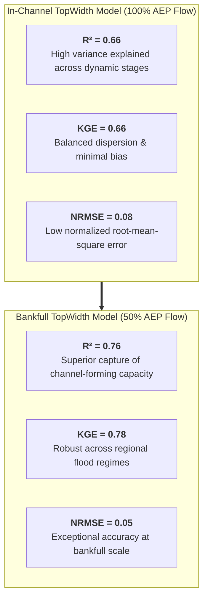
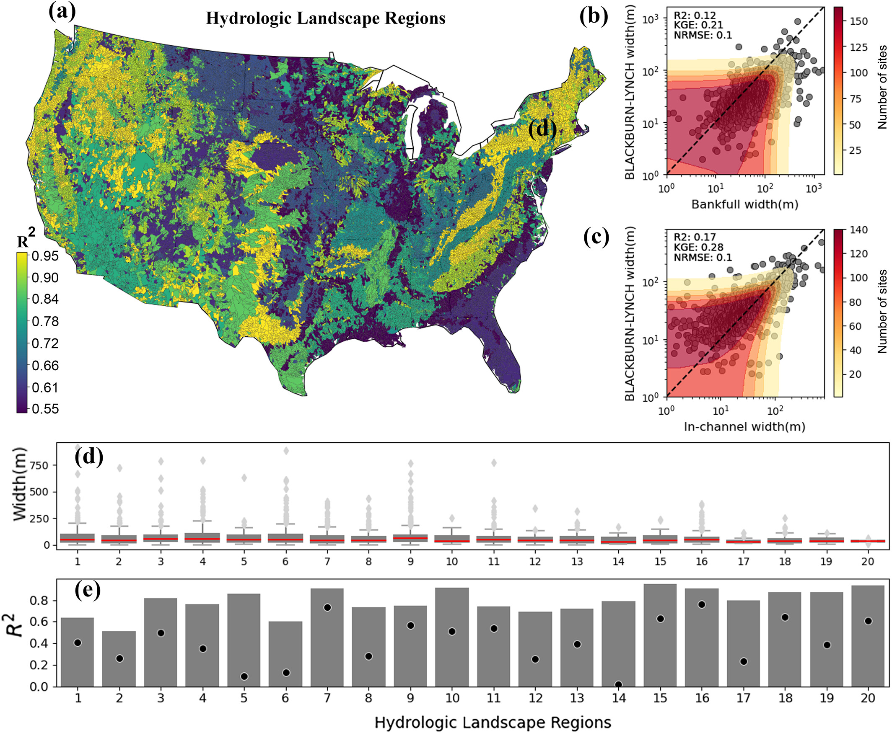
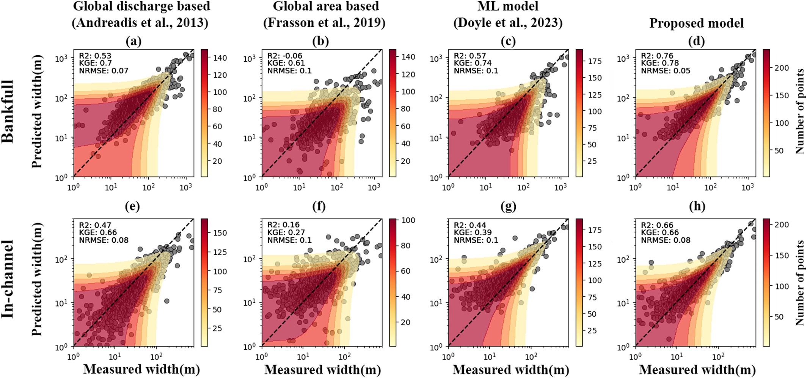
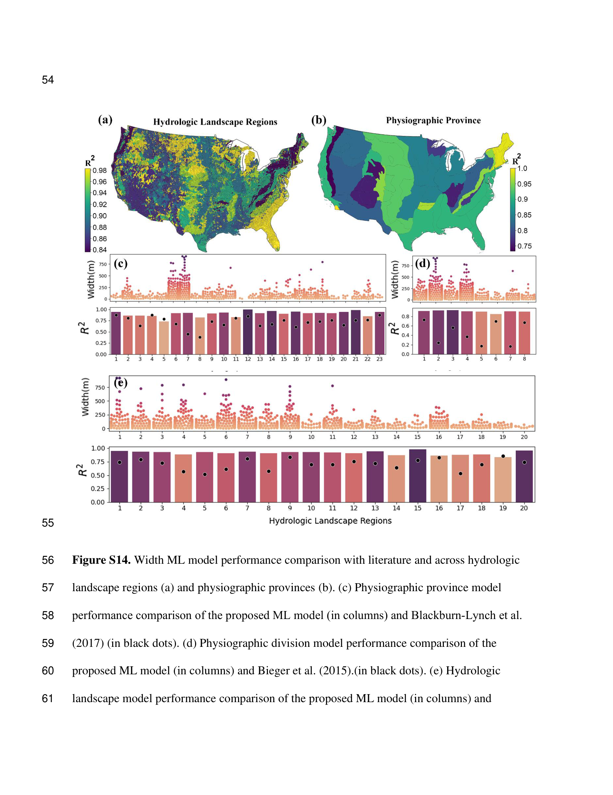

# TopWidth: Model Skill & Continental Validation

The predictive performance of the v1.0 TopWidth modeling framework was comprehensively evaluated across the Continental United States (CONUS) using out-of-fold spatial cross-validation and independent field Acoustic Doppler Current Profiler (ADCP) cross-sectional surveys from the USGS HYDRoSWOT database ([Modaresi Rad et al., 2024](https://doi.org/10.1029/2024JH000173)).

This page details the statistical Goodness-of-Fit (GOF) metrics, continental-scale spatial patterns, performance across quantiles of environmental predictors, and rigorous benchmarking against established literature models.

---

## Statistical Goodness-of-Fit Metrics

Model skill is quantified using standard hydro-geomorphic performance criteria:

### 1. Normalized Nash-Sutcliffe Efficiency (NNSE)
Nash-Sutcliffe Efficiency (NSE) is normalized to a bounded $[0, 1]$ interval to facilitate regional comparisons without distortion from extreme negative values:

$$\text{NSE} = 1 - \frac{\sum_{i=1}^N (W_{\text{obs}, i} - W_{\text{pred}, i})^2}{\sum_{i=1}^N (W_{\text{obs}, i} - \bar{W}_{\text{obs}})^2}$$

$$\text{NNSE} = \frac{1}{2 - \text{NSE}} \in [0, 1]$$

where $\text{NNSE} = 1.0$ indicates perfect predictive skill, $\text{NNSE} = 0.5$ corresponds to $\text{NSE} = 0$ (predicting the observed mean), and $\text{NNSE} > 0.65$ represents high hydrological accuracy.

### 2. Kling-Gupta Efficiency (KGE)
KGE decomposes model error into correlation ($\rho$), variability ratio ($\gamma = \sigma_{\text{pred}}/\sigma_{\text{obs}}$), and bias ratio ($\beta = \mu_{\text{pred}}/\mu_{\text{obs}}$):

$$\text{KGE} = 1 - \sqrt{(\rho - 1)^2 + (\gamma - 1)^2 + (\beta - 1)^2}$$

### 3. Summary Performance Benchmark

Performance metrics evaluated on independent test datasets across CONUS:

| Flow Regime & Target | $R^2$ | $\text{KGE}$ | $\text{NRMSE}$ | Target Description |
| :--- | :---: | :---: | :---: | :--- |
| **In-Channel TopWidth ($TW_{\text{in}}$)** | **$0.66$** | **$0.66$** | **$0.08$** | Rating curve width at USGS 100% AEP discharge |
| **Bankfull TopWidth ($TW_{\text{bf}}$)** | **$0.76$** | **$0.78$** | **$0.05$** | Rating curve width at USGS 50% AEP discharge |

---

## Continental Reach-Scale Predictions

The v1.0 ensemble pipeline was deployed across all **2.7 million Reference Fabric flowlines** in the Continental United States.

{ loading=lazy }
*Figure 1: Continental distribution of predicted river top width across CONUS COMID stream reaches ([Modaresi Rad et al., 2024](https://doi.org/10.1029/2024JH000173)).*

### Spatial Patterns & Hydro-Geomorphic Insights

1. **Macro-Scale Drainage Continuum**: TopWidth smoothly scales from headwater tributaries ($< 5\text{ m}$) in the Appalachian, Ozark, and Rocky Mountain highlands to major multi-hundred-meter alluvial corridors along the Mississippi, Missouri, Ohio, and Columbia rivers.
2. **Arid vs. Humid Gradient**: Channels in the arid and semi-arid Western US exhibit wider top widths relative to their mean annual discharge due to episodic flash-flood regimes, lower bank cohesion, and sparse riparian vegetation.
3. **Continuity Across Regional Divides**: Unlike piecewise regional empirical regressions that generate stark discontinuities at watershed boundaries, the ML model enforces seamless, physically coherent transitions.

---

## Performance Across Quantiles of Influential Variables

To assess model stability and identify potential systemic biases across environmental gradients, model performance ($R^2$) was evaluated across quantiles of major hydro-geomorphic controls:

{ loading=lazy }
*Figure 2: Performance metrics ($R^2$ and width distributions) evaluated across quantiles of bankfull discharge, NWM flood frequency, arbolate sum, and topographic wetness index ([Modaresi Rad et al., 2024](https://doi.org/10.1029/2024JH000173)).*

### Quantile Performance Details

* **Bankfull Discharge ($Q_{\text{bf}}$)**: $R^2$ increases steadily with stream scale, from $R^2 \approx 0.22$ for small headwaters ($0-50\text{ m}^3/\text{s}$) to $R^2 \approx 0.74$ in large channels ($130-10,000\text{ m}^3/\text{s}$).
* **NWM Flood Frequency**: $R^2$ ranges from $0.55$ to $0.78$, reaching its peak ($R^2 \approx 0.78$) in reaches with high flood frequencies ($7-1,151\text{ m}^3/\text{s}$).
* **Arbolate Sum (`arb_sum`)**: $R^2$ scales from $0.55-0.68$ in upstream tributaries to $R^2 \approx 0.79$ along major river networks ($2,059-2,136,856\text{ km}$).
* **Topographic Wetness Index (TWI)**: Strong predictive skill ($R^2 = 0.71-0.85$) across all TWI terrain classes.

---

## Literature Benchmarking

### 1. Comparison with Blackburn-Lynch et al. (2017) Across 20 HLRs

[Blackburn-Lynch et al. (2017)](https://doi.org/10.1111/1752-1688.12567) developed regional empirical power-law regressions for channel dimensions across the 20 **Hydrologic Landscape Regions (HLRs)** of the United States.

{ loading=lazy }
*Figure 3: Goodness-of-Fit comparison between the proposed ML model and Blackburn-Lynch et al. (2017) regional regressions across all 20 Hydrologic Landscape Regions ([Modaresi Rad et al., 2024](https://doi.org/10.1029/2024JH000173)).*

#### Overall Benchmark Against Blackburn-Lynch (2017)

| Regime & Evaluation | Metric | Blackburn-Lynch (2017) | Proposed ML Model (Ours) |
| :--- | :---: | :---: | :---: |
| **Bankfull Width ($TW_{\text{bf}}$)** | $R^2$ | $0.12$ | **$0.76$** |
| | $\text{KGE}$ | $0.21$ | **$0.78$** |
| | $\text{NRMSE}$ | $0.10$ | **$0.05$** |
| **In-Channel Width ($TW_{\text{in}}$)** | $R^2$ | $0.17$ | **$0.66$** |
| | $\text{KGE}$ | $0.28$ | **$0.66$** |
| | $\text{NRMSE}$ | $0.10$ | **$0.08$** |

#### Regional Performance Across HLRs (Figure 8e)

* **Proposed ML Model (Grey Bars)**: $R^2$ ranges from **$0.51$** (HLR 2) to **$0.95$** (HLR 15), maintaining high consistency ($\text{median } R^2 \approx 0.78$).
* **Blackburn-Lynch (Black Dots)**: $R^2$ ranges from **$0.01$** (HLR 14) to **$0.76$** (HLR 16), with substantial regional volatility ($\text{median } R^2 \approx 0.38$).
* The proposed ML model **outperforms Blackburn-Lynch regional equations across all 20 HLRs**.

---

### 2. Global Equations & Modern ML Benchmarks (Andreadis et al., 2013; Frasson et al., 2019; Doyle et al., 2023)

The proposed ML model was benchmarked against global discharge equations ([Andreadis et al., 2013](https://doi.org/10.1002/wrcr.20440)), global drainage area equations ([Frasson et al., 2019](https://doi.org/10.1029/2019WR025345)), and recent machine learning models ([Doyle et al., 2023](https://doi.org/10.1029/2022WR033621)):

{ loading=lazy }
*Figure 4: Scatter distributions and Goodness-of-Fit metrics ($R^2, \text{KGE}, \text{NRMSE}$) comparing the proposed ML model against Andreadis et al. (2013), Frasson et al. (2019), and Doyle et al. (2023) ([Modaresi Rad et al., 2024](https://doi.org/10.1029/2024JH000173)).*

#### Comparative Performance Matrix (Figure 9)

| Model / Approach | Target Regime | $R^2$ | $\text{KGE}$ | $\text{NRMSE}$ |
| :--- | :--- | :---: | :---: | :---: |
| **Global Discharge Based** ([Andreadis et al., 2013](https://doi.org/10.1002/wrcr.20440)) | Bankfull ($TW_{\text{bf}}$) In-Channel ($TW_{\text{in}}$) | $0.53$ $0.47$ | $0.70$ $0.66$ | $0.07$ $0.08$ |
| **Global Area Based** ([Frasson et al., 2019](https://doi.org/10.1029/2019WR025345)) | Bankfull ($TW_{\text{bf}}$) In-Channel ($TW_{\text{in}}$) | $-0.06$ $0.16$ | $0.61$ $0.27$ | $0.10$ $0.10$ |
| **ML Model** ([Doyle et al., 2023](https://doi.org/10.1029/2022WR033621)) | Bankfull ($TW_{\text{bf}}$) In-Channel ($TW_{\text{in}}$) | $0.57$ $0.44$ | $0.74$ $0.39$ | $0.10$ $0.10$ |
| **Proposed ML Model (CONUS-FHG v1.0)** | **Bankfull ($TW_{\text{bf}}$)** **In-Channel ($TW_{\text{in}}$)** | **$0.76$** **$0.66$** | **$0.78$** **$0.66$** | **$0.05$** **$0.08$** |

---

### 3. Physiographic Division & Province Evaluation (Figure S14)

Validation performance was further evaluated across US Physiographic Divisions (8 divisions) and Physiographic Provinces (23 provinces):

{ loading=lazy }
*Figure 5: Performance comparison of the proposed ML model against Blackburn-Lynch et al. (2017) and Bieger et al. (2015) across Physiographic Provinces and Divisions ([Modaresi Rad et al., 2024](https://doi.org/10.1029/2024JH000173)).*

* **Physiographic Provinces (Figure S14c)**: Proposed ML model $R^2$ exceeds $0.75-0.95$ across provinces, consistently outperforming Blackburn-Lynch et al. (2017) across nearly all regions.
* **Physiographic Divisions (Figure S14d)**: Proposed ML model $R^2$ remains consistently high ($R^2 \approx 0.75-0.95$) across all 8 major divisions, significantly improving over Bieger et al. (2015) baseline estimates.
