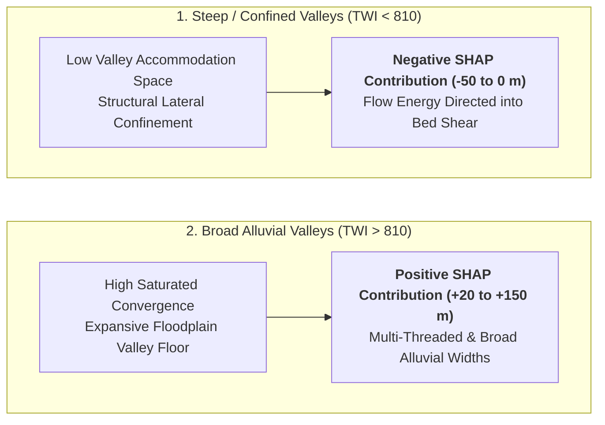

# TopWidth: Explainable AI & Geomorphic Drivers (v1.0)

A central objective of the v1.0 parameterization framework is ensuring that machine learning predictions are not mere statistical correlations, but physically consistent representations of fluvial mechanics ([Modaresi Rad et al., 2024](https://doi.org/10.1029/2024JH000173)). To interpret model behavior, quantify the contribution of each predictor, and discover non-linear environmental couplings, we utilize **TreeSHAP (SHapley Additive exPlanations)** grounded in cooperative game theory ([Lundberg & Lee, 2017](https://doi.org/10.48550/arXiv.1705.07874)).

---

## Game-Theoretic Formulation (TreeSHAP)

For any given stream reach $x$, TreeSHAP decomposes the model prediction $f(x)$ into an additive sum of a base expected value $\phi_0 = \mathbb{E}[f(x)]$ and reach-specific attribution values $\phi_j(x)$ for each environmental feature $j$:

$$f(x) = \phi_0 + \sum_{j=1}^M \phi_j(x)$$

The exact Shapley attribution $\phi_j$ is computed by evaluating the marginal contribution of feature $j$ across all possible feature subsets $S \subseteq F \setminus \{j\}$:

$$\phi_j(x) = \sum_{S \subseteq F \setminus \{j\}} \frac{|S|! \, (|F| - |S| - 1)!}{|F|!} \left[ f_x(S \cup \{j\}) - f_x(S) \right]$$

This formulation satisfies four essential game-theoretic properties:

1. **Efficiency**: $\sum_{j=1}^M \phi_j(x) = f(x) - \mathbb{E}[f(x)]$ (exact sum to the model prediction delta).
2. **Symmetry**: Identical features receive identical attributions.
3. **Dummy/Null Player**: Features with zero marginal impact receive $\phi_j = 0$.
4. **Additivity**: Attributions from ensembled models sum linearly.

---

## Global Feature Importance & Elbow Optimization

The global importance of each hydro-geomorphic feature was evaluated across all CONUS training reaches by calculating the mean absolute Shapley value ($|\phi_j|$):

{ loading=lazy }
*Figure 1: (a) Global TreeSHAP feature importance ranking and summary beeswarm plot for the v1.0 TopWidth model. Points represent individual stream reaches, with color indicating raw feature value (red = high, blue = low) and x-axis indicating impact on predicted top width. (b) Recursive feature elimination using the Elbow Method tracking model $R^2$, showing optimal parsimony at 15 features ([Modaresi Rad et al., 2024](https://doi.org/10.1029/2024JH000173)).*

```mermaid
flowchart TD
    subgraph DRIVERS ["Dominant TopWidth Predictors (Top 15 Subset)"]
        direction TB
        QBF["<b>1. Bankfull Discharge (Q<sub>bf</sub>)</b><br/>Primary volumetric driver of channel-forming capacity"]
        PC0["<b>2. NWM Flood pc0</b><br/>Hydrograph peak skewness & flood recurrence moments"]
        TWI["<b>3. Topographic Wetness Index (TWI)</b><br/>Valley saturation, groundwater convergence & floodplain extent"]
        AET["<b>4. Actual Evapotranspiration (AET)</b><br/>Catchment water balance & vegetated runoff regulation"]
        ARB["<b>5. Arbolate Sum (arbolatesu)</b><br/>Cumulative upstream hydrographic network length"]
        HUM["<b>6. Human pc2 & Water Table Depth</b><br/>Anthropogenic landscape modification & groundwater table proximity"]
        ENV["<b>7. Bedrock Depth & Elevation Metrics</b><br/>Geologic confinement & gravitational potential energy"]
    end

    class DRIVERS highlight-blue;
    class QBF highlight-blue;
    class PC0 highlight-blue;
    class TWI highlight-teal;
    class AET highlight-teal;
    class ARB highlight-teal;
    class HUM highlight-orange;
    class ENV highlight-orange;
```

### Top 15 Predictors Ranked by SHAP Value

| Rank | Feature Name | Category | SHAP Directionality & Hydraulic Mechanism |
| :---: | :--- | :--- | :--- |
| **1** | **Bankfull Discharge** | Hydrology | **Dominant positive driver**. High $Q_{\text{bf}}$ (red dots) provides the primary kinetic energy to widen channel margins ($\text{SHAP} > +500$). |
| **2** | **NWM Flood pc0** | Flow Dynamics | First principal component of NWM 2.1 flood frequency moments; captures peak flood flashiness and multi-year flood volume. |
| **3** | **Topographic Wetness Index (TWI)** | Geomorphometry | $\text{TWI} = \ln(a / \tan \beta)$ reflects unconfined valley-floor accommodation space; high TWI promotes wider channels. |
| **4** | **Actual Evapotranspiration (AET)** | Hydroclimate | High AET in vegetated catchments modulates runoff volume and channel boundary maintenance. |
| **5** | **Arbolatesu** | Hydrography | Cumulative upstream network length; scales with cumulative discharge and sediment transport capacity. |
| **6** | **Human pc2** | Landscape | Principal component capturing anthropogenic land use, urban imperviousness, and altered floodplain connectivity. |
| **7** | **Water Table Depth** | Groundwater | Shallow water tables (high saturation) maintain wider active channel corridors; deep water tables suppress width. |
| **8** | **PET** | Climate | Potential Evapotranspiration; reflects atmospheric evaporative demand and climatic aridity gradients. |
| **9** | **Bedrock Depth** | Geology | Deep alluvial overburden allows unrestricted lateral channel migration, whereas shallow bedrock restricts widening. |
| **10** | **NWM Flood pc1** | Flow Dynamics | Second principal component of NWM flood quantiles; captures moderate-recurrence flood pulse characteristics. |
| **11** | **Totdasqkm** | Drainage Scale | Total upstream drainage area ($\text{km}^2$); fundamental scaling metric following classical $W \propto A^{0.4\text{--}0.5}$ relations. |
| **12** | **Precipitation pc0** | Climate | Principal component of continental precipitation depth and storm intensity distributions. |
| **13** | **Elevation** | Terrain | Absolute reach elevation; separates lowland alluvial rivers from steep, confined alpine streams. |
| **14** | **NWM Flood pc2** | Flow Dynamics | Third principal component of NWM flood quantiles; captures high-frequency, low-magnitude pulse dynamics. |
| **15** | **Elevation Difference** | Terrain | Reach-level relief; steep drops concentrate flow energy vertically rather than laterally. |

### Elbow Method Feature Space Optimization

As shown in **Figure 1b**, training the ML regressor across varying feature subset sizes demonstrates clear elbow behavior:

* At **116 features**, the model exhibits excess collinearity and noise, achieving $R^2 \approx 54\%$.
* Recursive feature dropping tracking validation skill concentrates predictive power into the top orthogonal predictors.
* The performance curve reaches its optimal plateau at **15 features ($R^2 \approx 81\%$)**, highlighted by the red dashed line. Removing features below 15 causes model skill to decline ($R^2 < 77\%$).

---

## SHAP Interaction & Dependency Analysis

To examine non-linear threshold effects, SHAP interaction values decouple the primary feature response from joint multi-variable dependencies:

{ loading=lazy }
*Figure 2: SHAP dependency and interaction plot for Topographic Wetness Index (TWI), colored by Bankfull Discharge ($Q_{\text{bf}}$) ([Modaresi Rad et al., 2024](https://doi.org/10.1029/2024JH000173)).*

### Topographic Wetness Index $\times$ Bankfull Discharge Interaction

#### Physical Mechanisms Revealed:

1. **Threshold at $\text{TWI} \approx 810$**:
   * For steep, narrow valleys ($\text{TWI} < 810$), SHAP values remain negative ($-50\text{ to }0\text{ m}$), indicating that structural lateral confinement prevents channel expansion even during high flow events.
   * At $\text{TWI} \approx 810$, the relationship exhibits a sharp positive transition, where valley floors widen sufficiently to allow unconstrained lateral bank migration.
2. **Amplification by Bankfull Discharge**:
   * Above $\text{TWI} > 810$, reaches with high bankfull discharge ($Q_{\text{bf}} > 500\text{ m}^3/\text{s}$, pink/red points) experience dramatic positive width adjustments ($\text{SHAP} > +50\text{ to }+150\text{ m}$), reflecting large alluvial meander belts and multi-thread active channel corridors.

---

## Local Case Study Explanations

To illustrate how the model adapts across contrasting continental geomorphic settings:

```mermaid
flowchart TD
    subgraph APPALACHIAN ["Humid Appalachian Headwater (Order 2)"]
        A_IN["Low TWI (720)<br/>High Elevation (850 m)<br/>Low Q<sub>bf</sub> (12 m&sup3;/s)"]
        A_SHAP["SHAP Attributions:<br/>&bull; TWI: -12.4 m<br/>&bull; Elevation: -8.2 m<br/>&bull; Q<sub>bf</sub>: +15.1 m"]
        A_OUT["<b>Predicted Bankfull Width: 6.8 m</b><br/><i>Narrow, Structurally Confined Bed</i>"]
        A_IN --> A_SHAP --> A_OUT
    end

    subgraph MIDWEST ["Midwestern Alluvial River (Order 6)"]
        M_IN["High TWI (1,150)<br/>High Arbolate Sum (4,200 km)<br/>High Q<sub>bf</sub> (620 m&sup3;/s)"]
        M_SHAP["SHAP Attributions:<br/>&bull; Q<sub>bf</sub>: +48.2 m<br/>&bull; TWI: +24.5 m<br/>&bull; Arbolate Sum: +18.6 m"]
        M_OUT["<b>Predicted Bankfull Width: 96.2 m</b><br/><i>Broad, Unconfined Alluvial Corridor</i>"]
        M_IN --> M_SHAP --> M_OUT
    end

    class APPALACHIAN highlight-blue;
    class MIDWEST highlight-teal;
    class A_IN highlight-blue;
    class A_SHAP highlight-blue;
    class A_OUT highlight-blue;
    class M_IN highlight-teal;
    class M_SHAP highlight-teal;
    class M_OUT highlight-teal;
```

---

!!! success "Verification Against Classical Fluvial Theory"
    The XAI analyses rigorously confirm that the machine learning pipeline adheres to established physical principles:

    1. **Leopold & Maddock (1953)**: Power-law downstream scaling governed by volumetric discharge and drainage area.
    2. **Schumm (1960)**: Narrowing and deepening of channels in response to high sediment clay/silt fractions and cohesive bank boundaries.
    3. **Hack (1957) & Flint (1974)**: Slope-area concavity relationships governing channel energy distribution and valley confinement.

---

## Section Navigation

- [TopWidth v1.0 Overview](index.md) — Problem statement, FHG power-law equations, and key findings.
- [Model Architectures](models.md) — 50 baseline algorithms, Bayesian optimization, and Meta-Learner stacking.
- [Model Skill & Continental Validation](skill.md) — Evaluation across 3,543 USGS stations, HLR comparisons, and literature benchmarking.
