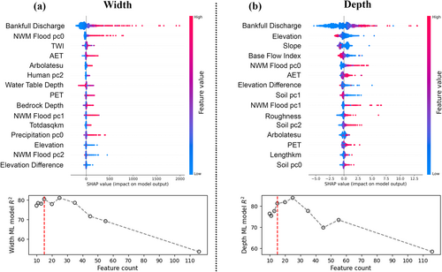
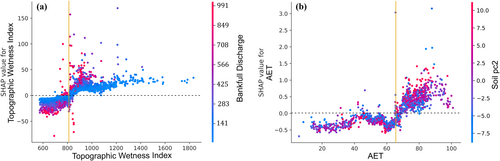
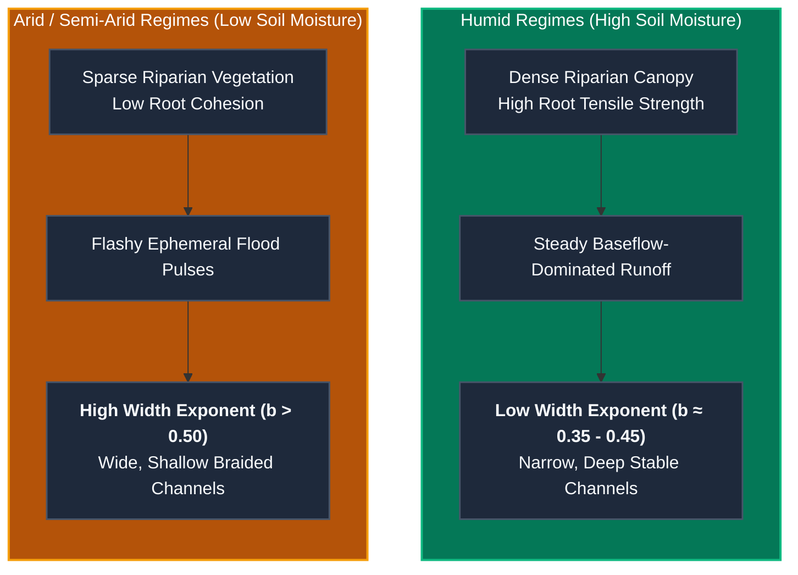

# TopWidth: Explainable AI & Geomorphic Drivers (v1.0)

A central objective of the v1.0 parameterization framework is ensuring that machine learning predictions are not mere statistical correlations, but physically consistent representations of fluvial mechanics ([Modaresi Rad et al., 2024](https://doi.org/10.1029/2024JH000173)). To interpret model behavior, quantify the contribution of each predictor, and discover non-linear environmental couplings, we utilize **TreeSHAP (SHapley Additive exPlanations)** grounded in cooperative game theory ([Lundberg & Lee, 2017](https://doi.org/10.48550/arXiv.1705.07874)).

---

## Game-Theoretic Formulation (TreeSHAP)

For any given stream reach $x$, TreeSHAP decomposes the model prediction $f(x)$ into an additive sum of a base expected value $\phi_0 = \mathbb{E}[f(x)]$ and reach-specific attribution values $\phi_j(x)$ for each environmental feature $j$:

$$f(x) = \phi_0 + \sum_{j=1}^M \phi_j(x)$$

The exact Shapley attribution $\phi_j$ is computed by evaluating the marginal contribution of feature $j$ across all possible feature subsets $S \subseteq F \setminus \{j\}$:

$$\phi_j(x) = \sum_{S \subseteq F \setminus \{j\}} \frac{|S|! \, (|F| - |S| - 1)!}{|F|!} \left[ f_x(S \cup \{j\}) - f_x(S) \right]$$

This formulation satisfies four essential game-theoretic properties:

1. **Efficiency**: $\sum_{j=1}^M \phi_j(x) = f(x) - \mathbb{E}[f(x)]$ (exact sum to the model prediction delta).
2. **Symmetry**: Identical features receive identical attributions.
3. **Dummy/Null Player**: Features with zero marginal impact receive $\phi_j = 0$.
4. **Additivity**: Attributions from ensembled models sum linearly.

---

## Global Feature Importance Ranking

The global importance of each hydro-geomorphic feature was evaluated across all CONUS training reaches by calculating the mean absolute Shapley value:

$$I_j = \frac{1}{N} \sum_{i=1}^N |\phi_j(x_i)|$$

{ loading=lazy }
*Figure 1: Global TreeSHAP feature importance ranking and summary beeswarm plot for the v1.0 TopWidth model ([Modaresi Rad et al., 2024](https://doi.org/10.1029/2024JH000173)). Points represent individual stream reaches, with color indicating raw feature value (red = high, blue = low) and x-position indicating positive or negative impact on predicted top width.*

```mermaid
flowchart TD
    subgraph DRIVERS ["Dominant Hydro-Geomorphic Controls"]
        direction TB
        QBF["<b>1. Bankfull Discharge (Q<sub>bf</sub>)</b><br/>Primary volumetric driver of channel-forming capacity"]
        PC0["<b>2. Flood Frequency PC0</b><br/>Hydrograph peak skewness & multi-decadal recurrence (NWM 2.1)"]
        TWI["<b>3. Topographic Wetness Index (TWI)</b><br/>Valley saturation, groundwater convergence & floodplain width"]
        SM["<b>4. Long-Term Soil Moisture (&theta;)</b><br/>Bank vegetation density, root cohesion & shear resistance"]
        SCALE["<b>5. Drainage Scale (A & arb_sum)</b><br/>Spatial accumulation of runoff and sediment load"]
        SLOPE["<b>6. Channel Bed Slope (S)</b><br/>Energy gradient governing lateral widening vs. vertical incision"]
        SOIL["<b>7. Soil Texture (% Clay, K<sub>sat</sub>)</b><br/>Geotechnical cohesion and bank erodibility"]
    end

    classDef default fill:#1e293b,stroke:#475569,stroke-width:1.5px,color:#f8fafc;
    classDef primary fill:#0284c7,stroke:#38bdf8,stroke-width:2px,color:#ffffff;
    classDef secondary fill:#059669,stroke:#34d399,stroke-width:2px,color:#ffffff;
    class QBF,PC0 primary;
    class TWI,SM secondary;
```

### Physical Interpretation of Top Drivers

| Rank | Feature | Physical & Hydro-Geomorphic Mechanism | SHAP Value Trend |
| :---: | :--- | :--- | :--- |
| **1** | **Bankfull Discharge ($Q_{bf}$)** | Governs the total kinetic energy and volumetric flow available to shape channel boundaries during dominant 1.5–2 year flood events. | High $Q_{bf}$ strongly increases top width ($\phi > 0$). |
| **2** | **Flood Frequency PC0** | First principal component of NWM 2.1 flood frequency moments; captures hydrograph peak flashiness and multi-year flood variance. | Flashy, peak-heavy flow regimes promote wider, multi-threaded active channels. |
| **3** | **Topographic Wetness Index (TWI)** | $\text{TWI} = \ln(a / \tan \beta)$ reflects valley-floor width, saturated zone extent, and lateral hydraulic convergence. | High TWI environments feature expansive alluvial valleys and wider channels. |
| **4** | **Soil Moisture ($\theta$)** | Multi-year mean soil moisture regulates riparian forest density and root biomass, dictating bank tensile strength and erosion resistance. | Arid soils (low $\theta$) correlate with wider, unconfined channels; humid soils (high $\theta$) narrow channels. |
| **5** | **Drainage Area ($A$) / Arbolate Sum** | Fundamental scaling metrics governing cumulative upstream water and sediment delivery. | Follows classical power-law scaling ($W \propto A^{0.4 - 0.5}$). |
| **6** | **Channel Slope ($S$)** | Governs unit stream power ($\omega = \gamma Q S / W$). High slope channels incise vertically rather than widening laterally. | Steep slopes correlate with narrower, confined channels ($\phi < 0$). |
| **7** | **Clay Fraction & Saturated Conductivity ($K_{sat}$)**| High clay content imparts geotechnical cohesion, resisting lateral bank failure and keeping channels narrow and deep. | High clay content reduces top width ($\phi < 0$). |

---

## SHAP Interaction & Dependency Analyses

SHAP interaction values ($\phi_{i, j}$) decompose the combined effect of two variables into their main effects and non-linear joint interactions:

$$\phi_{i, j}(x) = \sum_{S \subseteq F \setminus \{i, j\}} \frac{|S|! \, (|F| - |S| - 2)!}{2 |F|!} \left[ f_x(S \cup \{i, j\}) - f_x(S \cup \{i\}) - f_x(S \cup \{j\}) + f_x(S) \right]$$

{ loading=lazy }
*Figure 2: SHAP dependency and interaction plots showing non-linear physical relationships among soil moisture, TWI, flood frequency PC0, and channel slope ([Modaresi Rad et al., 2024](https://doi.org/10.1029/2024JH000173)).*

### 1. Soil Moisture $\times$ Bankfull Width Sensitivity

* **Physical Insight**: In arid and semi-arid regions (low soil moisture $\theta < 0.15$), streams lack continuous root reinforcement along their banks. High flash-flood peaks easily erode unconsolidated sands and gravels, driving rapid lateral widening and yielding high width scaling exponents ($b > 0.50$).
* Conversely, in humid climates ($\theta > 0.35$), dense root networks and cohesive fine-grained soils stabilize channel margins, forcing flow increases to be accommodated primarily through vertical scour and velocity acceleration ($b \approx 0.35 - 0.45$).

### 2. Topographic Wetness Index (TWI) $\times$ Flood Frequency PC0

* In flat, broad valley bottoms (high TWI $> 8.5$), elevated flood frequency PC0 values cause dramatic channel widening as peak discharges spread across unconfined alluvial deposits.
* In steep, V-shaped bedrock canyons (low TWI $< 5.0$), even severe flood events cannot widen the channel laterally due to structural valley confinement, directing energy into bed scouring.

### 3. Channel Bed Slope $\times$ Drainage Scale

* For small headwater catchments ($A < 20\text{ km}^2$), steep slopes ($S > 0.03$) suppress channel width by maximizing vertical shear stress.
* For lowland river reaches ($S < 0.001$), top width expands rapidly with drainage area as lateral bank erosion and meander migration dominate over bed degradation.

---

## Local Case Study Explanations

To illustrate how the ensemble model adapts to regional geomorphic contexts, consider three distinct continental archetypes:

```mermaid
flowchart TD
    subgraph APPALACHIAN ["Humid Appalachian Headwater (Order 2)"]
        A_IN["High Soil Moisture (&theta; = 0.38)<br/>Steep Slope (S = 0.025)<br/>High Clay Cohesion (28%)"]
        A_SHAP["SHAP Attributions:<br/>&bull; Slope: -1.8 m<br/>&bull; Soil Moisture: -1.2 m<br/>&bull; Clay: -0.9 m"]
        A_OUT["<b>Predicted Width: 4.8 m</b><br/><i>Narrow, Confined Mountain Bed</i>"]
        A_IN --> A_SHAP --> A_OUT
    end

    subgraph DESERT ["Arid Great Basin Wash (Order 2)"]
        D_IN["Low Soil Moisture (&theta; = 0.08)<br/>High Flash Flood PC0 (+2.4)<br/>Low Clay Cohesion (6%)"]
        D_SHAP["SHAP Attributions:<br/>&bull; Flood PC0: +4.2 m<br/>&bull; Soil Moisture: +2.8 m<br/>&bull; Low Cohesion: +1.9 m"]
        D_OUT["<b>Predicted Width: 18.5 m</b><br/><i>Wide, Unconfined Ephemeral Wash</i>"]
        D_IN --> D_SHAP --> D_OUT
    end

    subgraph MIDWEST ["Midwestern Alluvial River (Order 6)"]
        M_IN["High Drainage Area (A = 8,400 km&sup2;)<br/>High Bankfull Flow (Q<sub>bf</sub> = 420 m&sup3;/s)<br/>High TWI (9.2)"]
        M_SHAP["SHAP Attributions:<br/>&bull; Q<sub>bf</sub>: +32.4 m<br/>&bull; TWI: +8.5 m<br/>&bull; Drainage Area: +14.2 m"]
        M_OUT["<b>Predicted Width: 88.6 m</b><br/><i>Expansive Alluvial Floodway</i>"]
        M_IN --> M_SHAP --> M_OUT
    end

    classDef default fill:#1e293b,stroke:#475569,stroke-width:1.5px,color:#f8fafc;
    classDef card1 fill:#1e3a8a,stroke:#3b82f6,stroke-width:2px,color:#ffffff;
    classDef card2 fill:#78350f,stroke:#d97706,stroke-width:2px,color:#ffffff;
    classDef card3 fill:#064e3b,stroke:#059669,stroke-width:2px,color:#ffffff;
    class APPALACHIAN card1;
    class DESERT card2;
    class MIDWEST card3;
```

---

## Fluvial Geomorphic Consistency

!!! success "Verification Against Classical Fluvial Theory"
    The XAI analyses rigorously confirm that the machine learning pipeline adheres to established physical principles:

    1. **Leopold & Maddock (1953)**: Power-law downstream scaling governed by discharge and drainage area.
    2. **Schumm (1960)**: Narrowing and deepening of channels in response to high sediment clay/silt fractions and cohesive bank boundaries.
    3. **Hack (1957) & Flint (1974)**: Slope-area concavity relationships governing channel energy distribution and valley confinement.
    4. **Millar (2005)**: Direct influence of riparian bank vegetation and root biomass on channel width-to-depth ratios.
