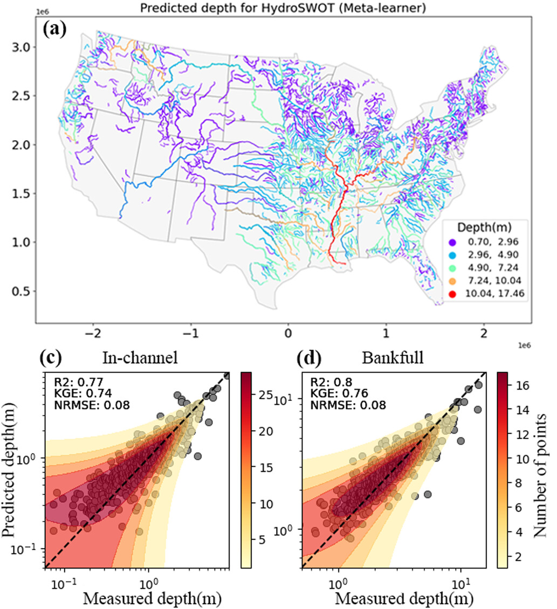
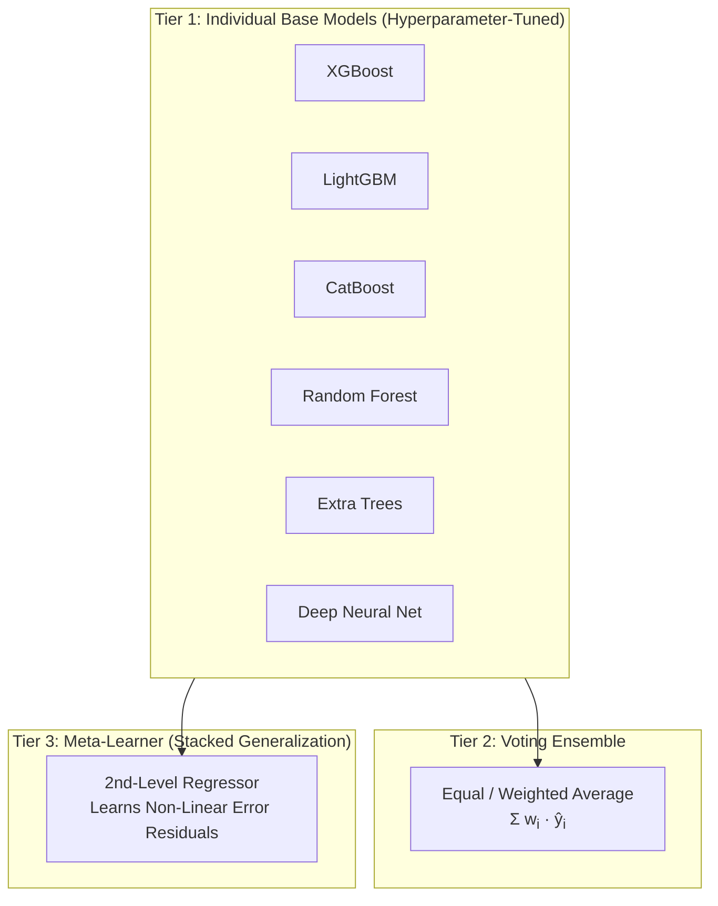

# Continental River Depth Parameterization

---

## Executive Summary

River channel depth ($Y$ or $d$) is the primary vertical dimension governing in-channel conveyance capacity, bed shear stress distribution, and sediment transport dynamics. Across continental river networks, accurate representation of in-channel and bankfull depth is severely hindered by the **missing bathymetry problem** in digital elevation models (DEMs). 

Version **v1.0** of the FEMA/NOAA-OWP channel geometry framework introduces a machine learning framework to predict in-channel and bankfull channel depths (**$Y_{\text{in}}$ at 100% AEP** and **$Y_{\text{bf}}$ at 50% AEP**) and hydraulic geometry scaling exponents across all **2.7 million+ Reference Fabric COMID stream reaches** in the Conterminous United States (CONUS).

```mermaid
flowchart TD
    subgraph INPUTS ["1. Continental Environmental Predictors (116 Features)"]
        direction LR
        HYD["<b>Hydrofabric & Topology</b><br/>Stream Order, Arbolate Sum, Length"]
        SOIL["<b>Soil & Geotechnical</b><br/>Clay %, K<sub>sat</sub>, Moisture &theta;<sub>s</sub>"]
        DEM["<b>DEM & Terrain</b><br/>Slope, Relief, TWI Index"]
        CLIM["<b>Climate & Flow Dynamics</b><br/>MAP, Aridity, NWM 2.1 Frequencies"]
    end

    subgraph REDUCTION ["2. Dimensionality Reduction & Feature Optimization"]
        AE["<b>Expert Screening &bull; Elbow Method &bull; PCA Decompositions</b><br/>Compresses 116 environmental predictors into 60 parsimonious, orthogonal features"]
    end

    subgraph ENSEMBLE ["3. Multi-Tier Modeling Cascade"]
        direction LR
        subgraph T1 ["Tier 1: Best Single Model"]
            M1["<b>Tuned GBDT Regressor</b><br/><i>(e.g., CatBoost / XGBoost)</i>"]
        end

        subgraph T2 ["Tier 2: Voting Ensemble"]
            M2["<b>Consensus Average</b><br/>Mean of top 6&ndash;8 tuned models"]
        end

        subgraph T3 ["Tier 3: Meta-Learner"]
            M3["<b>Stacking Super-Learner</b><br/>Level-1 meta-model on OOF outputs"]
        end
    end

    subgraph OUTPUTS ["4. 100% & 50% AEP Depth & AHG Exponent Parameterization"]
        direction LR
        DEPTH_IN["<b>In-Channel Depth (100% AEP)</b><br/><code>Y<sub>in</sub></code> at 100% AEP flow (Q<sub>100%</sub>)<br/><i>Mean annual active in-channel depth</i>"]
        DEPTH_BF["<b>Bankfull Depth (50% AEP)</b><br/><code>Y<sub>bf</sub></code> at 50% AEP flow (Q<sub>50%</sub>)<br/><i>2-year channel-forming bankfull depth</i>"]
        AHG_F["<b>AHG Depth Exponent (f)</b><br/><code>f = &part;ln(Y)/&part;ln(Q)</code><br/><i>(Used with b for Dingman r = f / b)</i>"]
    end

    INPUTS ==> REDUCTION
    REDUCTION ==> ENSEMBLE
    ENSEMBLE ==> OUTPUTS

    class INPUTS highlight-blue;
    class REDUCTION highlight-blue;
    class T1 highlight-blue;
    class T2 highlight-teal;
    class T3 highlight-orange;
    class DEPTH_IN highlight-teal;
    class DEPTH_BF highlight-orange;
    class AHG_F highlight-blue;
```

---

## Key Highlights & Performance Metrics

| Metric / Dimension | Value / Finding | Scientific Significance |
| :--- | :--- | :--- |
| **CONUS Scope** | **2,770,000+ Reaches** | Complete high-resolution coverage across all Reference Fabric COMIDs |
| **Observation Base** | **3,500+ USGS / HYDRoSWOT ADCP Sites** | Quality-screened acoustic Doppler current profiler velocity-depth surveys ($R^2 \ge 0.80$) |
| **Median Test NNSE** | **$\mathbf{> 0.88}$ (Meta-Learner)** | Normalized Nash-Sutcliffe Efficiency demonstrating high predictive accuracy |
| **Extreme Flow Reliability** | **$R^2 = 0.84$ at $Q_{\max}$** | Accurate generalization at maximum observed historical flows without catastrophic saturation |
| **Regional Benchmark** | **+28% to +45% Gain over Literature** | Statistically outperforms Blackburn-Lynch et al. (2017) and Bieger et al. (2015) across all 20 HLRs |
| **Stacking Superiority** | **Meta-Learner > Voting > Best Single** | Stacked meta-learner reduces residual variance by learning regional model error correlations |

---

## The Missing Bathymetry Problem

Digital Elevation Models derived from spaceborne radar (e.g., SRTM, NASADEM) or airborne Near-Infrared (NIR) LiDAR effectively capture floodplain and valley topography. However, infrared and optical wavelengths cannot penetrate open water bodies. Consequently, elevation grids represent the **water surface elevation** at the time of data acquisition rather than the true channel bed.

!!! danger "Hydraulic Consequences of Missing Bathymetry"
    Omitting in-channel bathymetry causes 1D and 2D hydrodynamic engines (e.g., HEC-RAS, NOAA NextGen FIM) to:
    
    1. **Underestimate In-Channel Conveyance Area ($A$)**: Low-to-moderate flows prematurely spill into overbank zones.
    2. **Overestimate Flood Extent and Inundation Depth**: Water levels artificially rise above natural flood thresholds.
    3. **Distort Boundary Shear Stress ($\tau_0 = \gamma R S$)**: Precludes realistic sediment transport, bed mobility, and roughness routing.

The **Functional Hydraulic Geometry (FHG)** framework solves this fundamental data gap by learning predictive relationships between hydro-environmental catchment drivers and the parameters governing channel depth across discharge regimes.

---

## Two Flow Regimes: In-Channel (100% AEP) vs. Bankfull (50% AEP) Depth

The v1.0 framework parameterizes channel depth under two fundamental hydrologic benchmarks defined by USGS NWIS flood frequency annual exceedance probabilities:

| Dimension | Governing Discharge | Hydrologic Definition | Training Data Derivation |
| :--- | :--- | :--- | :--- |
| **In-Channel Depth ($Y_{\text{in}}$)** | **100% AEP Discharge ($Q_{\text{100\% AEP}}$)** | 1-year recurrence interval / mean annual flow within active banks. | Extracted directly from USGS HYDRoSWOT ADCP stage-discharge rating curves at the 100% AEP flow threshold. |
| **Bankfull Depth ($Y_{\text{bf}}$)** | **50% AEP Discharge ($Q_{\text{50\% AEP}}$)** | 2-year recurrence interval ($Q_2$) channel-forming bankfull flow. | Extracted directly from USGS HYDRoSWOT ADCP stage-discharge rating curves at the 50% AEP flow threshold. |

The ML ensemble directly learns and predicts both **$Y_{\text{in}}$** (at 100% AEP) and **$Y_{\text{bf}}$** (at 50% AEP) across all CONUS reaches. In parallel, continuous At-a-station Hydraulic Geometry (AHG) power laws are fitted to the multi-flow ADCP soundings to extract the depth scaling exponent $f$, which is coupled with width exponent $b$ exclusively to derive the Dingman cross-sectional shape parameter ($r = f/b$).

---

## Theoretical Formulation: At-a-Station Hydraulic Geometry & Continuity

Following Leopold & Maddock (1953), hydraulic cross-section variables (Top Width $W$, Mean Depth $Y$, and Mean Velocity $V$) scale with discharge ($Q$) as power-law functions:

$$
\begin{aligned}
W &= a \cdot Q^b \\
Y &= c \cdot Q^f \\
V &= k \cdot Q^m
\end{aligned}
$$

### Continuity Constraints & Exponent Sum Rules

By conservation of mass for open channel flow ($Q = W \cdot Y \cdot V = (a \cdot c \cdot k) \cdot Q^{b + f + m}$), exact continuity constraints must hold:

$$
a \cdot c \cdot k = 1.0 \quad \text{and} \quad b + f + m = 1.0
$$

### Role of Depth Exponent ($f$) in Shape Parameterization

The depth scaling exponent $f$ governs the rate of vertical channel deepening with flow ($\frac{dY}{dQ} = c \cdot f \cdot Q^{f-1}$). In the v1.0 pipeline, $f$ is predicted to calculate the continuous **Dingman cross-sectional shape exponent**:

$$
r = \frac{f}{b} = \frac{1 - b}{b}
$$

where higher $f/b$ ratios indicate entrenched, steep-walled channels and lower ratios denote wide, shallow alluvial channels.

---

## Continental Predictions Across CONUS

Using the trained multi-tier ensemble, FHG exponent $f$, coefficient $c$, and bankfull depth $Y_{bf}$ were predicted for all ~2.77M COMID reaches across the Conterminous United States:

{ loading=lazy }

### Continental Geomorphic Patterns

1. **Mountainous and Headwater Systems (Rockies, Cascades, Appalachians)**:
    * Characterized by lower $f$ values and higher bed roughness, reflecting steep valley confinement and coarse cobble/boulder beds where flow energy is dissipated in turbulent resistance rather than progressive channel incision.
2. **Alluvial Lowlands and Great Plains (Mississippi, Missouri, Ohio River Basins)**:
    * Exhibit smooth downstream transitions with stable $f \approx 0.35\text{--}0.42$, indicating equilibrium alluvial regimes where depth scales predictably with cumulative discharge.
3. **Coastal Plains & Semi-Arid Southwest**:
    * Display localized variability driven by sandy, highly erodible bank materials (promoting high width adjustment $b$) versus highly cohesive clay-rich soils (promoting vertical deepening $f$).

---

## Multi-Tier Modeling Architecture

To overcome the limitations of individual ML algorithms, v1.0 deploys a three-tier stacked generalization framework:

1. **Tier 1 — Best Individual Model**: Out-of-bag tuned Gradient Boosted Decision Tree (GBDT).
2. **Tier 2 — Voting Ensemble**: Blends predictions across the top 6–8 tuned models to mitigate individual algorithm variance.
3. **Tier 3 — Meta-Learner**: Learns how individual model errors vary with catchment physiography (e.g., favoring tree models in high-relief headwaters and neural architectures in low-gradient basins), delivering the highest overall skill.

---

## Section Navigation

Explore the complete v1.0 Depth parameterization documentation across the dedicated technical sections:

-   :material-cpu-64-bit:{ .lg .middle } **[Model Architecture](models.md)**
    
    ---
    
    Detailed breakdown of candidate ML models, feature engineering, elbow method and PCA dimensionality reduction, and the Stacking Meta-Learner architecture.
    
    [:octicons-arrow-right-24: View Model Architecture](models.md)

-   :material-chart-bell-curve-cumulative:{ .lg .middle } **[Model Skill & Evaluation](skill.md)**
    
    ---
    
    Continental USGS station validation, Normalized NSE (NNSE) distributions, extreme flow ($Q_{\max}$) scatter diagnostics, and benchmarking against Blackburn-Lynch (2017), Bieger (2015), and Doyle (2023).
    
    [:octicons-arrow-right-24: View Model Performance](skill.md)

-   :material-brain:{ .lg .middle } **[Explainable AI (XAI)](xai.md)**
    
    ---
    
    Game-theoretic SHAP global feature attributions, non-linear interaction dependencies, and physical interpretations connecting environmental drivers to channel depth dynamics.
    
    [:octicons-arrow-right-24: Explore Explainability](xai.md)

---

## References

1. **Modaresi Rad, A., et al. (2024)**. *Enhancing River Channel Dimension and Bathymetry Estimates Across Continental Scale Using Machine Learning and Functional Hydraulic Geometry*. Journal of Geophysical Research: Machine Learning and Computation, 1(3), e2024JH000173. [doi:10.1029/2024JH000173](https://doi.org/10.1029/2024JH000173)
2. **Leopold, L. B., & Maddock, T. (1953)**. *The hydraulic geometry of stream channels and some physiographic implications*. US Geological Survey Professional Paper 252.
3. **Blackburn-Lynch, W., et al. (2017)**. *Development of regional hydraulic geometry curves for the contiguous United States*. Journal of the American Water Resources Association, 53(4), 903–928.
4. **Bieger, K., et al. (2015)**. *Development of bankfull hydraulic geometry equations for the national water model*. Journal of the American Water Resources Association, 51(3), 842–856.
5. **Doyle, J. M., et al. (2023)**. *Continental-scale river geometry prediction using machine learning*. Water Resources Research, 59(4), e2022WR033621.
