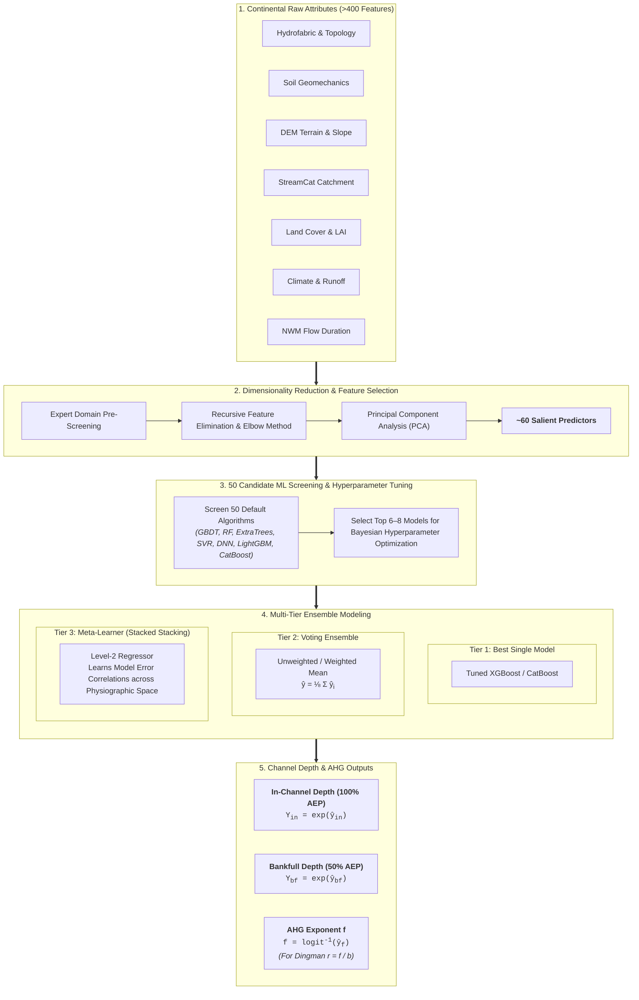
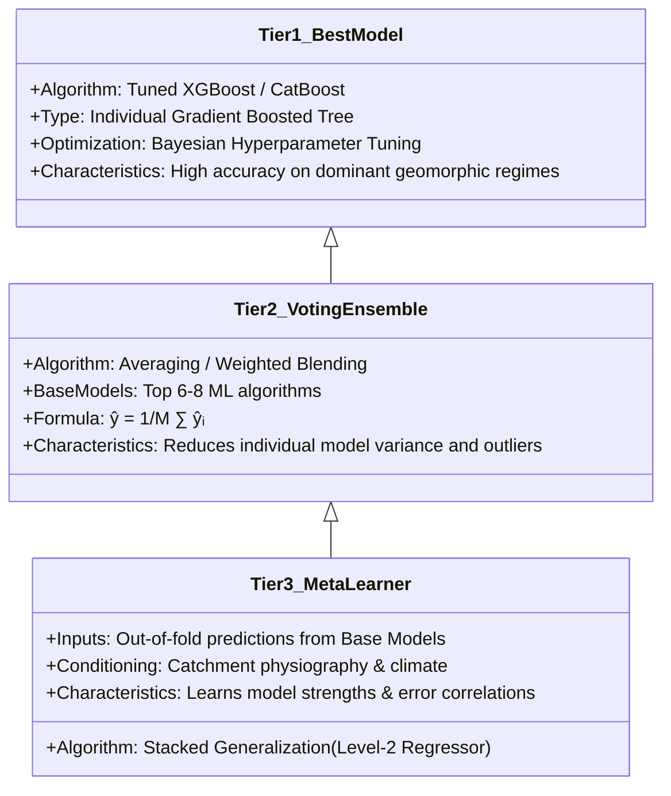

# Model Architectures & Multi-Tier Ensemble (v1.0)

> **Publication Reference**: Modaresi Rad, A., et al. (2024). *Enhancing River Channel Dimension and Bathymetry Estimates Across Continental Scale Using Machine Learning and Functional Hydraulic Geometry*. **Journal of Geophysical Research: Machine Learning and Computation**, 1(3), e2024JH000173.

---

## Overview

Predicting river channel depth across continental hydro-climatic gradients requires capturing highly non-linear interactions among fluvial geology, valley topography, soil mechanical properties, and upstream flow regime. In version **v1.0**, channel depth is modeled through two complementary mathematical formulations implemented across a **three-tier stacked ensemble architecture**.



---

## Target Formulation & Physical Flow Benchmarks

The v1.0 Depth pipeline trains machine learning models to predict both dimensional channel depths and hydraulic scaling exponents:

### 1. In-Channel & Bankfull Depth Predictions

Rather than relying purely on empirical scaling, models directly predict physical water depths at standardized hydrologic flow thresholds:
- **In-Channel Depth ($Y_{\text{in}}$)**: Evaluated at the **100% AEP discharge** ($Q_{\text{100\% AEP}}$, 1-year mean annual flow).
- **Bankfull Depth ($Y_{\text{bf}}$)**: Evaluated at the **50% AEP discharge** ($Q_{\text{50\% AEP}}$, 2-year channel-forming flood).

Target depths are log-transformed ($\ln(Y)$) during training to stabilize residual variance across small headwater streams ($Y < 0.5\text{ m}$) and major continental rivers ($Y > 10\text{ m}$):

$$
y_Y = \ln(Y) \implies \hat{Y} = \exp(\hat{y}_Y)
$$

### 2. At-a-Station Hydraulic Geometry Exponent ($f$)

In parallel, continuous At-a-station Hydraulic Geometry (AHG) power-law relationships ($Y = c \cdot Q^f$) are fitted across the multi-flow ADCP soundings under continuity constraints ($b + f + m = 1.0$). The depth exponent $f$ is predicted to calculate the continuous **Dingman cross-sectional shape parameter**:

$$
r = \frac{f}{b} = \frac{1 - b}{b}
$$

which governs the vertical-to-lateral geometry of the submerged channel bed.

---

## Predictor Space & Dimensionality Reduction

The initial feature repository comprises **>400 environmental variables** aggregated from national geospatial hydro-environmental datasets:

| Domain | Key Features | Physical Mechanism for Depth |
| :--- | :--- | :--- |
| **Hydrofabric & Topology** | Strahler stream order, arbolate sum, path length, upstream drainage area ($A_{\text{up}}$) | Governs cumulative volume conveyance and downstream hydraulic scale |
| **Soil & Geotechnical** | % clay, % silt, % sand, $K_{\text{sat}}$ (saturated hydraulic conductivity), $\theta_s$ (water capacity), depth to bedrock | High clay content increases bank cohesion, forcing vertical incision ($f \uparrow$) over widening |
| **DEM & Topography** | Channel slope ($S$), valley slope, elevation, relief diversity, NED physiographic diversity | High slope increases flow velocity and stream power ($\Omega = \gamma Q S$), altering incision potential |
| **StreamCat Attributes** | Baseflow Index (`BFI`), % impervious, road density, % urban/forest cover | High BFI creates sustained baseflows with stable equilibrium channel depths |
| **Land Surface / Vegetation** | Leaf Area Index (`LAI`), NDVI, actual evapotranspiration (`AET`) | Root density stabilizes banks; vegetation regulates catchment runoff ratios |
| **Climate & Hydrology** | Mean annual precipitation (`MAP`), aridity index, precipitation seasonality, temperature | Drives long-term mean annual discharge and flood peak magnitudes |
| **NWM Flow Statistics** | Flow duration quantiles ($Q_{10}, Q_{50}, Q_{90}$), bankfull discharge ($Q_{bf}$), return period flows ($Q_{2}, Q_{10}, Q_{100}$) | Sets the energetic discharge spectrum governing channel geometry formation |

### Dimensionality Reduction Pipeline

To avoid collinearity, mitigate the curse of dimensionality, and eliminate spurious correlations, dimensionality reduction is performed in three methodical stages:

1. **Expert Domain Knowledge Pre-Screening**: Initial candidate variables are vetted to eliminate physically uninformative or redundant indicators.
2. **Recursive Feature Elimination & Elbow Method**: Iteratively trains gradient boosted models, dropping the least influential predictors while tracking model skill (KGE, NNSE). The **Elbow Method** is used to identify the optimal inflection point that maximizes predictive performance with minimal complexity.
3. **Principal Component Analysis (PCA)**: High-dimensional collinear thematic subsets (such as multi-recurrence flood frequency distributions and soil textural profiles) are decomposed into orthogonal principal components (PC0, PC1, etc.).

This optimizes the predictor space to **~60 orthogonal, physically informative features**.

---

## Multi-Tier Modeling Strategies

Rather than relying on a single learning algorithm, the framework implements a three-tier hierarchical architecture:



### Tier 1: Best Individual ML Model

* Evaluates **50 candidate regression algorithms** (including Random Forest, Extra Trees, XGBoost, LightGBM, CatBoost, Support Vector Machines, Multi-Layer Perceptrons, Ridge/ElasticNet) with default parameters to establish robust inductive biases.
* Selects the single highest-performing algorithm—typically **XGBoost (Extreme Gradient Boosting)** or **CatBoost**—and performs Bayesian hyperparameter optimization over tree depth, learning rate, subsample ratio, and regularizers ($\lambda, \alpha$).

### Tier 2: Voting Ensemble

Combines the out-of-fold predictions of the top 6–8 tuned models:

$$
\hat{Y}_{\text{voting}} = \sum_{m=1}^{M} w_m \hat{Y}_m, \quad \text{where } \sum_{m=1}^M w_m = 1.0
$$

Averaging across diverse model families (tree ensembles, linear regularizers, neural nets) dampens idiosyncratic variance and suppresses extreme outlier errors.

### Tier 3: Meta-Learner (Stacked Generalization)

The **Meta-Learner** operates one level above standard ML models by learning from the *predictions of other models* rather than raw historical attributes alone:

$$
\hat{Y}_{\text{meta}} = \mathcal{F}_{\text{meta}}\left(\hat{Y}_1, \hat{Y}_2, \dots, \hat{Y}_M; \mathbf{Z}_{\text{physio}}\right)
$$

* **Mechanism**: During training, $K$-fold cross-validation generates out-of-fold predictions for each base model. The level-2 meta-learner is trained on these held-out predictions alongside key physiographic indicators ($\mathbf{Z}_{\text{physio}}$).
* **Physical Synergy**: The meta-learner discovers regional regimes where specific base models excel. For example:
    * Tree ensembles accurately capture step-change geomorphic thresholds in steep, faulted mountain reaches.
    * Neural network representations capture smooth, continuous power-law growth in expansive low-gradient alluvial basins.
* **Result**: The Meta-Learner dynamically weights the base models across physiographic space, achieving lower residual variance and higher cumulative skill than any single model or unweighted ensemble.

---

## Log-Space Transformation & Bias Correction

Channel depth $Y$ spans multiple orders of magnitude across headwaters ($Y \sim 0.2\,\text{m}$) and major continental rivers ($Y > 15\,\text{m}$). Training directly in arithmetic space leads to severe heteroscedasticity and large-river bias.

### 1. Logarithmic Target Transformation

Target variables ($Y$, $f$, $c$) are transformed into natural log space:

$$
y_{\log} = \ln(Y + \epsilon)
$$

### 2. Analytical Smearing / Bias Correction

Because $\mathbb{E}[\exp(X)] \neq \exp(\mathbb{E}[X])$, direct exponentiation of log-space predictions underestimates arithmetic means. Predictions are corrected using the analytical variance smearing factor:

$$
\hat{Y} = \exp\left(\hat{y}_{\log} + \frac{\sigma^2_{\text{val}}}{2}\right) - \epsilon
$$

where $\sigma^2_{\text{val}}$ is the residual mean squared error evaluated on the validation fold.

---

## Overfitting Prevention & Cross-Validation

To ensure genuine out-of-sample generalization across unseen hydrographic basins:

```
Continental Dataset (3,500+ Gauged Sites / HYDRoSWOT ADCP)
┌───────────────────────────────────────────────────────────────┐
│                    K-Fold Spatial Split                       │
├──────────────┬──────────────┬──────────────┬──────────────────┤
│ Fold 1 (20%) │ Fold 2 (20%) │ Fold 3 (20%) │ ... Fold 5 (20%) │
└──────────────┴──────────────┴──────────────┴──────────────────┘
       │
       ├── Training Set (80%): Multi-Seed Gradient Boosting + Early Stopping
       ├── Validation Set: Evaluates patience threshold (100 rounds)
       └── Out-of-Bag Test Set: Final blind evaluation (NNSE, KGE, RMSE)
```

1. **10-Fold Cross-Validation**: Field gauging stations across all 1,432 distinct river systems are partitioned across 10 folds to ensure rigorous out-of-bag (OOB) and out-of-fold (OOF) blind evaluation.
2. **Early Stopping Regularization**: Training terminates when validation loss fails to decrease for 50 consecutive iterations.
3. **Tree Subsampling & Regularization**: Tree models subsample features (`colsample_bytree = 0.70–0.80`) and training instances (`subsample = 0.80–0.85`) at each split to prevent overfitting.

---

## Section Navigation

- [Depth v1.0 Overview](index.md) — Problem statement, FHG continuity formulation, and summary.
- [Model Skill & Evaluation](skill.md) — Continental USGS validation, NNSE CDFs, max flow diagnostics, and literature benchmarking.
- [Explainable AI (XAI)](xai.md) — Global SHAP attributions, feature interaction analyses, and physical mechanisms.
