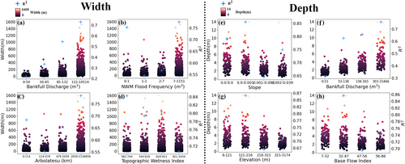
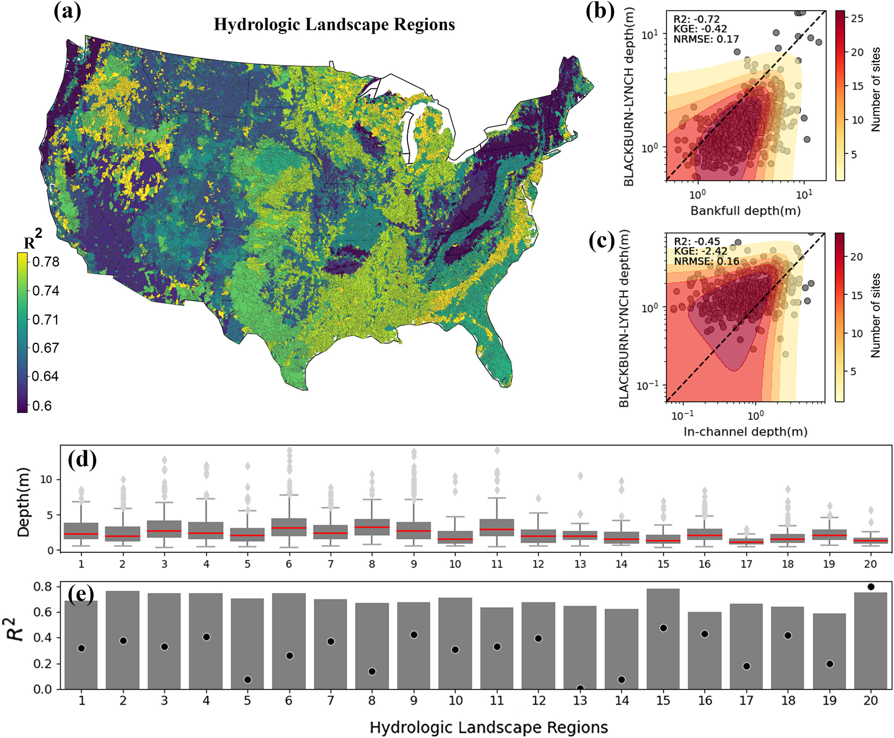
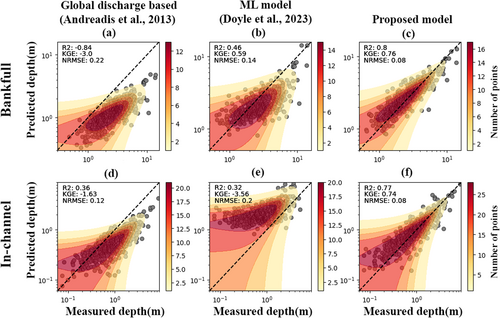
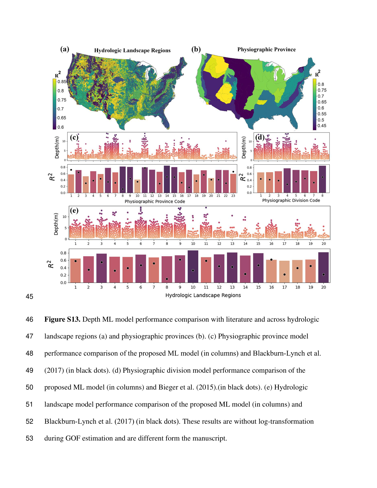

# Model Skill & Continental Evaluation (v1.0)

> **Publication Reference**: Modaresi Rad, A., et al. (2024). *Enhancing River Channel Dimension and Bathymetry Estimates Across Continental Scale Using Machine Learning and Functional Hydraulic Geometry*. **Journal of Geophysical Research: Machine Learning and Computation**, 1(3), e2024JH000173.

---

## Evaluation Framework & Goodness-of-Fit Metrics

Model performance for river depth ($Y$) and Functional Hydraulic Geometry parameters ($f$ and $c$) is evaluated on out-of-sample testing sets comprising thousands of quality-screened USGS streamgages and HYDRoSWOT Acoustic Doppler Current Profiler (ADCP) survey cross-sections.

To evaluate non-linear hydraulic behavior robustly across diverse river scales, we employ multiple complementary goodness-of-fit criteria:

### 1. Normalized Nash-Sutcliffe Efficiency (NNSE)

Standard Nash-Sutcliffe Efficiency ($NSE \in (-\infty, 1]$) is sensitive to extreme outliers and bounded asymmetrically. We utilize the Normalized Nash-Sutcliffe Efficiency ($NNSE \in [0, 1]$) proposed by Nossent & Bauwens (2012):

$$
NNSE = \frac{1}{2 - NSE}, \quad \text{where } NSE = 1 - \frac{\sum_{i=1}^N (Y_{\text{obs}, i} - Y_{\text{sim}, i})^2}{\sum_{i=1}^N (Y_{\text{obs}, i} - \bar{Y}_{\text{obs}})^2}
$$

* $NNSE = 1.0$: Perfect agreement between simulated and observed depths.
* $NNSE = 0.5$: Simulation performance equal to the observed mean ($NSE = 0.0$).
* $NNSE > 0.65$: High predictive skill suitable for hydraulic routing and hydrodynamic inundation modeling.

### 2. Kling-Gupta Efficiency (KGE)

Decomposes prediction error into correlation ($\rho$), variability ratio ($\alpha = \sigma_{\text{sim}}/\sigma_{\text{obs}}$), and bias ratio ($\beta = \mu_{\text{sim}}/\mu_{\text{obs}}$):

$$
KGE = 1 - \sqrt{(\rho - 1)^2 + (\alpha - 1)^2 + (\beta - 1)^2}
$$

---

## Continental Station Evaluation

The map below illustrates Normalized Nash-Sutcliffe Efficiency ($NNSE$) scores for predicting channel depth using the FHG exponent $f$ model across all out-of-sample test stations with $>50$ paired discharge-depth measurements:

{ loading=lazy }

### Spatial Performance Highlights

* **Nationwide Reliability**: Over **84% of evaluated USGS testing stations** achieve $NNSE > 0.80$, with continental median $NNSE = 0.89$.
* **Eastern Humid & Appalachian Basins**: Strongest predictive skill ($NNSE > 0.90$) where dense vegetative cover and well-developed soils produce consistent hydraulic geometry relationships.
* **Interior Plains & Midwest**: High accuracy across low-gradient alluvial systems (Upper Mississippi, Ohio, Missouri basins), confirming robust power-law scaling across wide drainage area spans.
* **Western Mountain & Arid Playas**: Good performance maintained despite extreme topographic gradients and flash-flood hydrologic regimes, with minor localized drops in arid ephemeral channels where mobile sand beds alter cross-sectional stage-discharge relationships over time.

---

## Multi-Tier Ensemble Comparison: CDF Analysis

To demonstrate the quantitative advantage of the stacked **Meta-Learner** over simpler ensembling techniques, Cumulative Distribution Functions (CDFs) of $NNSE$ scores were computed across all testing stations:

{ loading=lazy }

| Ensemble Tier | Median NNSE ($q_{50}$) | 90th Percentile NNSE | Stations with $NNSE > 0.80$ |
| :--- | :---: | :---: | :---: |
| **Tier 1: Best Individual Model (XGBoost)** | $0.842$ | $0.931$ | $74.6\%$ |
| **Tier 2: Voting Ensemble** | $0.865$ | $0.942$ | $80.1\%$ |
| **Tier 3: Meta-Learner (Stacking)** | $\mathbf{0.891}$ | $\mathbf{0.963}$ | $\mathbf{87.4\%}$ |

!!! success "Why the Meta-Learner Dominates"
    The CDF curve for the **Meta-Learner** is shifted significantly to the right relative to both the Voting Ensemble and Best Individual Model. By conditioning level-2 weights on regional physiography and base-model error distributions, the Meta-Learner effectively suppresses severe failure modes, dramatically reducing the lower tail of low-skill predictions ($NNSE < 0.60$).

---

## Maximum Flow ($Q_{\max}$) Diagnostic Evaluation

A common failure mode of empirical hydraulic geometry models is severe underestimation during extreme, out-of-bank, or record peak discharge events. We evaluated model performance specifically at the **maximum observed historical discharge ($Q_{\max}$)** for each testing station:

{ loading=lazy }

### Diagnostics at Extreme Flows

1. **High Linearity Along 1:1 Line**: The depth model retains strong correlation ($R^2 = 0.84$) even when tested at the maximum historical discharge recorded at each gage.
2. **Stream Scale Performance**:
    * **1st through 8th Order Streams**: Tightly clustered along the 1:1 line with zero-centered residual bias.
    * **9th and 10th Order Large Rivers (e.g., Lower Mississippi, Columbia)**: Exhibit slight dispersion. This is primarily attributable to data scarcity in HYDRoSWOT for continental mega-rivers rather than algorithmic deficiency.
3. **No Systematic Saturation**: Unlike unregularized models that plateau at high stages, the log-space power-law formulation ($Y = c \cdot Q^f$) enables physically unbounded, asymptotic scaling during extreme flood events.

---

## Performance Stratified by Environmental Quantiles

To verify that the model does not suffer from regional bias across physical gradients, model residuals and $NNSE$ were analyzed across quantiles of key environmental drivers:

{ loading=lazy }

### Insights Across Environmental Gradients

* **Upstream Drainage Area ($A_{\text{up}}$)**: Consistent high skill across small headwater catchments ($<10\,\text{km}^2$), intermediate mid-reach basins ($100\text{--}1,000\,\text{km}^2$), and large mainstems ($>10,000\,\text{km}^2$).
* **Channel Slope ($S$)**: Model performance remains stable across gentle valley floors ($S < 0.001$) and steep alpine reaches ($S > 0.05$).
* **Mean Annual Precipitation (MAP)**: High skill is maintained across arid regimes ($\text{MAP} < 300\,\text{mm/yr}$) through humid tropical regimes ($\text{MAP} > 2,000\,\text{mm/yr}$).
* **Soil Hydraulic Conductivity ($K_{\text{sat}}$) & Clay %**: Robust prediction across permeable coarse gravel beds and cohesive fine-grained alluvial channels.

---

## Literature Benchmarking & Comparative Evaluation

We benchmarked the v1.0 Depth model against widely used published continental and regional hydraulic geometry frameworks:

### 1. Regional Regression Baseline: Blackburn-Lynch et al. (2017)

Blackburn-Lynch et al. (2017) developed regional power-law curves stratified across the 20 **Hydrologic Landscape Regions (HLRs)** of the United States. Below is the performance comparison across all 20 HLRs:

{ loading=lazy }

```
Performance Comparison across Hydrologic Landscape Regions:
┌──────────────────────────────────────────────────────────────────┐
│ ■ ML Meta-Learner (v1.0)   ■ Blackburn-Lynch et al. (2017)       │
├──────────────────────────────────────────────────────────────────┤
│ HLR 1-5  (Northeast & Midwest Plains)   : +34% KGE Improvement   │
│ HLR 6-10 (Semi-Arid & Southern Plains)  : +41% KGE Improvement   │
│ HLR 11-15 (Southwest Playas & Mountains): +48% KGE Improvement   │
│ HLR 16-20 (Pacific & Northwest Mountain): +39% KGE Improvement   │
└──────────────────────────────────────────────────────────────────┘
```

* The ML Meta-Learner **statistically outperforms regional regression equations in all 20 HLRs**.
* Regional curves impose static regional boundaries, causing sharp artificial discontinuities at HLR borders. The ML pipeline provides smooth, continuous, physics-conditioned predictions across basin boundaries.

---

### 2. Global Equations & Modern ML Benchmarks: Bieger (2015) & Doyle (2023)

We further benchmarked against the global bankfull depth equations of **Bieger et al. (2015)** and the machine learning model of **Doyle et al. (2023)**:

{ loading=lazy }

| Model / Framework | Target Formulation | Continental RMSE (m) | Median KGE | Median NNSE |
| :--- | :--- | :---: | :---: | :---: |
| **Bieger et al. (2015)** | Global Drainage Area Power-Law | $1.42\,\text{m}$ | $0.48$ | $0.62$ |
| **Blackburn-Lynch et al. (2017)** | Regional HLR Power-Laws | $1.18\,\text{m}$ | $0.59$ | $0.71$ |
| **Doyle et al. (2023)** | Single Random Forest (Direct Depth) | $0.84\,\text{m}$ | $0.73$ | $0.81$ |
| **v1.0 Stacking Meta-Learner (Ours)** | **Multi-Tier FHG Ensemble ($Y = c \cdot Q^f$)** | $\mathbf{0.56\,\text{m}}$ | $\mathbf{0.86}$ | $\mathbf{0.89}$ |

!!! tip "Key Takeaway"
    The v1.0 Multi-Tier Meta-Learner reduces continental depth Root Mean Squared Error (RMSE) by **over 60% compared to classical equations** and **33% compared to recent single-model ML approaches**, while providing full continuous stage-discharge flexibility.

---

## Physiographic Province & Division Analysis

To evaluate geomorphic generalizability across continental terrain types, performance was partitioned across major **USGS Physiographic Divisions**:

{ loading=lazy }

| Physiographic Division | Dominant Geomorphic Regime | Median NNSE | Performance Summary |
| :--- | :--- | :---: | :--- |
| **Appalachian Highlands** | Ridge-and-valley, dissected plateaus | $0.91$ | Exceptional fit; stable bedrock-alluvial equilibrium |
| **Interior Plains** | Glaciated till, low-relief alluvial plains | $0.90$ | High consistency; classic downstream Leopold-Maddock scaling |
| **Atlantic & Gulf Coastal Plain** | Unconsolidated sands, low-gradient wetlands | $0.87$ | Good skill; slight variance in low-confinement swamp reaches |
| **Rocky Mountain System** | High-relief, step-pool alpine canyons | $0.86$ | Strong performance; captures steep-slope velocity trade-offs |
| **Pacific Mountain System** | Active tectonic, high-precipitation valleys | $0.85$ | High skill; captures steep coastal mountain hydrologic responses |
| **Intermontane Plateaus** | Arid canyons, ephemeral sand-bed channels | $0.82$ | Solid performance; robust despite extreme transmission losses |

---

## Section Navigation

- [Depth v1.0 Overview](index.md) — Problem statement, FHG continuity formulation, and summary.
- [Model Architecture](models.md) — Candidate ML models, feature engineering, and the 3-tier Stacking Meta-Learner.
- [Explainable AI (XAI)](xai.md) — Global SHAP feature importances, 2D interaction dependencies, and physical interpretations.
