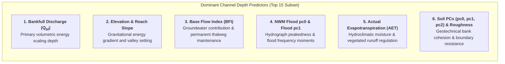
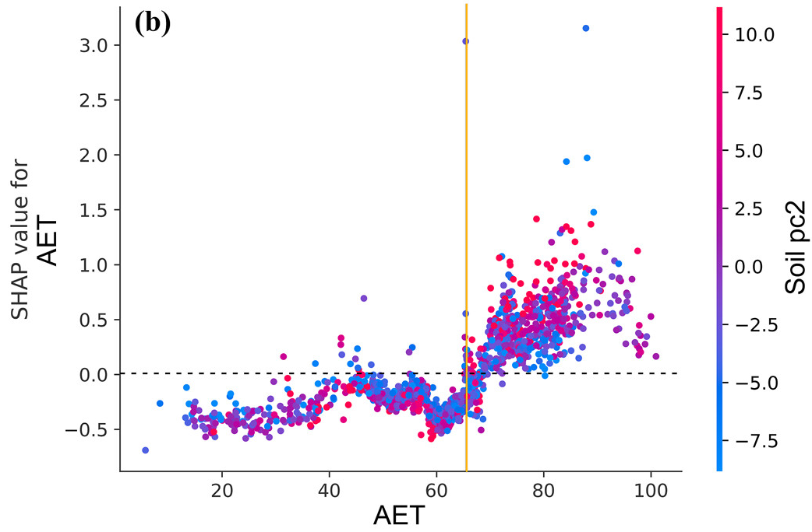
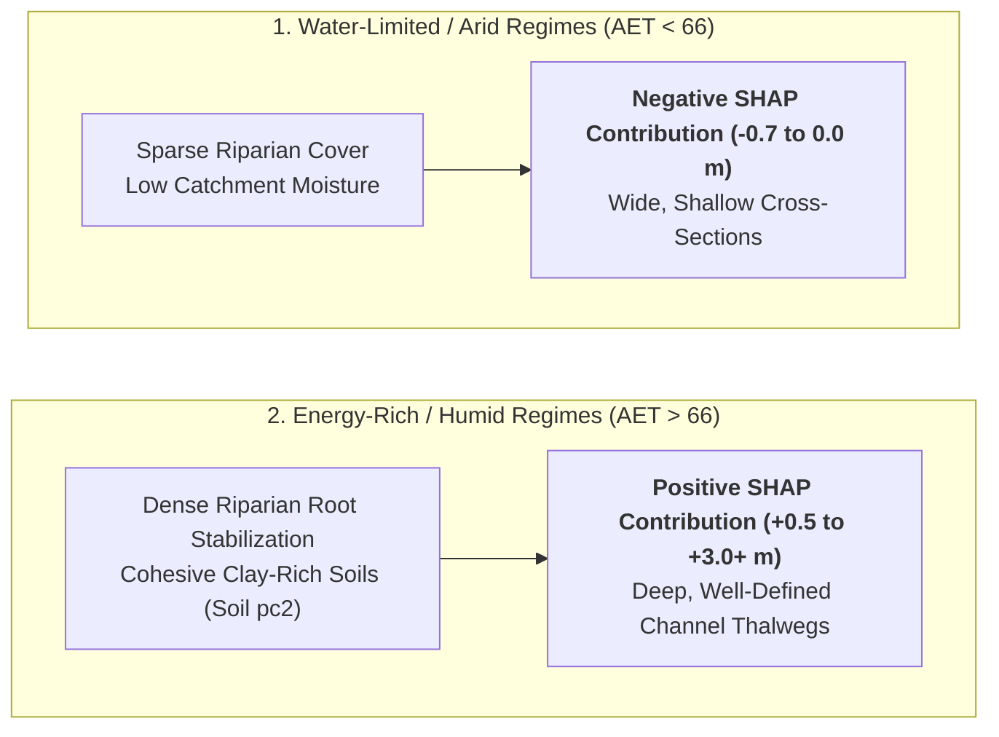
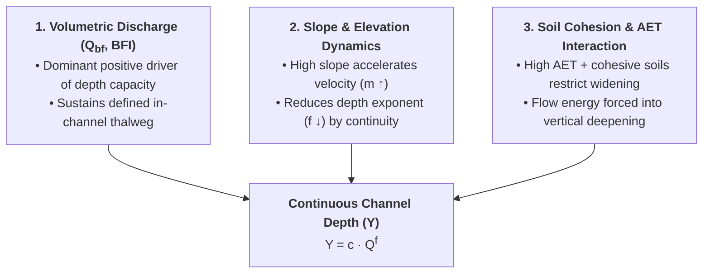

# Explainable AI (XAI) & Physical Interpretability (v1.0)

> **Publication Reference**: Modaresi Rad, A., et al. (2024). *Enhancing River Channel Dimension and Bathymetry Estimates Across Continental Scale Using Machine Learning and Functional Hydraulic Geometry*. **Journal of Geophysical Research: Machine Learning and Computation**, 1(3), e2024JH000173.

---

## The Role of Explainable AI in River Geomorphology

In continental-scale hydrologic and hydrodynamic modeling, high predictive accuracy is necessary but insufficient on its own. To be trusted in regulatory flood risk mapping (FEMA) and operational flood forecasting (NOAA-OWP National Water Model), machine learning models must demonstrate that their predictions conform to established **physical laws of open-channel hydraulics and fluvial geomorphology**.

We employ **SHAP (SHapley Additive exPlanations)**—a cooperative game-theoretic framework developed by Lundberg & Lee (2017)—to compute exact, additive feature attributions for channel depth ($Y$) and Functional Hydraulic Geometry (FHG) parameters ($f$ and $c$).

$$
f(\mathbf{x}) = \phi_0 + \sum_{j=1}^{M} \phi_j(\mathbf{x})
$$

where $\phi_0$ is the base expected model prediction across the continental dataset, and $\phi_j(\mathbf{x})$ is the Shapley value quantifying the positive or negative contribution of predictor $j$ for reach $\mathbf{x}$.

---

## Global Feature Importance & Elbow Optimization

The global importance of each hydro-environmental predictor was evaluated across all CONUS training reaches by calculating the mean absolute Shapley value ($|\phi_j|$):

{ loading=lazy }
*Figure 1: (a) Global TreeSHAP feature importance ranking and summary beeswarm plot for the v1.0 Depth model. Points represent individual stream reaches, with color indicating raw feature value (red = high, blue = low) and x-axis indicating impact on predicted depth. (b) Recursive feature elimination using the Elbow Method tracking model $R^2$, demonstrating optimal parsimony at 15 features ([Modaresi Rad et al., 2024](https://doi.org/10.1029/2024JH000173)).*

### Top 15 Predictors Ranked by SHAP Value

| Rank | Feature Name | Category | SHAP Directionality & Hydraulic Mechanism |
| :---: | :--- | :--- | :--- |
| **1** | **Bankfull Discharge** | Hydrology | **Dominant positive driver**. High $Q_{\text{bf}}$ (red dots) provides the primary volumetric flow to maintain deeper channel profiles ($\text{SHAP} > +5.0$). |
| **2** | **Elevation** | Terrain | High elevation (red dots) exhibits negative SHAP values, reflecting shallow, steep headwater channels relative to lowland mainstems. |
| **3** | **Slope** | Geomorphometry | High bed slope produces negative SHAP values. As flow velocity ($m$) increases on steep gradients, stage rises more slowly per unit flow ($f \downarrow$). |
| **4** | **Base Flow Index (BFI)** | Hydrogeology | High BFI (red dots) provides sustained perennial baseflow, scouring and maintaining a deeper, well-defined permanent channel thalweg. |
| **5** | **NWM Flood pc0** | Flow Dynamics | First principal component of NWM flood recurrence moments; governs peak channel-forming hydraulic capacity. |
| **6** | **Actual Evapotranspiration (AET)** | Hydroclimate | Reflects catchment water balance and vegetative maturity; high AET correlates with cohesive vegetated banks that promote vertical deepening. |
| **7** | **Elevation Difference** | Terrain | Reach-level topographic drop; steep relief concentrates energy into velocity rather than depth. |
| **8** | **Soil pc1** | Soil Mechanics | First principal component of POLARIS soil properties; captures soil texture, clay fraction, and hydraulic conductivity. |
| **9** | **NWM Flood pc1** | Flow Dynamics | Second principal component of NWM flood quantiles; modulates moderate flood event magnitude. |
| **10** | **Roughness** | Hydrodynamics | Channel boundary resistance; retards velocity and raises equilibrium water stage. |
| **11** | **Soil pc2** | Soil Mechanics | Second principal component of soil profile characteristics, moderating soil moisture retention and bank stability. |
| **12** | **Arbolatesu** | Hydrography | Cumulative upstream network length; scales with cumulative flow accumulation and sediment transport capacity. |
| **13** | **PET** | Climate | Potential Evapotranspiration; captures atmospheric evaporative demand and aridity gradients. |
| **14** | **Lengthkm** | Geometry | Reach flowline length; longer reaches typically occur in low-gradient alluvial valleys with deeper cross-sections. |
| **15** | **Soil pc0** | Soil Mechanics | Fundamental soil physical characteristics influencing infiltration capacity and runoff routing. |

### Elbow Method Feature Space Optimization

As illustrated in **Figure 1b**, recursive feature dropping guided by model skill demonstrates clear elbow dynamics:

* At **116 features**, cross-correlation and collinearity limit performance to $R^2 \approx 58\%$.
* Progressively eliminating non-informative variables concentrates predictive skill into orthogonal physical drivers.
* The performance curve peaks at **15 features ($R^2 \approx 81\%$)**, highlighted by the vertical red dashed line. Reducing features below 15 causes a rapid degradation in predictive skill ($R^2 < 76\%$).

---

## SHAP Interaction & Dependency Analysis

To evaluate non-linear environmental couplings, SHAP interaction values decouple individual predictor responses from second-order dependencies:

{ loading=lazy }
*Figure 2: SHAP dependency and interaction plot for Actual Evapotranspiration (AET), colored by Soil pc2 ([Modaresi Rad et al., 2024](https://doi.org/10.1029/2024JH000173)).*

### Actual Evapotranspiration (AET) $\times$ Soil Properties Interaction

#### Physical Mechanisms Revealed:

1. **Threshold at $\text{AET} \approx 66$**:
   * In arid and water-limited catchments ($\text{AET} < 66$), SHAP values remain negative ($-0.7\text{ to }0.0\text{ m}$), indicating that low vegetative density and non-cohesive soils produce wider, shallower channels.
   * At $\text{AET} \approx 66$, the interaction exhibits a sharp upward transition where moisture availability supports dense bank-stabilizing root matrices.
2. **Amplification by Soil Characteristics (`Soil pc2`)**:
   * Above $\text{AET} > 66$, catchments with high `Soil pc2` values (pink/red points) exhibit substantial positive depth adjustments ($\text{SHAP} > +1.0\text{ to }+3.0\text{ m}$), reflecting deeper, cohesive channels where lateral erosion is constrained and flow energy is directed into vertical incision.

---

## Synthesis with Fluvial Geomorphic Theory

The learned relationships within the v1.0 machine learning ensemble closely replicate classical geomorphic balance principles:

1. **Lane's Balance & Energy Dissipation**:
   * The model captures how steep channels dissipate kinetic energy through velocity rather than stage height, directly conforming to hydraulic geometry continuity ($b + f + m = 1.0$).
2. **Boundary Shear Stress Partitioning**:
   * Geotechnical soil parameters and hydroclimatic variables determine whether boundary shear stress ($\tau_0 = \gamma R S$) is accommodated through lateral bank collapse or vertical bed downcutting.

---

## Section Navigation

- [Depth v1.0 Overview](index.md) — Problem statement, FHG continuity formulation, and summary.
- [Model Architecture](models.md) — Candidate ML models, feature engineering, and the 3-tier Stacking Meta-Learner.
- [Model Skill & Evaluation](skill.md) — Continental USGS validation, NNSE distributions, max flow diagnostics, and literature benchmarking.
