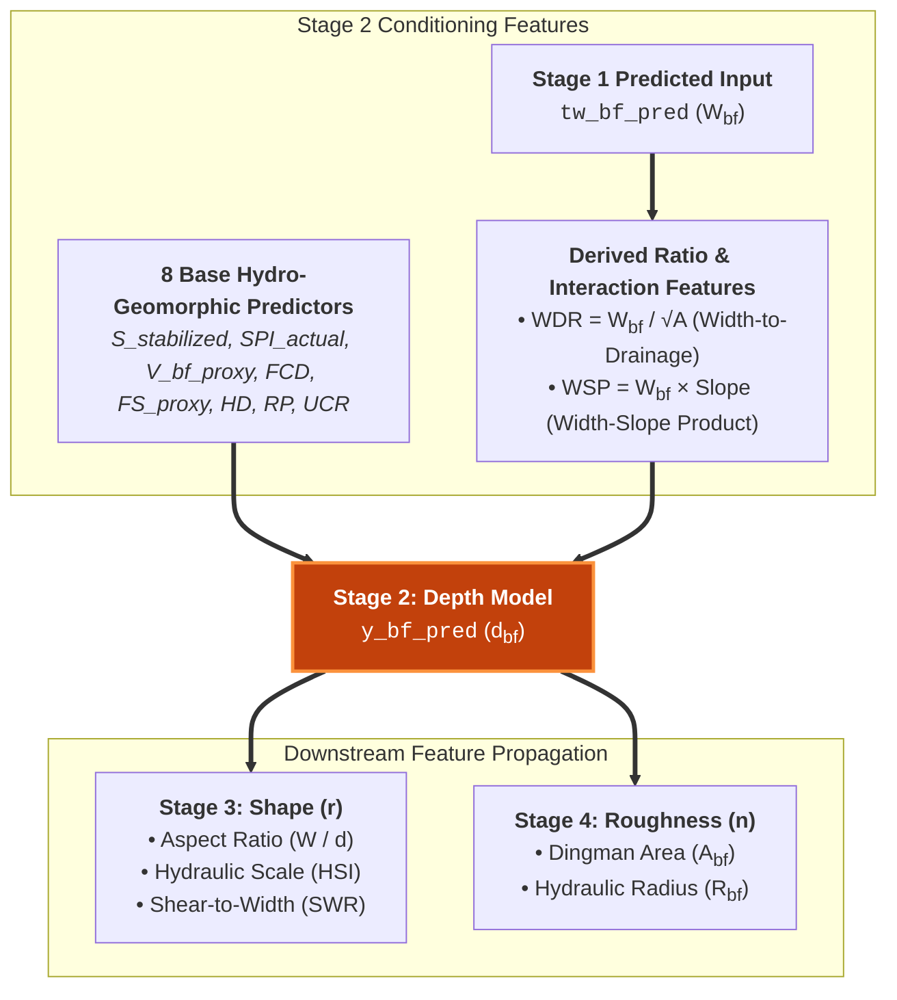

# Depth — Bankfull Channel Depth

Bankfull channel depth ($d_{bf}$ or $y_{bf}$) represents the vertical dimension of the active channel geometry, governing flow conveyance capacity and boundary shear stress distributions. In classical hydraulic geometry, bankfull depth scales with discharge according to the empirical power-law of Leopold & Maddock (1953):

$$d_{bf} \propto Q_{bf}^f$$

where the downstream scaling exponent $f \approx 0.36\text{--}0.40$, reflecting the systematic deepening of river channels as drainage area increases downstream.

---

## Multi-Stage Pipeline Role (Stage 2)

Depth is predicted in **Stage 2** of the cascade pipeline. Estimating channel depth presents greater physical complexity than width due to subsurface bed resistance and sediment transport thresholds. To constrain depth predictions, Stage 2 conditions on the **8 base hydro-geomorphic features**, the Stage 1 predicted width ($\hat{W}_{bf}$ / `tw_bf_pred`), and two key derived ratio features:

### Input Feature Set (11 Predictors)

1. **8 Base Hydro-Geomorphic Features**: $S_{\text{stabilized}}$, $\text{SPI}_{\text{actual}}$, $V_{bf,\text{proxy}}$, $\text{FCD}$, $\text{FS}_{\text{proxy}}$, $\text{HD}$, $\text{RP}$, $\text{UCR}$.
2. **Predicted TopWidth (`tw_bf_pred`)**: $\hat{W}_{bf}$ from Stage 1.
3. **Width-to-Drainage Ratio ($\text{WDR}$)**:
   $$\text{WDR} = \frac{\hat{W}_{bf}}{\sqrt{A_{\text{total}}} + \epsilon}$$
   A dimensionless index identifying whether the channel is abnormally wide/braided (high $\text{WDR}$) or deeply incised/confined (low $\text{WDR}$).
4. **Width-Slope Product ($\text{WSP}$)**:
   $$\text{WSP} = \hat{W}_{bf} \cdot S$$
   Proportional to the lateral energy dissipation rate, helping the model constrain vertical incision potential.

---

## Downstream Feature Propagation

Predicted bankfull depth (`y_bf_pred`) feeds directly forward into subsequent stages:

- **Stage 3 (Shape)**: Combined with width to compute channel Aspect Ratio ($\text{AR}_{\text{channel}} = W/d$), Hydraulic Scale Index ($\text{HSI}$), and Shear-to-Width Ratio ($\text{SWR}$).
- **Stage 4 (Roughness)**: Enables analytical formulation of Dingman cross-sectional area ($A_{bf}$), wetted perimeter ($P_{bf}$), and hydraulic radius ($R_{bf}$).

---

!!! info "Upcoming Release"
    Content is being prepared. Results and analysis for this variable will be published in an upcoming release.

---

## Section Navigation

- [Literature Review](literature.md) — Downstream depth scaling, threshold channels, and tractive force theory.
- [Model Architecture](models.md) — ResNet-XGBoost ensemble with cross-feature conditioning.
- [Model Skill](skill.md) — Validation scores, scatter plots, and regional performance.
- [Uncertainty Quantification](uncertainty.md) — Confidence distributions and spatial flowline maps.
- [Explainability (XAI)](xai.md) — SHAP attribution, PDP curves, and causal interactions.
