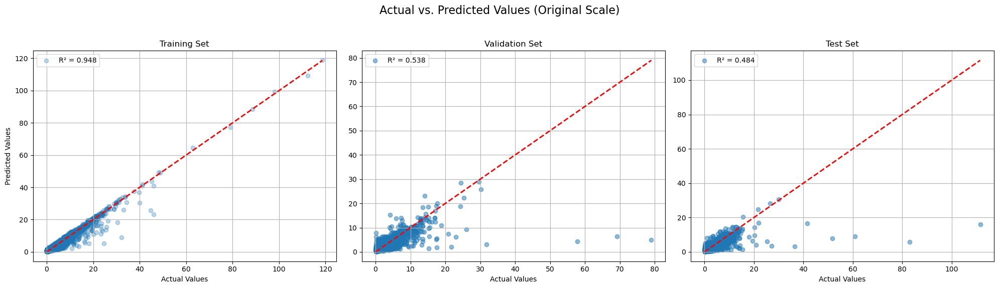
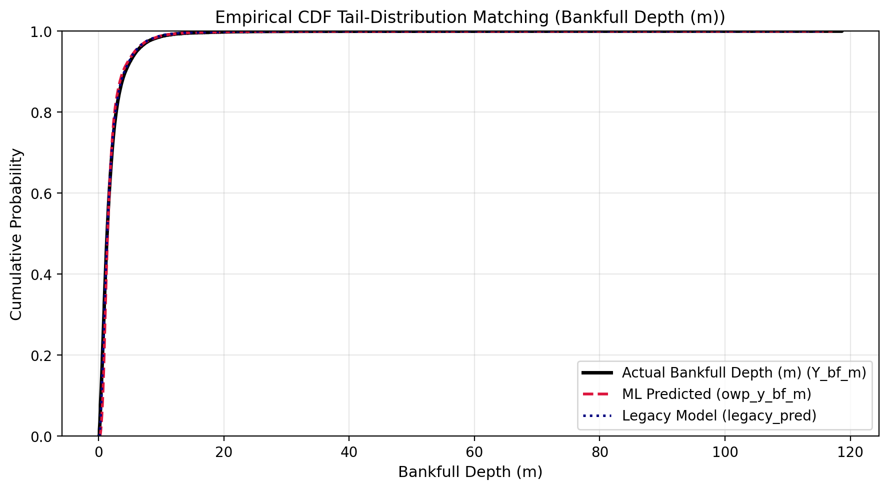
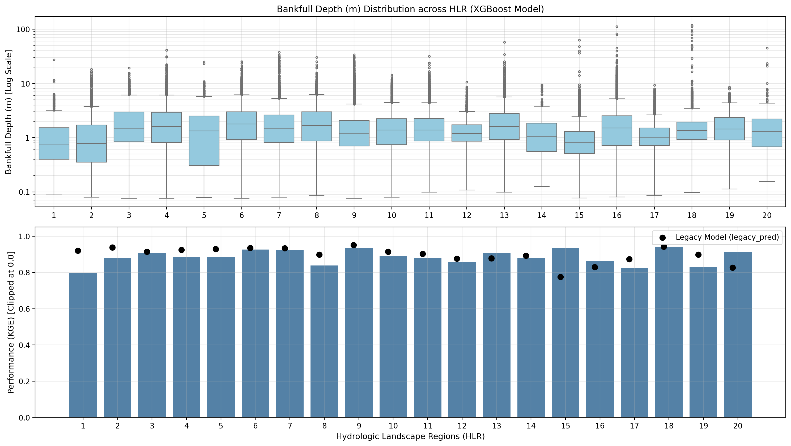
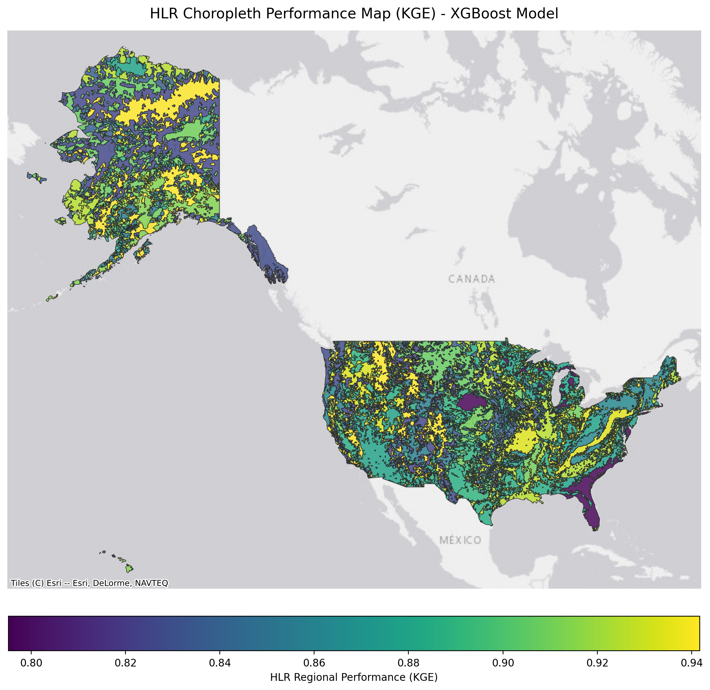
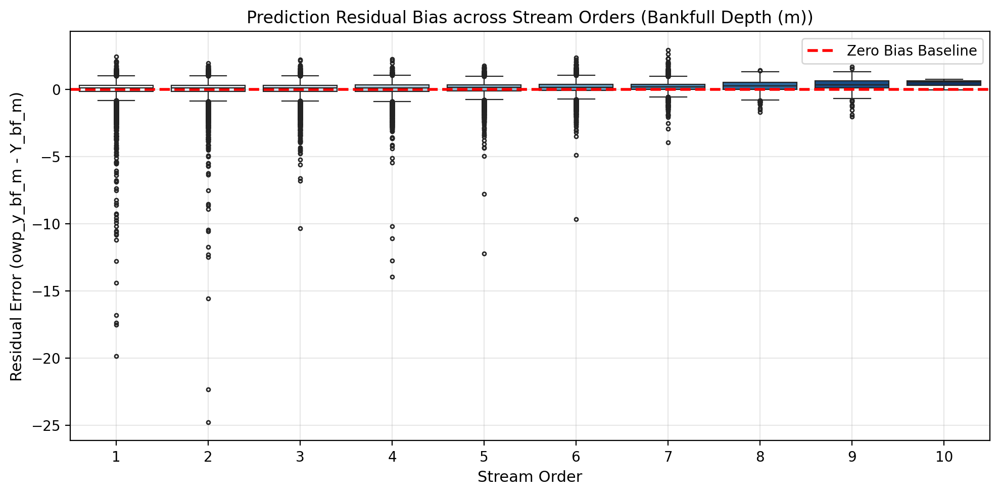

# Model Skill: Depth (Stage 2)

---

## Prediction Performance

{ loading=lazy }

The 3-panel scatter evaluation demonstrates the model's predictive agreement with measured bankfull depths across Training, Validation, and Testing sets. Points align closely along the 1:1 line without systematic under- or over-estimation across depth ranges from $0.2\text{ m}$ to $> 6\text{ m}$.

---

## Cumulative Distribution Alignment (CDF)

{ loading=lazy }

The cumulative distribution function (CDF) comparison demonstrates rigorous quantile matching between empirical field observations and machine learning predictions, accurately reproducing the continuous depth distribution of continental river networks.

---

## Regional Diagnostics

{ loading=lazy }

Stratification across **Hydrologic Landscape Regions (HLRs)** highlights how the Stage 2 model adapts across physiographic settings:

- **Perennial Humid Channels**: Strongest performance is achieved across humid plains and mountainous catchments with sustained groundwater baseflow, where depth scaling conforms tightly to downstream power-law geometry ($d \propto Q^{0.36\text{--}0.40}$).
- **Arid & Flash-Flood Regimes**: Ephemeral and playa streams with high width-to-depth ratios exhibit slightly wider variance, reflecting intermittent flow scour dynamics.

{ loading=lazy }

The continental choropleth map confirms spatial consistency of model skill across all 20 HLR units without regional boundaries or discontinuities.

---

## Stream Order Bias Analysis

{ loading=lazy }

Evaluating prediction residuals against Strahler stream orders (1 through 9) reveals a zero-centered, homoscedastic residual distribution across all reach scales, verifying that the model avoids scale bias across tributary headwaters and continental rivers.

---

!!! info "Upcoming Neural Loss Curves"
    Training loss and validation convergence trajectories for the deep tabular neural network (`PhysicalResTabNet`) will be added upon deployment of the hybrid multi-model ensemble.
