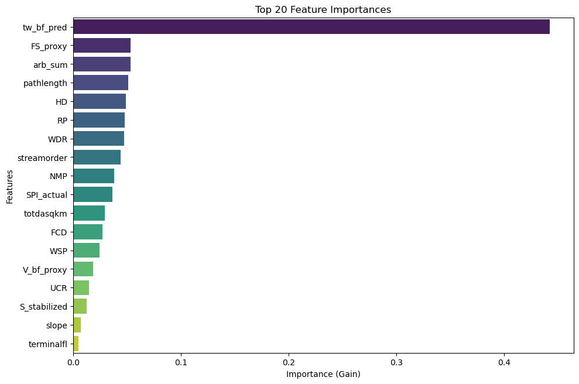

# Explainable AI (XAI) — Depth (Stage 2)

Our explainability pipeline examines the feature attribution structure of the Stage 2 bankfull depth ($d_{bf}$) model, validating how cascaded width constraints guide depth estimation.

---

## Global Feature Importance

{ loading=lazy }

The feature importance distribution confirms the critical physical role of cascaded hydraulic constraints:

1. **Stage 1 Predicted Width ($\hat{W}_{bf}$)** and **Width-to-Drainage Ratio ($\text{WDR}$)**: Act as leading predictors, anchoring depth to cross-sectional aspect ratio dynamics and preventing unphysical width-depth divergence.
2. **Width-Slope Product ($\text{WSP}$)**: Encapsulates reach-scale total energy dissipation, guiding the depth necessary to maintain bedload transport equilibrium.
3. **Flint's Law Deviation ($\text{FCD}$) & Stream Power**: Provide secondary corrections reflecting knickpoints, forced valleys, and localized profile concavity.

---

!!! info "Upcoming SHAP Beeswarm & Partial Dependence (PDP/ICE) Suite"
    Detailed **SHAP beeswarm distributions** and **Partial Dependence / ICE response curves** will be published in the upcoming release, illustrating marginal depth response curves and verifying Leopold & Maddock power-law exponents ($d \propto Q^f$).
